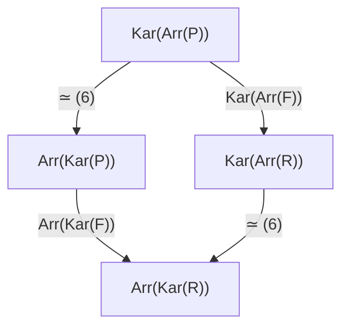
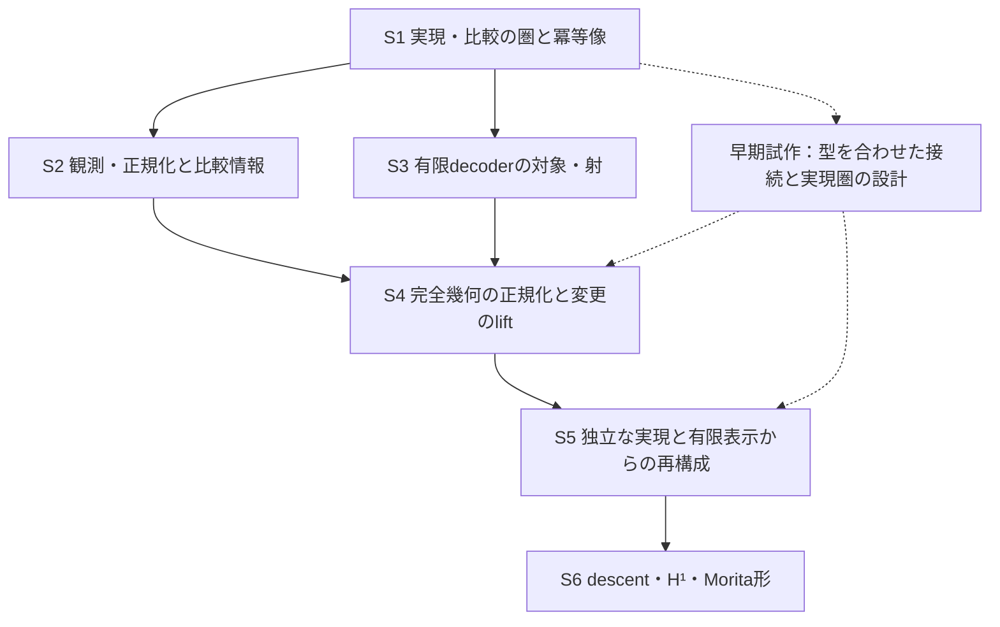

# アンナプルナ後の研究プログラム — 実現と比較の構造を再構成する

本ノートは、[n1009 §4.4](n1009_aat_annapurna_gr_series_record.md) の予想A・B・Cを、
一つの実現・比較の構造の同一性、情報の保存、有限表示として研究する計画である。
中心に置く問いは次のものである。

> AtomとLawから生成される実現、その間の比較、比較を維持する変更を、表示の違いを越えて
> 再構成できるか。その再構成を、どの範囲で有限のデータから行えるか。

意味の実現を対象の集合として先に確定し、比較と有限性を後から付け足す順序にはしない。
初めから対象・射・可換正方形を持つ圏を扱い、冪等像、観測、有限表示をその圏への構成として
調べる。Aは実現の同一性、Bは比較情報の保存と損失、Cは対象と射の表示可能性を問う。
三つが交わるところは、**表示から再構成した比較と、実現の側で行える変更が一致するか**にある。

研究の方向は [研究の全体目標](../research_goal.md) に従う。本ノートでは証拠を三段階に分ける。
「既存定理」は参照したLean sourceの成果、「本文導出」はここで証明を記した一般数学で、
AATへの形式化は未実施、「研究課題」は対象の構成・成立判定が残る命題である。
本文導出を新しいResearch-proved成果として数えない。GOAL候補は§9にまとめる。

## 1. 共通の対象を既存の圏から作る

### 1.1 実現の圏と、その投影

固定したAtom carrier `U` と必要なuniverseについて、既存の圏の列を出発点にする。

\[
\mathcal E_{\mathrm{geom}}
 \xrightarrow{\rho}\mathcal E_{\mathrm{core}}
 \xrightarrow{\pi}\mathcal B,
\qquad
\begin{cases}
\mathcal E_{\mathrm{geom}}=\mathrm{GeomReadCategory}(U),\\
\mathcal E_{\mathrm{core}}=\mathrm{AATCorePackage}(U),\\
\mathcal B=\mathrm{ExtractionInstance}(U).
\end{cases}
\tag{1}
\]

`ρ` は `geometryProjection`、`π` は `packageProjection`、合成は
`crossStageProjection` である。完全幾何の射は `GeometryTotalHom` であり、
coreの写像だけでなく、係数、Support、Axis、Observableの比較写像を保持する。
この意味で(1)は、同じ構造を異なる情報量で読む列である。

最初の実現の対象は、この既存のpackage・geometryである。その意味をさらに独立な
configuration・Law・operationのモデルとして与える圏 `R` は、§7の後続構成にする。
両者の同値は証明する課題であり、`R` を既存packageの別名として導入しない。

以下の一般構成は任意の圏 `E` に対して述べ、(1)の各段へ適用する。標準の合成記法
`gf = g∘f` を使う。Leanの `f ≫ g` はこの `gf` に対応する。

### 1.2 実現の比較と、比較の変更

`Arr(E)` の対象は `c:X→Y`、射 `c→c'` は `u:X→X'`、`v:Y→Y'` と

\[
vc=c'u
\tag{2}
\]

からなる可換正方形である。比較そのものが非可逆でも、その表示変更 `(u,v)` は可逆に
なりうる。可逆な表示変更だけを見るときは、**射の圏を作った後で**その最大亜群を取る。
先に `E` の非可逆な射を捨てると、研究対象の比較や正規化が失われる。

G-118の資格は、両端の自己同型が合成投影 `πρ` の上で恒等になることである。
従って `c` のqualifiedな自己同型群は

\[
\Gamma_c=\{(b,p)\in Q_c\mid pc=cb\},\qquad
Q_c=\operatorname{CompositeFiberAut}(X)
       \times\operatorname{CompositeFiberAut}(Y).
\tag{3}
\]

`c` が底の上で恒等であることは、この一般定義には要求しない。
表示変更では底の端点と底の比較射も記録し、底を固定する変更と、底を移す関手を区別する。

### 1.3 冪等像も比較の対象にする

`Kar(E)` の対象は `(X,e)`、`e²=e`、射 `a:(X,e)→(Y,d)` は

\[
a=dae
\quad\Longleftrightarrow\quad ae=a=da
\tag{4}
\]

を満たす元の圏の射である。恒等射は `e` である。共通の研究対象を

\[
\mathcal M(E):=\operatorname{Arr}(\operatorname{Kar}(E))
\tag{5}
\]

と置く。(5)は、冪等像を含む実現と、その間の比較・変更を同時に保持する。
元の比較 `c` は `((X,1),(Y,1),c)` として入る。
投影関手(1)は `Kar` と `Arr` を通じて(5)の列を誘導する。
底を完成前の `B` のまま読む場合は、底へ恒等を送る冪等射に限定した部分圏を明示する。
任意の冪等射についての投影先はまず `Kar(B)` である。

**既存成果との接点**。G-116はcore fiberのKaroubi像の間に実際の同型を構成する。
G-118は完全幾何のraw比較を(5)へ入れる例を与える。G-117は、対象ごとの正規化を
raw圏の恒等関手上の自然変換にできないことを示す。この三つを同じ型へ接続するには、
coreの正規化を完全幾何の冪等射へ持ち上げる仕事が残る。`ρ` を逆向きに使って
Support等を自動生成した扱いにはしない。これを§7.1の具体的構成課題にする。

## 2. 最初の統一命題 — 比較と冪等完備化を交換する

### 2.1 射の圏の冪等完備化

**本文導出**。任意の圏 `E` に対し、明示的な同値

\[
\operatorname{Kar}(\operatorname{Arr}(E))
 \simeq\operatorname{Arr}(\operatorname{Kar}(E))=\mathcal M(E)
\tag{6}
\]

がある。左辺の対象は、raw比較 `c:X→Y` と、その自己準同型である冪等対 `(e,d)`、
すなわち `e²=e`、`d²=d`、`dc=ce` である。これを

\[
((X,e),(Y,d),a=dce)
\tag{7}
\]

へ送る。左辺の射は `vc=c'u` に加え `u=e'ue`、`v=d'vd` を満たす。
このとき `vc=va`、`c'u=a'u` なので、rawな正方形の条件と像の正方形の条件は同値になる。
従って(7)はHom上で全単射を与える。右辺の任意の対象 `a=dae` は、raw比較を `c=a`
として左辺へ戻せるので、本質的全射でもある。恒等と合成は端点の写像の計算で従う。

この証明は [mathlibのArrow](https://leanprover-community.github.io/mathlib4_docs/Mathlib/CategoryTheory/Comma/Arrow.html)
と [Karoubiの定義](https://leanprover-community.github.io/mathlib4_docs/Mathlib/CategoryTheory/Idempotents/Karoubi.html)
から本ノートで導いたもので、同名の既存Lean定理を引用しているのではない。
一般関手 `F:E→E'` に対しても `F(dce)=F(d)F(c)F(e)` により自然に対応する。
そのため(6)を(1)の各投影へ適用した図式も可換になる。

ここにはAとBの共通の構造がある。意味の像を対象として加えることと、比較を対象として
扱うことは、(6)の意味で交換できる。ただし、これは**冪等射とその両立関係を保持した**
完備化の性質である。任意の比較を選択済みの正規化へ押し込む操作とは異なる。

### 2.2 選択した正規化 — 関手性と自然性を分ける

一般の圏で各対象に冪等射 `e_P` を選ぶだけでは、`f↦e_Q f e_P` の合成則は従わない。
十分条件の一つは、すべての射について `e_Q f e_P=f e_P` が成立することである。
この片側吸収を仮定すれば、正規化像の圏 `N` への写像 `N(f)=f e_P` は

\[
N(g)N(f)=g e_Q f e_P=gf e_P=N(gf),\qquad N(1_P)=e_P
\]

を満たす。`N` の対象は `(P,e_P)`、射は `a=e_Q a e_P`、恒等射は `e_P` である。
二側の条件 `f e_P=e_Q f` はより強い十分条件であり、その条件を満たす射の圏
`C_com` に制限する方法もある。

**実装からの本文導出**。AATのcanonicalな `e_P` には、admissibleなpackage間の
任意のtotal射 `f` について、この片側吸収が成立する。G-116のobject map自然性から
`f(n_P x)=n_Q(f x)` は `n_Q` の固定点になる。正規化のoperation写像は
`admissible.operation_type_eq` によるcastなので、すでに固定された両端点上では
元のoperationを保つ。残りの計算fieldも恒等またはそのcastである。
従って `e_Q f e_P=f e_P` を、object mapの等号、operation写像の異種等号、
既存のtotal射のextensionalityから導ける。これらをまとめたLean宣言は未構成である。

この導出はG-117の反証と両立する。`J(P)=(P,1)` をrawなKaroubi埋込みとすると、
`i_P=e_P:N(P)→J(P)` は `J(f)i_P=f e_P=i_QN(f)` により自然である。
各対象で逆向きにある `p_P=e_P:J(P)→N(P)` は `p_P i_P=1_{N(P)}` を満たすが、
その自然性には `f e_P=e_Q f` が必要であり、G-117はこの普遍的成立を反証した。
つまり、**正規化像を読む関手とその自然な包含は作れる一方、対象ごとの射影は自然には
揃わない**。自然性の失敗から関手性まで不可能だとは推論しない。
強い条件のoperation上の意味は、既存の
`canonicalObjectNormalizationTotal_natural_iff_operationCoherent` が与える。

構成の参照は [canonical normalizationの全field](../../research/lean/ResearchLean/AG/DoctrineFiberProduct/BCAuthoredCanonicalObjectNormalization.lean)
と [object mapの自然性](../../research/lean/ResearchLean/AG/DoctrineFiberProduct/CanonicalObjectNormalizationNaturality.lean)
である。正規化が比較を保つことと、元の比較を反映することの差は§4で調べる。

G-116の `β=α≫E` を通常の記法で `β=Eα` と書くと、`α` は同型で、
source側の冪等射は `e=α⁻¹Eα` となる。`βe=β=Eβ` なので、既存のKaroubi同型は
(5)の実例になる。実際の宣言はcore fiber内のものであり、完全幾何への持ち上げは別に行う。

## 3. 情報の保存を、同じ構造上の忘却として測る

### 3.1 係数観測と比較の適合部分

完全幾何の係数を読む関手 `κ:E_geom→CommRingCat` は、objectでは係数環、射では
`geometry.coefficientHom` を取る。恒等・合成則は既存の `GeomReadHom.id/comp` の式から
関手としてまとめる課題である。G-118は既に各自己同型群上の射影を構成している。

raw比較について、その両端の射影の直積を

\[
O_c:Q_c\longrightarrow R_c,
\qquad R_c=\operatorname{Aut}(\kappa X)\times\operatorname{Aut}(\kappa Y),
\qquad K_c=\ker O_c
\tag{8}
\]

とする。冪等像では最初に `Kar(κ)` を用い、観測先もKaroubi内の像として読む。
同じ元の係数環をそのまま使う主張では `κ(e)=1`、`κ(d)=1` を実際に証明する。

**本文導出**。任意の群準同型 `O:Q→R` と部分群 `Γ≤Q` について

\[
\begin{aligned}
&\exists h:R\to\mathrm{Prop},\ \forall q,\quad
 (q\in\Gamma\iff h(Oq))
 \quad\Longleftrightarrow\quad \ker O\leq\Gamma,\\
&O^{-1}(O\Gamma)=\Gamma\ker O.
\end{aligned}
\tag{9}
\]

必要性は `1∈Γ` と `O(k)=O(1)` から従う。十分性は
`h(r):=∃γ∈Γ, Oγ=r` と置き、同じ観測の差が `ker O` に入ることから従う。
`O` の全射性は不要である。右辺の積は `ker O` が正規なので部分群になる。

`L_c=K_c∩Γ_c` とすると、固定した適合元 `γ∈Γ_c` の観測fiberは `γK_c`、
その中の適合元は `γL_c` である。左剰余類の集合 `K_c/L_c` を基点 `L_c` とともに
保持すると、相対差が適合するかを判定できる。`L_c` の正規性は要求せず、群商とは呼ばない。
`K_c/L_c` が一点であることと(9)の判定可能性は同値になる。

### 3.2 G-118から得る非自明な元

既存の正負対 `q₊∈Γ_c`、`q₋∉Γ_c` は同じ係数観測を持つ。
従って `k_*=q₊⁻¹q₋` は `K_c\Γ_c` に属し、`K_c/L_c` の基点と異なる元を与える。
この導出を既存の生成されたdatumからLeanで構成するのが、(9)のAATへの第一の適用になる。
固定例では片側に対応する相手が一意であり、この情報損失は選択肢の多さに由来しない。

保持する不変量の候補は、抽象群の同型類だけでなく

\[
\Gamma_c\hookrightarrow Q_c\xrightarrow{O_c}R_c
\tag{10}
\]

と両端への射影を含む図式である。比較の表示変更は共役によって(10)を運ぶ。
係数を固定する変更では `R_c` の同一視も固定し、一般の係数同型ではその共役を用いる。
G-118 C1sの入力再構成から得る変化と、この図式の輸送を一致させる。
図式の同型類はwell-definedな不変量の候補であり、全比較の完全分類とはまだ同定しない。

### 3.3 忘却に対して何を要求するか

関手 `F:E→E'` が忠実なら、指定した端点写像からなる正方形について、像での可換性から
元の可換性を反映できる。充満忠実なら、像の対象間の射を持ち上げ、同型の逆射も回収できる。
従って、実現の同一性の候補を選ぶときは、対象の対応だけでなく、この比較の保存・反映を調べる。

係数観測のように意図して情報を忘れる関手には、常に充満忠実性を要求しない。
その代わり、どの判定が(9)で因子化し、どのfiberで正負が分かれるかを示す。
表示の同値を与える関手と、粗く読む関手は、(5)を共通の定義域として役割を区別できる。

## 4. 正規化した後の変更は、元へ戻せるか

### 4.1 比較群を像へ送る準同型

一般の `E` で `e²=e`、`d²=d`、`dc=ce` を固定し、`a=dce` とする。
`H=Cent_Aut(X)(e)×Cent_Aut(Y)(d)`、`Γ₀=H∩Γ_c` と置く。
ここではまず全自己同型群を用い、AATでは底の資格を保持する部分群へ制限する。

\[
r:H\longrightarrow
 \operatorname{Aut}_{Kar(E)}(X,e)\times
 \operatorname{Aut}_{Kar(E)}(Y,d),\qquad
(b,p)\longmapsto(ebe,dpd)
\tag{11}
\]

を定める。逆射は `eb⁻¹e`、`dp⁻¹d` であり、中心化条件から準同型になる。
`r` を `Γ₀` に制限して初めて、値域を像の比較群 `Γ_a` に取れる。
ここで三つの問いを分ける。

| 問い | 正確な条件 |
| --- | --- |
| 比較を保つ変更は像でも比較を保つか | `r(Γ₀)⊆Γ_a`。上の式から従う |
| 像で比較を保てば、元でも保っていたか | `r⁻¹(Γ_a)=Γ₀` |
| 像で可能な比較変更は、元から得られるか | `r(Γ₀)=Γ_a` |

第二と第三は互いに異なる。第二では端点変更を先に固定し、第三では端点変更そのものを
持ち上げる。`ker r≤Γ₀` だけでは第二の十分条件にならず、
`r(Γ₀)=Γ_a∩im r` も必要である。持ち上がる適合元のfiberは
`ker(r|Γ₀)` のtorsorになる。全射性を証明した場合にのみ
`1→ker(r|Γ₀)→Γ₀→Γ_a→1` という完全列を得る。

### 4.2 二つの有限反例が計画を拘束する

以下は `Set` における**本文導出の反例**である。AATの固定datumでの反例は別に構成する。

第一に、`X=Y={0,1,2}`、`c=id`、`e=d` を定値0とする。
`b` は1と2の交換、`p=id` とする。両者は正規化と可換だが、raw比較を保つ条件 `b=p` は
成立しない。正規化像は一点なので、像では両者が恒等になり適合する。よって反映は失敗する。

第二に、同じ集合で `e=d` を `e(0)=0,e(1)=1,e(2)=1` とする。
像 `{0,1}` の交換はKaroubi像の自己同型であり、`a` がその像の恒等比較なら、
両端を同時に交換する対は `Γ_a` に属する。しかし `e` と可換するraw置換は、
大きさ1のfiberと大きさ2のfiberを交換できない。従ってこの変更は持ち上がらない。

この二例により、(6)の交換定理と、選んだ正規化への縮約は区別しなければならない。
(6)は比較と冪等射の情報を保持する。縮約では、その外側の作用を忘れる。
**Aで選ぶ同一視が、Bの比較情報を保存するかが定理の内容になる。**

### 4.3 canonical正規化では全自己同型群から出発する

**本文導出**。§2.2の片側吸収が成立するadmissibleなcore圏では、任意の自己同型 `b`
について `N(b)=be=ebe` は像の自己同型である。逆は `N(b⁻¹)` であり、
積が像の恒等射 `e` になることは関手性から従う。強い条件 `be=eb` は不要である。
従って任意の比較 `c:P→Q` に対して

\[
r_N:\operatorname{Aut}(P)\times\operatorname{Aut}(Q)
 \longrightarrow\operatorname{Aut}(N(P))\times\operatorname{Aut}(N(Q)),
\qquad (b,p)\longmapsto(N(b),N(p))
\]

を定め、`r_N(Γ_c)⊆Γ_{N(c)}` を関手性から得る。比較 `c` 自身にも
`e_Q c=c e_P` を要求せず、像の比較は `N(c)=c e_P` とする。
底の資格は、canonicalな `e_P` が底へ恒等を送ることから保持される。

また、選択された像の間の任意の射 `a=e_Q a e_P` は元の圏の射でもあり、
`N(a)=a e_P=a` である。よって、この像の圏への `N` は充満である。
ただし、持ち上げたraw射 `a` の可逆性は従わない。像での逆射との積は `e_P,e_Q`
であり、rawな恒等射 `1_P,1_Q` とは異なるためである。
従って全自己同型群上でも、`r_N⁻¹(Γ_{N(c)})=Γ_c` と
`r_N(Γ_c)=Γ_{N(c)}` は別々の成立判定を要する。

(11)は一般の冪等対に対する中心化群上の構成、この節はcanonical正規化の片側吸収を
使う構成である。後者を完全幾何へ移すには、§7.1の持ち上げと、そこでの片側吸収を
構成する必要がある。coreでの関手性だけから完全幾何での関手性を推論しない。

## 5. 有限表示は、対象と射をともに表す必要がある

### 5.1 有限例外コードの位相的特徴づけ

`D=U.Atom` に離散位相を入れ、`D⁺=OnePoint D`、`Bool` も離散とする。
既存 `AtomPredicateCode` は既定値 `b:Bool` と有限の例外集合 `F⊆D` からなり、
`F` の中でのみ値を反転する。

**本文導出**。コードを∞での値 `b` を持つ写像へ延長すると

\[
\mathrm{AtomPredicateCode}(D)\simeq C(D^+,\mathrm{Bool}).
\tag{12}
\]

逆方向では `b=f(∞)`、`F={x∈D\mid f(x)≠b}` と取る。
∞での連続性により `F` は有限であり、両写像が逆になる。
[OnePointの連続性API](https://leanprover-community.github.io/mathlib4_docs/Mathlib/Topology/Compactification/OnePoint/Basic.html)
は、離散空間からのこの構成に使える。述語 `S⊆D` の特徴関数の連続延長が存在する条件は、
`S` が有限または余有限であることになる。

有限の `D` では同じ述語が∞で異なる値を持つ二つの延長を許し、空集合でもこの違いが残る。
従って(12)は生のコードと延長全体の同値である。述語だけを残す場合は `D` 上の評価の
等しさでコードを商にする。既存のcanonical codeは有限の場合に既定値falseを選ぶ。
無限の `D` ではこの延長は一意であり、評価の等しさからコードの等しさが従う。

Atom同値 `σ` は∞を固定する同相写像へ延長する。
`AtomPredicateCode.transport σ` は例外集合の順像なので、写像の側では `σ⁻¹` による
precompositionである。抽出集合の逆像は `σ` によるprecompositionになる。
この向きで、恒等・合成と既存decoderの評価に自然な同値を構成する。

### 5.2 G-112が与えるものと、射に残る問題

G-112のanchored coverageは、両端の `Source` が有限で、targetの全抽出集合が
有限または余有限であることと対応する。後者を(12)による連続延長へ置き換え、
codeから作る射・端点同型・可換正方形を、既存の構成と照合する。
Sourceの有限性は、その離散位相のcompactnessとも対応する。
一方、G-112のsemantic-globalな強cartesian liftは、この有限性を仮定せず存在する。
有限表示の条件とliftの存在条件を同じものにしない。

下段には既に、対象を `FiniteInstanceCode`、射をtyped presentationのdecodedな等しさで
商にした圏 `P₀=FiniteCodeCartCategory` と、関手

\[
D_0:\mathcal P_0\longrightarrow\mathcal B,
\qquad D_0=\mathrm{finiteCodeCartRealization}
\tag{13}
\]

がある。射の商の定義から忠実性を導くことができる。しかし、**anchored coverageは、
固定したcode対象間での(13)の充満性を意味しない**。

具体的に `D=ℕ`、一点のSource、恒等normalize、抽出常にtrueのcode `P` を取る。
意味の自己同型として、すべての対 `(2n,2n+1)` を交換するAtom置換 `σ` がある。
`CartPresentationBetween P P` のAtom置換は `AtomPermutationCode` の有限supportの外で
恒等なので、`σ` をdecodeする射はない。G-112はtargetの端点同型へ `σ` を移して
別の表示からこの射を表せる。このことと、固定code間での非充満性は両立する。

この非充満性は現行の二つの型の定義から導く候補であり、まだLeanの反証宣言にはしていない。
`σ` は `D⁺` の同相写像にも延長するため、compactnessや連続性だけではこの欠落を埋めない。
ここにCとBの接点がある。**有限な対象の表示があっても、その対象で許される変更の全体は
その表示言語で表せるとは限らない。**

より強い**本文導出の下限**もある。記号集合が可算で、入力に任意の関数や無限集合を
別途受け取らない有限構文は、全体として可算集合である。一方、各 `S⊆ℕ` に、`n∈S` の
ときだけ `(2n,2n+1)` を交換する置換 `σ_S` を対応させると、`S↦σ_S` は単射である。
従って上の同じsemantic対象の自己同型群は非可算であり、この有限構文から全自己同型を
decodeする全射は存在しない。表示を可算個に増やし、それらの間の射も有限構文で表す版も、
可算個の構文の合併にとどまる。これは計算可能性を仮定する前の集合論的な反証である。

全隣接対の交換 `σ` 一つは、より豊かな有限構文で表せる可能性がある。
したがって有限supportと有限記述可能性は同じ条件ではない。ただし構文の拡張だけで、
上の全自己同型を同時に表せるようにはならない。再構成(15)では、対象の条件に加えて、
表示する射のデータ条件か、固定パラメータに相対化した表示の型を明示する必要がある。

### 5.3 最初に狙える射の表示可能性の分類

無限の `D` について、固定code `P,Q` の間のsemantic射 `f:D₀P→D₀Q` が
(13)の像に入る条件として、`f` のAtom置換のsupportの有限性を調べる。
必要性はcodeから従う。十分性の証明方針は次の通りである。

1. 有限Sourceの写像と、有限supportのAtom置換をそのままtableへ符号化する。
2. semantic射のnormalize・pointの法則をcodeの法則へ移す。
3. 抽出のexactnessを正規化出力上の述語の等しさへ移し、無限 `D` での(12)の一意性から
   codeの等しさ `extraction_eq` を得る。

有限 `D` では、同じ述語に二つのcodeがあるため3をそのまま使えない。
正規化出力上のcodeを既定値falseに揃えた部分圏を独立に定め、その上で同じ分類を証明する。
有限 `D` の全置換は有限supportなので、この部分圏では充満性が期待できる。
codeの等号とdecodedな意味の等号を混同しないことが、この分類の中心になる。
元のcodeから既定値falseのcodeへの正規化は、decodedな意味を同型に保つ関手として作る。
元のcode圏内の同型を主張する場合は、両方向のtyped presentationも必要になる。
既定値が異なるとその射自体が存在しない場合があるため、意味の同型と区別する。

この段階の有限性は、選んだAtom・係数等をパラメータとした有限tableである。
任意のsemantic anchorの内容まで有限文字列で表したことにはならない。
全体の実効的表示では、anchor・operation・係数写像の構文と評価も設計する。
既存の `finiteOrCofiniteAtomPredicateCode` 等は `noncomputable` な存在構成を含む。
連続性から有限な例外集合が存在することと、与えられた入力からその集合を計算できることは、
別の結論として証明する。

### 5.4 compactnessをさらに育てる方向

有限／余有限の述語のBoolean algebraは、無限 `D` では `D⁺` のclopenを与える。
これを別の述語代数へ拡張する場合、Stone双対は表示空間の構成に使える。
一般論の参照は [Sam van Gool, Stone duality for Boolean algebras](https://www.samvangool.net/stonedualityba.pdf)
である。有限構文を得るには、代数の生成子・関係と許すAtom写像の逆像閉性を別に与える。
合同条件等の無限かつ余無限の述語は、現行表示を越える具体的な試験になる。

もう一つの後続候補は、実現圏にfiltered colimitを構成した後で

\[
\operatorname{Hom}(P,\operatorname*{colim}_i X_i)
 \cong\operatorname*{colim}_i\operatorname{Hom}(P,X_i)
\tag{14}
\]

を満たす有限表示対象を特徴づける方向である。これは位相空間のcompactnessとは別の
圏論的条件である。例えば加群では有限表示と(14)の同値が標準定理になっている
([Stacks Project, Lemma 10.11.4](https://stacks.math.columbia.edu/tag/0G8P))。
AATで同じ言葉を使うには、colimitの存在と、codeの像が(14)を満たすことを証明する。
いまの有限／余有限条件から直接同一視しない。

## 6. 一つの再構成定理へまとめる

### 6.1 仮定付き一般定理と、AATでの構成を分ける

**本文導出の一般命題**。圏 `P,R` と関手 `F:P→R` について、
(i) `F` が充満忠実、(ii) `R` が冪等完備、(iii) `R` の任意の対象がある `F(P)` のretract
であるとする。このとき

\[
\overline F:\operatorname{Kar}(P)\simeq R,
\qquad
\operatorname{Kar}(\operatorname{Arr}(P))\simeq\operatorname{Arr}(R).
\tag{15}
\]

第一の関手は `F(e)` の像を取る。充満忠実性はsandwich条件を保つHomの全単射から従う。
本質的全射性は、retractから得る冪等射を充満性で `P` へ戻し、忠実性で冪等性を反映して
示す。第二の同値は第一と(6)を合成する。
[Karoubiの関手延長の普遍性](https://leanprover-community.github.io/mathlib4_docs/Mathlib/CategoryTheory/Idempotents/FunctorExtension.html)
はこの構成の標準的な道具になる。

(15)に、底への投影と観測関手との可換な同一視を追加すれば、比較群と(10)の図式も運べる。
底を固定した資格を保つ版では、retractと同型を底の恒等の上で選べること、および
その選択と関手の底への投影の一致を別に証明する。通常の圏同値から、fiber上の同値を
自動的に結論しない。

**研究課題としての統一目標**は、(15)の仮定を、独立に定めたAATの有限表示と実現の
構成から放電することである。`R` を `F` の像や `Kar(P)` と定義してこの仕事を消さない。
全packageの有限表示をここで仮定せず、表示する対象範囲をAtom・Law・operation等の
具体的なデータ条件で先に固定する。

### 6.2 三予想がこの定理のどこを問うか

| 観点 | 同じ再構成について問う性質 | 成立を支える仕事 |
| --- | --- | --- |
| A・同一性 | 別の表示が、同じ実現・比較の圏を与えるか | Karoubi像、独立な実現圏、充満忠実性、retractによる生成 |
| B・情報の保存 | 表示から得た変更と実現で可能な変更が対応するか。観測は何を忘れるか | 正方形の保存・反映、比較群、(9)、正規化後のliftの分類 |
| C・有限表示 | 対象・射・冪等射をどこまで有限の構文で表せるか | (12)、decoderの像、射の表示可能性、有限表示に閉じた生成 |

(15)が成り立つ範囲では、Aは表示の差を除く同値、Bはその同値が保持する比較と粗い観測の
差、Cは同値の左辺を構成する有限表示として、同じ対象について語る。
一方、§5.2の非充満性は、現行の底のdecoderを無条件でその `F` に使えないことを示す。
この具体的な不足を解くことが、統一を一般論の引用で終わらせないための最初の仕事になる。

### 6.3 三つの交換図式

単にA・B・Cの各定理を同時に持つことより、次の図式の構成を優先する。

この図式の自然性は一般関手で成り立つ。縦の写像が同値になるか、観測図式(10)を保持するか、
選択した有限表示の部分圏に制限できるかが研究課題である。

さらに、表示変更 `w` と生成器 `Gen` に対する `Gen(I^w)≅Gen(I)^w`、
および正規化した変更のrawへのliftを同じ構造へ接続する。
前者はG-118 C1sの実構成を使い、後者は§4の保存・反映・全射性を個別に判定する。
「すべての操作が交換する」を先に完了条件へ置かず、(6)の成立、§4の一般反例、
実際のAAT生成入力で判定すべき部分を区別する。

## 7. AATの生成器へ接続するための構成課題

### 7.1 coreの正規化を完全幾何へ持ち上げる

G-118の `generatedCompatibleUpperGeometryMateAt_isIso` は、一般のcompatible inputに
対して生成比較が完全幾何の同型であることを証明している。従ってG-116の非可逆な枝の
`β` との接続は、可逆比較 `α` と冪等因子 `E` の対応から構成する。

G-116の `α:X≅Y`、`E:Y→Y`、`β=Eα` に対し、完全幾何の端点 `G,H` と、
`ρG≅X`、`ρH≅Y` を与える具体的な端点同型を先に固定する。その同型に沿って型を
合わせた記法で、次を構成する。

\[
\bar\alpha:G\cong H,\quad \bar d:H\to H,\quad
\rho(\bar\alpha)=\alpha,\quad \rho(\bar d)=E,\quad \bar d^2=\bar d,
\qquad
\bar e=\bar\alpha^{-1}\bar d\bar\alpha,\quad
\bar\beta=\bar d\bar\alpha.
\]

すると `ē²=ē`、`β̄ ē=β̄=d̄ β̄` が完全幾何で成立し、像の上の同型を得る。
最初の二つの投影等式と、`ᾱ` をG-118の生成比較へ対応させる等式は、入力・生成経路から
証明する構成義務である。coreの等式を完全幾何の等式として受け取らない。
同じ係数を読む版では `d̄.geometry.coefficientHom=id` も証明する。

早期の試作では、同じ `G:GeometryPackage U` 上のcanonical正規化
`e=canonicalObjectNormalizationTotal G.core admissible` を先に扱う。
この `e` はcontext equivalenceとAtom・equation・axisの添字写像が恒等で、
`rawReindexCore` はcontextの逆関手から定まる。そのため係数と三つの局所比較を
恒等に取り、以下の全法則を導く構成を試す根拠がある。

必要な仕事は `GeomReadHom G G e` のcoverage・overlap・raw compatibilityと、
Support・Axis・Observableの実際の写像、その読取り則と自然性を生成することである。
冪等性はそれらの写像の合成から証明する。完成済みの `GeomReadHom` や冪等性の証書を
callerから受け取る形を、G-116との接続の証明にはしない。

この試作は未構成であり、成功した場合も、輸送後のG-116 cell projectorへの対応と
可逆mateの持ち上げを続けて構成する。G-116のresidual・coordinate保存だけから、
Support等の必要な写像が生成されるとは推論しない。
結果が条件付きになるなら、その条件を元のreadingデータの条件として記し、満たす例と
満たさない例を構成する。固定入力で持ち上がらない場合は、その欠ける写像を反証する。

### 7.2 実現をobjectからoperationへ広げる

core段には、packageのobject mapから作る関手

\[
\mathrm{Fix}:\operatorname{Kar}(\mathcal E_{core})\to\mathrm{Type},\qquad
(P,e)\mapsto\{x:\operatorname{ArchitectureObject}(U)\mid e(x)=x\}
\tag{16}
\]

があるという本文導出ができる。射が固定点を固定点へ送ることは(4)から従う。
正規化 `e_P` への制限では、G-116の `canonicalNormalizationFixedEquiv` と
`canonicalObjectNormalization_natural` を自然同型としてまとめる。

しかし、operationを保持する実現には(16)の情報量の検査が要る。
G-117の `taggedOperationPackage` で、対象に依存せずBoolタグを反転する自己同型 `τ`
を構成し、`e` と `eτe` が同じ固定点写像を持ちながらoperation上で異なることを調べる。
端点依存の既存flipをそのまま(4)の射と見なさない。この試験で非忠実性を構成できれば、
独立な `R` に残すoperationデータの具体的な必要性が得られる。

`R` の定義では、configurationとLawの充足だけでなく、operationの実現、
operation間の等しさ、比較の可換性をどのデータで記述するかを決める。
(10)の図式が保たれるかを、実現関手の候補を選ぶ基準にする。
集合・亜群・さらに高次の構造のどれが必要かは、低い情報量での分離例と、選んだ構造での
再構成の十分性を組にして判断する。

### 7.3 入力表示とbase変更に沿った構造

G-118で固定された `ctx,P,k,I` と、C1sの完全幾何の入力表示変更 `w` を最初の変化として
使う。対象・edge・comparatorを再構成する既存の生成器を読み、その変更の恒等・合成と
(5)の可換正方形の合成を対応させる。輸送先の比較を自然性の式から定義してはならない。

より一般のbase変更では、G-109の擬関手的な輸送と、G-112のcore側のcartesian reindexingを
それぞれの向きのまま接続する。完全幾何の全射に同じcartesian liftがあるとは仮定しない。
最初は実際に関手が構成された経路を対象にし、単位・合成の同型とそのcoherenceを示す。
その上で比較亜群の族をbase上のfiberedな構造へまとめられるかを問う。

この段階ではbaseは圏であり、siteの被覆はまだ選ばれていない。
stackを主張する段階ではsite、局所同一視、descentの有効性を追加で構成する。
対象の集合が対応することから、射の貼り合わせやstack性を推論しない。

## 8. H¹とMoritaの予想を統一構造の先に置く

### 8.1 二種類のH¹への接続

比較亜群とその忘却を持てば、局所liftの差がtorsorを作るという研究経路が得られる。
例えばsite上で群の層の射 `G→H` を構成し、選んだsection `h` が局所的にliftできるなら、
そのliftの層はkernelの層のtorsorになる。kernelがアーベルならその同型類は通常のH¹で
分類され、非可換なら対応する非可換torsorの分類を使う。
この標準的な分類は [Stacks Project §21.4](https://stacks.math.columbia.edu/tag/03AG) を参照する。

G-118の群・fiberはまず集合と群の水準にある。これを使うにはrestriction、sheaf条件、
局所liftの存在を構成する必要がある。任意のtorsorをそのままsite上のtorsorとは呼ばない。

一方、元の予想Bが求める「既存のobstruction H¹より細かい」ことには別の接続が要る。
固定site `S` と係数層 `A`、対象から作るcocycle `z` を決め、比較亜群から `[z]∈H¹(S,A)`
への写像を構成する。その同じfiber内で(10)の図式が異なる二対象を示す。
G-118の正負対は同じ比較に対する二つの変更候補なので、そのまま二対象の分離例にはならない。
変更候補を対象に含めるなら、その同値関係まで先に固定する。
G-113のobstruction消滅性の同値も、類そのものの等しさとは区別する。

したがって、局所liftを分類する新しいH¹と、既存の障害類を細分する主張を混同しない。
両方を同じ比較構造から構成し、対応を証明できたときに、予想Bの名称に数学的実体が入る。

### 8.2 Morita形とSHIGUREへの位置づけ

独立な実現圏 `R` と表示圏 `P` を得た段階で、予想AのMorita形を、
その二圏の冪等完備化の同値として固定する。`R` が冪等完備なら(15)が候補になる。
二つの表示 `P,P'` が同じ `R` を再構成すれば、
`Kar(P)≃Kar(P')` と、比較・観測に整合する同値を得る。
これは単なるobjectの因子化を越え、実現の間で行える変更も対応するという主張である。

n1001の因子化テーゼへ接続するときは、移すAATの結論関手を明示し、観測の核で消える
判定と、(15)で保持される判定を区別する。
SHIGUREでは、さらに係数代数に自然な実現関手と、その幾何学的表現可能性を問う。
(5)や(15)の構成だけでscheme・stackによる表現可能性が証明されたことにはならない。
本プログラムは、その実現関手がどの対象・operation・比較を保持するべきかを定める。

## 9. GOALへ切り出す順序と判定条件

### 9.1 一つの構造に対する段階

以下の `S1` 等は本ノート内の候補名であり、GOAL番号を予約しない。
最初の三枚はstatementを固定できる段階、S4以降は明記した対象の設計を先に行う段階である。
各カードには目標と完了条件、進行状態はtracking Issueとreportに置く。

実線は成果を接続する順序であり、各段の着手条件を表さない。点線の設計試作は、
S2・S3の形式化と並行して始める。一つのGOALで全段を実行する指示ではない。
S1の一般構造はS2・S3と共通の定義を固定する。S4の入力族は、先行結果から狭めるのではなく、
その段の研究対象として別途明示して固定する。

早期試作では、§7.1の端点・可逆mate・冪等因子の対応、§7.2の一様なBool反転による
分離試験、独立な `R` の最小限の対象・射を先に書く。射の範囲は、有限carrier上のすべての射、
無限carrier上の有限supportの射、明示したパラメータに相対的な表示のどれを扱うかを
意味条件から選ぶ。
`R=decoderの像` と定義して充満性を済ませない。試作の成果は型と構成義務を固定する
ことであり、S4・S5の完了判定とは区別する。

### 9.2 S1 — 実現・比較の圏と冪等像

**mode案**: target-theorem。任意の圏と関手について(6)とその自然性を構成し、
既存のcore・geometry・底の列へ適用する。

完了条件は、対象・射・両逆の同型、自然性図式、底への投影、qualifiedなraw比較の
自己同型群とG-118の `Γ_c` の同定、G-116のKaroubi同型のcore段への配置である。
さらに§2.2のcanonicalな片側吸収、正規化関手 `N` と自然な包含 `i:N→J` を構成し、
逆向きの対象別射影 `p` の自然性がG-117の反例で失敗することを対応させる。
選択された像の圏への `N` の充満性と、全自己同型群上の誘導準同型も§4.3から構成する。
最大亜群を取る順序も型として固定する。一般圏論の別名だけで終えず、二つの実際の
theorem packageがどの対象・射に入るかを直接示す。

`rival` はarrow categoryとKaroubi completion。AATでの追加成果は、複数段の実構成を
比較の圏に接続し、以後の観測とdecoderが読む同一の対象を固定する点にある。
未構成の完全幾何projectorをS1の入力へ要求しない。

### 9.3 S2 — 観測と正規化による比較情報の変化

**mode案**: target-theorem。任意の群準同型について(9)、任意の比較・両立する冪等対に
ついて(11)と保存・反映・liftの型を固定する。一般反例は§4.2の有限集合二例に固定する。

完了条件は(9)の両方向、`γK`内の適合部分`γL`の記述、基点付き剰余類の移送、
G-118の固定 `k_*∈K_c\Γ_c`、C1sの入力再構成に沿う(10)の保存、
(11)の像・核・非空fiberの作用、および二つの有限反例である。
`r` の値域を最初から `Γ_a` にして中心条件を隠さない。
canonicalなcore正規化については§4.3の `r_N` を別に扱い、比較の保存と、反映・liftの
判定条件を固定する。`N` の充満性を自己同型のlift全射性として使用しない。

AATの生成された正規化で反映またはlift全射性が成立するかはS4で決める。
一般の反例を理由にその実例の判定を省かない。
`rival` は群準同型の飽和性とtorsor。追加成果は同じ生成比較で判定可能性と情報損失を
対応させ、正規化後の変更の問題をその同じ構造に置く点にある。

### 9.4 S3 — 有限decoderの対象・射の表示可能性

**mode案**: target-theorem。(12)を任意の離散Atom carrierについて構成し、
(13)の既存decoderに接続する。

完了条件は、空・有限・無限の全場合の両逆、Atom同値への自然性、G-112のcoverageの
位相的な必要十分条件、既存の意味射・合成の一致、(13)の忠実性、§5.2の無限support反例、
可算な有限構文から全自己同型を表示できない下限、§5.3の無限carrier上の射の像の分類である。
有限carrierでは、正規化出力上で既定値falseの
codeを取る部分圏を固定し、その充満性と、任意のcodeからの意味を保つ正規化を構成する。
生のcodeへの等号と意味射への等号を別の宣言にする。

`rival` は一点コンパクト化と有限support置換。追加成果は、G-112の対象・端点表示の
分類を、固定された表示の間の射の分類へ深める点にある。
これにより、統一再構成(15)に使うdecoderが、どこで充満性を失うかを具体化する。

### 9.5 S4以降で先に固定するもの

| 段階 | カード化前に固定するデータ | 成果として判定するもの |
| --- | --- | --- |
| S4 | G-116とG-118の端点同型、可逆mateと冪等因子の対応、必要なreadingと生成経路 | 完全幾何での因子化と像の同型、または固定入力での反証。中心化群版とcanonical版の反映・liftの判定 |
| S5 | 独立な実現圏 `R`、有限表示の構文 `P`、decoder、対象範囲を定めるデータ条件 | 充満性・忠実性・冪等完備性・retract生成を個別に放電し、(15)と観測の整合を構成 |
| S6 | base、siteの被覆、restriction、既存障害類の係数とcocycle、比較する二表示 | descentの有効性、同じH¹類の分離、Morita同値と結論関手の輸送 |

S5の一般転送命題(15)を証明することと、S5のAATでの完了を分ける。
幾何の構成、充満性、射の表示可能性、descent等を新しいrecordの入力fieldへ移すだけでは
当該義務を放電したことにならない。

### 9.6 反証によって計画を進める

- (6)の一般構成で型の不一致が出たら、冪等対の可換条件とsandwich条件を実読する。
  固定したstatementが偽なら反証として止め、別の完備化へ暗黙に取り替えない。
- 正規化による反映とlift全射性は別々に判定する。一方の反例を他方の結論に使わない。
- 有限decoderが非充満なら、欠ける具体的な射を残す。表示の変更を許す版と、
  固定code間での版を別のstatementとして扱う。
- S4で必要なSupport等の写像が作れなければ、その生成義務が未構成であると記録する。
  恒等写像を置いたあとで両立条件をcallerから受け取る方法で完了させない。
- H¹の分離例が選んだ同値関係で消えるなら、その分類では細分を得られないと記録する。
  同値関係の改訂は別の数学的判断として行う。

各GOALの実行と検証は [researchの運用](../../research/README.md) と
[AAT guideline](../aat/guideline.md) に従う。一般命題の証明、AAT入力からの構成、
有限な実例、実効的なアルゴリズムは、それぞれの証拠として残す。

## 10. 数学と実装の参照

### 10.1 この計画の接続点となる既存実装

| 接続する構造 | module・宣言 |
| --- | --- |
| 完全幾何の圏とcoreへの投影 | [GeometryTransport/Categories](../../research/lean/ResearchLean/AG/GeometryTransport/Categories.lean): `GeometryTotalHom`, `GeomReadCategory`, `geometryProjection` |
| 底を固定する自己同型 | [CrossStageCoherence/ObstructionGroups](../../research/lean/ResearchLean/AG/CrossStageCoherence/ObstructionGroups.lean): `CompositeFiberAut` |
| 比較群とtorsor | [QualifiedComparisonStabilizer](../../research/lean/ResearchLean/AG/DoctrineFiberProduct/QualifiedComparisonStabilizer.lean): `qualifiedComparisonSubgroup` と両射影・liftの作用 |
| 比較の表示変更 | [QualifiedComparisonEndpointTransport](../../research/lean/ResearchLean/AG/DoctrineFiberProduct/QualifiedComparisonEndpointTransport.lean)、[G-118カード](../../research/goals/G-118-aat-diagnostic-descent-transport.md) C1sのsource-presentation naturality系列 |
| 観測の非因子化 | [QualifiedComparisonCoefficientNonfactorization](../../research/lean/ResearchLean/AG/DoctrineFiberProduct/QualifiedComparisonCoefficientNonfactorization.lean): `fixedQualifiedDecision_not_factor_through_coefficientObservation` |
| 相手の一意性 | [QualifiedComparisonFixedDecision](../../research/lean/ResearchLean/AG/DoctrineFiberProduct/QualifiedComparisonFixedDecision.lean): `solution_baseComparator_targetPartner_existsUnique` |
| configurationへの因子化 | [ConfigurationDescent](../../research/lean/ResearchLean/AG/DoctrineFiberProduct/ConfigurationDescent.lean): `canonicalNormalizationFixedEquiv`, `canonicalObjectNormalization_factorization_iff` |
| object mapの自然性 | [CanonicalObjectNormalizationNaturality](../../research/lean/ResearchLean/AG/DoctrineFiberProduct/CanonicalObjectNormalizationNaturality.lean): `canonicalObjectNormalization_natural` |
| 正規化関手の構成に使うfield | [BCAuthoredCanonicalObjectNormalization](../../research/lean/ResearchLean/AG/DoctrineFiberProduct/BCAuthoredCanonicalObjectNormalization.lean): `canonicalObjectNormalizationUpper`, `canonicalObjectNormalizationTotal`。片側吸収は本文導出であり新しいLean宣言は未構成 |
| raw圏内の非分裂 | [InternalNormalizationSplitNoGo](../../research/lean/ResearchLean/AG/DoctrineFiberProduct/InternalNormalizationSplitNoGo.lean): `canonicalObjectNormalizationTotal_not_internal_split` |
| core fiberのKaroubi像 | [IdempotentExchangeKaroubiImage](../../research/lean/ResearchLean/AG/DoctrineFiberProduct/IdempotentExchangeKaroubiImage.lean): `authoredDiagnosticObjectCollapseKaroubiIso` |
| cell projectorの生成と輸送 | [IdempotentExchangeCellProjector](../../research/lean/ResearchLean/AG/DoctrineFiberProduct/IdempotentExchangeCellProjector.lean): `authoredViaBaseDiagnosticObjectCollapseComponentAtCochain_comp` |
| 生成された完全幾何比較の同型性 | [QualifiedComparisonFixedDecision](../../research/lean/ResearchLean/AG/DoctrineFiberProduct/QualifiedComparisonFixedDecision.lean): `generatedCompatibleUpperGeometryMateAt_isIso` |
| 正規化の幾何liftに使うraw transport | [GeometryTransport/Basic](../../research/lean/ResearchLean/AG/GeometryTransport/Basic.lean): `rawReindexCore` |
| 正規化のoperation条件 | [LaxDiagnosticProjectorModificationBlocker](../../research/lean/ResearchLean/AG/DoctrineFiberProduct/LaxDiagnosticProjectorModificationBlocker.lean): `canonicalObjectNormalizationTotal_natural_iff_operationCoherent` |
| Bool-tag反例 | [LaxDiagnosticProjectorModificationCounterexample](../../research/lean/ResearchLean/AG/DoctrineFiberProduct/LaxDiagnosticProjectorModificationCounterexample.lean): `no_taggedAdmissibleCanonicalNormalizationNatTrans` |
| 有限構文・意味・射の商 | [Schema](../../research/lean/ResearchLean/AG/DoctrineFiberProduct/Schema.lean): `AtomPredicateCode`, `AtomPermutationCode`, `CartPresentationBetween`, `finiteCodeCartRealization` |
| anchored coverage | [ExactBottomCoverageClassification](../../research/lean/ResearchLean/AG/DoctrineFiberProduct/ExactBottomCoverageClassification.lean): `endpointFiniteTargetCofiniteTerm`, `endpointFiniteTargetCofinitePresentation`, `coveredObjectWitness_necessary` |
| 有限表示の合成 | [ExactBottomCoverageClosure](../../research/lean/ResearchLean/AG/DoctrineFiberProduct/ExactBottomCoverageClosure.lean) |
| 有限性を仮定しないlift | [ExactBottomGlobalLiftCoherence](../../research/lean/ResearchLean/AG/DoctrineFiberProduct/ExactBottomGlobalLiftCoherence.lean): `exact_bottom_semantic_global_reindex_functor` |
| 障害の消滅性の輸送 | [ObstructionExactness](../../research/lean/ResearchLean/AG/DiagnosticConservativity/ObstructionExactness.lean): `indexedTransportObstructionVanishes_iff` |

外部の数学の引用先は各命題の近くに置いた。mathlibの一般定義と普遍性、本文での導出、
AATでの未放電構成を区別して読む。実装時には、このリポジトリが固定したmathlibのAPIを照合する。

### 10.2 得られる研究の姿

このプログラムの成果は、意味の対象を一つ作ることに加え、その対象に対して何を比較でき、
どの変更を運べ、その記述をどこまで有限に再構成できるかを一つの数学で答えることである。
A・B・Cは同じ構造の三つの検査になる。

CSへの接続では、表示を変えた後の解析の再利用、比較を維持する追随変更の生成、
有限な入力から扱える変更の範囲が具体的な題材になる。
それらへ渡すのは、対象・比較・変更に関する定理と構成である。ArchMapとLawPolicyからの
計算は下流の実装で行い、その正しさと実効性を別に検証する。

SHIGUREへは、表現されるべき実現関手の中身を渡す。SFTへは、実現の間で行える変更の
対応を渡す。中心にあるのは、同じ意味の値を読むことから、同じ実現と比較の構造を
再構成することへの移行である。
