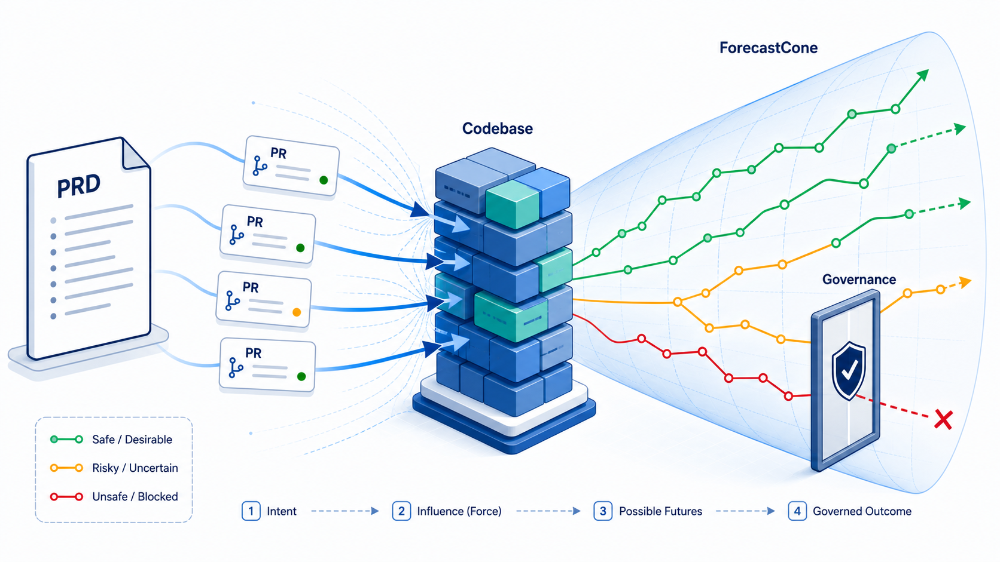

> **TL;DR**
>
> This article starts from the `ForecastCone` in Software Field Theory (SFT), then reads modularity, technical debt, review, governance, and learning as parts of one research program.
>
> The goal is simple to state:
>
> > Make it possible to see what futures a change opens, close dangerous futures early, and shape the development environment so good futures become easier to reach.
>
> If this theorem-shaped program works, architecture, technical debt, review, governance, and AI coding safety can all be reread around the same object: the `ForecastCone`.
>
> We are also formalizing this direction in Lean by breaking concepts such as `ForecastCone` and `ConsequenceEnvelope` into small records and theorem packages.

## For the Bigger AAT / SFT Picture

I introduced the broader AAT / SFT framing here:

[Software Architecture as a Field: Asking Better Questions About Software Evolution](https://blog.iroha1203.dev/software-architecture-as-a-field)

## The Problem: Fast Code Is Not the Same as Healthy Evolution

For an AI agent, the codebase itself is the largest prompt.

If the existing code contains many shortcuts, the agent can easily learn those patterns.
If boundaries are vague, the agent will naturally add the next change in the vague place.
A good structure attracts good changes. A bad structure repeatedly makes bad shortcuts look natural.

PRDs, issues, review policies, and CI rules do not only decide "this change."
They shape what the next PR tends to look like, which modules feel natural to touch, which boundaries are easy to miss, and which shortcuts are likely to pass.

In vibe coding, for example, an AI agent can quickly produce a plausible implementation from an underspecified PRD.

A PRD that only says "make coupons usable" may turn into a small `if` inside the checkout flow.
The first demo works.
But if that change leaves pricing policy, refunds, usage limits, and audit logs as vague boundaries, the next PR will often build on the same shortcut.

The problem is not that AI writes bad code.
The problem is that vague artifacts plus fast generation can open bad future paths very quickly.
A bad field can be amplified by AI into larger technical debt.

Traditional review, CI, and metrics often look at the current diff or at outcomes that already happened.
In the AI era, that is not enough.

The question is no longer only:

> Does this PR pass right now?

The deeper question is:

> What future does this PRD, this agent, this codebase, and this review rule open next?

SFT needs `ForecastCone` in order to ask that question.
It gives us an object for making software evolution computable, not as a mere sequence of changes, but as a space of reachable futures.

## The Grand Theorem: A Fundamental Theorem of Software Evolution

```text
Modularity
  = ForecastCone descent

Technical debt
  = descent obstruction

Review
  = minimal decision-preserving envelope

Governance
  = desired-cone-preserving obstruction cutting

Learning
  = closed-loop boundary-explicit fixed point
```

In this article, I will call this theorem-shaped picture the **Fundamental Theorem of Software Evolution**.

In everyday engineering language, it says something like this:

> A good architecture boundary lets teams and AI agents work separately, then combine their changes safely later.

> Technical debt is the ability to explain, with a concrete cause, why integration keeps breaking at the same place.

> In review, we do not want every diff line or every possible future. We want the dangerous futures that matter for the decision.

> Governance should not just add rules that stop development. It should close bad shortcuts and make good implementation paths easier to choose.

> Learning means using actual PRs, incidents, and review outcomes to update the next forecast and the next rule.

In more mathematical language:

> A good architecture boundary is not merely a static dependency cut. It is a boundary across which future evolution paths can be computed locally and glued into a global future under compatibility conditions.

> Technical debt is an obstruction that appears when that gluing fails.

> Review is not the act of seeing the entire ForecastCone. It is the act of seeing an envelope that preserves the distinctions needed for a decision.

> Governance is a support transformation that removes bad futures while preserving desired futures.

> Learning is a closed-loop update that moves a field estimate toward a boundary-explicit fixed point using PRs, incidents, reviews, and operational outcomes.

If such a theorem can be proved, the way we reason about software evolution changes.

Whether an architecture is good, where technical debt sits, what a reviewer needs to see, which governance rule is effective, and how the field model should be updated next can be studied over the same computational object.

That object is the `ForecastCone`.

## ForecastCone: The Range of Reachable Futures

SFT reads the development environment as a `field`.

```text
codebase
  + artifacts
  + practices
  + agents
  + governance
  + feedback
  -> reachable software futures
```

The range of futures reachable under that field is what SFT calls a `ForecastCone`.



A ForecastCone is not a prophecy.

SFT does not say:

> This PRD will definitely produce this PR.

Instead, it asks:

> Under this field model, operation support, policy, observation boundary, and horizon, which future paths are reachable?

Imagine an e-commerce service receives a PRD: "Add limited-time coupons."

That PRD does not open just one future.

- One future adds a small branch to the checkout flow.
- One future adds a discount policy to the pricing service.
- One future introduces an independent coupon domain.
- One future expands into campaign rules and audit logs.
- One future adds a database column for now and leaves cleanup for later.

All of these are, in some sense, "coupon support."
But they open very different next futures.

The ForecastCone is the object that lets us look at that difference.
The same PRD can make different futures easy or hard to reach depending on the current codebase, module boundaries, past workarounds, review rules, CI, and AI agent behavior.

## Modularity = ForecastCone Descent

```text
Modularity
  = ForecastCone descent
```

The intuition is:

> The global future of a software system can be computed by gluing compatible local futures.

Traditional modularity is often described in terms of APIs, dependency direction, and responsibility separation.
SOLID, Layered Architecture, Clean Architecture, and Design Patterns have often been used as ways to help humans understand responsibilities, localize change, and control dependencies.

SFT extends that line of thought by asking:

> Do the futures glue?

If a boundary is truly modular, we should be able to reason about the future of `Pricing` and the future of `Checkout` locally, then glue them into one checkout future under the right compatibility conditions.

The boundary is not just a line. It is a place where future evolution should cross without breaking.

In practice, following SOLID and Layered Architecture already gets us a lot of the way toward this kind of modularity.

## Technical Debt = Descent Obstruction

```text
Technical debt
  = descent obstruction
```

The intuition is that technical debt can be read as a failure of futures to glue.

local tests pass.
local reviews pass.
the AI proposal looks reasonable.
then integration breaks.

SFT does not want to stop at "the design is bad."
It wants to record the failure as an obstruction.

```text
DescentFailure:
  missing interface invariant

Witness:
  Pricing returns a discounted total,
  but Checkout treats it as a tax-included final charge.
```

Now technical debt is no longer just a feeling.

> Each team-local change looks reasonable, but the whole system cannot combine them into a valid global future.
> The reason is that the boundary rule that should have been preserved was never defined.

That is the role of the `Descent Obstruction Theorem`.

## Review = Minimal Decision-Preserving Envelope

```text
Review
  = minimal decision-preserving envelope
```

A ForecastCone can be large.
A reviewer cannot look at every future path.
But a diff alone is often too small.

Suppose an AI agent produces a PR like this:

```text
if coupon_code.present?
  total = total - discount
end
```

The diff is small.
But the reviewer does not only care about these three lines.

Will this add an unobserved branch to the refund path?
Will usage limits collide with retry behavior?
Is the tax boundary between `Pricing` and `Checkout` still undefined?

What we need is not the whole ForecastCone, but the part needed for a review decision.
SFT calls this a `ConsequenceEnvelope`.

The goal for review tooling is not to show everything.
It is to show the future-relevant differences needed for the decision, no more and no less.

## Governance = Desired-Cone-Preserving Obstruction Cutting

```text
Governance
  = desired-cone-preserving obstruction cutting
```

When a risky future appears, the simplest response is to add another rule.

> Anything coupon-related must be reviewed by a senior engineer.

That is a guardrail.
But it is often heavy, and it may not say what future it is actually closing.

The kind of governance SFT wants is more specific: close bad futures while preserving desired ones.

- Introduce separate `DiscountedTotal` and `FinalCharge` types across the `Pricing` / `Checkout` boundary.
- Make coupon usage updates idempotent.
- Require coupon invariant checks when touching the refund path.
- Guide AI agents away from ad hoc discount branches under checkout and toward policy objects.

We want to close the future where discount logic spreads across checkout.
We still want to preserve the future where coupon policy can evolve independently.

That difference is what the `Governance Synthesis Theorem` is about.
It is not just about adding guardrails. It is about shaping the field.

## Learning = Closed-Loop Boundary-Explicit Fixed Point

```text
Learning
  = closed-loop boundary-explicit fixed point
```

SFT is not a theory where we compute one ForecastCone and stop.

Predicted future paths are compared with actual PRs, incidents, review comments, CI failures, and runtime observations.
When the forecast is wrong, that is not just a failure.
It becomes evidence for updating the model.

- Was the field estimate too coarse?
- Was the observation boundary too narrow?
- Did the policy model fail to represent actual review behavior?
- Should the unknown remainder have been made explicit?

As this closed loop progresses, an SFT workbench becomes more than an analyzer.
It becomes a system for continuously calibrating the field model of software evolution.

## Attractor Engineering and ArchSig

This grand theorem becomes practical only when it connects to AAT and ArchSig.

AAT gives us a local theory for reading what a change preserves and what it breaks.
ArchSig gives us a signature layer for observing preservation and breakage from repositories, PRs, reviews, CI, and incidents.
SFT uses those observations to compute reachable futures and connect them to governance and learning.

```text
AAT
  -> local laws / invariants / obstruction witnesses

ArchSig
  -> observed signatures / measured axes / evidence boundaries

SFT
  -> ForecastCone / ConsequenceEnvelope / governance update
```

Attractor Engineering fits here as well.

A good architecture attracts good changes.
A bad architecture repeatedly makes the same shortcut look natural.

In SFT language, this means the shape of reachable futures changes.
Governance interventions close bad future paths, type boundaries make good local evolution more natural, and review rules make risky paths observable.

Attractor Engineering is the practice of shaping the ForecastCone.
ArchSig is a tool for observing that change.
SFT connects those observations back to the theorem family.

## A Sketch of a Future Development Workflow

SFT is not trying to build a system that decides the future instead of developers.
It is trying to make a development environment where developers, AI agents, reviews, and CI can see the future opened by a change on the same map.

An ambiguous PRD arrives.
An AI agent quickly proposes an implementation.
At the same time, a workbench sketches the futures that change seems to open and shows only the differences needed for review.

```text
PRD
  -> implementation candidates
  -> reachable future range
  -> review-relevant differences
  -> review / CI / governance
  -> observed outcome
  -> next forecast update
```

Before reading every line of the diff, the reviewer sees which futures look risky.
CI checks not only whether tests pass, but whether a risk we wanted to close is still present.
The AI agent prioritizes implementation candidates that open better futures instead of copying the nearest shortcut.

Actual PRs, incidents, and review comments then become evidence for the next forecast.

That is the development workflow SFT is aiming toward.

## Impact on Computer Science and Software Engineering

Lehman raised a core question of software evolution: long-lived software keeps changing as it adapts to its environment, and that change tends to increase complexity.

SFT revisits that question in the age of AI-assisted development.

Software engineering has long developed design and architecture theory around human cognition.

That makes sense.
Software is complex, and if humans cannot read it, they cannot maintain it.
So we developed ideas such as separation of concerns, information hiding, cohesion, coupling, layering, Clean Architecture, and bounded contexts to make complexity manageable for people.

That axis remains important.

But once AI coding agents enter the loop, the bottleneck shifts.
When code can be produced faster, the question is no longer only:

> Can humans understand the current structure?

The next question is:

> What futures does this structure make reachable?

A good design is not only one that makes the current code easier to read.
It is also one that makes good futures easier to reach and bad futures harder to reach.

From this point of view, architecture expands from human comprehensibility to future reachability.

- Can this boundary glue future paths locally?
- Which direction does this PR make the next change more likely to take?
- Does this metric preserve distinctions that matter for future evolution?
- Does this review rule close bad futures while preserving good ones?
- Which gluing failure does this technical debt represent?

These questions already exist in practice.
They are just scattered across experience, intuition, review comments, incident memory, and organizational culture.

SFT tries to move them toward computable theory.

If this direction works, software engineering moves from:

> techniques for making complexity understandable to humans

toward:

> a science for observing, computing, and governing software evolution

The central concepts begin to look different:

```text
architecture
  -> shape of reachable futures

modularity
  -> descent of future paths

technical debt
  -> obstruction to future gluing

review
  -> minimal consequence envelope

metrics
  -> cone-conservative observations

governance
  -> support transformation

refactoring
  -> evolutionary invariance

AI coordination
  -> agentic confluence

lifecycle
  -> bifurcation of repair feasibility
```

## Lean Formalization

We are also formalizing this research program in Lean.

The point is to keep SFT vocabulary from remaining only a metaphor.

Terms such as `field`, `ForecastCone`, `ConsequenceEnvelope`, and `governance update` are being broken into small objects that can become records, types, and theorem packages.
The big research picture gradually becomes something we can touch formally.

Current formalization work includes:

```text
SoftwareFieldEstimate
OperationSupport / StepRelation
ForecastCone / ClockedForecastCone
ConsequenceEnvelope
FieldUpdate
```

For example, `ForecastCone` is treated as a supported path within a finite horizon.
`ClockedForecastCone` introduces a shared clock and idle / stutter steps for descent.
`ConsequenceEnvelope` treats review output as a projection from a cone family.

The final grand theorem is also being assembled from components: descent, obstruction, review, governance, calibration, and agentic confluence.
Under those explicit components, the Lean-side assembly has the shape:

```text
computably governed
  or
typed boundary failure
```

This formalization makes SFT a research program where we can track what is a theorem, what belongs to modeling, and what remains on the tooling or empirical side.

## Closing

ForecastCone is not a tool for predicting the future.

It is a way to make reachable software futures computable under explicit modeling boundaries, operation support, policies, observation boundaries, and horizons.

SFT's bet is that we can rebuild central software engineering concepts from there.

```text
Architecture is not only the shape of present code.
It is the shape of reachable futures.
```

Architecture is not only the shape of the code we have now.

It is also the shape of the futures that codebase makes reachable.
