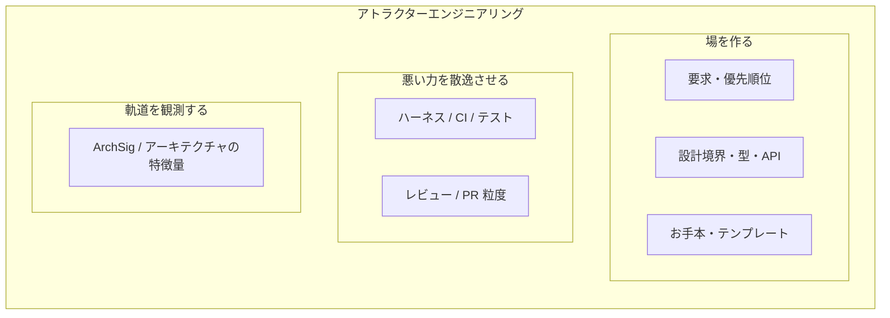
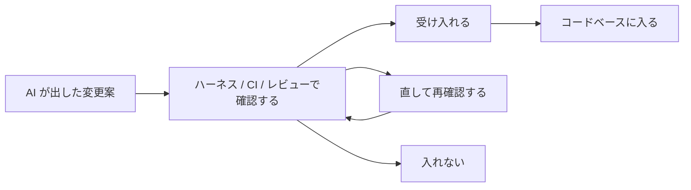

# アトラクターエンジニアリングという発見 ――ソフトウェア開発を場の力学として見る

:::note info

- コードベースは場であり、PR はその場に加わる力として読める
- 良い場は良い変更を引き寄せ、悪い場は悪い変更を何度も選ばせる。AI が高速に PR を作る時代には、この引力はさらに強くなる
- この「未来の変更がどこへ吸い寄せられるか」を設計する考え方を、アトラクターエンジニアリングと呼ぶ
- CI/CD、テスト、レビュー、ハーネスは、不要な力を逃がして軌道を整える散逸系として見える
- ArchSig（アーキテクチャの特徴量）は、その軌道を複数の軸で観測するための道具である
:::

## 最初の発見

出発点は、素朴な思考実験。

ソフトウェアアーキテクチャを、ディレクトリ構成や設計ルールの集まりとしてだけでなく、**代数構造**として見てみることでした。

そうすると、機能追加、リファクタリング、分割、移行、修復、保護、削除、統合といった日々の変更は、アーキテクチャという構造に作用する操作として見えてきます。

```
今のコードベース
  + 機能追加
  + リファクタリング
  + レビューでの修正
  + 移行
  + 修復
  -> 次のコードベース
```

もう少し進めると、その操作が一回だけではなく、何十回、何百回と繰り返されるなら、開発全体をひとつの『力学』として読めるのではないか、と思いました。

個々の PR は小さな変更です。

でも、それが繰り返されると、コードベースは少しずつどこかの方向へ進んでいきます。

良い構造があると、次の変更も良い場所に収まりやすい。

悪い構造があると、局所的には自然な変更が、また同じ悪い近道へ寄っていく。

この「変更がどこへ寄っていくのか」を設計対象として見られるのではないか。

それを、 **アトラクターエンジニアリング** と呼ぶことにしました。

## コードベースは場であり、PR は力である

この発見の中心にあるのは、次の解釈です。

```
コードベース = 変更を引き寄せる場
PR = その場に加わる力
ArchSig = その動きを見る観測器
```

コードベースは、未来の変更を中立に受け止める空間ではありません。

既存の名前、型、責務境界、テスト、ディレクトリ構成、過去の実装例、レビュー文化は、次にどんな変更が自然に選ばれるかを決めます。

PR は、その場に加わる力です。ひとつひとつは小さくても、繰り返されると変更の軌道を作ります。

```
今のコードベース
  -> PR が加わる
  -> アーキテクチャの変化が観測される
  -> 変更の軌道ができる
  -> 次のコードベースになる
```

重要なのは、PR がコードベースを変え、変わったコードベースが次の PR の出方をまた変えることです。

## 開発に関わる人と仕組みが、場を作る

この場を作っているのは、エンジニアだけではありません。

PdM、PO、エンジニア、レビュワー、AI エージェント、CI、テスト、設計ドキュメント、コーディング規約、既存コード例。

開発に関わる人と仕組みのすべてが、次にどんな変更が選ばれやすいかに影響します。

| 参加者 / 仕組み | 場への作用 |
| --- | --- |
| PdM | どの価値や要求を継続的に注入するかを決める。 |
| PO | 要件の粒度、優先順位、受け入れ条件を通じて、PR の出方を変える。 |
| エンジニア / アーキテクト | 境界、抽象、標準パターンやお手本実装を通じて、変更の流路を作る。 |
| レビュワー | 悪い力を戻し、良い方向へ修正する。 |
| CI / テスト / 型 | 不適切な力を拒否し、弱め、絞り込む。 |
| AI エージェント | 既存の場を読み取り、高速に変更案を加える。 |

要求の切り方、優先順位、締切、受け入れ条件、レビュー方針は、後続する PR の出方を変えます。コードを書かない人も、コードベースという場に間接的な力を加えています。

特に AI 駆動開発では、この影響が大きくなります。曖昧な要求は曖昧な PR として高速に具体化され、境界や非目標が明確なら、AI はその範囲で良い変更を出しやすくなります。

## AI 駆動開発で何が変わるか

AI 駆動開発の本質は、単にコードを書く速度が上がることではありません。

より重要なのは、**どの変更操作が選ばれやすいか**が変わることです。

AI は、既存コード、周辺ファイル、命名、型、テスト、過去の実装例、README、設計ドキュメントを見て、次の変更案を生成します。

つまり、コードベース全体が AI に渡される入力文脈になります。

```
コードベースが AI への入力文脈になる
  -> AI が変更案を作る
  -> PR になる
  -> レビュー / CI / マージを通る
  -> コードベースが更新される
  -> 次の入力文脈が変わる
```

良いお手本になる実装が近くにあれば、AI はそれを真似しやすい。

悪い近道が既にあれば、AI もそれを自然な選択肢として選びやすい。

この意味で、AI はその場にある局所的な書き方を高速に再生産します。だから、AI 時代に重要なのは AI エージェント単体の性能だけではなく、AI が参加する場そのものの設計です。

## アトラクターとは

巨大な `common`、便利すぎるヘルパー、曖昧なサービスがあると、変更はそこへ吸い寄せられやすくなります。

逆に、良い責務境界や分かりやすい実装例があると、次の変更もそこに沿って作られやすくなります。

この「変更が寄っていく先」がアトラクターです。ものごとが繰り返し動くときに、だんだん寄っていきやすい場所や状態のことです。

そして、そのアトラクターへ落ちやすい周辺領域を、ここでは吸い込み領域と呼びます。

技術的負債は、悪い吸い込み領域として見ることができます。

一度そこに入ると、局所的には自然な変更が、さらに同じ場所へ追加され、抜け出すための リファクタリングコスト がどんどん高くなっていくからです。

大事なのは、アトラクターは良いものにも悪いものにもなりうる、ということです。

良いアトラクターは、良い変更を引き寄せます。

悪いアトラクターは、悪い近道を何度も選ばせます。

## アトラクターエンジニアリングとは何か

アトラクターエンジニアリングは、このアトラクターを設計しようという考え方です。

対象はコードベースだけではありません。

PdM、PO、エンジニア、レビュワー、AI エージェント、CI/CD、テスト、設計ドキュメント、コーディング規約まで含めた、開発組織全体を対象にします。

悪い変更を外から止めるだけでなく、そもそも良い変更が自然に選ばれやすい場を作ります。



アトラクターエンジニアリングは **開発組織全体を扱う、AI 開発時代の統合的な設計論** です。

## ハーネスエンジニアリングは散逸系として読める

AI が出した変更案を、そのままコードベースに入れるわけにはいきません。

ハーネス、CI、テスト、型チェック、静的検査、レビューは、それを「受け入れる」「直して再確認する」「入れない」に分けます。

この働きを、アトラクターエンジニアリングの中では散逸として見ます。



これは、場に入ってきた力のうち、不要な成分を逃がす仕組みです。

散逸が弱いと、AI の高速な変更力がそのままコードベースに入ります。強すぎると、何も進まなくなります。よいハーネスは、機能を前に進める力を残しながら、負債を増やす力を弱めます。

この見方では、CI/CD は単なるチェックではなく、速い PR 生成を安全な生産性に変えるためのブレーキ、レール、信号機、安全装置に相当します。

AI 駆動開発で重要なのは、エンジンを強くすることだけではありません。

強いエンジンを受け止める場と散逸系を整えることです。

## ArchSig は何を見る道具か

場を設計するには、何が起きているかを観測する必要があります。

そのための道具が ArchSig です。

ArchSig は Architecture Signature の略で、「アーキテクチャの特徴量」という意味です。

私の[リポジトリ](https://github.com/iroha1203/AlgebraicArchitectureTheoryV2)で開発している、コードベースや PR の変化を複数の軸で読むための観測枠組みを指します。依存、境界、抽象化、実行時露出、意味のずれ、テストでの観測しやすさなどを、一つの点数ではなく複数の特徴量として扱います。

PR がアーキテクチャをどの方向へ動かしているのかを、複数の軸で見るための観測器です。

たとえば、次のような軸を見ることができます。

| 軸 | 見たいこと |
| --- | --- |
| 静的依存 | 依存方向や禁止依存の破れ |
| 境界ルール | 境界を越えた接続やルールのすり抜け |
| 抽象の漏れ | 抽象を飛び越えた具象依存 |
| 意味のずれ | 期待していた責務や意味から外れていないか |
| テストでの観測しやすさ | 変更がテストで観測できるか |
| PR ごとの変化 | ひとつの PR で各軸がどう動いたか |

重要なのは、良い / 悪いを一つの点数にしないことです。

見たいのは、どの軸が悪化し、どの軸が改善し、どの変更がどの方向の力を持っているかです。

```
PR
  -> ArchSig で変化を見る
  -> 変更の軌道を見る
  -> 良い領域 / 悪い領域へ向かっているかを見る
```

ArchSig は、AI PR 時代の観測器になります。

AI が作る変更が、良いアトラクターへ向かっているのか。

技術的負債のたまり場に落ちているのか。

ハーネスが十分に散逸させているのか。

それを議論するための共通言語を作ることができます。

## PR の重要性はむしろ上がる

AI によってコード生成コストが下がると、PR の重要性は下がるように見えるかもしれません。

しかし、力学系として見ると逆です。

PR は、単なる作業単位ではありません。

PR は次の機能を持っています。

- 連続的な変更を観測可能な単位に区切る。
- 変更がどの方向に効いているかを分けて見られるようにする。
- レビュー / CI / 承認という散逸プロセスを組み込む。
- ロールバックや差し戻しの可逆性境界を作る。
- 意思決定と議論の単位を作る。

AI によって下がるのは、主に PR を作るコストです。

一方、観測、分解、散逸、可逆性、意思決定単位としての PR の価値は、むしろ上がります。AI 時代に PR が不要になるのではなく、アーキテクチャの動きを観測し制御する単位として、より重要になります。

## 未来の開発組織

未来の開発組織では、速くコードを書く力そのものよりも、その速度を安全に受け止める場の設計が重要になります。

新幹線は強いモーターだけでは速く安全に走れません。

レール、ブレーキ、信号機、安全装置、運行管理が必要です。

開発も同じです。AI は強いモーターですが、それだけでは、意味や責務のずれ、守りたい設計上の性質の劣化、マージ時の混乱、技術的負債に吸い寄せられる流れが起こりえます。

必要なのは、次のような場です。

- 小さく観測可能な PR
- 速いフィードバック
- 信頼できる CI
- 型システム
- アーキテクチャテスト
- 選び抜かれたお手本実装
- レガシーコードの隔離
- 明確な要求、要件、設計境界
- 人間による価値と受け入れ条件の境界設計

最も安全な AI コーディング環境とは、外部ハーネスが最も強い環境ではありません。良い変更が自然で、模倣しやすく、観測可能で、悪い近道に入りにくい環境です。

## ここまでのまとめ

AI 駆動開発の成否は「AI がどれだけ速くコードを書けるか」だけでは決まりません。

コードベース、要求、設計境界、お手本実装、レビュー、CI/CD、ArchSig が作る場によって、次に選ばれる PR の向きは変わります。

良い場は良い変更を引き寄せ、悪い場は悪い変更を何度も選ばせる。だから AI 時代のアーキテクチャ設計は、未来の変更がどこへ吸い寄せられるかを設計することになります。

ここまでが、実務の言葉で見たアトラクターエンジニアリングです。後半では、この直感を AAT（代数的アーキテクチャ論）と力学系の言葉に翻訳していきます。

## ここから数学の言葉で

ここから先は、数学的な定式化が多くなります。実務的な見方だけを先に押さえたい場合は、[まとめ](#まとめ) へ進んでも大丈夫です。

AI 開発の周辺には、「このプロンプトでうまくいった」「こういう運用にしたら速くなった」という経験則が大量にあります。もちろん経験則にも価値はあります。しかし、それだけでは、なぜうまくいったのか、どこまで再現できるのか、どの条件で壊れるのかを分けにくい。

そこで、変更が選ばれ、PR になり、レビュー / CI を通り、merge され、更新されたコードベースが次の変更分布を変えるまでの流れを分解します。状態、操作、観測、不変量、obstruction witness、proof obligation を分けて見ることで、経験則を検証しやすい形にします。

## AAT の基礎解説

この議論の背景にあるのが、AAT、つまり Algebraic Architecture Theory（代数的アーキテクチャ論）です。ここでは、このあと使う最小限の語彙だけを導入します。

AAT は、ソフトウェア開発を単なるコード変更の列としてではなく、architecture の拡大、分解、修復、合成の理論として扱います。

中心命題は、だいたい次の形です。

```text
software development
  = architecture extension
  + operation
  + invariant
  + obstruction witness
  + proof obligation
  + certificate
```

このうち operation は、Lean 側ではまず操作カタログとして切っています。

```lean
inductive ArchitectureOperationKind where
  | compose
  | refine
  | abstract
  | replace
  | split
  | merge
  | isolate
  | protect
  | migrate
  | reverse
  | contract
  | repair
  | synthesize
  deriving DecidableEq, Repr
```

ここで大事なのは、`split` や `repair` という名前だけでは何も証明されないことです。operation kind は theorem package の分類であって、保存・改善・修復の主張は別途 proof obligation として立てます。

この見方では、設計レビューの問いは「この設計はよいか悪いか」だけではありません。

```text
- 既存構造は拡大後にも埋め込まれているか。
- 新機能は既存構造から split して取り出せるか。
- 相互作用は宣言された interface を通るか。
- どの invariant が保存され、どの invariant が破れたか。
- split しないなら、どの obstruction witness が妨げているか。
```

AAT の最小対象は `ArchitectureCore` です。

```lean
structure ArchitectureCore (C : Type u) (A : Type v)
    (StaticObs : Type w) (SemanticExpr : Type q)
    (SemanticObs : Type r) where
  flatness :
    ArchitectureFlatnessModel C A StaticObs SemanticExpr SemanticObs
  staticUniverse : ComponentUniverse flatness.static
  componentDecidableEq : DecidableEq C
  staticEdgeDecidable : DecidableRel flatness.static.edge
  runtimeEdgeDecidable : DecidableRel flatness.runtime.edge
  boundaryPolicyDecidable : DecidableRel flatness.boundaryAllowed
  abstractionPolicyDecidable : DecidableRel flatness.abstractionAllowed
  runtimeRole : C -> C -> RuntimeDependencyRole
  semanticRequiredDecidable :
    ∀ d : RequiredDiagram SemanticExpr,
      Decidable (flatness.requiredSemantic d)
```

ここで重要なのは、`ArchitectureCore` が実コードベース全体そのものではないことです。実コード、仕様、レビュー、運用観測から切り出された、理論が扱える有限または bounded な対象です。

新機能追加は、既存 architecture を保ったまま、より大きな architecture へ拡大する操作として読みます。

```text
ExistingCore X
  -> ExtendedArchitecture X'
  -> FeatureView F
```

良い feature extension では、既存 core は拡大後にも保存され、feature view は説明可能な形で取り出せ、feature から core への相互作用は宣言された interface を通ります。逆に、hidden dependency、boundary policy violation、abstraction leakage、runtime exposure、semantic mismatch は、単なる感想ではなく `ObstructionWitness` として扱います。

この obstruction を数える、消す、保存する、あるいは「ここでは結論しない」と境界づけるために、AAT では `ProofObligation` と `Certificate` を明示します。

```lean
structure ProofObligation (State : Type u) (Witness : Type v) where
  formalUniverse : Prop
  requiredLaws : Prop
  invariantFamily : State -> Prop
  witnessUniverse : Witness -> Prop
  coverageAssumptions : Prop
  exactnessAssumptions : Prop
  operationPreconditions : Prop
  conclusion : Prop
  nonConclusions : Prop
```

さらに、obligation は「ある」というだけでは証明済みになりません。visible assumptions から conclusion が出るときだけ discharge された、と定義します。

```lean
def AssumptionsHold (P : ProofObligation State Witness) : Prop :=
  P.formalUniverse ∧
  P.requiredLaws ∧
  P.coverageAssumptions ∧
  P.exactnessAssumptions ∧
  P.operationPreconditions

def Discharged (P : ProofObligation State Witness) : Prop :=
  AssumptionsHold P -> P.conclusion
```

certificate も同じです。たとえば修復合成で「解なし」と言う場合、solver が失敗しただけでは足りません。valid な certificate があるときだけ、満たす architecture が存在しない、という soundness を使います。

```lean
structure NoSolutionCertificate
    {State : Type u} {Constraint : Type c} (Certificate : Type v)
    (C : SynthesisConstraintSystem State Constraint)
    (cert : Certificate) where
  valid : Prop
  sound : valid -> NoArchitectureSatisfies C
  coverageAssumptions : Prop
  exactnessAssumptions : Prop
  nonConclusions : Prop

theorem sound_of_valid
    (pkg : NoSolutionCertificate Certificate C cert)
    (hValid : ValidNoSolutionCertificate pkg) :
    NoArchitectureSatisfies C
```

`nonConclusions` は飾りではありません。ある static split が証明されても、runtime flatness や semantic flatness が自動的に従うわけではない。ある observation universe で obstruction が見つからなくても、全 universe で obstruction が存在しないとは限らない。この境界を明示することが、単なる経験則ではなく、検証可能な理論として扱うために必要です。

そして `ArchitectureSignature` は、architecture quality を単一スコアに潰すためのものではありません。複数の invariant や obstruction family を、軸ごとに読むための多軸診断です。

```lean
structure ArchitectureSignatureV1 where
  core : ArchitectureSignatureV1Core
  weightedSccRisk : Option Nat
  projectionSoundnessViolation : Option Nat
  lspViolationCount : Option Nat
  nilpotencyIndex : Option Nat
  runtimePropagation : Option Nat
  relationComplexity : Option Nat
  empiricalChangeCost : Option Nat
  deriving DecidableEq, Repr
```

`Option Nat` になっている軸があるのは、測れていないものをゼロ扱いしないためです。`none` は「問題なし」ではなく「この universe / extractor / bridge では未測定」です。

```lean
theorem not_axisAvailableAndZero_of_axisValue_none
    {sig : ArchitectureSignatureV1} {axis : ArchitectureSignatureV1Axis}
    (hNone : axisValue sig axis = none) :
    ¬ axisAvailableAndZero sig axis
```

この見方では、signature は便利な metric 集ではなく、law universe に相対化された多軸不変量です。実際、selected required law axes については、lawfulness と signature zero をつなぐ bridge theorem もあります。

```lean
theorem architectureLawful_iff_requiredSignatureAxesZero
    {C : Type u} {A : Type v} {Obs : Type w}
    (X : ArchitectureLawModel C A Obs)
    [DecidableEq C] [DecidableEq A] [DecidableEq Obs]
    [DecidableRel X.G.edge] [DecidableRel X.GA.edge]
    [DecidableRel X.boundaryAllowed]
    [DecidableRel X.abstractionAllowed] :
    ArchitectureLawful X ↔
      RequiredSignatureAxesZero (ArchitectureLawModel.signatureOf X)
```

AAT では、すべての主張を同じ水準で扱いません。定義、証明済み theorem package、bounded な bridge theorem、tooling-side evidence、empirical hypothesis を分け、それぞれがどの universe、observation、coverage、exactness に相対化されているかを明示します。

ここから続く力学編の Lean も、雰囲気を出すための擬似コードではなく、実装済み API から記事用に短く抜粋したものです。重要なのは、AAT が「それっぽい数学用語」ではなく、何を仮定し、何を証明し、何を結論しないかを型に持たせようとしている点です。

ここまでの AAT は、ひとつの architecture 状態と、そこに作用する操作を扱うための語彙でした。

しかし AI 駆動開発で問題になるのは、単発の操作だけではありません。要求、既存コード、レビュー、CI、AI エージェントによって、どの操作が次に選ばれやすいかが変わり、その選択が何度も繰り返されることです。

つまり、AAT の operation を一回の証明対象として見るだけでなく、反復的に選ばれる変換として見る必要があります。ここで、カオスゲーム的な見方が入ってきます。

## アトラクター力学の定式化

ここからは、AAT の語彙を使って、前半で出てきた「場」「力」「散逸」「観測」をもう少し数学的に書き直します。

これは「AI 開発をカオスゲームっぽく語る比喩」だけではありません。AAT で整備している、状態、操作、不変量、obstruction、proof obligation、certificate、signature の上に、AI 駆動開発における PR force、operation support、trajectory、basin candidate を載せる試みです。

現時点で完成した定理というより、実務で感じている現象を、測定や検証につながる構造として整理します。

力学編の最小ループは、次のように読めます。

```text
architecture field
  -> operation distribution
  -> accepted / rejected transitions
  -> signature trajectory
  -> updated architecture field
```

つまり、architecture quality は snapshot の性質だけではなく、future operation distribution と signature trajectory の性質として読む、という立場です。

### 1. 状態、操作、観測

まず、アーキテクチャの状態を $X_t$ とします。

機能追加、修復、分割、保護、移行、リファクタリングなどを、状態に作用する operation と見ます。

```
X_{t+1} = op_t(X_t)
```

このとき、 $op_t$ は完全にランダムに選ばれるわけではありません。

現在のコードベース、要求、prompt、review policy、CI、設計境界、組織判断によって選ばれやすさが変わります。

```
op_t ~ P(operation | X_t, control_t)
```

ただし、この確率式は、実務上の読みを表すための記法です。AAT の形式的な核そのものは、確率分布ではなく、有限または bounded な operation support、bounded script、accepted transition predicate、明示された preservation assumption です。

Lean 側では、たとえば operation support は確率分布ではなく、状態ごとの有限な候補操作として切っています。

```lean
structure FiniteOperationKernel
    (State : Type u) (OperationId : Type w) where
  support : State -> List OperationId
  coverageAssumptions : Prop
  weightSourceBoundary : Prop
  normalizationBoundary : Prop
  nonConclusions : Prop
```

重み、正規化、AI が出す proposal の完全性は、ここでは theorem の中に混ぜません。`weightSourceBoundary` や `normalizationBoundary` として境界を記録し、確率的な読みはその外側に置きます。

同じように、反復適用される操作列も、まず bounded な script として扱います。

```lean
structure BoundedOperationScript (OperationId : Type w) where
  operations : List OperationId
  operationFamily : OperationId -> Prop
  operationsInFamily :
    ∀ op, op ∈ operations -> operationFamily op
  coverageAssumptions : Prop
  nonConclusions : Prop
```

この境界を置くことで、確率的な解釈と、有限 support 上の保存性主張を混同しないようにします。

そして、状態そのものを直接全部見るのではなく、観測写像 $Obs$ で signature 空間へ写します。

```
sigma_t = Obs(X_t)
```

この $sigma_t$ が Architecture Signature です。

依存方向、境界、抽象化、runtime exposure、semantic mismatch などを、多軸の観測値として持ちます。

Lean では、観測そのものも package にします。観測写像だけでなく、coverage と non-conclusion の境界を一緒に持たせます。

```lean
structure SignatureObservation (State : Type u) (Sig : Type v) where
  observe : State -> Sig
  coverageAssumptions : Prop
  nonConclusions : Prop
```

そして、architecture evolution を観測空間へ写すと signature trajectory になります。

```lean
def SignatureTrajectory (O : SignatureObservation State Sig) :
    {X Y : State} -> ArchitectureEvolution State X Y -> List Sig
  | X, _, ArchitecturePath.nil _ => [O.observe X]
  | X, _, ArchitecturePath.cons _step rest =>
      O.observe X :: SignatureTrajectory O rest
```

変更によって signature は動きます。

```
Delta_t = sigma_{t+1} - sigma_t
```

この $Delta_t$ が、その PR や operation が場に加えた force として読めます。

ただし、すべての軸で単純な引き算ができるとは限りません。数値化できる軸では signed delta として読み、そうでない軸では before / after の比較、witness の出現、状態分類の変化として読みます。

### 2. PR Force Model

この整理で PR を見ると、PR は単なる diff 以上のものになります。

PR は、選ばれた Architecture Signature 空間上で、コードベースに加えられる力として読めます。

```
PRForce(PR) = sigma(after(PR)) - sigma(before(PR))
```

ここでの force は物理的な力ではなく、観測された signature の変化です。どの軸を観測しているか、どの差分を定義できるかに相対化されます。

差分列も、Lean では trajectory と同じく finite path に相対化します。

```lean
def SignatureDeltaSequence
    (O : SignatureObservation State Sig) (D : SignatureDelta Sig Delta) :
    {X Y : State} -> ArchitectureEvolution State X Y -> List Delta
  | _, _, ArchitecturePath.nil _ => []
  | X, _, ArchitecturePath.cons (Y := Y) _step rest =>
      D.between (O.observe X) (O.observe Y) ::
        SignatureDeltaSequence O D rest
```

加法的に扱える selected delta については、各 step の差分を足したものが endpoint delta に一致することも theorem として証明しています。

```lean
theorem netSignatureDelta_telescopes [Zero Delta] [Add Delta]
    (O : SignatureObservation State Sig) (D : SignatureDelta Sig Delta)
    (law : AdditiveSignatureDeltaLaw D) :
    {X Y : State} -> (plan : ArchitectureEvolution State X Y) ->
      NetSignatureDelta (SignatureDeltaSequence O D plan) =
        EndpointSignatureDelta O D plan
```

ただし、この定理は「選ばれた delta が加法法則を満たす」場合の有限 path calculus です。未観測軸、incident risk、review quality、実際の PR outcome まで足し合わせられるとは言っていません。

この force は単一成分ではありません。

| force 成分 | 意味 |
| --- | --- |
| feature force | 機能を前に進める力。 |
| repair force | 既存の破れを直す力。 |
| coupling force | 結合を増やす / 減らす力。 |
| boundary force | 境界を守る / 破る力。 |
| type force | 型情報を増やす / 型穴を増やす力。 |
| test force | 観測可能性を上げる / 下げる力。 |
| debt force | 悪い basin へ押す力。 |
| refactor force | 悪い basin から脱出させる力。 |

良い PR は、feature force だけでなく stabilizing force も持ちます。

```
v_PR = v_feature + v_stabilize
```

注意すべき PR は、局所的には feature を進めながら、小さな debt force を静かに積みます。

```
v_PR = v_feature + v_debt
```

AI 生成 PR で特に見たいのは、テストが通り、仕様も満たしている一方で、小さな `v_debt`、`v_coupling`、`v_type_hole`、`v_entropy` が反復的に蓄積するケースです。一回の PR では見えにくい。しかし、軌道として見ると bad basin へ向かっている。これが Local Correctness Trap です。

### 3. force の三分類

前半で触れた PdM / PO / review / CI/CD の話は、force の見え方を分けると整理しやすくなります。

force は、観測可能性に応じて三つに分けられます。

| force class | 意味 | 主な evidence |
| --- | --- | --- |
| ObservedForce | 実際に merge された PR の before / after signature delta。 | PR、ArchSig report、drift ledger。 |
| LatentForce | 要求、設計、prompt、既存コードの局所的な作法が、PR の出方に与える見えない力。 | 要求、要件、prompt、proposal log、case study。 |
| DissipatedForce | review / CI / type / policy によって拒否、修正、減衰された raw force。 | CI failure、review requested changes、rejected proposal。 |

この分類があると、AI 駆動開発をかなり具体的に見られます。

merge された PR だけを見ると ObservedForce しか見えません。

しかし、AI が大量に proposal を出す時代には、merge されなかった力、review で削られた力、CI で落ちた力も重要です。

散逸系がどれだけ働いているかを見るには、DissipatedForce が必要です。

上流の要求や prompt がどんな PR 分布を作っているかを見るには、LatentForce が必要です。

この「受け入れられた変更」と「拒否された変更」の分離は、Lean 側では damping / control schema として表現しています。

```lean
structure DampingControlSchema (State : Type u) (Sig : Type v) where
  observation : SignatureObservation State Sig
  invariant : SafeRegion Sig
  accepted :
    {X Y : State} -> ArchitectureTransition State X Y -> Prop
  rejected :
    {X Y : State} -> ArchitectureTransition State X Y -> Prop
  acceptedPreservesInvariant :
    ∀ {X Y : State} (t : ArchitectureTransition State X Y),
      accepted t -> StepPreservesSafeRegion observation invariant t
  coverageAssumptions : Prop
  nonConclusions : Prop
```

ここで証明できるのは、`accepted` と分類された遷移が、明示された `invariant` を保存するという範囲です。reject された変更の存在から、コードベース全体の未来が安全だとは言いません。

この schema の上で、accepted な finite evolution が selected invariant 内の trajectory を作ることは theorem として証明しています。

```lean
theorem acceptedEvolution_preserves_selectedInvariant
    (control : DampingControlSchema State Sig) :
    {X Y : State} -> (plan : ArchitectureEvolution State X Y) ->
      StateInSafeRegion control.observation control.invariant X ->
      control.AcceptedEvolution plan ->
        SignatureTrajectoryInSafeRegion
          control.invariant (SignatureTrajectory control.observation plan)
```

### 4. カオスゲーム的な対応

ここで、カオスゲーム的な読みが出てきます。

似ているのは、複数の変換があり、その中から次に適用される変換が選ばれ、状態の軌道ができる点です。

違うのは、ソフトウェア開発では変換の集合も選ばれやすさも固定ではない点です。要求、レビュー、CI、設計境界、既存コード例、AI エージェントのふるまいによって、次に選ばれやすい操作は変わります。

したがって、やりたいことは、ソフトウェア開発をそのまま古典的なカオスゲームだと言い切ることではありません。複数の操作が反復選択され、その軌道がある領域へ寄っていく、という構造を AAT の語彙で扱うことです。

対応はこうなります。

| カオスゲーム側 | AAT / 開発側 |
| --- | --- |
| 状態 $X_t$ | architecture state / codebase field |
| 変換 $f_i$ | architecture operation / PR / patch |
| 変換の選択 | developer / AI / requirement / review による operation selection |
| 軌道 | Architecture Signature trajectory |
| attractor | 滞留しやすい signature region |
| basin | その attractor に落ちやすい初期状態や周辺状態 |
| control input | prompt、review policy、CI、type checker、architecture rule |

式で書くなら、こうです。

```
X_{t+1} = f_{i_t}(X_t)
i_t ~ P(. | X_t, control_t)
Y_t = sigma(X_t)
```

ここで重要なのは、確率や attractor をいきなり強い定理として主張しないことです。

実務で扱うべきなのは、まず有限な observation window、bounded horizon、selected signature axes、selected operation support に相対化された attractor candidate / basin candidate です。

```
finite observed trajectory
  + selected signature region
  + bounded operation support
  -> attractor / basin candidate
```

これは弱い主張に逃げているのではありません。測定と反証ができる形に落とすための境界設定です。

### 5. support shaping

アトラクターエンジニアリングの数学的な核は、support shaping です。

これは、単に「悪い PR を止める」話ではありません。そもそも次に選ばれうる操作の集合と、その選ばれやすさを変える話です。

短く言うと、アトラクターエンジニアリングは、操作分布の幾何を設計する理論です。

```lean
def Supports
    (kernel : FiniteOperationKernel State OperationId)
    (X : State) (op : OperationId) : Prop :=
  op ∈ kernel.support X
```

いまのアーキテクチャ状態 $X$ で、自然に選ばれうる操作の集合を operation support と呼びます。

良い設計は、この support を変えます。

```lean
def SupportOperationsPreserveSafeRegion
    (kernel : FiniteOperationKernel State OperationId)
    (sem : OperationTransitionSemantics State OperationId)
    (O : SignatureObservation State Sig) (R : SafeRegion Sig) : Prop :=
  ∀ {X : State} (op : OperationId),
    kernel.Supports X op -> sem.OperationPreservesSafeRegion O R op
```

つまり、support shaping の強い形は「support に残っている操作が、選んだ安全領域を保存する」という主張になります。実務の言葉に戻すと、悪い操作を減らし、良い操作を増やし、正しい経路を選びやすくし、危ない近道を選びにくくする、ということです。

この発想を Attractor Engineering 側の package にまとめると、次のようになります。

```lean
structure AttractorEngineeringSupportPackage
    (State : Type u) (Sig : Type v) (OperationId : Type w) where
  observation : SignatureObservation State Sig
  kernel : FiniteOperationKernel State OperationId
  semantics : OperationTransitionSemantics State OperationId
  targetRegion : SafeRegion Sig
  supportPreserves :
    kernel.SupportOperationsPreserveSafeRegion semantics observation targetRegion
  coverageAssumptions : Prop
  measurementBoundary : Prop
  nonConclusions : Prop
```

この package があると、bounded script が finite support の操作だけを使い、開始点が target region に入っているなら、観測された trajectory 全体が target region に残る、という theorem が得られます。

```lean
theorem supportPackage_preserves_targetTrajectory
    (package : AttractorEngineeringSupportPackage State Sig OperationId)
    (script : BoundedOperationScript OperationId)
    {X Y : State} (plan : ArchitectureEvolution State X Y)
    (hStart :
      StateInSafeRegion package.observation package.targetRegion X)
    (hRealizes : script.RealizesEvolution package.semantics plan)
    (hSupport :
      package.kernel.ScriptUsesSupport script.operations plan) :
    SignatureTrajectoryInSafeRegion package.targetRegion
      (package.TargetTrajectory plan)
```

たとえば、良い API、良い example、明確な ownership、狭い module、型で表現された domain state は、良い operation の local discoverability を上げます。

逆に、巨大な common module、暗黙の global context、曖昧な service、便利すぎる helper は、悪い operation の local convenience を上げます。

この観点では、refactoring は現在の構造を整理するだけではありません。未来の operation distribution を変える basin reshaping 操作として読めます。

ここで見るべき指標のひとつが `SupportRiskMass` です。

```
SupportRiskMass(C) =
  sum over op in support(C) of weight(op) * risk(op, C)
```

ただし、ここでも `risk` を単純な 0 / 1 にしないことが重要です。

AAT 的には、少なくとも次を区別します。

```
safe-preserving proved
safe-preserving measured
safe-preserving estimated
unsafe witness measured
unmeasured
unavailable
private
notComparable
outOfScope
```

測れていないものを zero と読まない。これは ArchSig でも AAT でも重要な原則です。

### 6. 同じ signature でも同じ未来とは限らない

ここで重要なのは、現在の Architecture Signature が同じでも、未来の operation distribution が同じとは限らないことです。

たとえば、二つの module が同じ依存違反数、同じ test coverage、同じ complexity に見えたとしても、片方には良い canonical example があり、もう片方には悪い shortcut が大量にあるかもしれません。

現在の観測値が同じでも、未来の PR は違う方向へ吸い寄せられます。

```
Obs(X) = Obs(Y)
  does not imply
OperationSupport(X) = OperationSupport(Y)
```

これは、snapshot metric だけでアーキテクチャ品質を見てはいけない理由です。同じ現在値でも、未来の力場が違う。アトラクターエンジニアリングは、この未来の力場を設計対象にします。

### 7. accepted preservation と support preservation は違う

もうひとつ重要な分離があります。

review や CI によって、merge された PR が safe region を保存しているとします。

それでも、operation support の中に unsafe な操作が残っているかもしれません。

この分離は、単なる注意書きではなく、Lean 側に有限反例として入っています。accepted step の invariant preservation が成り立ち、accepted safe step も存在する。それでも、support の中には safe region を保存しない操作が残りうる。

```lean
theorem acceptedPreservation_not_supportPreservation_counterexample :
    (∃ (t : ArchitectureTransition ExampleState safeState safeState),
      control.AcceptedStep t ∧
        StepPreservesSafeRegion control.observation control.invariant t) ∧
    (∀ {X Y : ExampleState} (t : ArchitectureTransition ExampleState X Y),
      control.AcceptedStep t ->
        StepPreservesSafeRegion control.observation control.invariant t) ∧
    (∃ X op,
      kernel.Supports X op ∧
        ¬ semantics.OperationPreservesSafeRegion control.observation
          control.invariant op)
```

これは、guardrail と attractor engineering の違いです。

強い guardrail があれば、悪い PR を止められるかもしれません。

しかし、悪い PR が毎回大量に出てくる場は、まだ良い場ではありません。

良い場とは、そもそも悪い操作が出にくく、良い操作が自然で、模倣しやすく、観測可能で、低摩擦な場です。

### 8. PR は非可換である

PR は一般に非可換です。

```
PR_2 o PR_1 != PR_1 o PR_2
```

もちろん、両方の順序で適用できる場合に限った話です。そのうえで、同じ二つの PR でも、merge order によって最終的な signature が変わることがあります。

これは、AI agent が複数 PR を並列生成する時代に重要になります。

個々の PR が局所的に正しくても、順序によって boundary、type、test、semantic alignment が変わる。

これを merge order sensitivity として見ます。

```
MergeOrderSensitivity(a, b, X) =
  distance(
    sigma(b(a(X))),
    sigma(a(b(X)))
  )
```

これは単なる conflict の話ではありません。operation algebra の非可換性が、signature trajectory を分岐させる話です。AI agent team の評価にも、この観点が必要になります。

### 9. trajectory の形を見る

Architecture Signature は現在値だけでなく、軌道として見る必要があります。

同じ endpoint に戻っていても、途中で bad region を通っているかもしれません。

net delta がゼロでも、内部では大きな churn があったかもしれません。

```
endpoint safe
  does not imply path safe

net force zero
  does not imply no excursion
```

この点も、Lean では小さな有限反例として証明しています。`0 -> 2 -> 0` のような trajectory では、endpoint delta も net delta もゼロに見える一方で、途中で unsafe region を通っています。

```lean
theorem netSignatureDelta_eq_zero :
    NetSignatureDelta (SignatureDeltaSequence observation signedNatDelta
      excursionPlan) = 0

theorem endpointSafe_and_zeroDelta_but_not_pathSafe :
    EndpointSignatureDelta observation signedNatDelta excursionPlan = 0 ∧
      StateInSafeRegion observation safeRegion 0 ∧
      StateInSafeRegion observation safeRegion 0 ∧
      ¬ SignatureTrajectoryInSafeRegion safeRegion
          (SignatureTrajectory observation excursionPlan)
```

trajectory には形があります。

| 軌道タイプ | 意味 |
| --- | --- |
| Stable Orbit | 小変更後も安全領域に戻る。 |
| Drift | ゆっくり悪い領域へずれる。 |
| Spiral Debt | 一見戻りつつ、長期的には悪い basin に近づく。 |
| Sudden Phase Shift | ある PR を境に signature が急変する。 |
| Oscillation | feature addition と refactor で良悪を往復する。 |
| Basin Capture | ある時点から特定の悪い構造に吸着される。 |

ArchSig が本当に見たいのは、この trajectory です。

単発の PR 評価ではなく、PR 群の合力がどの軌道を作っているかです。

### 10. 観測を広げると、突然 bad が見えることがある

観測が粗いと、あるコードベースは安全に見えることがあります。

しかし、観測軸を増やすと、隠れていた obstruction が nonzero として見えることがあります。

```
coarse observation:
  safe

refined observation:
  hidden obstruction appears
```

これを observability expansion shock と呼べます。

重要なのは、これは必ずしもアーキテクチャが悪化したという意味ではないことです。単に、今まで見えていなかった軸が見えるようになっただけかもしれません。

だから、ArchSig は `unmeasured` と `zero` を分ける必要があります。測れていなかったものが見えるようになったとき、それを劣化として扱うのか、観測可能化として扱うのかを分離しなければなりません。

### Lean 形式化について

ここまでの整理は、比喩だけで組み立てているわけではありません。AAT の中核語彙の一部は、Lean の定義・定理として `Formal/Arch` 以下に実装されています。

リポジトリは [AlgebraicArchitectureTheoryV2](https://github.com/iroha1203/AlgebraicArchitectureTheoryV2) にあります。証明済み API は [Lean 定義・定理索引](https://github.com/iroha1203/AlgebraicArchitectureTheoryV2/blob/main/docs/lean_theorem_index.md) にまとめています。

特にこの記事の後半で使った語彙は、主に `Formal/Arch/Evolution/SignatureDynamics.lean` と `Formal/Arch/Evolution/AttractorEngineering.lean` に対応しています。

Lean 形式化の役割は、この理論を「正しそうな雰囲気」にすることではありません。どの universe、どの observation、どの coverage、どの exactness assumption のもとで何が言えるのかを、境界つきで記録することです。

ここで重要なのは、証明済み theorem だけではなく、反例も同じ場所に置いていることです。

```text
proved:
  accepted evolution preserves selected invariant
  bounded sampled support-preserving script stays in target region
  selected additive delta telescopes over finite path

proved counterexamples:
  endpoint safe + zero delta does not imply path safe
  accepted preservation does not imply support preservation
  unmeasured axis is not available-zero evidence
```

逆に言えば、Lean で証明されているからといって、実コード抽出器が完全であることや、すべての runtime / semantic obstruction が観測済みであることまでは主張しません。この境界を持つことで、AAT は、何が形式的に言えて、何が測定に依存し、何が今後の実証課題なのかを分けて議論できます。

## まとめ

アトラクターエンジニアリングという発見は、ソフトウェアアーキテクチャを静的な設計図から、未来の変更を誘導する場へと見方を変えるものです。

ソフトウェアアーキテクチャを代数構造として見ると、機能追加やリファクタリングは operation になります。

その操作が繰り返されると、アーキテクチャの状態は少しずつ軌道を描きます。

その軌道がどこへ向かいやすいのか、どこに留まりやすいのかを見る。そこにアトラクターと basin の考え方が入ってきます。

AI 駆動開発時代のアーキテクチャ設計は、未来の変更が良い場所へ集まり、悪い場所から戻りやすい場を作ることだと言えます。

ハーネスエンジニアリングは、その場に注入される AI の変更力を受け止め、不要な成分を散逸させ、良いアトラクタへ収束させるための工学として位置づけられます。

そして ArchSig は、その軌道を観測するための道具です。

AI 駆動開発の本質は、速く PR を作ることだけではありません。

速く加わる力を、どこへ収束させるかです。

コードベースは場である。

PR は力である。

CI/CD は散逸系である。

PdM、PO、エンジニア、レビュワー、AI エージェントは場の参加者である。

ArchSig は、その軌道を見る観測器である。

この整理ができると、AI 時代の開発は、単なる自動化ではなく、場の設計として見えてきます。

そのための設計論として、アトラクターエンジニアリングは大きな可能性を秘めています。
