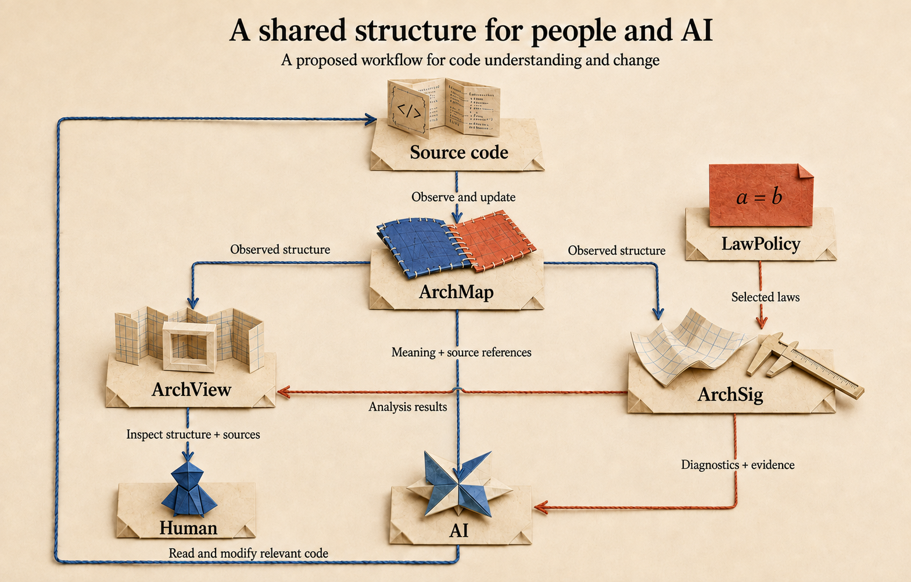

# AI Reads Your Codebase. Then It Forgets Everything.

*AAT: A Semantic Layer for the AI Era*


<!-- Editorial brief: An unpublished research article for engineers familiar with AI coding and service integration. No prior knowledge of AAT or algebraic geometry is assumed. Adapted from the Japanese article; the email system is a fictional example. Preserve the author's voice, theorem assumptions, and distinction between established results and future applications. -->

## AI Reads the Code. How Do We Keep What It Learns?

“Move email delivery to a shared asynchronous queue.”

The request fits in a sentence. The understanding needed to carry it out is scattered across more than 200,000 lines of code.

The sending function is easy to find. Follow its callers, though, and authentication codes and newsletters turn out to use the same implementation. One has expiration rules; the other has unsubscribe requirements. Queue delays and retries affect the conditions under which each feature works.

In an environment where the entire codebase cannot fit into context at once, an AI agent alternates between searching and reading. It cross-checks authentication flows, delivery settings, tests, and design documents to reconstruct dependencies and assumptions. Before it can judge the change, it uses a substantial number of tokens to recover meaning distributed across the code.

How much of that understanding will survive into the next task? Unless the relationships and the reasoning behind its decisions are retained in a reusable form, another session will repeat much of the investigation.

**I want the understanding gained from reading code to persist as a structure that people and AI can share and use for the next change.** Ontologies offer a starting point by making concepts and relationships explicit. I am developing a vision for a semantic layer that also captures meaning in context, supports consistency analysis, and lets us reason about what changes preserve.

The foundation for this work is **AAT, Algebraic Architecture Theory**, a theory I originated and continue to develop through mathematical research and software tools. AAT approaches architectural meaning through geometry. I want to turn that foundation into a way to understand a codebase and reason about how it can change while preserving what matters.

## The Same Email Function Can Mean Different Things

Consider this function:

```typescript
sendEmail(to, subject, body)
```

It sends a subject and a body to a recipient. Its role in the system emerges from its relationship to the code that calls it.

| Use | What the email does in context | Requirements in this example |
| --- | --- | --- |
| Two-factor authentication | Delivers a code needed to complete authentication | Delivery before expiration; clear rules about which code remains valid after a resend |
| Newsletter | Delivers information to subscribers | Consent checks; honoring unsubscribe requests during delivery |

Put authentication emails in the same queue as a bulk mailing, and they may wait behind thousands of messages. Delivery can succeed while authentication fails because the code has already expired.

For newsletters, a subscriber may unsubscribe after a message enters the queue. Consent when the audience was selected and consent when the message is sent are distinct states. The system needs an explicit rule about which state governs delivery.

To assess the change, we need more than a label identifying each use. We need the relationships between the authentication request, code generation, delivery, and verification, as well as the point at which subscription status is checked.

**The meaning of sending an email lies in its relationships with other operations and the requirements of its use.**

By a *semantic layer*, I mean a layer through which we can access components, relationships, contexts, and the laws they must satisfy, together with references to their sources. An AI agent would retrieve the information relevant to a task, then follow those references to the original code wherever implementation details are needed.

## AAT: Toward a Geometry of Meaning

I am building AAT as a theory of pure mathematics, starting from Atoms and Laws. An **Atom** is a basic unit of architectural fact. A **Law** is an equation over a family of Atoms. To apply the theory to code, we express observed facts in this vocabulary and choose laws for the properties we want to examine.

In the email example, we might record that authentication requests code delivery, or that delivery uses a queue, along with the context and source of each fact. We then specify the conditions we want to examine, such as those governing expiration and delivery times.

The perspective I take in AAT is that **software architecture is a large system of simultaneous equations**. The laws within each part and the conditions connecting those parts must hold together. A solution describes a consistent configuration under the selected laws.

**The solutions to a system of equations form a space.** Algebraic geometry studies such spaces. We can ask whether a configuration satisfying the conditions exists, whether configurations built separately can form a coherent whole, and what becomes possible when the conditions change. My aim with AAT is to treat architectural consistency and change as questions about this geometry.

Authentication, delivery, and subscription management can each have configurations that satisfy their own conditions. To form a working system, they must also agree where they meet, for example on which authentication code is being delivered and when delivery takes place.

In mathematics, assembling local configurations into a whole on the basis of agreement on their overlaps is called **gluing**. In this framework, we study failures of global consistency as obstructions to gluing, and changes in configuration as problems of deformation.

I call this research program **Semantic Geometry of Architecture**. It studies the space of consistent realizations of meaning: their existence, obstructions, deformations, and relationships across different ways of reading an architecture.

Once our understanding of an implementation connects to such mathematical objects, we can move from asking what is present to asking what is consistent and how it can change. That is the scope I want the semantic layer to support.

## The Atlas Theorem: Choosing How Much Detail to Read

To use this layer across a 200,000-line codebase, we must choose both the scope and the level of detail appropriate to the question. For asynchronous email delivery, expiration and retry rules deserve early attention. Does every styling detail in the HTML template need the same scrutiny?

Yet omitting the logic that inserts the authentication code into the message could discard something essential. **What we can leave out depends on what we need to establish.** AAT treats this choice mathematically.

We begin by grouping together things that the selected laws cannot distinguish. AAT provides a construction of a *canonical reading* that preserves the evaluations of those laws. In an expiration analysis, for example, the idea is to retain the information needed to evaluate the relevant conditions.

We then ask whether preserving information within each part also preserves the diagnosis of the whole. This is the question addressed by the Atlas Theorem.

> **Atlas Theorem: A change in resolution preserves diagnostics when the required conditions hold.**
>
> If both the finer and coarser readings retain enough information for the selected laws, and their comparison satisfies the specified conditions, their diagnostic classes in first cohomology correspond one to one.

Here, *first cohomology* is a mathematical tool for studying discrepancies that satisfy specified consistency conditions and identifying the obstructions that remain after local adjustments. A one-to-one correspondence of classes means that, under the theorem's conditions, a coarser reading neither loses diagnostics nor introduces new ones. The parts, their overlaps, and the data on those overlaps must all be appropriately related.

Applied to code comprehension, this would let us say, with mathematical justification: **“For this property, reading at this resolution preserves the diagnosis.”** Once a model extracted from the code is shown to satisfy the Atlas Theorem's conditions, omitting detail preserves the diagnostics associated with the selected laws.

An AI agent could use that guarantee to choose a reading resolution, then inspect finer detail when it needs to investigate another property or edit the implementation. Reliable model extraction and a way to select laws appropriate to the question are the tools needed to make this workflow possible.

## The SAGA Theorem: A First Realization of Semantic Geometry

Once we know what to read, we need to determine whether the requirements we find can hold together.

Suppose an authentication code expires five minutes after issuance, but the shared queue can take ten minutes to deliver it. The authentication service rejects expired codes, and the delivery service sends the message. Both follow their own rules, yet the user cannot complete authentication.

An engineer can approach this problem from two directions. One is to consider changes that restore consistency, such as separating the authentication email queue. The other is to express the required relationships as equations, such as those relating expiration and delivery times.

The SAGA Theorem establishes a mathematical correspondence between two independently constructed ways of describing obstructions, one based on each perspective.

On the semantic side, the construction starts from the repairs allowed within each part and the ways those repairs combine. On the geometric side, it starts from the law equations and the algebra describing their obstructions. Because the constructions have different starting points, their agreement requires proof.

> **SAGA Theorem: Semantic and geometric accounts of obstruction correspond.**
>
> Choose finitely many parts covering the subject of analysis. When their local data satisfy the required correspondence and consistency conditions, the cohomology constructed from semantic repairs is isomorphic to the cohomology constructed from the equations and obstruction algebra. The obstruction classes correspond as well.

An *isomorphism* here allows us to move between the two descriptions while preserving the mathematical structure used to study obstructions.

The power of the SAGA Theorem is that **we can take a semantic question about what prevents local repairs from fitting into a consistent whole and bring it into algebraic and geometric computation**. For a model satisfying the theorem's conditions, the correspondence between the computed obstruction and the semantic obstruction is mathematically guaranteed. People and AI can use that result as evidence when evaluating repair proposals.

For the email system, I want to model the allowed repairs and the data shared between operations, then connect the problem of making authentication and delivery consistent to this analysis. **The SAGA Theorem connects reasoning about meaning with geometric computation. It is the first realization of the Semantic Geometry of Architecture program.**

## Annapurna: Preserving Relationships Through Change

Moving to asynchronous delivery may involve a dedicated authentication queue, invalidating old codes when a new one is sent, or checking subscription status immediately before delivery. The change extends beyond the sending function into relationships between operations.

Identical “delivery succeeded” records before and after a change do not establish that authentication and subscription requirements have been preserved. We need to know whether the recorded information captures the property we want to compare.

In the research series I call **Annapurna**, I have studied how comparisons can be carried through changes in viewpoint and structure. Its later results include the following.

> **Annapurna results: Classify changes that preserve a comparison, and establish distinctions that observation alone cannot detect.**
>
> Within the specified structures, we can classify which changes to the two objects preserve their comparison. This classification carries over when the presentation of the inputs changes. There are also examples in which two changes produce identical observations through specified coefficients, yet only one is compatible with the comparison.

In the latter case, processing the observed values afterward cannot recover the distinction. The information needed for that decision is absent from those values.

The email delivery log is an illustration of the problem these results address. To assess a change, we need records that let us compare structural relationships as well as outcomes.

I want to use the Annapurna results to examine a practical question mathematically: **“If we change one side, how must we change the other to preserve their relationship?”** Classifying the changes compatible with a comparison provides a mathematical basis for that analysis within the specified structures.

For asynchronous email, the application would be to ask how code issuance and resend rules should change alongside the delivery mechanism. What does the proposed modification preserve, and which changes must be made together to preserve it? To support that analysis, the semantic layer would record how operations correspond before and after the change, which requirements must carry over, and the information needed to check the theorem's applicability.

## The Major Theorem Ahead: Representing Meaning Geometrically

The results so far answer particular questions within semantic geometry. Beyond them, I am working toward **a major theorem that represents realizations of meaning as a geometric object**.

A *realization of meaning* is a consistent configuration for the chosen Atoms and laws. In the email example, this would be a configuration in which authentication, delivery, and subscription management satisfy their local conditions and agree where they interact.

The goal is first to define these realizations independently, then show that they are naturally described by maps into a geometric object. This property is called **representability**. It would let us study questions about configurations satisfying the conditions as properties of the corresponding space.

Proving this major theorem remains a research goal. I want it to connect engineering questions to geometric ones:

| Engineering question | Geometric question |
| --- | --- |
| What does this refactoring preserve? | Is there a correspondence preserving the selected semantic structure? |
| What else must change when delivery becomes asynchronous? | Which deformations are possible while the conditions continue to hold? |
| Why does fixing individual operations still fail to make the system consistent? | What obstructs gluing? |
| Can the problem be resolved under these constraints? | Does a realization satisfying the conditions exist? |

Computing actual repair proposals will also require algorithms that work with finite inputs. I want to pursue both the theorem and the implementation work needed to turn its consequences into computations, so that refactoring and repair can be treated as geometric problems.

## The Workflow I Want to Build with ArchMap, ArchView, and ArchSig

I am developing ArchMap to record observed structure, ArchView to visualize it, and ArchSig to analyze it under selected laws. LawPolicy specifies the laws, which are combined with the observations for computation. Here is the future workflow I want to build on that foundation.



Return to the 200,000-line codebase and the original request:

“Move email delivery to a shared asynchronous queue.”

The AI first queries ArchMap for the contexts in which email delivery is used. It retrieves the operations involved in authentication and newsletters, their requirements, and their source references, together with the shared data and relationships needed for the decision.

In ArchView, a person examines the same structure. They follow code issuance through delivery and verification, checking which operations the AI selected for modification and why. Eventually, linking changes in the level of visual detail to mathematical reading resolutions could make it clear which information each view preserves.

ArchSig analyzes the selected scope under the selected laws. I want to extend it to check the conditions for comparisons across resolutions and to handle structural correspondences before and after a change. The results and supporting evidence would serve both the AI's explanation and human review.

With that information, the AI reads the implementation details it needs: code issuance, queue submission, resend handling. After making the change, it updates the relevant observations and repeats the diagnosis and comparison for the same objective.

The semantic structure used to reach the decision remains available to the person reviewing it and to the AI in the next session.

## Putting the Geometry of Meaning in the Hands of People Who Build Software

What I want to create with AAT is a development environment in which people and AI share an understanding of software's meaning and explore the changes that understanding makes possible.

Faced with 200,000 lines of code, we trace the relationship between authentication and delivery. We introduce a proposal for asynchronous processing and inspect the requirements it must preserve and the operations it needs to adjust. One repair leaves an obstruction; another configuration is consistent. We can explain why using both the original code and mathematical evidence. That is the development experience I want to build.

In that environment, a codebase is both an implementation to read and a geometric object through which to reason about what can remain and what can change. Refactoring becomes a question about correspondences that preserve semantic structure. Repair becomes a question about the existence and deformation of configurations satisfying the conditions. I want the individual difficulties of everyday engineering to become approachable through a shared body of mathematics.

Through the SAGA Theorem, the Atlas Theorem, and Annapurna, I have been building that foundation in theorems and counterexamples. We already have verifiable results on comparisons between meaning and geometry, changes in resolution that preserve diagnostics, and structural comparison and information loss. I am also pursuing formal verification in Lean so that others can check the foundations themselves. The work toward the major theorem continues from those results.

There is still substantial tooling work ahead: reliable extraction and updates, usable ways to query meaning, and evaluation in actual development. I want to measure not only how much code and how many tokens an agent consumes, but whether it retains the requirements that matter and carries its understanding into the next session. Each of these is part of bringing the mathematics into the hands of people who build software.

In this future, using the tools would not require every developer to learn algebraic geometry. People and AI would express what they want to build and what they want a change to preserve. The theory and tools would connect those questions to semantic structure, perform the computation, and return results with evidence. As AI becomes capable of proposing more changes, mathematics can help us explore those possibilities with greater confidence.

**Treat software's meaning as geometry, and put that geometry in the hands of the people building it.** That is the ambition behind Semantic Geometry of Architecture. From understanding 200,000 lines of existing code to exploring configurations that have yet to be implemented, I want people and AI to be able to reason about the same space of meanings.

Repository: [AlgebraicArchitectureTheoryV2](https://github.com/iroha1203/AlgebraicArchitectureTheoryV2)
