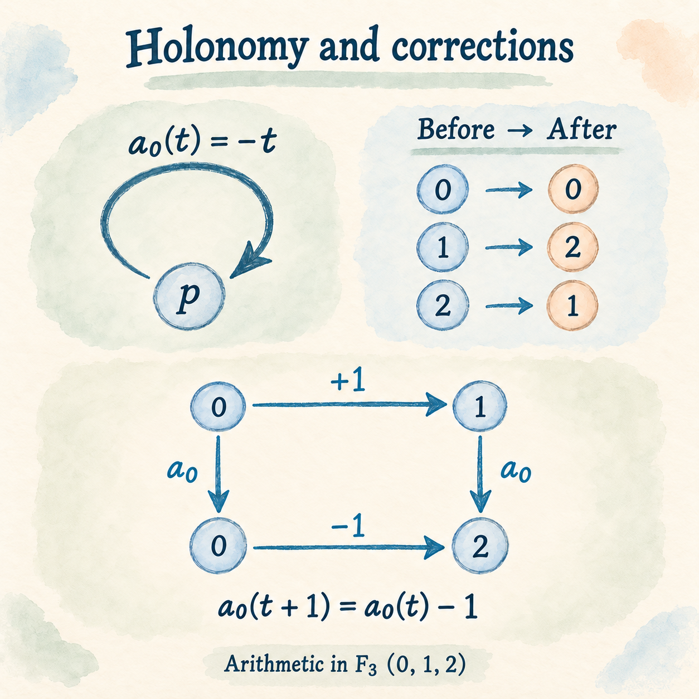
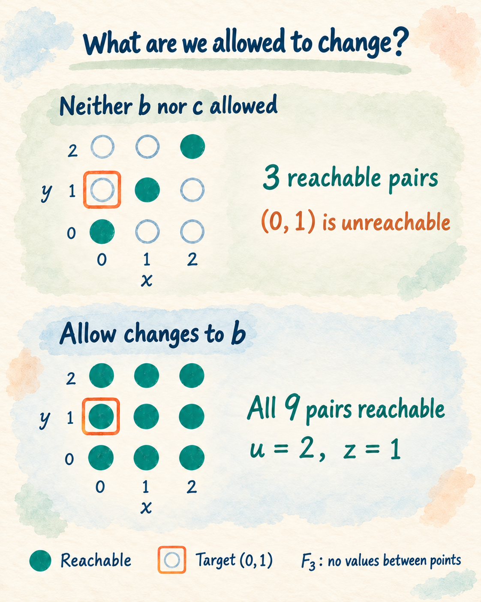
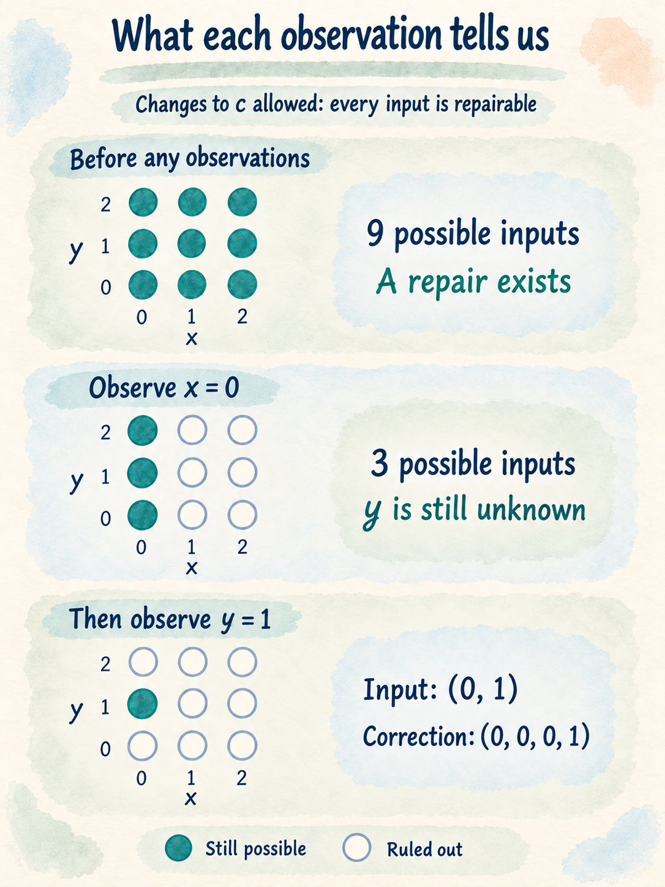

# Ariadne: The Mathematics of Refactoring in the Age of AI

“I want to add multilingual support to the site.”

It sounds like a small change: add translation files and switch the strings shown on screen. Then you switch to English, and the return button disappears. The business logic was checking a Japanese display string.

In this fictional order-management system, an AI agent has handled much of the development. How do we make the internal state independent of the display language while preserving the business rules and the behavior of the existing API? What do we need permission to change, and what do we need to find out first?

Reviewing every line of AI-generated code is a substantial burden. I want us to be able to establish, on mathematical grounds, that the requirements we care about are preserved—without rereading the entire codebase.

**Algebraic Architecture Theory (AAT)** is the theory I am developing to study operations and the relationships they must satisfy as mathematical objects. This article introduces the Ariadne Boundary Repair Theorem and results about the observations needed to carry out a repair, starting with a small model we can calculate by hand.

## Translate a status label, lose a return button

The first implementation displays the order's status directly. The Japanese string `"発送済み"` means “Shipped.”

```ts
const order = { status: "発送済み" };
statusElement.textContent = order.status;
```

A new requirement arrives: show the return button for shipped orders. This is a simplified business rule for our example.

The developer has been asking the AI agent to “keep the diff small and follow the existing patterns.” They check that each feature works on screen, but spend less time reading the generated code in detail.

The agent adds a condition that reuses the display string. The change takes only a few lines, and the button appears as expected.

```ts
const canReturn = order.status === "発送済み";
returnButton.hidden = !canReturn;
```

Later, the agent follows the same pattern in the return API's eligibility check and a batch job that selects orders eligible for return. Each change meets the requirement at the time. With attention focused on visible behavior, the growing dependence on Japanese text goes unnoticed.

Now multilingual support arrives. The code translates `status` before passing the order to the view, so the English view receives `"Shipped"`.

```ts
const orderForView = { ...order, status: "Shipped" };

// The existing UI condition expects the Japanese string.
const canReturn = orderForView.status === "発送済み"; // false
```

Fixing the UI condition leaves the same assumption in the API and batch job. Changing the value at its source to English would affect those checks and existing API consumers.

A label intended for display has become a shared assumption across the system. Small changes that followed existing patterns carried that assumption further.

The design we want separates the internal status ID from its display text:

```ts
type StatusId = "pending" | "shipped";
type Order = { statusId: StatusId };

const labels = {
  ja: { pending: "未発送", shipped: "発送済み" },
  en: { pending: "Pending", shipped: "Shipped" },
};

function canReturn(order: Order): boolean {
  return order.statusId === "shipped";
}

function statusLabel(order: Order, locale: "ja" | "en"): string {
  return labels[locale][order.statusId];
}

// Preserve the representation expected by existing API consumers.
function toLegacyApi(order: Order): { status: string } {
  return { status: labels.ja[order.statusId] };
}
```

Internally, `"shipped"` is a stable identifier. Changing the English label to `"Dispatched"` no longer changes return eligibility. At the legacy API boundary, we convert the status back to the Japanese value that consumers expect.

Reaching this design requires coordinated changes to data creation, business checks, display logic, and API conversion. The available solutions depend on whether we may change only the UI or also the internal representation and the API conversion.

## “Can we fix it?” depends on what we may change

There are three things to specify:

| What to specify | In the multilingual example |
| --- | --- |
| What must stay the same | Return eligibility and the values returned by the existing API |
| What may change | The internal status representation, business checks, and conversions for display and API output |
| What must agree | Return decisions across display languages, and the order state understood by existing API consumers |

Only then does “Can we fix it?” become a precise question. The requirements may be achievable with one set of permitted changes and impossible with a narrower set.

The Ariadne Boundary Repair Theorem studies whether permitted changes can satisfy the required conditions while preserving a fixed part. Its central setting is a model in which corrections can be calculated linearly over a finite field.

We can explore the question behind our multilingual example using reversible operations on just three values. In this small model, we can write out every operation and calculate exactly what each correction does.

## A three-value model of what needs to change

### Arithmetic with 0, 1, and 2

Our values are 0, 1, and 2. After each calculation, we take the remainder modulo 3, so `2 + 1 = 0` and `1 - 2 = 2`. This number system is the finite field **F₃**.

Imagine a location `p` holding one of these values. An operation changes the value at that location. Start with two operations: “add `x`” and “add `y`.” Writing the input as `t`, we have

$$
r_x(t)=t+x,\qquad r_y(t)=t+y.
$$

Both `x` and `y` belong to F₃. These two operations must stay fixed during repair. We will adjust other operations so that their combined results match them.

There are four operations available for adjustment:

| Operation | Transformation | When may it change? |
| --- | --- | --- |
| `e_u` | `t ↦ t + u` | Always |
| `a_h` | `t ↦ -t + h` | Always |
| `b_z` | `t ↦ t + z` | Only if changes to `b` are permitted |
| `c_v` | `t ↦ t + v` | Only if changes to `c` are permitted |

The subscripts `u`, `h`, `z`, and `v` are the correction values we will choose. Initially, all four are 0. Each may be reset to 0, 1, or 2, subject to the permissions: if we cannot change `b`, then `z` stays 0; if we cannot change `c`, then `v` stays 0.

Repair adjusts the amounts added. The sign reversal in `a_h` stays in place.

### Holonomy: a loop can change what comes back

Following a loop brings us back to the starting location, but it need not bring the state back unchanged. The transformation obtained by composing operations around a closed path is called **holonomy**.

Here, `a_h` is a single arrow that loops from `p` back to itself. With `h = 0`, it acts as `a_0(t) = -t`: 0 stays 0, while 1 and 2 swap places.

It also reverses the sign of a correction. If we add `z` before applying the operation, then

$$
a_h(t+z)=-(t+z)+h=a_h(t)-z.
$$

Adding `z` before the operation corresponds to subtracting `z` afterward. This propagation of a correction along an operation is called *transport*. Around this loop, the holonomy on corrections is multiplication by −1.



*Top: returning to the same location swaps 1 and 2. Bottom: +1 before the operation corresponds to −1 afterward. All arithmetic is modulo 3.*

### Turn the required behavior into equations

We want two sequences of operations to match the fixed operations:

| Execution order, left to right | Required result |
| --- | --- |
| `b_z` → `e_u` | `t + x`, matching `r_x` |
| `c_v` → `a_h` → `b_z` → `a_h` → `e_u` | `t + y`, matching `r_y` |

The first sequence adds `z`, then `u`, so it matches when `u + z = x`.

In the second sequence, focus on `b_z` between the two occurrences of `a_h`. Substitution gives

$$
\begin{aligned}
a_h\bigl(b_z(a_h(t))\bigr)
&=-(-t+h+z)+h\\
&=t-z.
\end{aligned}
$$

The two occurrences of `h` cancel, and the effect of adding `z` changes sign. Adding `v` before this sequence and `u` after it gives `t + u - z + v`.

The two sequences match their targets for every input `t` exactly when

$$
\boxed{u+z=x,\qquad u-z+v=y.}
$$

We can now solve these equations under different change permissions.

### Which permissions make repair possible?

If neither `b` nor `c` may change, then `z = v = 0`. The equations reduce to `u = x` and `u = y`. **A repair exists exactly when `x = y`.**

We may always change `e` and `a`, but `h` disappears from the equations, and `u` adds the same amount to both sides. Neither can make up a difference between `x` and `y`.

What if we allow changes to `c`? Keep `z = 0`, choose `u = x`, and set `v = y - x`. Both conditions are satisfied: the correction at `c` makes up the difference between the targets.

Allowing changes to `b` also works. Write the difference as `d = y - x`. Subtracting the equations gives `d = z + v`, because −2 equals 1 modulo 3. Even with `c` fixed and `v = 0`, we can repair by choosing `z = d` and `u = x - d`.

| Additional operations permitted to change | When is repair possible? |
| --- | --- |
| Neither | Only when `x = y` |
| `b` | For every `x, y` |
| `c` | For every `x, y` |
| Both `b` and `c` | For every `x, y` |



*Each point is a pair `(x, y)`. The target `(0, 1)` is unreachable with neither optional operation permitted, and reachable when `b` may change. There are no intermediate values between these points.*

When `x ≠ y`, permitting just `b`, or just `c`, gives a set of permissions that cannot be reduced further while retaining a repair. Such a set is **inclusion-minimal**.

But permitting one additional operation does not mean only one operation will actually change. For example, take `(x, y) = (0, 1)` and choose the unrestricted value `h = 0`:

- Using `b`, we set `u = 2` and `z = 1`, changing both `e` and `b`.
- Using `c`, we set `v = 1`, changing only `c`.

All other correction values are 0. A permission set that cannot be reduced further is different from a repair that changes the fewest operations or lines of code.

### The same connections can require different repairs

For comparison, replace `a_h(t) = -t + h` with `a_h(t) = t + h`, which does not reverse the sign. Keep the same arrows and permissions. Transport on corrections changes from multiplication by −1 to multiplication by 1.

The two additions of `h` now accumulate instead of canceling. The difference between the targets becomes `d = 2h + v`, which we can match using `h` alone. As `h` ranges over 0, 1, and 2, `2h` takes the values 0, 2, and 1, covering every possible difference.

In the original network, a nonzero difference required permission to change `b` or `c`. In this network, no additional permission is needed. **By changing how corrections propagate, holonomy affects which operations we need permission to change.**

## Ariadne: combine local conditions to repair the whole

To extend this example to a larger network of operations, we need a way to combine the repair conditions for its parts.

In our example, one part could handle `u + z = x` while another handles `u - z + v = y`. Their shared values `u` and `z` must agree when we put the parts together. A correction that works for one part may be incompatible with the other.

Meanwhile, `h` does not appear in the shared equations, but we still need it to determine the actual operation `a_h`. Each part must retain both its shared conditions and the information needed to reconstruct its own operations.

The **Ariadne Boundary Repair Theorem** provides a way to build this information locally and combine it into repairs of the whole. Once constructed, it can answer, for each permitted change scope: Does a repair exist? What repairs are available? If none exists, what prevents one? The construction also takes us from numerical corrections back to the original operations.

The name comes from Ariadne in Greek mythology, who gave Theseus a thread so that he could find his way back out of the labyrinth. It reflects the idea of tracing a route to repair through a network of interdependent operations.

### The difference that no permitted change can remove

What can serve as evidence that repair is impossible? With neither `b` nor `c` permitted to change, the only reachable right-hand sides are `(u, u)`. Their components always differ by 0. The target `(0, 1)` has difference 1, so it cannot be reached. That difference proves impossibility without trying every correction.

Now group together pairs that can be transformed into one another by permitted corrections. For example, `(0, 1)`, `(1, 2)`, and `(2, 0)` are related by adding the same amount to both components. All have difference 1. The reachable pairs `(0, 0)`, `(1, 1)`, and `(2, 2)` form the group with difference 0.

A **quotient space** groups together values in this way, removing distinctions that permitted corrections can change and retaining those they cannot. Here, we can decide whether a repair exists by looking at the remaining difference `y - x`.

In larger finite, linear models, we similarly account for all changes that permitted corrections can produce and ask whether the target has a residual difference. When repair is impossible, we can extract a linear functional that detects a difference no permitted correction can eliminate. The same calculation that searches for a repair can therefore produce evidence of impossibility.

Ariadne connects this calculation with assembly from local parts and reconstruction of the original operations. Its mathematical foundations include *relative cohomology*, which handles the requirement to preserve a fixed part, and a construction that glues repairs together by making them agree on shared parts.

## Knowing a repair exists is different from knowing the repair

So far, we have calculated repairs assuming we know `x` and `y`. What if we have not obtained those values yet?

Return to the original network, with `a_h(t) = -t + h`. The structure and equations are known, but the values of `x` and `y` are not. Only two observations are allowed:

$$
r_x(0)=x,\qquad r_y(0)=y.
$$

Evaluating either operation at 0 costs one query. Other computation does not count toward this cost. A *numerical repair* must return four concrete values `(u, h, z, v)`.

### Zero queries to say “yes,” two to say how

Suppose changes to `c` are permitted. We leave `b` unchanged, so `z = 0`.

A repair exists for every `x, y`. We can therefore answer “Is repair possible?” with “yes” without inspecting either value. That takes zero queries.

What about returning an actual repair? We can use

$$
(u,h,z,v)=(x,0,0,y-x).
$$

But this is still a formula containing unknown values. To return four specific numbers, we need to obtain both `x` and `y`.



*Changes to `c` are permitted. Each observation narrows the possible inputs. All of them admit a repair, but they do not share a single numerical correction.*

The illustration also shows why one query is insufficient. After learning `x = 0`, we still have three possible values for `y`. Each requires a different `v`, so we cannot choose a single number yet.

Choosing a different repair does not avoid this problem. Any complete correction tuple determines exactly one pair `x, y` through `u + z = x` and `u - z + v = y`. Querying `y` first leaves the same uncertainty about `x`.

Two queries suffice, and one does not. Under these observation rules, the optimal worst-case query count for returning a correct repair on every input is exactly two.

This measures the cost of evaluating the specified operations. It does not measure lines of code read or execution time. The information requirement also changes if we may return a program that calls the unknown operations later, rather than returning concrete values now.

### Use what is already known

If at least one of `b` or `c` may change, the number of additional queries is:

| Information already available | Decide whether repair is possible | Return one numerical repair |
| --- | ---: | ---: |
| Neither `x` nor `y` is known | 0 | 2 |
| `x` is known | 0 | 1 |
| Both are known | 0 | 0 |

We count additional observations. If another part of the system has already supplied a concrete value, we do not need to query it again. Knowing the form of an equation, however, does not mean we have obtained its values.

If neither optional operation may change, feasibility depends on `x = y`. With both values unknown, deciding feasibility and producing a numerical result each require two queries in the worst case. Here, the numerical result is either a concrete repair or an answer that repair is impossible.

### Could the remaining uncertainty change the answer?

The repair–observation duality results extend this reasoning to more general models. The key is to consider **which inputs remain possible after the observations**.

For a yes-or-no answer, it is enough that all remaining inputs are repairable, or that all are impossible to repair. To return a concrete repair, a single correction must work for every remaining input. If all are impossible to repair, we can report that instead.

The theorems consider families of inputs with shared structure and correction transport, where the unknown values vary affinely. In our example, the operations keep the same form while the added values `x` and `y` vary. For finite-dimensional models over a finite field, with linear known information and permitted observations, the repair equations determine which input differences must be distinguished. When sufficient observations are available, we can choose a smallest set.

The resulting query count is optimal in the worst case, even among procedures that choose their next query based on earlier answers. The procedures considered are deterministic, terminate on every input, and always return a correct answer. The results also determine when the permitted observations cannot distinguish inputs well enough to produce the required answer.

## What the model tells us

The calculations lead to three conclusions.

**1. Once we specify what may change, we can find repairs or establish why none exists.**

With neither optional operation permitted, a nonzero difference `y - x` proves that repair is impossible. Allowing changes to `b` or `c` gives us a way to make up that difference.

**2. Connections alone do not determine what must change. The operations matter too.**

With the sign-reversing loop, the correction `h` cancels. Without the sign reversal, that correction alone is enough. Holonomy affects the required change permissions.

**3. Deciding that a repair exists can require less information than producing one.**

In the original network, permitting either optional operation makes the feasibility decision possible with zero observations. A numerical correction still requires `x` and `y`: two additional queries if both are unknown, one if either is already known.

For networks satisfying their assumptions, Ariadne and the repair–observation duality results connect these questions through the same repair equations.

## Where dependency analysis and program repair fit

Software engineering has a long history of studying the effects of change.

Weiser's *program slicing* focuses on a variable at a chosen point in a program and retains statements needed to preserve its value. Its treatment of data and control dependencies is relevant to tracing the checks that use our Japanese status string. [Program Slicing, 1984](https://faculty.cc.gatech.edu/~harrold/6340/cs6340_fall2009/Readings/Weiser.Slicing.TSE.pdf).

Automated program repair also handles changes at multiple locations. Angelix, for example, derives repair constraints through symbolic execution and synthesizes patches across interdependent locations. [Angelix: Scalable Multiline Program Patch Synthesis via Symbolic Analysis, 2016](https://discovery.ucl.ac.uk/id/eprint/10088929/).

Rothenberg and Grumberg's *Must Fault Localization for Program Repair* studies sets of locations such that every repair must modify at least one location in the set. These sets depend on the chosen repair scheme and the changes it permits. The question “Can this be repaired while leaving this entire region untouched?” is already explicit in existing research. [Must Fault Localization for Program Repair, 2020](https://link.springer.com/chapter/10.1007/978-3-030-53291-8_33).

The AAT construction described here starts from local representations, obtains repairs and impossibility evidence for every permission scope, and provides a correspondence back to the original operations. It also derives the required observations from the same equations. Connecting this with existing techniques is a next research step: use dependency analysis to identify the relevant behavior, establish its correspondence with the model, and check the resulting code changes through repair tools and testing.

## The multilingual refactoring workflow I want ArchSig to support

Return to the order-management system. Ariadne, the repair–observation duality results, and the small model in this article have been proved in the research Lean formalization. Using them in development requires a way to map real code to models satisfying the theorems' assumptions and translate the resulting corrections back into code changes.

Verifying the correspondence between code and model, implementing the results in ArchSig, and evaluating them in practice are work ahead. The workflow I want to build would look like this.

**1. Tell the agent what must be preserved.**

“I want to add multilingual support to the site. Internal order states should be independent of the display language. Return eligibility and the values returned by the existing API must stay the same.” Start by giving your usual AI agent the goal and the constraints.

**2. Have the agent trace where the status is used.**

The agent follows order creation, return-button visibility, the return API's eligibility checks, and the batch job's selection criteria. It records which operations expect `"発送済み"`, together with their source locations. ArchSig receives both these facts about the implementation and the requirements to preserve.

**3. Compare repairs under different change permissions.**

ArchSig analyzes the model under progressively broader permissions: from UI-only changes to changes in the internal state representation and business checks, with a conversion at the legacy API boundary. For scopes that cannot satisfy the conditions, it identifies the obstruction. For those that can, it provides concrete repair options. You use that evidence to decide how far the change should extend.

**4. Obtain the missing information needed to decide or implement the repair.**

For example, building the compatibility conversion may require a complete list of status values in existing API responses. ArchSig identifies the information required by the model, and the agent checks the corresponding code or specifications. Information already obtained is reused.

**5. Change the code and verify the preserved behavior.**

Following the chosen repair, the agent moves internal checks to status IDs, translates labels for display, and converts back to legacy values at the API boundary. It updates the model from the changed code and reruns the analysis. Tests also check that the return button appears under the same conditions in Japanese and English, and that existing API responses remain unchanged.

Runtime concerns such as races, I/O behavior, and performance are checked with appropriate methods, including end-to-end and load tests.

A request that initially looked like a UI change can then be evaluated as a refactoring that spans business logic and API behavior. The developer uses the evidence to choose the change scope, and the agent implements and checks the change within those conditions.

In my AAT research, “Rising Sea” names the direction of connecting descriptions of operations, repairs, and required observations within one mathematical construction. These results let us move from “What must change to make this work?” to “What must we know to make that change?”

By verifying the correspondence between code and model and integrating this approach into development, I want to make it possible to **refactor with checkable evidence that the requirements we care about are preserved, without having to reread every line of code**. A request as ordinary as “add multilingual support” should come with a reasoned account of what to change and what to verify. That is the development workflow I want ArchSig to support.

The mathematical definitions and Lean formalizations are available in the [AAT repository](https://github.com/iroha1203/AlgebraicArchitectureTheoryV2), including the accounts of relative boundary repair and repair–observation duality and their proofs.
