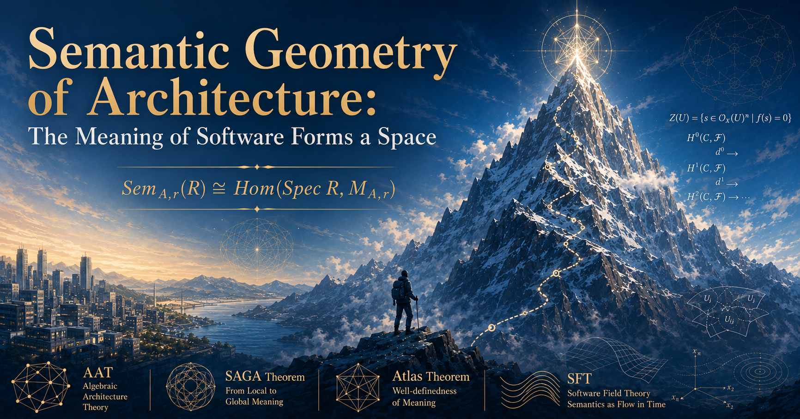

# Semantic Geometry of Architecture: The Meaning of Software Forms a Space

## TL;DR

- **Does software architecture have a denotational semantics? Yes.** But it differs from the classical one in three ways. Syntax is generated from observation. The meaning of a whole system does not exist automatically: its existence is itself a theorem. And broken meaning is not an error but a measurement.
- The existence theorems (global gluing, descent, torsor structure, resolution invariance) are **machine-verified in Lean 4** inside AAT (Algebraic Architecture Theory).
- Beyond existence lies one more question. **What is the shape of the space of meanings?** I name the geometry that studies this question **Semantic Geometry of Architecture**, and announce it here as a research program.
- The summit is scheme representability: the conjecture that an architecture carries its own space of meanings. A roadmap closes the article.



## The Commutative Diagram in the Meeting Room

I once watched a design argument end over a single diagram.

The dispute was about two processing paths. Should the data flow in this order, or that one? Neither side was budging. So we drew it out on the whiteboard. Four corners. Four arrows. Should this square **commute** — should both paths land on the same result?

The moment it was drawn, the argument changed character. The places that had to commute became equations to agree on. The places that were allowed not to commute became decisions to own. The former were agreed in minutes. The latter were settled as judgment calls. The shouting match about which path was "right" ended there.

On the way home I kept turning it over. What exactly had happened?

Programming languages have **denotational semantics**: a theory that assigns mathematical meaning to syntactic objects called programs. Does architecture have one? Wasn't the thing we executed by hand in that meeting room exactly that?

This article answers the question by drawing the map of a research program. Its name is **Semantic Geometry of Architecture**.

## The Staircase of Semantics

The history of denotational semantics reads as a history of **meaning acquiring structure**.

At first, meaning was sets and functions. A program is a function from inputs to outputs. Not much could be said.

Dana Scott gave meaning **order and topology**. Sequences of approximations acquired limits, and it became possible to speak about recursion. "The meaning of this loop is the limit of its approximations" became, for the first time, a mathematical sentence.

Category theory gave meaning **the structure of composition**. In Lawvere's functorial semantics, a theory is a category, a model is a functor out of it, and semantic equations are commuting diagrams. The square on that whiteboard stands at the far end of this tradition.

The abstract model theory of specifications (Goguen and Burstall's Institutions) coined a slogan: **Truth is invariant under change of notation.**

Every step up the staircase enlarged what could be said. So: what is the next step?

**Architecture never got to climb this staircase. Not even the first step.**

## No On-Ramp

Denotational semantics starts from syntax. For programs this worked because syntax was given from the start, by the language definition. Whatever the parser accepts is a program; semantics could then be defined as its interpretation.

Architecture has no given syntax.

There was a road that invented syntax first: architecture description languages, formal specifications, design documents. That road carries a curse — **double bookkeeping of description and implementation**. You write the spec, you write the code, and you chase their divergence by hand. The divergence always comes, and the description always loses. Every working engineer knows how that story ends.

## Building the On-Ramp

**Syntax is not written. It is observed.**

There is a theory that has been building this on-ramp: **AAT (Algebraic Architecture Theory)**. It takes source code as the source of truth, diagnoses architecture with the weapons of algebraic geometry, and keeps its mathematical core formally verified in Lean 4.

A typed fact extracted from code by observation is called an **Atom**. "This module writes this state." "This operation emits this event." "This value denotes this meaning." Small grains of fact. Atoms are the generators of syntax: from their combinations, the syntax of an architecture — a category of parts, a structure of coverings — is generated.

Generation does not stop at syntax.

Specifications are written as **laws** — that is, as equations. "Replay reconstructs the state." "These two operations commute." And **the place where meaning lives (what mathematicians call the coefficients) is generated from the same Atoms, through the laws.** The denotation function is not a bridge between two independently given worlds. It is a **factorization of a single generative process out of Atoms**.

That the whole semantics needs no input beyond the Atoms and the chosen laws is not a slogan. It has been proved, step by step, in Lean 4 — from the coefficient generation contract up to resolution invariance.

## Turn 1: Syntax Is Observed, Not Written

In classical denotational semantics, humans write terms and the semantics interprets them. Here the order reverses. Syntax rises out of observation of the implementation, and the semantics stands on top of it.

As a consequence, **semantics stops being a design-time document and becomes a measuring instrument.** You do not write a spec first and bend the implementation to it. You observe the implementation, state equations over the observation, and measure whether they hold. Double bookkeeping cannot arise, in principle: the description to be managed is generated from observation.

## Turn 2: The Existence of Global Meaning Is a Theorem

In the classical picture, the denotation function is total. The meaning of a whole program exists by definition. For architecture, this premise collapses.

Meaning is given **locally** first: a state where meaning is pinned down only over an individual context — a service, a module, an aggregate. Mathematics calls this a **section**. Choose a family of parts that covers the system (a **cover**), glue the local meanings over the overlaps, and if you reach one coherent meaning for the whole, that is a **global section**. The principle of reconstructing the global from glued local data is called **descent**.

**"The meaning of the whole system" does not exist automatically, by definition. Its existence is a theorem, not a given.**

And that existence theorem is already proved inside AAT. Call the algebraic fingerprint that aggregates the disagreements on overlaps the **obstruction class**. Over semantic coefficients:

```text
a global meaning exists ⟺ the obstruction class is zero
Nonempty P_sem(W) ⟺ [r_sem] = 0
```

Here `P_sem(W)` is the space of global semantic states over the chosen cover `W`, and `[r_sem]` is the obstruction class computed from that cover. A second theorem of the same shape stands on the **repair** side. Call a state where a law's violation has been fixed part-by-part a **lift**. Each part is fixed. Can all of them be fixed at once? The family of local lifts `s` determines a class

```text
∂_U(s) ∈ ČechH¹(U, ConDef)
```

(`ConDef` is the coefficient of repair directions), and `∂_U(s) = 0` is equivalent to the existence of a global lift. The distance between "fixable locally" and "fixable globally" is concentrated into this one class. What the symbol `ČechH¹` actually contains, we will compute by hand later — counting one-cent coins.

If meaning exists, is it unique? That, too, is a theorem. Global meaning is not unique. The set of solutions moves freely along a single orbit under the action of a group `H⁰` — the group of degrees of freedom coherent across the whole cover (a **torsor structure**). In place of uniqueness, **the freedom of choosing a meaning is measured exactly, as a group.**

Where did classical denotational semantics go? It did not disappear. **It sits inside this picture as the degenerate case where the cover is trivial and the obstruction class always vanishes.** Architecture lives outside that degeneracy.

## Turn 3: Breakage Is a Measurement, Not an Error

In the classical picture, if a diagram that ought to commute does not, the semantics is simply wrong; the only move is to fix the definition until it commutes.

Architecture is different. Eventual consistency. The application order of concurrent operations. Data read differently by different teams. A broken commutativity is sometimes a defect to eliminate — and sometimes **a decision the design has deliberately taken on**.

So AAT treats breakage as first-class data. When the residual of an equation does not vanish, it is defined as an obstruction, presented as finite data, and measured as a cohomology class. Not merely "there is breakage": **on which cover, on which overlap, as which class** it breaks is localized.

It also explains what happened in the meeting room. The argument raged because the participants were assuming different commutativity, implicitly. Externalize the diagram, and the equations to agree on separate from the breakages to own. "Which path is right" is a question that does not converge. "Do we own this breakage" is a question that gets decided.

There are more theorems on AAT's shelf. Add a measurement axis, and two designs that had been identical come apart (**Period Separation**). This is the architectural version of the phenomenon program semantics has called full abstraction. The term carries historical weight. Plotkin posed the problem for the language PCF in 1977. Whether a semantics captures observational equivalence exactly stood for nearly twenty years as the hardest open problem in program semantics, falling only to game semantics in the 1990s. Period Separation is advance notice that the same question returns at the level of architecture.

Meanwhile, change the granularity of measurement within one axis — the resolution of the reading — and under calibration conditions the diagnosis matches exactly (**the Atlas theorem**). Coarsening loses no defect; refining fabricates none. That both accidents really do happen once the conditions are broken is included in the same theorem package, with finite counterexamples. There is no contradiction here: adding an axis genuinely refines the diagnosis; changing resolution within an axis does not. The two theorems divide those two directions between them. The Atlas theorem is the **well-definedness theorem** of this semantics. It turns the Institutions slogan — "Truth is invariant under change of notation" — into a theorem, complete with the conditions under which it holds and counterexamples for when it fails. Classical denotational semantics has no counterpart.

An existence theorem. The freedom of uniqueness. Well-definedness. Full abstraction. The chapters of the textbook are all there. Yet none of these theorems was proved for the sake of a semantics. Global gluing came out of repair theory. Conormal descent, out of the search for repair directions. The torsor structure, to quantify the failure of uniqueness. Resolution invariance, for the trustworthiness of diagnosis. Theorems stacked up for separate reasons were re-read, all at once.

**Everything we had built was, all along, converging into one semantics.**

## The Geometry of Meaning

Back to the staircase. After order and topology, after categories — what is the next step?

Geometry.

The existence theorems answered "is there a meaning?". Beyond them lies a question the tradition never posed.

**What is the shape of the space of meanings?**

The algebraic geometry of AAT builds this question into the substance of diagnosis.

**Failure carves out space.** A failed equation generates an obstruction ideal, which carves out the range of lawful designs (the lawful locus). "How far does legality extend" exists not as a verdict value but as **a region of space**.

**Breakage can be dissected.** Obstructions are not only measured as classes; they are dissected in the vocabulary of singularities and monodromy. The same "non-commuting" can be an isolated gluing mistake or a torsion that winds through the whole design. Different pathologies; different surgery.

**Repair is deformation theory.** The dual of the coefficient `I/I²` attached to the obstruction ideal `I` (this is what `ConDef` was) gives the **tangent space** of first-order deformations that move a design toward legality. Repair candidates are not an ad-hoc list of patches. **The space of repair candidates is itself a geometric object.**

**Evolution is geometry in the time direction.** The history of design changes reads as a family of spaces of meaning.

And, at the far edge of the view:

If meanings form a moduli space — a space whose points are the meanings — then **development is a trajectory in that space.** Refactoring is motion within the space; repair is a step along a tangent direction; an architecture that feels stable is a trajectory that has entered a basin of attraction. A singularity becomes, literally, a point where the flow does not extend smoothly.

Statics and dynamics. The shape of the space of meaning is the statics; the motion of development on it is the dynamics. **The commutative diagram tells you where it breaks. The geometry tells you the type of the break, and the surgery.**

## The Record of Cliffs

The Atlas theorem did not stand up on the first try. In AAT, proof search is carried by a loop of AI agents; humans adjudicate. That loop **refuted its own target four times**. State the claim, fall to a counterexample, sharpen the conditions, fall again. Along the way a no-go emerged — piling on shape-only conditions can never reach the goal, in principle — and the definition of the coefficients themselves had to be rebuilt. Each of the four refutations remains in the Lean codebase as a finite counterexample.

How the theorem finally stood can be read directly in the Lean code.

```lean
theorem generatedComparisonH1Map_bijective [Fintype Source]
    (M : TargetSupportedNerveMorphism coarseReading fineReading hcoarser
      coarse fine)
    (laws : FiniteLawFamily Source)
    (hcoarse : laws.Adequate coarseReading)
    (hfine : laws.Adequate fineReading)
    (hC : M.ConditionC laws hcoarse hfine) :
    Function.Bijective
      (M.generatedComparisonH1Map laws hcoarse hfine)
```

Read it line by line. `M` is the comparison morphism connecting a coarse reading and a fine one. `laws` is a finite family of laws. `hcoarse` and `hfine` say that both readings are adequate — able to speak that family. The conclusion: the comparison map between the two diagnoses `H¹` is a bijection. That is the exact form of "coarsening loses no defect; refining fabricates none". And the hypothesis `hC` — calibration condition C — is precisely what the four refutations carved out. Each refutation added a condition; the no-go forced the coefficients to be rebuilt; then the theorem closed in this form. **The scars remain as the hypotheses of the theorem.**

A second hunt ran alongside the theorem itself: the attempt to carve out, with finite syntactic conditions, the exact boundary where invariance holds. That one is still open. Three generations of candidate definitions fell to counterexamples in succession, and what remained was a negative result: **within the registered observation vocabulary that sees no further than adjacent parts, that boundary is indistinguishable in principle.** The separation proof is anchored by Lean counterexamples; pinning it down at theorem level is the current target of the climb.

Why tell the cliff stories? **Because only a map with cliffs drawn on it is a map of real terrain.**

A record of refutations is not a record of failures. It is the proof that the terrain this theory touches is real, not metaphorical. Cliffs do not appear on maps drawn from wishes. Every time the mathematics pushed back, the map became more accurate.

## Touching the Rock

After the cliffs, the rock face. Let us verify by computation — once, concretely — that an obstruction class is not a metaphor.

The AAT repository contains a runnable example called "**the one-cent drift**". A pull request lands on a roughly 3,000-line commerce service written in Rust. Unit tests are green in every configuration. Every hunk of the diff can be justified in review. And the PR charges the customer's card one cent more than the checkout page displays.

Money flows through three modules. After the PR, they speak three different rounding conventions. In the demo basket the subtotal is 33,990 cents and the loyalty discount is 2.5%, so the exact discount is 849.75 cents.

| Module | Convention | Discount |
| --- | --- | --- |
| Display (checkout) | round half-up on the total | 850 |
| Payment | per line, banker's rounding | 849 |
| Ledger (settlement) | never rounds | 849.75 |

The actual demo measures over a somewhat larger complex; we extract the skeleton. A part, together with the declaration of the range it is responsible for, is called a **chart**. Our three modules are three charts. The overlaps — the interfaces between modules — are also three, and they form a ring. Measure the disagreement on each overlap:

```text
r(display → payment)  = 849 − 850    = −1
r(payment → ledger)   = 849.75 − 849 = +0.75
r(ledger → display)   = 850 − 849.75 = +0.25
```

This is the raw data of the obstruction.

Can it be repaired? A repair means moving each chart's value within what that chart's law allows. Display and payment can move only in whole cents — screens and cards live in the world of integer cents. The ledger cannot move at all — being exact is the ledger's law. Moving chart `X` by `c(X)` changes each disagreement to

```text
r'(X→Y) = r(X→Y) + c(Y) − c(X)
```

And here arithmetic decides everything. `c(display)` and `c(payment)` are integers; `c(ledger)` is 0. So no repair can change the **fractional part** of any disagreement. The `+0.75` and the `+0.25` survive every local repair.

`H¹` is a quotient: the space of measured disagreements, divided by the space of disagreements that local repairs can produce. The fractional parts that just survived are a nonzero class in that quotient. What produces the residue is not the shape of the ring as such. It is **the poverty of the moves the laws allow**: two parties that can move only in integers, and one that cannot move at all. **The moment you take the quotient under this constraint system, a residue that no local repair can erase stands as a global invariant.** Try minimizing it yourself. Set `c(payment) = 1` and the residual shrinks to `(0, −0.25, +0.25)` — but since the fractional part of `+0.75` cannot be erased, some overlap must always retain a quarter of a cent. That is the size of this design's obstruction class. In the demo, a CI gate detects the class and blocks the PR; after a repair that unifies the conventions, it passes. The whole pipeline runs as an example in the repository.

In passing, the classical embedding also becomes a proposition. If the cover has a single chart, there are no overlaps. The place where disagreements would live is zero, so the obstruction vanishes by definition. Classical denotational semantics — where whole-program meaning always existed — is the degenerate special case of this arithmetic. (This is degeneracy in the choice of cover, a different axis from the reading resolution that the Atlas theorem protects.) The claim of Turn 2 is not rhetoric; it is the generalization of this computation.

This `H¹` is not some exotic import. Linters, contract tests, consistency checkers — what they measure are local conditions: inside single files, on single interfaces. The moment you try to measure "the disagreement that no local fix can remove", you are computing this quotient, by definition. **Your consistency tools have been approximating `H¹` without knowing its name.**

And the shape has a pedigree. Bell's theorem of quantum mechanics, in sheaf language, says this: all local observations are pairwise consistent, yet no global section explains them simultaneously (the sheaf-theoretic contextuality of Abramsky and Brandenburger). The skeleton — a presheaf, and the absence of a global section — is the same as the computation we just did. The ring of three rounding conventions is locally correct everywhere; only the global ledger fails to exist. **The mathematics that showed quantum mechanics admits no classical global explanation is measuring why your microservices cannot reconcile one cent.** The scale differs. The shape does not.

## The Summit: Semantic Scheme Representability

This map has a summit. No one has reached it.

Algebraic geometry has an operation called `Spec`. From a commutative ring `R` — an algebraic system in which you can add and multiply — it builds a space `Spec R` that geometrizes the ring's equational content. Seeing systems of equations as spaces: the founding move of algebraic geometry.

The conjecture. For the collection `Sem_{A,r}(R)` of coherent realizations of meaning over coefficients `R`, generated from Atoms and laws (`A` is the architecture, `r` the choice of reading), there exists a geometric object `M_{A,r}` and a natural bijection

```text
Sem_{A,r}(R) ≃ Hom(Spec R, M_{A,r})
```

**An architecture `A` carries its own space of meanings `M_{A,r}`.** To choose a realization of meaning is to choose a map into this space. If it holds, the space of meanings stands as an intrinsic geometric object, independent of the choice of reading and of the convenience of observation. The existence theorems, the freedom of choice, the tangent space of repairs — all of them line up again as properties of this one space.

The shape of this conjecture is not an accident. Algebraic geometry contains a turn of perspective called the **functor of points** (Grothendieck's relative point of view). A space is not given directly as a set of points; it is **known by the totality of maps into it, from all coefficients**. To know a space and to know the maps into it are the same thing (the Yoneda lemma). So the conjecture — the collection of realizations of meaning coincides with the maps into some space — traces the legitimate way of defining a space of meaning. And the history of moduli problems teaches how steep this road is. The moduli of elliptic curves fails to have a fine moduli scheme because its objects have automorphisms, a failure that forced the invention of stacks. If architectural realizations carry automorphisms, this summit too rises from scheme to stack. The terrain, branch point included, is already mapped in the classics.

The greatest enemy of this conjecture is not an external counterexample but **circular definition**. Define realizations from the start as maps into `M`, and representability holds vacuously. Only by defining the collection independently — as **solutions of equations** out of Atoms and laws — and then proving that it coincides with maps into a space, does the claim deserve the name of a theorem. The local part is expected to follow almost by definition, as a matter of solution spaces of equations; the substance of the claim concentrates in the gluing. The heart of this conjecture, too, is descent.

How the conjecture can die has also been designed. If representability fails to close at the scheme level, the obstruction — automorphisms of realizations, higher gluing obstructions — is not a failure: it is cashed in as evidence that the ascent to stacks is necessary. If the affine level trivializes, the independent definition of the functor gets rebuilt. What happens upon refutation is decided in advance. The discipline of the cliffs applies to the future as well.

This is a conjecture. But a map on which the summit is visible and a map on which it is not are different maps.

## On the Name

I call this research program **Semantic Geometry of Architecture**.

The word order is the content. This is not geometric semantics — geometry used as a tool to explain meaning. It is **geometry whose subject is the space that meaning itself forms.**

The overall position:

```text
AAT
  the pure mathematical foundation: the statics of the space of meaning
Semantic Geometry of Architecture
  the research program opening on top of AAT — this article
The SAGA theorems
  a proved theorem series inside it (gluing, repair, descent)
The Atlas theorem
  a proved solitary peak inside it (resolution invariance; well-definedness)
SFT (Software Field Theory)
  the dynamics on the space of meaning: development as trajectory
```

One rule attaches to the name. It is **never abbreviated**. The acronym would collide with Grothendieck's Séminaire de Géométrie Algébrique, a monument of algebraic geometry. Out of respect for that SGA, this program is always written out in full. If you are not prepared to write a long name every time, you have no business hanging "geometry" over your door.

## Where We Stand

Where do we stand now?

Looking back, every stretch of road behind us is paved. Global gluing, conormal descent, the torsor structure, Atlas, Period Separation, the single-source generation completeness series. Every theorem up to this point has passed machine verification in Lean 4. Under the road lies bedrock fixed in the theory's canonical text: syntax generated from Atoms, laws as equation systems, the coefficient generation contract, the denotation functor.

Looking up, a slope with no footprints. The moduli of meaning. The summit of Semantic Scheme Representability. The promotion of breakage to 2-cells (lax denotations). Normal forms of the resolution hierarchy. The return of full abstraction. Not one line of proof exists yet.

The route is drawn. The first technical gate is **base change of coefficients** — widening coefficient generation from a fixed number field to general coefficient algebras. From there the climb runs through the moduli of meaning to representability. The ridge conjectures get picked up along the way.

The scaffolding is all public.

- Theory and Lean formalization: https://github.com/iroha1203/AlgebraicArchitectureTheoryV2
- The SAGA paper (Zenodo): https://doi.org/10.5281/zenodo.21603761
- The Atlas theorem write-up (the record of four refutations): link to be added on publication

## Coming Back Down

Time to come down. What the theory brings back to the meeting room is a two-phase structure. **At design time, choose the equation system. At observation time, measure the residuals.** Agreeing on a commutative diagram is choosing an equation system. After implementation, compute the residuals of the chosen system from observation and measure whether the agreement holds. The measurement is mechanized — AAT's tooling implements it. The design-time agreement becomes, unchanged, the observation-time measuring standard.

What happened in that meeting room at the start of this article was a manual execution of the first phase of this semantics. That the argument converged the moment the diagram was drawn was neither luck nor a victory of rhetoric. **That diagram was a component of a semantics.** The theory executes it, not by hand, but as a measuring instrument.

Meaning forms a space. The survey of that space has just begun.
