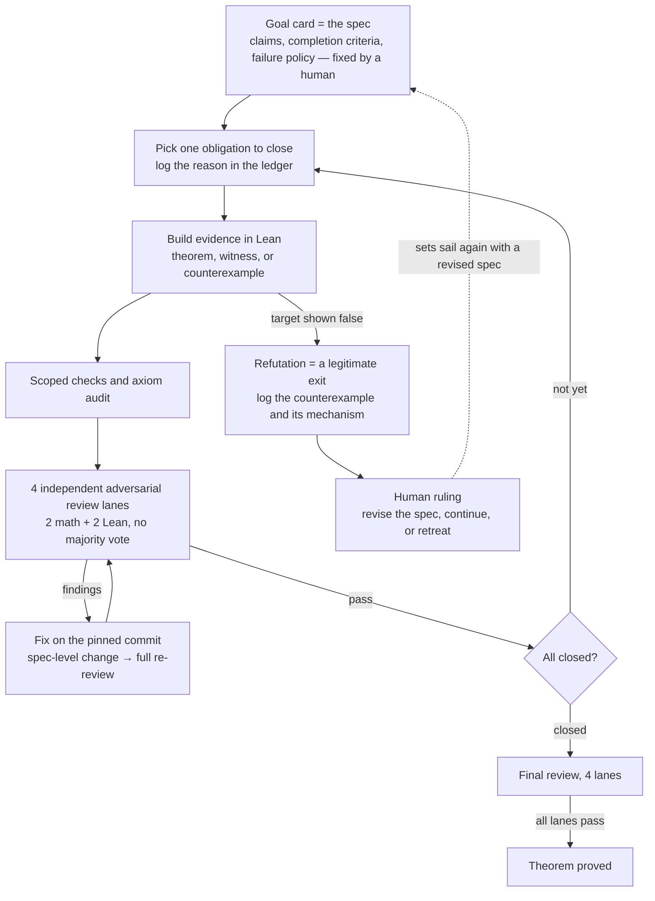

# Uncharted Waters: Thirteen Rules for Not Trusting an AI's Proofs

*Seven theorems in fifteen days, one refutation, ~104 cycles of Lean — and the ship's log of why nothing sank*

## TL;DR

- I want to hand an AI agent a multi-day job and have it run to completion. This article collects the rules for that into **thirteen articles**. Never let the loop rewrite its own spec. Enumerate up front what counts as evidence of "done." Review in independent parallel, never by majority vote. If verification didn't run, the answer is unknown, not pass. Nine more inside
- The rules run in my repository. In fifteen days of August 2026, this loop proved seven theorems and refuted one. About 104 cycles, roughly 67,000 lines of Lean 4. All seven proofs cleared four independently running adversarial review lanes
- The theorems are the main results my research program (AAT) set as its goals — nothing like famous open problems. But each was a multi-day proof target where refutation and revision were live possibilities. The outcomes were genuinely unknown
- A three-way division of labor: Claude (Fable) drafts the goal cards and runs adversarial reviews, Codex (GPT-5.6 Sol) drives the proof loop, and a human makes the rulings
- I make no claim that these thirteen rules are optimal. This is an N=1 record, with no controlled comparison

## Introduction

When you hand an AI agent a multi-day job, the hard part is not getting it to work. It is **deciding whether to believe the output**.

The stage is my monorepo, [AlgebraicArchitectureTheoryV2](https://github.com/iroha1203/AlgebraicArchitectureTheoryV2). It hosts AAT (Algebraic Architecture Theory), a research program that analyzes software architecture with the tools of algebraic geometry and machine-checks its claims in Lean 4.

This record is N=1. One team, one problem domain, fifteen days without sinking — that is all it is. But every one of the rules below has a logged incident where it fired.

A proof starts from a goal card pinned down by a human, and moves through this loop.

The thirteen rules pin down the load-bearing points of this loop.

# Part 1: The Thirteen Rules

## Rules of preparation

### Rule 1 — Split the state three ways

Keep the spec, the execution state, and the evidence in different places. The spec says what to achieve, as a static document. The execution state says where we are. The evidence says what is done. Mix them, and you open a path for the AI to achieve the spec by rewriting it.

In this repository, the spec lives in a goal card, the execution state in a GitHub Issue, the evidence in a report file. The loop reads the card. It cannot write to it.

### Rule 2 — Never let the loop rewrite the spec

Revising the spec always means stopping the loop and getting a human ruling. The AI may propose a revision; that is as far as it goes. When a refutation or a dead end hits, the easiest exit is to fix the goal instead of the proof — and sometimes that is even the right call. Which is exactly why this one decision lives outside the loop.

### Rule 3 — Design failure as a deliverable

"The target turned out to be false" is not an error. It is one of the legitimate exits. Before departure, decide what a failure should leave behind: the counterexample itself, the mechanism of the failure, the parts worth reusing. Fix that format up front, and failures become raw material for the next spec.

Every goal card in this repository must carry a *failure policy* section, fixing in advance what gets recorded when a refutation lands.

### Rule 4 — One obligation per cycle

At the top of each cycle, before any work, the loop writes down "the one obligation I will close this cycle" — the single remaining task — together with why it chose it. Working on a little of everything creates the illusion of progress, and when something fails, you can no longer tell what caused it. This prevents both.

Here, the cycle ledger opens with the chosen obligation. All 104 cycles carry this record.

### Caveats

This group assumes the work can be cut down to a granularity where the spec fits in a static document. Exploratory work needs a separate stage that produces the spec itself. Here, a human and Claude did that, putting each draft through several rounds of adversarial review before handing it to the loop. Run the loop on a weak spec, and refutations and revisions will cost you severalfold. And Rule 3's "format of failure" has to be designed per domain. Mathematics has the counterexample, a beautifully reusable form. What plays that role in your domain is not obvious.

## Rules of verification

### Rule 5 — Enumerate what counts as evidence of done

Enumerate, up front, the forms of evidence you will accept as completion, and accept nothing else, whatever the reason. The AI's "it's done" is judged one way only: does the evidence match one of the forms.

In this repository there are exactly three ways to close a proof obligation: a machine-checked theorem; a concrete example or counterexample pinned as finite data; a derivation from a previously proved result pinned by hash. And the inverse rule: moving the thing-to-be-proved into a typeclass or a structure field, so that it arrives as an assumption — however elegant — closes nothing.

### Rule 6 — "The tests pass" is not done

CI is green. The PR is merged. Something with the right name exists. None of these is evidence of completion. Verification has to touch the conclusion itself.

This repository's acceptance contract carries that prohibition as one line of its verdict table.

### Rule 7 — Review in independent parallel, never by majority

Run several reviewers with the same passing bar, in parallel, without showing them each other's output. Do not split them into a lead and assistants; a reviewer demoted to assistant stops hunting. Do not tally by majority; one fatal finding from one lane is enough to block. And keep a mechanism that can reject even a unanimous pass, on fixed mechanical rules.

Reviews here run four lanes: two mathematical, two Lean. The power to reject sits with a fixed rule that detects claim weakening.

### Rule 8 — Pin every review to a commit SHA

"I fixed it" means nothing on a moving target. Pin the review to a specific commit, and define narrowly when a light re-check after a fix is allowed. If a change touches the spec, the light check is off the table, and you go back to full review.

Here, any of the following instantly disqualifies the light check: a statement change, a definition-body change, adding or deleting declarations, changing an import direction, changing a ledger status.

### Rule 9 — Write it down: "no findings" is a rare pass

A review whose default outcome is pass is dead. This repository's review protocol contains one sentence: "No major findings is a rare pass." That single sentence changes how deep a reviewer AI digs.

### Rule 10 — Name the cheats, audit for them every cycle

AI cheating comes in recurring shapes. Vacuous success: the condition holds because the set is empty. Playing to the grader: a construction shaped to the goal's wording. Claiming an equivalence while proving one direction. Smuggling the thing-to-be-proved into the setup. Reinterpreting the goal or the report. Give each shape a name, and you can audit for all of them mechanically, every cycle. Leave them nameless, and you will miss them every time.

The cycle ledger here has an audit field for each of the five.

### Rule 11 — Fail closed

If verification did not run, the result is unknown, not pass. When a reviewer fails to start, the worst possible move is for the parent agent to fill in a pass on its behalf. Record undecidable as undecidable, and do not proceed.

The judges are audited too. Even the decision to stop a search can be overturned by an independent review.

### Caveats

The biggest assumption in this group is an oracle: something that objectively decides "done." Here it is Lean, type-checking a proof. In domains with type checkers, reproducible tests, or deterministic measurements, this group transfers as is. Where judgment is subjective — prose quality, design — Rule 5's enumeration gets hard, and more of the weight lands on Rule 7's multiple lanes. One more thing. Rule 10's names come from your own incident log. The five shapes above are the ones this voyage actually met; yours will wear different faces.

## Rules of rulings and cost

### Rule 12 — Never automate the decision to stop

How many review rounds before cutting it off. After a failure, push on or retreat. When to pivot. Design these as human rulings, and confine them to a few explicit points — precisely so that everything else can be automated. What you delegate to the loop is the execution of rules already decided.

### Rule 13 — Engineer the cost of verification

Explicitly ban whole-project verification — full builds, full test suites — inside the loop, and design the scoped checks that replace it, in advance. The pairing is the point: the ban and the replacement together. Just cutting verification collides with Rule 11.

Here, a hard rule forbids full research builds inside the loop. In their place: per-module checks, direct axiom audits, and a scan for placeholders, the markers of unproven holes.

### Caveats

Run this group, and the bottleneck moves to the humans. In our measurements, after the cost reductions, the limiting factor was not tokens but the supply of specs and the bandwidth of human rulings. And since Rule 13 deliberately lowers verification coverage, record what you gave up. Whole-project verification moves outside the loop, to CI and post-merge audits. It does not disappear.

## Thirteen rules, one principle

The thirteen rules are not a bag of tricks. Each is a different cross-section of one principle.

**Don't trust the AI's output — and enforce that distrust with structure, not human attention.**

Saying "we don't trust it" is easy. Doing it is not. Human attention is finite; nobody stays suspicious for 104 cycles. So the suspicion itself gets fixed into specs, ledgers, review lanes, and acceptance contracts, and the AI and the loop carry it for you. Almost every accident in these fifteen days was caught by structure.

# Part 2: The Ship's Log

This voyage is one leg of an ongoing research program: AAT, Algebraic Architecture Theory. Its history is in earlier posts on this blog; the most recent is the [Atlas theorem article](https://blog.iroha1203.dev/atlas-theorem-how-far-can-you-zoom-out).

On an earlier voyage, the theory reached the SAGA theorem. Whether a broken consistency can be repaired is decided by whether an obstruction class — a quantity measuring the twist that blocks repair — vanishes. That is what the theorem says. It went on to detect a one-cent accounting drift in a real open-source system. The point where theory touched the real sea is what we call our Cape of Good Hope. These fifteen days are the waters beyond that cape. There are pilots: algebraic geometry since Grothendieck teaches the seamanship — universal properties, descent, cohomology. But nobody holds a chart of this sea. Over software architecture, which claims stand as theorems and which fall to counterexamples — you find out by sailing.

On this ship, Claude draws the charts, Codex holds the helm, and a human makes the rulings, all under the same thirteen rules. Numbers like G-101 are serial numbers assigned to goals.

| Day | Goal | Claim | Result | Cycles |
| --- | --- | --- | --- | --- |
| Day 1 | G-101 | Swap the rewriting rules for parts, and there is exactly one canonical way to carry the whole analysis across | Proved | 16 |
| Day 2 | G-102 | If structural bugs are zero, every coupling bug is caught on the semantic side | Proved | 5 |
| Day 3 | G-103 | The coarsest decomposition that can still express a given family of laws exists, and is computable | Proved | 6 |
| Days 3–7 | G-104 | Under certain conditions, the diagnosis does not depend on reading resolution (the Atlas theorem) | Proved, after 4 refutations | 31 |
| Day 8 | G-105 | The shape drawn by the layout of parts survives any change of interpretive convention | **Refuted** | 7 |
| Days 8–12 | G-107 | Agreement of diagnoses is decidable by a finite computation, yet cannot be recovered from radius-1 local observation | Proved, after 2 spec rewrites | 27 |
| Day 14 | G-106 | Mismatch under repeated transport is measured by a two-stage obstruction; it vanishes exactly when the whole coheres | Proved | 5 |
| Day 15 | G-108 | Transport at the upper floors is canonical too, and the only place it can fail is pinned to a single spot | Proved | 7 |

## Day 1 — Setting sail on uncharted waters

The first theorem, G-101. The claim: swap the rewriting rules for parts, and there is exactly one canonical way to carry the entire analysis across. In engineering terms, a guarantee that switching modeling conventions does not mean redoing the analysis. For a long time, this theory had described its own construction as "Grothendieck-like." That was a metaphor. On this day, the mathematical condition the name demands — a universal property — was proved, and the metaphor became the name of a device.

Not a day of fair winds. Attempt 1 of the final review: three lanes demanding revisions, one rejecting outright. Nothing passed. Only on attempt 3 did all four lanes clear. This is what "a pass is rare" looks like as daily life (Rule 9).

## Days 2–3 — Fair winds and a fake completion

Two theorems in two days. G-102: if structural bugs are zero, every coupling bug is caught on the semantic side — grounds for narrowing the search. G-103: the coarsest decomposition that can express a given family of laws exists and is computable — the minimum module granularity your spec requires, delivered by an algorithm.

It looks smooth. The review record says otherwise. G-102's pinned-commit review caught defects on runs 1 through 4, back to back. Run 3's catch was the worst kind: a shell with the right shape and an empty core. It passed on run 5 (Rules 6, 8).

## Days 3–7 — The first storm

G-104. The claim: the conditions under which an architecture diagnosis does not depend on reading resolution. Put differently, the guarantee that the same defects appear in the same places whether you look at service granularity or module granularity — a guarantee about review granularity, in an era where AI writes the code and humans read it coarsely. This would later be named the Atlas theorem, one of the theory's main results.

In these five days, the target was refuted four times. The calibration grew to seven clauses. Three of them were beaten into existence by counterexamples; the rest were rebuilt through refutation and search. After the third refutation, the human called it: stop adding clauses, stop the loop, switch to a search campaign (Rule 12). A brute-force enumeration of 6,086 candidate conditions, plus a structural argument on top of it, delivered the verdict: no amount of clauses in this vocabulary can ever reach the target. That negative survey forced a rebuild of the coefficients themselves — the vocabulary of observations the diagnosis computes over (Rule 2). The loop set sail again, and summited on cycle 31.

Along the way, one cycle smuggled in a hidden premise. The audit caught it, and the artifacts were removed wholesale (Rule 10). The full story of these five days is in the [Atlas theorem article](https://blog.iroha1203.dev/atlas-theorem-how-far-can-you-zoom-out).

## Day 8 — The shipwreck becomes a chart

G-105. The claim: the space spanned by the supports of structural parts is invariant under pragmatic change — the shape drawn by the layout of parts survives a change of interpretive convention. Cycles 1 through 6 went smoothly. Then, on cycle 7, the last remaining obligation — constructing a *firing witness*, a concrete example where the premises actually hold and the conclusion is non-trivially true — was proved **impossible in principle**. The voyage's only refutation.

Read the record, though, and this is no sinking. The content of the impossibility was itself a theorem: the chosen coefficient generation rule swallows information indiscriminately, so the diagnostic geometry vanishes universally. The theorem-version of a dashboard with everything on it that tells you nothing. Because the failure policy existed in advance, the counterexample and its mechanism went straight into the ledger. The theory later repositioned this refutation as its first machine-checked evidence that observation must be chosen, not hoarded (Rule 3). The site of the shipwreck became the chart of the shallows.

## Days 8–12 — The ship that lost its mast twice

G-107. The longest five days of the voyage.

The target statement died twice. Version 1 — "agreement of diagnoses is characterized by condition C\*" — met an exact counterexample. Version 2's sufficiency direction met another. Both were found by the out-of-loop search campaign and the reviews. Within that campaign, the decision to stop searching was itself overruled twice, by independent review, as premature. The judges were being audited (Rule 11). Version 3 rebuilt the claim on new pillars. Agreement of diagnoses is decidable by a finite computation — and yet that decision cannot be recovered from radius-1 local observation. Decidable in CI, unreachable by any pile of local lint rules. Codex proved the pair in a 27-cycle, 49-hour solo run.

The ending is on record too. The spec's adversarial review ran four rounds; mathematical counterexamples hit zero for three consecutive rounds, and the last two rounds' findings were wording-level refinements of the completion criteria. The human called it: the review is saturated. Cut it off (Rule 12). Knowing when to stop a review takes as much design as the review itself.

One more line from the record: the precedent search found no known prior example of a property that is decidable yet locally unobservable, pinned all the way down to a machine-checked proof. *Uncharted waters* was not a figure of speech.

## Day 14 — A mountain in a single night

G-106. The claim: the mismatch that accumulates under repeated transport is measured by a two-stage obstruction, and its vanishing is equivalent to the whole cohering. Whether a multi-step refactoring or migration hangs together is measurable, and decidable. Drafted on day 2, this chart had matured for twelve days under rounds of review.

The loop set sail before dawn and finished five cycles while I slept. Cost: 9% of the weekly API limit (Rule 13). And not merely fast. Cycle 4, while closing its own obligation, detected a defect in the evaluator that cycle 2 had built — a wrong order in a non-commutative composition — replaced it, and logged the correction in the ledger. On the first cycle, one lane had passed a result, and the fixed anti-weakening rule overruled it (Rule 7). The ship repaired itself while under way.

## Day 15 — A mirage, and the next chart

G-108. The theory is built as a tower of abstraction layers, and G-101 had proved transport at the ground floor. The claim here: transport at the upper floors is canonical too, and the only place it can fail is pinned to a single spot. If a migration fails, the cause is *here* — the endpoint of fault isolation, proved before the work begins. Seven cycles in half a day.

The day belonged to the reviewers. The firing witness submitted on cycle 5 looked, at first glance, like it met the requirements. The pinned-commit review established that its firing depended not on a genuine structural difference, but only on a settings difference and a coefficient swap — and sent it back (Rules 8, 10). The lookout stopped the ship a moment before a mirage was logged as land. After the fix, all eight lanes passed: the usual four, plus four independent formal-review lanes.

The same day, the chart for the next goal, G-109, was finished. Drafted by Claude, hammered through seven rounds of Codex's adversarial review, every finding fixed. The two ships do not trust each other's work. That is what trust looks like in this fleet.

## Epilogue — The sea with no name

Fifteen days. Seven theorems and one refutation. About 104 cycles, about 67,000 lines. And the last chart is still out on the water.

This sea has no name yet. When we cross it, the chart will be complete — and the sea will receive its name, together with the theorem's.

---

**Related**: [Atlas Theorem: How Far Can You Zoom Out?](https://blog.iroha1203.dev/atlas-theorem-how-far-can-you-zoom-out) / Repository: [AlgebraicArchitectureTheoryV2](https://github.com/iroha1203/AlgebraicArchitectureTheoryV2)
