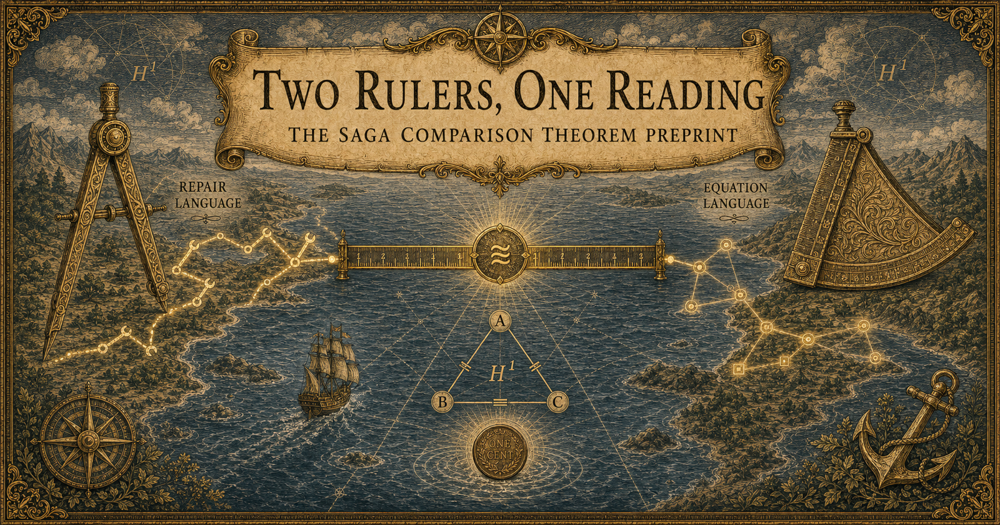

# The SAGA Comparison Theorem Preprint Is Out: Two Rulers, One Reading

## TL;DR

- We have published a paper on Zenodo ([DOI: 10.5281/zenodo.21603761](https://doi.org/10.5281/zenodo.21603761), CC BY 4.0) that formalizes the "locally correct, globally broken" phenomenon of software architecture as mathematics, proves its central theorem, and measures it on a real open-source system.
- The central claim is a single sentence. **Build two ways of measuring brokenness — one in the language of "how can this be repaired", one in the language of "which equations are violated" — without either referring to the other, and they turn out to carry the same scale.** This is proved as a comparison theorem.
- On top of that, under a gluing condition, **"the obstruction is zero" and "a repair of the whole system exists" are equivalent.** The sentence "without this fix, the whole would have broken" — until now folklore — becomes a consequence of a theorem.
- The paper presents three layers — the mathematical proof, the Lean 4 verification status, and a reproducible measurement on a real microservice system — pinned to one and the same snapshot.



## 0. The story so far

The goal of this series is to move software architecture from something discussed with diagrams, folklore, and review-time taste to a mathematical object studied with definitions, theorems, counterexamples, and proofs. For readers new to the series, here is the cast.

| Name | What it is |
| --- | --- |
| **AAT** (Algebraic Architecture Theory) | An algebraic-geometric theory of software architecture. On top of typed minimal facts read from code (**Atoms**), it states the conventions that should hold as equations, and treats an architecture as the geometry of their solutions |
| **The SAGA comparison theorem** | The central theorem of this paper. Obstructions measured in the language of "repairs" and obstructions measured in the language of "equations" coincide as the same cohomology class. The name is an homage to the GAGA theorem in algebraic geometry — it has nothing to do with the distributed-transaction Saga pattern |
| **ArchSig** | A Rust measurement tool built on AAT. From observation data and equations, it computes gluing obstructions deterministically |
| **Lean** | A theorem prover. AAT's theorems are machine-checked here |

[Two articles ago](https://blog.iroha1203.dev/the-saga-theorem) I told the story of proving the theorem; [last time](https://blog.iroha1203.dev/saga-cape-of-good-hope) I reported dogfooding it on a real OSS codebase. Today's protagonist is the **first paper**, which binds those results into one document. You do not need the earlier articles; everything required is introduced below.

## 1. No file has a bug, yet the system is broken

A real microservice system ([train-ticket](https://github.com/FudanSELab/train-ticket), 42 services) contains the following spot.

- **order** stores the order price as a raw string (`private String price`)
- **inside-payment** parses that string into a `BigDecimal` and computes exactly
- **cancel** parses the same string into a `double`, multiplies by 0.8, and rounds to two decimal places

Each of the three services follows its own convention **perfectly**. Each pairwise handoff succeeds on its own terms. And yet, follow the refund computation around the loop and the books do not balance.

```text
original price:            12.33
cancel's convention:       0.8 × 12.33 = 9.864 → rounded → "9.86"
inside-payment's:          exact arithmetic → 9.864
remaining difference:      0.004 (less than one cent)
```

This sub-cent drift is booked in no service's ledger. And nowhere in the source is there any code that reconciles the three services' amounts at once. The paper calls this instance the **one-cent obstruction**. **No file has a bug, yet the system is broken.**

The paper is a report of building the mathematics that measures this phenomenon, proving its central theorem, machine-checking it in Lean, and — on the example above — walking the full circle from measuring the obstruction, through a CI gate blocking, to pre-validating a repair plan, to the gate passing, all reproducibly.

## 2. Two ways of measuring

Here is the heart of the paper. We construct two ways of measuring "how broken it is" — **from two entirely different principles**.

**Ruler A — the language of repairs.** Each service (from here on, a *chart*) comes with the repair moves permitted there. In the one-cent example these are operations like "unify the money reading to scale-2 `BigDecimal`" or "create a place where the rounding remainder is booked". Combinations of moves are called *repair words*, and we identify words that produce the same result. This gives each chart a space of meaningfully distinct repair options. The obstruction is measured as **the amount by which neighboring charts' repair choices disagree around a loop without canceling out**.

**Ruler B — the language of equations.** This side never looks at repairs. The conventions that should hold are stated as a system of equations — equalities like "both charts determine the refund as the same currency value". The obstruction is measured as **the residue of equation violations that survives around the loop**.

What matters is that the two constructions are **independent — neither refers to the other**. No equation appears in the definition of Ruler A; no repair appears in the definition of Ruler B. Think of two thermometers, one built from the expansion of mercury and one from the color of radiation. That two instruments built on different principles agree on their scale is guaranteed by nothing — merely building them proves nothing.

**The SAGA comparison theorem** (Theorem 5.1 of the paper) proves the following, over a chosen finite cover, whenever a finite list of conditions matching up the two rulers' local data (spelled out as a checklist in the paper) is satisfied.

1. The scales the two rulers use (the coefficients) are naturally isomorphic.
2. That isomorphism identifies the quantities they measure (the cohomology classes in `H^1`). The obstruction class measured by Ruler A is carried exactly to the obstruction class measured by Ruler B.
3. If, moreover, the family of repair states satisfies the gluing condition (the sheaf condition), then **"the obstruction class is zero" ⟺ "a repair that glues the whole system exists"**.

In one sentence: **semantic diagnosis (how to fix it) and geometric computation (which equations broke) translate into each other, in both directions.**

## 3. Why this matters

"Two measurements agree — so what?" The value of the paper lives in the answer.

**First: a round-trip ticket between diagnosis and computation.** The language of repairs is the language of humans (and LLMs). "Unify the money reading across these three services and it's fixed" is a sentence in repair language. The language of equations is the language of machines: it reduces to finite linear algebra and computes deterministically. The comparison theorem is the round-trip ticket between the two worlds. A diagnosis posed on the semantic side can be computed on the geometric side; a result computed on the geometric side can be read back in repair language. In practice, the measurement tool ArchSig computes on the equation side, while what people want to receive is the repair side. The theorem's claim is that this bridge is not "these presumably correspond" but a proved isomorphism.

**Second: "without this fix, the whole would have broken" becomes sayable.** In the vocabulary of testing, a failure that never happened cannot be observed. "That fix prevented an outage" has always been a counterfactual with nowhere to stand. The third part of the theorem (zero class ⟺ existence of a global repair) gives that sentence a mathematical status. Hand the measurement a candidate repair, compute that the obstruction class vanishes, and you have **pre-implementation validation** that this particular fix makes the whole glue — as a consequence of a theorem, not as folklore.

**Third: the nature of the obstruction becomes visible.** A nonzero obstruction class means: no matter how any single chart re-chooses its own baseline, the discrepancy does not vanish. Re-paper one service's convention and the mismatches on its adjacent edges merely shift; the residue around the loop remains. A nonzero obstruction **belongs to no file**. Fixing it requires not a convention swap but a structural change — such as creating a place where the remainder is booked. "This is the kind of bug that a culprit hunt cannot find" becomes a computable verdict.

## 4. How the paper is built: three layers, one snapshot

The paper presents this mathematics in three layers of different character. Proof, machine verification, and measurement each answer a different kind of "really?".

**Layer one: mathematics (Chapters 3–5).** The full proof of the comparison theorem: the two independent constructions, the coefficient isomorphism, the `H^1` isomorphism, the correspondence of obstruction classes, and the global-repair equivalence.

**Layer two: Lean (Chapter 6).** The central theorem's conclusion bundle, the lemmas of each stage, and concrete nonzero and zero examples (witnesses) are proved in Lean 4. Every row of the status table is `proved`, there is no `sorry`, and the only dependency axioms are Lean/mathlib's three standard ones — confirmed by a kernel-level axiom audit that runs in CI.

**Layer three: measurement (Chapter 7).** On the one-cent obstruction of §1, the diagnostic staircase runs its full circle.

| Act | Result |
| --- | --- |
| Pre-repair measurement | `MEASURED_NONGLUING_RESIDUAL` — every chart obeys its own convention (`measured_zero`), yet the loop residue cannot be canceled by any per-chart change of baseline |
| Gate verdict | `BLOCKED_BY_GATE_POLICY` — in CI, this is where the PR stops |
| Measurement with a repair plan (unified `BigDecimal` scale-2) | `REPAIR_GLUES_WITHIN_SELECTED_COMPLEX` |
| Before/after comparison | `MEASURED_OBSTRUCTION_NO_LONGER_RECORDED_AFTER_CHANGE` |
| Post-repair gate verdict | `PASS_WITHIN_GATE_POLICY` |

And the three layers are pinned to **one and the same snapshot** by a tuple of identifiers — the Lean source tag, the ArchSig version, and the digests of the measurement inputs (the paper calls this the *release identity*). From any claim in the paper you can trace what kind of claim it is (proved / machine-checked / measured) and where its primary evidence lives. The correctness of the mathematics is carried by the proof, the correctness of the proof by Lean, the reproducibility of the measurement by pinned inputs and procedures. The design policy is to **make the part you must take on faith as small as possible**.

## 5. What the paper does not claim

Following the custom of this series, here is what the paper explicitly does not claim. These boundaries are fixed by the paper itself, in §5.7 and §7.5.

- **The theorem is a theorem over a chosen finite cover.** No identification with cover-independent cohomology is claimed.
- **The theorem is not unconditional.** The correspondence between the two rulers requires a finite list of conditions, and the paper's appendix pins down which proof consumes which condition. Finite counterexamples showing that removing any one condition breaks the isomorphism are also proved in Lean.
- **The measurement does not claim to have discovered a new fault.** Detecting the mismatch itself is the job of the lower rungs of the staircase. What the SAGA stage adds is chaining "each part is locally lawful", "the discrepancy survives the loop", and "this repair plan would glue" into one sequence of machine verdicts.
- **The drift's frequency and monetary scale are not measured.** Runtime measurement is future work, and not speaking numbers we did not measure is this project's discipline.

## 6. Where this goes next: SAGA is the first theorem

The SAGA comparison theorem is the **first theorem** of AAT's local-to-global capability to reach a full proof. If the theory is a tower, the first floor is now built. Chapter 9 of the paper describes the floors planned above it — explicitly as outlook, kept separate from the proved results (the two below are on the outlook side).

**Architecture schemes.** This paper measured whether one architecture glues. The next direction treats an architecture itself as a geometric object — the vanishing locus of its system of convention equations, a *scheme* — and develops morphisms, base change, and fibers **between** architectures as theorems. If this grows well, everyday judgments like "does this refactoring preserve the structure?" or "is the architecture the same shape before and after this PR — and if not, where did it change?" may acquire a geometric meaning: a verifiable map between architectures.

**SFT (Software Field Theory).** AAT is the statics of architecture: the consistency of one moment in time. SFT is the research program that builds the dynamics of change, branching, and merging on top of that geometry. A merge in version control is a gluing of local changes, and SFT reads it as descent theory. The target proposition has the shape "a software architecture is modular exactly when its future evolution satisfies descent" — and the static comparison SAGA proved is the ground this dynamics stands on at every instant.

## 7. How to read it, and where to get it

A suggested route for a first pass:

1. **Abstract and Chapters 1–2**: the problem and the AAT approach.
2. **Chapter 7**: the one-cent measurement.
3. **The opening of §5.1**: a plain-prose summary of the central theorem. You can follow the claim without the formulas.
4. **Chapter 9**: the research outlook — including the picture of what a theorem-grounded, deterministic measurement is for in an era when code is written by AI.

- **Paper**: [SAGA: A Comparison Theorem for Local-to-Global Software Architecture](https://doi.org/10.5281/zenodo.21603761) (Zenodo, CC BY 4.0, PDF + reproduction bundle)
- **Source**: [AlgebraicArchitectureTheoryV2](https://github.com/iroha1203/AlgebraicArchitectureTheoryV2) (MIT license — the Lean proofs, ArchSig, and all measurement inputs live here)
- **Target codebase**: [FudanSELab/train-ticket](https://github.com/FudanSELab/train-ticket)

## 8. Closing

"Locally correct, globally broken" has long gone by the name *integration hell*, handled by folklore. What this paper shows is that the phenomenon has a precise mathematical name; that under that name the obstruction is computable; and that the two ways of measuring it — the language of repairs and the language of equations — are joined by a proved isomorphism.

A voyage that began from an abstract comparison theorem passed through machine verification and arrived at one cent in real code. That one cent is the smallest, most concrete witness to the fact that the sum of local correctness does not reach global correctness.

Questions, objections, and "I think my codebase has one of these triangles" stories are all welcome.
