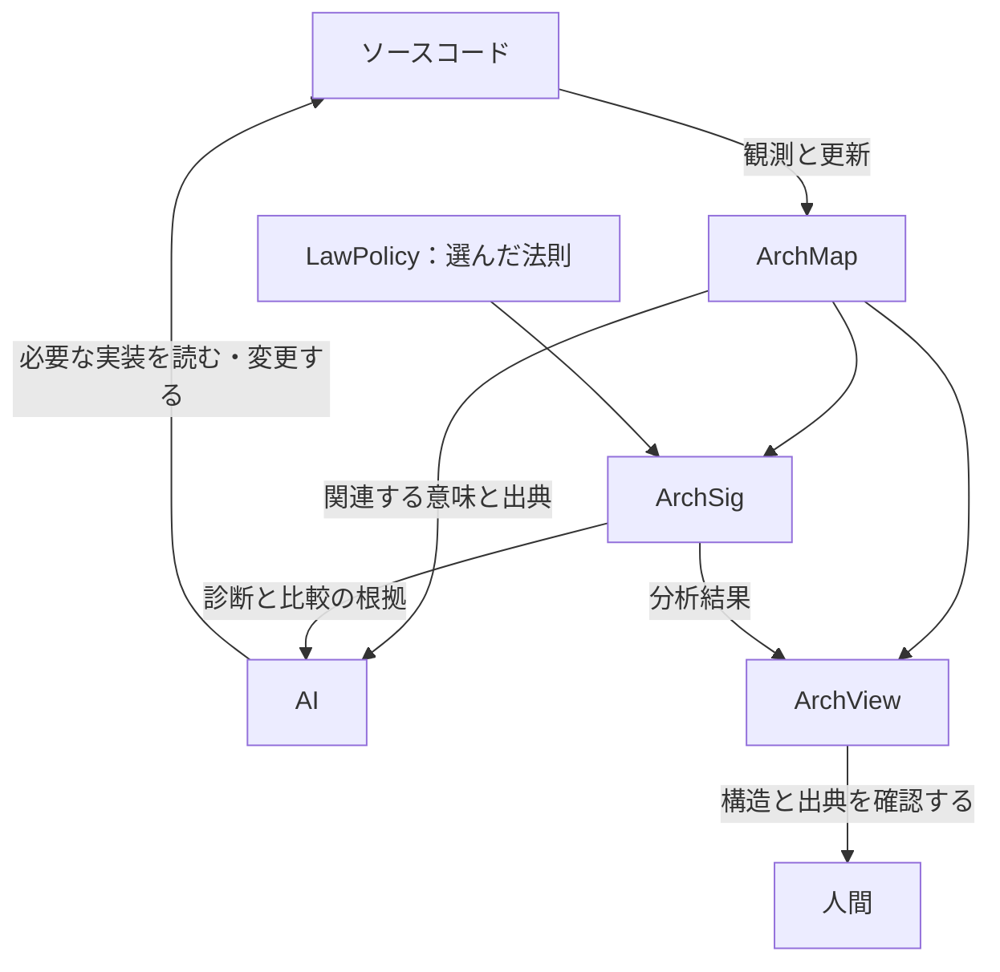

<!-- 執筆方針: エンジニア向け研究紹介。AIコーディングとサービス連携の知識を前提にし、AAT・代数幾何の予備知識は求めない。持ち帰りは、共有できる意味構造を土台にコードを理解し、変更を幾何の問題として考えるという見方。メール機能は説明用の架空例。 -->

## AIがコードを読む。その理解を、どう残すか

「メール送信を共通の非同期キューに移してほしい」

依頼は一文で済む。その変更に必要な理解は、20万行を超えるコードベースのあちこちに散らばっている。

送信関数はすぐに見つかる。しかし、呼び出し元をたどると、認証コードとメールマガジンが同じ処理を使っている。片方には有効期限があり、もう片方には購読解除がある。キューで待つ時間や再送の扱いは、それぞれの機能を成立させる条件に関わる。

この規模のコード全体を一度にコンテキストへ収められない環境では、AIは検索と読解を繰り返す。認証フロー、配送設定、テスト、設計資料を照合し、処理の間にある依存関係や前提を明らかにしていく。変更を判断できるまでには、多くのトークンを使って、コードに分散した意味を読み解く必要がある。

こうして得た理解は、次の仕事でどれだけ使えるだろうか。処理の関係や判断の根拠を再利用できる形で残していなければ、別のセッションでも、似た調査をやり直すことになる。

私は、**コードを読むことで得た理解を、人間とAIが共有し、次の変更にも使える構造として残したい。** 概念と関係を明示するオントロジーの考え方を手がかりに、使われ方に応じた意味を記述し、その整合性や変更前後の関係まで計算できるセマンティックレイヤーを構想している。

その数学的基盤に据えたいのが、私が発案し、研究と開発を進めている **AAT（代数的アーキテクチャ論）** である。アーキテクチャの意味を幾何として扱うこの理論を、コードベースを理解し、何を保って変更できるかを考えるための開発基盤へ育てたい。

## 同じメール送信でも、使われ方によって意味が変わる

次の関数を考えよう。

```typescript
sendEmail(to, subject, body)
```

この関数は、指定された宛先に件名と本文を送る。そのメールがシステムの中で担う役割は、呼び出し元との関係を読むことで明らかになる。

| 用途 | メールが担う意味 | この例で守りたい約束 |
| --- | --- | --- |
| 二要素認証 | 認証を完了するためのコードを届ける | コードの有効期限内に配送できること、再送時に有効なコードを明確にすること |
| メールマガジン | 購読者へ情報を届ける | 配信同意を確認すること、購読解除を配送に反映すること |

認証メールを一斉配信と同じキューに入れると、大量のメールの後ろで配送を待つ可能性がある。送信処理が成功しても、届いたコードが期限切れなら、利用者は認証を完了できない。

メールマガジンでは、キューへの投入後に購読が解除される場合が問題になる。配信対象を選んだ時点での同意と、実際に送る時点での同意を区別し、どの時点の状態に従うかを決めなければならない。

変更を判断するには、用途のラベルに加えて、認証要求からコードの発行、配送、検証までのつながりや、購読状態を確認する時点も把握する必要がある。

**メール送信の意味は、他の処理との関係と、その使われ方が要求する約束に現れる。**

この記事では、構成要素とその関係、意味が成立する文脈、守るべき法則を、出典とともに参照できる層をセマンティックレイヤーと呼ぶ。AIはここから課題に関わる情報を取得し、実装の詳細が必要な箇所では、出典をたどって原コードを読む。

## AAT: 代数的アーキテクチャ論が目指す「意味の幾何」

私はAATを、AtomとLawを出発点とする純粋数学の理論として構築している。Atomはアーキテクチャ上の事実を表す基本単位、LawはAtomの集まりの上に置く方程式を指す。コードへの応用では、観測した事実をこの語彙で表し、確認したい性質に応じて法則を選ぶ。

メールの例なら、「認証処理がコードの配送を要求する」「配送処理がキューを利用する」といった事実を、それが成立する文脈や出典とともに記録する。そこへ、有効期限や配送時点について確かめたい条件を与える。

私がAATでとる見方は、**ソフトウェアアーキテクチャは、巨大な連立方程式である**というものだ。各部分が守る法則と、部分どうしを結ぶ条件が、同時に満たすべき方程式をなす。その解は、選んだ法則の下で一貫して成立する構成を表す。

**連立方程式の解は、空間をなす。** 代数幾何は、こうした解の空間を研究する数学である。条件を満たす構成が存在するか、部分ごとの構成を一つの全体にできるか、条件の変更によって何が可能になるかを、その空間の性質として調べる。私がAATで目指しているのは、アーキテクチャの整合性や変更を、この幾何の問題として扱うことである。

認証、配送、購読管理には、それぞれ条件を満たす構成がある。一つのシステムとして成立させるには、処理どうしをつなぐ場所でも、認証コードの同一性や配送時点について記述が一致しなければならない。

各部分の構成を、重なりでの一致に基づいて一つの全体にする操作を、数学では**貼り合わせ**と呼ぶ。この枠組みでは、全体として成立しない理由を貼り合わせの障害として調べ、構成の変更を変形の問題として扱っていく。

私はこの研究構想を **Semantic Geometry of Architecture――アーキテクチャの意味の幾何** と呼んでいる。意味の実現がなす空間について、存在、障害、変形、そして異なる読みの間の関係を研究する。

目の前の実装について得た理解を、このような数学的対象へ接続できれば、「何があるか」に続いて、「何が整合するか」「どう変更できるか」を問える。この広がりを、セマンティックレイヤーとして実現したい。

## 必要な意味を残して、読む解像度を変える――Atlas定理

20万行のコードベースでこの層を使うには、問いに応じて読む範囲と詳しさを選ぶ必要がある。メール送信の非同期化なら、有効期限や再送規則を先に知りたい。HTMLテンプレートの装飾まで、同じ詳しさで読む必要があるだろうか。

ただし、認証コードを本文へ埋め込む処理まで省けば、必要な情報を失うかもしれない。**何を省いてよいかは、何を確かめたいかによって変わる。** AATでは、この読み分けを数学的に扱う。

まず、選んだ法則から見て区別のつかないものをまとめる。AATでは、この方法で法則の評価を保つ「正準な読み」を構成できる。たとえば有効期限を調べるなら、その評価に必要な情報を残して読む、という考え方である。

さらに、各部分の情報を保つだけでなく、部分どうしをつないだ全体の診断も保てるかを問う。これに答えるのがAtlas定理だ。

> **Atlas定理：条件を満たす解像度の変更は、診断を保つ。**
>
> 細かい読みと粗い読みがともに選んだ法則に対して十分で、両者の比較が所定の条件を満たすとき、診断に使う一次コホモロジーの類は一対一に対応する。

ここでいう一次コホモロジーは、所定の整合条件を満たす食い違いについて、局所的な調整では解消できずに残る障害を捉える数学的な道具である。「類が一対一に対応する」とは、定理の条件の下で、粗く読んでも診断が消えたり、新たに生じたりしないという意味だ。この保証には、各部分とその重なり、そこで使うデータが適切に対応していることも必要になる。

これをコードの読解に生かせれば、**「この性質を調べるには、この解像度で読めば診断を失わない」と、数学的な根拠を持って判断できる。** コードから得たモデルがAtlas定理の条件を満たすことを確認すれば、選んだ法則に基づく診断は、細部を省いた読みでも保たれる。

AIはその保証を使って読む解像度を選び、別の性質を調べるときや実装の詳細が必要なときに、さらに細かく読む。モデルの正しい抽出と、問いに合う法則の選択を支える仕組みを整え、この読解を実現したい。

## 意味の幾何、その最初の実現例――SAGA定理

読む範囲が定まったら、そこで見つけた約束が全体として両立するかを調べたい。

認証コードが発行から5分で失効するのに、共通キューでは配送まで10分かかる場合があるとしよう。認証サービスは期限切れのコードを拒否し、配送処理はメールを送る。どちらも自分の規則に従っているが、利用者は認証を完了できない。

この問題には、二つの方向から取り組める。一つは、認証メールのキューを分けるなど、整合を回復する変更を考えること。もう一つは、有効期限と配送時間の関係など、満たすべき条件を式にして調べることだ。

この二つの視点に対応する障害の捉え方を、数学として独立に構成し、その対応を証明したのがSAGA定理である。

意味の側では、各部分で許される修正と、その組み合わせから、全体を整合させる際の障害を捉える。幾何の側では、法則の方程式と、障害を表す代数から構成する。出発点が異なる以上、両者が同じ障害を捉えることには証明が必要になる。

> **SAGA定理：意味の側と幾何の側で捉えた障害が対応する。**
>
> 分析対象を覆う有限個の部分を選び、その上で局所データの対応と整合条件が成立すると、意味上の修正から構成したコホモロジーと、方程式・障害を表す代数から構成したコホモロジーは同型になり、障害の類も対応する。

ここでの「同型」は、障害を扱う数学的な構造を保ったまま、二つの記述を行き来できるという意味である。

SAGA定理の力は、**「各部分の修正を組み合わせても、全体の整合を妨げるものは何か」という意味の問いを、方程式と幾何の計算へ移せること**にある。定理の条件を満たすモデルでは、計算で得た障害と意味の側の障害との対応が、数学的に保証される。人間やAIは、その結果を根拠に修正案を検討できる。

メール機能なら、許される修正や各処理の共有データをモデル化し、認証と配送を全体として整合させる問題を、この分析へつなげたい。**意味について考えることと、幾何として計算することを結ぶ。SAGA定理は、意味の幾何という構想の最初の実現例である。**

## 構造が変わるとき、何を保って比較するか――アンナプルナ

非同期化を検討する過程では、認証用のキューを分けたり、再送時に以前のコードを失効させたり、配送直前に購読状態を確認したりする案が考えられる。変更の範囲は送信関数を越え、処理どうしの関係にも及ぶ。

変更前後で「送信成功」という記録が同じでも、認証や購読の約束が保たれたとは判断できない。記録した情報が、比較したい性質を捉えているかが問われる。

私は**アンナプルナ**と呼ぶ一連の研究で、見方や構造を取り替えたときに比較をどう引き継げるかを調べてきた。その後半には、次の成果がある。

> **アンナプルナの成果：比較を保つ変更を分類し、観測だけでは判定できない違いを示す。**
>
> 指定された構造の下で、比較する二つの対象に加える変更のうち、比較を保つものを分類し、入力の表示を取り替えてもその分類を引き継げる。また、特定の係数を通した観測では同じ値になる二つの変更が、比較との両立性では異なる実例が存在する。

後者では、観測値を後から加工しても、失われた区別は復元できない。変更の判断に必要な情報が、その観測値には残っていないためである。

メールの送信記録は、この結果の問題意識を伝えるための例である。改修を判断するには、結果の記録に加え、構造の関係を比較できる情報も残しておく必要がある。

アンナプルナの成果を生かし、**「一方を変更したとき、もう一方をどう変えれば、両者の関係を保てるか」を数学的に検討したい。** 指定された構造の下で、比較と両立する変更を分類できることが、その根拠になる。

メール送信の非同期化なら、配送方法の変更に合わせて、認証コードの発行や再送の規則をどう変えるか。何を保つ改修なのか、そのためにどの変更を組み合わせる必要があるのかを調べたい。その分析を支えるため、セマンティックレイヤーに変更前後の処理の対応と引き継ぐべき約束を記述し、定理の適用条件を確認できるようにする。

## 目指す大定理――意味の実現を、幾何的対象として表す

ここまで紹介した成果は、意味の幾何に関わる個々の問題に答えるものである。その先で私が目指しているのが、**意味の実現そのものを幾何的対象として表す大定理**である。

「意味の実現」とは、選んだAtomと法則に対して、一貫して成立する構成を指す。メールの例で考えれば、認証、配送、購読管理の各部分で条件を満たし、それらをつなぐ場所でも整合する構成にあたる。

目標は、意味の実現をまず独立に定義し、それらの集まりが、ある幾何的対象への写像として自然に表されることを示すことにある。数学では、この性質を**表現可能性**と呼ぶ。これが成立すれば、条件を満たす構成についての問いを、対応する空間の性質として扱えるようになる。

大定理の証明は、今後の研究目標である。その到達によって、開発上の問いを次のような幾何の問題へ結びつけたい。

| 開発で知りたいこと | 幾何として調べたいこと |
| --- | --- |
| このリファクタリングは何を保つのか | 選んだ意味の構造を保つ対応があるか |
| 非同期化と同時に何を調整すべきか | 条件を満たしたまま、どの変形が可能か |
| 個々の処理を直しても全体が成立しないのはなぜか | 貼り合わせを妨げる障害は何か |
| この制約の下で障害を解消できるか | 条件を満たす実現が存在するか |

実際に修正案を計算するには、幾何的な表現に加え、有限の入力を扱うアルゴリズムが必要になる。大定理の研究と、その成果を計算へ結びつける開発をともに進め、リファクタリングや障害解消を幾何の問題として扱えるようにしたい。

## ArchMap・ArchView・ArchSigで実現したい開発体験

現在、観測した構造を記録するArchMap、それを可視化するArchView、選んだ法則に基づく分析を担うArchSigを開発している。適用する法則はLawPolicyで指定し、観測した事実と組み合わせて計算する。この基盤を発展させた将来の開発体験を、冒頭の依頼に沿って考えてみよう。



20万行のコードベースで、AIに依頼する。

「メール送信を共通の非同期キューに移してほしい」

まずAIは、ArchMapを通じてメール送信が使われる文脈を問い合わせる。認証とメールマガジンに関わる処理、守るべき条件、出典を、判断に必要な共有部分や関係とともに取得する。

ArchViewでは、人間も同じ構造を参照する。認証コードの発行から配送、検証までをたどり、AIが変更対象に選んだ箇所と、その根拠を確認できる。さらに、表示の切り替えを数学的な読みの解像度と対応づければ、どの情報を保ったまま構造を見ているのかも示せるだろう。

ArchSigは、選ばれた法則と対象範囲について分析する。今後は、解像度を変える比較の適用条件や、変更前後の構造の対応も扱えるようにしたい。分析結果とその根拠は、AIによる説明にも、人間による確認にも使う。

この情報を踏まえて、AIはコードの発行時点、キューへの投入、再送処理など、変更に必要な実装を読む。変更後は関連する観測を更新し、引き続き同じ目的に沿って診断と比較を行う。

AIが判断に用いた意味の構造は、人間にも、次のセッションのAIにも引き継げる。

## 意味の幾何を、ソフトウェアをつくる人の手へ

私がAATで実現したいのは、人間とAIがソフトウェアの意味を共有し、その先にある変更の可能性を一緒に調べられる開発環境である。

20万行のコードベースを前にして、認証と配送の関係をたどる。非同期化の案を置くと、守るべき約束と、調整が必要な箇所を確かめられる。ある修正では障害が残り、別の構成なら整合する。その理由を、原コードと数学的な根拠の両方から説明できる。私は、そのような開発体験をつくりたい。

そのときコードベースは、現在の実装を読む対象であると同時に、何を保ち、どこを変えられるかを考える幾何的な対象になる。リファクタリングは意味の構造を保つ対応の問題へ、障害解消は条件を満たす構成の存在や変形の問題へとつながる。日々の開発で出会う個別の難しさを、共通の数学で考えられるようにしたい。

SAGA定理、Atlas定理、アンナプルナを通じて、そのための定理と反例を積み重ねてきた。意味と幾何の比較、診断を保つ解像度の変更、構造の比較と情報の損失には、すでに確かめられる成果がある。Leanによる形式検証も、その根拠を誰もが検証できる形で残すために進めている。大定理への研究は、この成果の先へ続いている。

ツールには、まだ多くの仕事が残っている。抽出と更新を整え、意味を問い合わせる操作を使いやすくし、実際の開発で効果を測る。読む量やトークン消費だけでなく、守るべき約束を見落とさず、次のセッションへ理解を引き継げるかまで確かめたい。こうした開発の一つひとつを、数学を、ソフトウェアをつくる人の手へ届ける仕事として進めていく。

この未来では、道具を使うすべての人が代数幾何を学ぶ必要はない。人間とAIは、何をつくり、何を守って変えたいかを語る。その問いを意味の構造へ結びつけ、計算し、根拠とともに返す役割を、理論とツールが担う。AIがより多くの変更案を考えられるようになるほど、その可能性を確かめる数学も、開発の力になるはずだ。

**ソフトウェアの意味を幾何として扱い、その幾何を、ソフトウェアをつくる人の手に届ける。** 私がSemantic Geometry of Architectureに込めているのは、その構想である。20万行のコードを読み解くところから、まだ実装されていない構成を考えるところまで、人間とAIが同じ意味の空間を参照できるようにしたい。

リポジトリ: [AlgebraicArchitectureTheoryV2](https://github.com/iroha1203/AlgebraicArchitectureTheoryV2)
