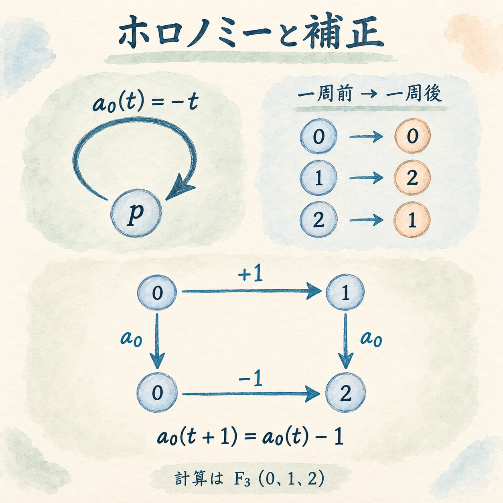
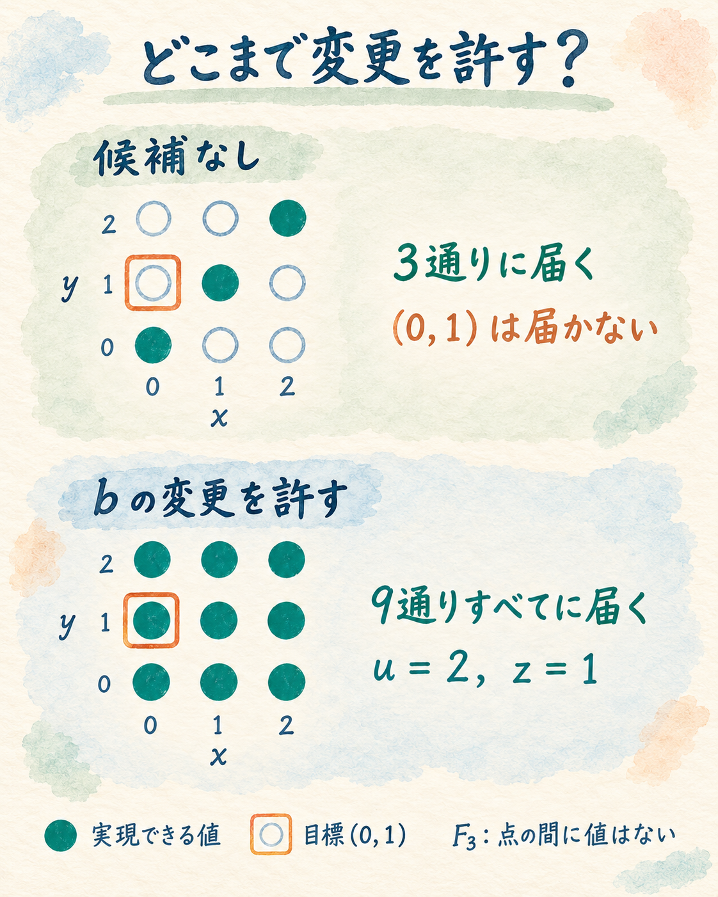
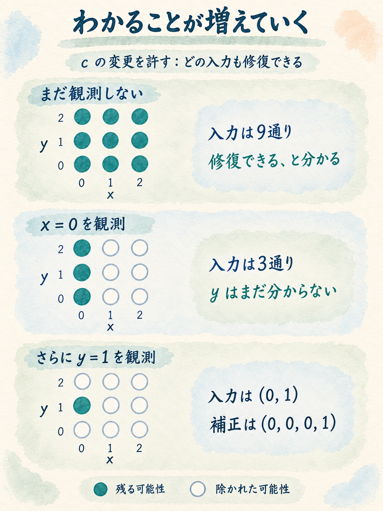

「サイトを多言語対応させたい」

翻訳ファイルを追加して、表示する文字列を切り替える。それくらいの改修だと思っていたのに、英語表示にすると返品ボタンが消えてしまう。調べてみると、業務ロジックが日本語の表示文字列を使っていました。

この架空の注文管理システムでは、改修の多くをAIに任せていました。内部の状態を言語に依存しない形へ変えながら、既存の業務ルールや外部APIの仕様を守るには、どこまで変更し、何を調べればよいのでしょうか。

AIが書くコードを人が全行確認し続けるのは、大きな負担です。コードをすべて読み直さなくても、守りたい仕様が保たれることを、数学的な根拠から確かめられるようにしたい。

私が研究している **Algebraic Architecture Theory（AAT）** では、操作と、それらが満たすべき関係を数学の対象として扱っています。今回は、アリアドネ境界修復定理と、修復に必要な観測を扱う結果を、小さなモデルの計算から紹介します。

## 「発送済み」を翻訳したら、返品ボタンが消えた

最初の実装では、注文の状態をそのまま画面に表示していました。

```ts
const order = { status: "発送済み" };
statusElement.textContent = order.status;
```

次に、「発送済みなら返品ボタンを出す」という要件が加わります。返品条件は、この例のための架空の業務ルールです。

AIエージェントには「差分を小さく、既存の書き方に合わせて」と依頼していました。できあがった機能が画面で動くことは確認していましたが、生成されたコードを細かく読む機会は減っていました。

このとき追加されたのは、既存の表示文字列をそのまま使う判定です。修正は数行で済み、画面にも期待どおりに返品ボタンが表示されます。

```ts
const canReturn = order.status === "発送済み";
returnButton.hidden = !canReturn;
```

その後、返品APIの受付判定や、返品対象を抽出するバッチにも、エージェントが既存コードに倣って同じ条件を追加していきました。どの修正も、その時点の要件を満たしています。動作を中心に確認していたため、日本語に依存する業務ロジックが各所に広がっていることには、気づいていませんでした。

ところが多言語化で、注文データを画面に渡す際に `status` を翻訳するようにすると、英語画面に渡された値は `"Shipped"` になります。

```ts
const orderForView = { ...order, status: "Shipped" };

// 画面の既存判定は、日本語の文字列を期待している
const canReturn = orderForView.status === "発送済み"; // false
```

画面だけ判定を書き換えても、同じ表現を前提にした処理はAPIやバッチに残ります。そこでデータの生成元まで英語へ変えれば、今度はそれらの判定や既存APIの利用者に影響します。

表示するための言葉が、いつの間にかシステム全体で共有する仕様になっていたわけです。小さな差分で既存の書き方に合わせるうちに、その依存も引き継がれていました。

目指す形は、内部の状態IDと表示を分けることです。

```ts
type StatusId = "pending" | "shipped";
type Order = { statusId: StatusId };

const labels = {
  ja: { pending: "未発送", shipped: "発送済み" },
  en: { pending: "Pending", shipped: "Shipped" },
};

function canReturn(order: Order): boolean {
  return order.statusId === "shipped";
}

function statusLabel(order: Order, locale: "ja" | "en"): string {
  return labels[locale][order.statusId];
}

// 既存APIの利用者には、従来どおりの表現を返す
function toLegacyApi(order: Order): { status: string } {
  return { status: labels.ja[order.statusId] };
}
```

内部の `"shipped"` は状態を識別する固定のIDです。英語の画面表示を `"Dispatched"` に変えても、返品の判定は変わりません。既存APIの出口では、互換性を保つために従来の日本語へ変換します。

この設計へ移るには、データの生成、業務判定、画面表示、APIへの変換を揃える必要があります。「UIだけ変更してよい」とする場合と、「コアの状態表現やAPIの変換も変更してよい」とする場合では、選べる改修が違います。

## 「直せる？」に、変更範囲を加える

今回の改修で決めたいことを整理すると、次の三つになります。

| 決めること | 多言語化の例 |
| --- | --- |
| 守るもの | 返品を受け付ける条件、既存APIが返す値 |
| 変更してよいもの | 内部の状態表現、各処理の判定、表示やAPIへの変換 |
| 満たしたい関係 | 表示言語によらず返品判定が一致し、既存APIの利用者も同じ状態を読み取れること |

「直せるか」という問いは、これらを決めて初めて具体的になります。保持する条件が同じでも、変更できる範囲が狭ければ修復できず、範囲を広げれば修復できるかもしれません。

アリアドネ境界修復定理は、固定した部分を守りながら、許された変更で条件を満たせるかを扱います。中心となるのは、有限体上で補正を線形に計算できるモデルです。

多言語化の例で考えた問いを、今度は三つの値の上で動く可逆な操作で追ってみましょう。この小さなモデルでは、操作をすべて書き出し、補正の効果を計算できます。

## 三つの値を使って、「どこを変えれば直るか」を考える

### 値は0、1、2の三つ

使う値は0、1、2です。計算の結果は3で割った余りに戻すので、$2+1=0$、$1-2=2$ になります。この数の体系が、有限体 $\mathbb F_3$ です。

値を置く場所を $p$ とし、操作はその場所の値を変えるものと考えます。まず、「$x$ だけ足す」「$y$ だけ足す」という二つの操作を用意します。入力する値を $t$ と書くと、

$$
r_x(t)=t+x,\qquad r_y(t)=t+y.
$$

と書けます。$x,y$ も0、1、2のいずれかです。この二つの操作は、修復するときに守る対象です。ほかの操作を調整して、その結果をこれらに合わせたいとします。

調整に使うのは、次の四つの操作です。

| 操作 | 値の変換 | 変更してよいか |
| --- | --- | --- |
| $e_u$ | $t\mapsto t+u$ | 常に変更してよい |
| $a_h$ | $t\mapsto -t+h$ | 常に変更してよい |
| $b_z$ | $t\mapsto t+z$ | 候補 $b$ の変更を許したときだけ |
| $c_v$ | $t\mapsto t+v$ | 候補 $c$ の変更を許したときだけ |

添字の $u,h,z,v$ が、これから選ぶ補正値です。最初はすべて0で、それぞれ0、1、2から選び直せます。ただし、$b$ の変更を許さないなら $z=0$、$c$ の変更を許さないなら $v=0$ のままです。

修復では、足す量を調整します。$a_h$ の「符号を反転する」という部分は、そのまま保ちます。

### 一周したときに残る変換「ホロノミー」

矢印をたどって一周したとき、出発した場所に戻っても、その場所の状態に変換が残ることがあります。閉じた経路に沿って合成した変換を、ホロノミーと呼びます。

今回の $a_h$ は、一つの矢印で同じ場所 $p$ へ戻る操作です。$h=0$ なら $a_0(t)=-t$ なので、0は0のまま、1と2は入れ替わります。

この操作には、補正の向きを反転させる働きもあります。先に $z$ を足してから操作すると、

$$
a_h(t+z)=-(t+z)+h=a_h(t)-z
$$

となります。操作の前の「$z$ を足す」は、操作の後の「$z$ を引く」に対応するわけです。このように補正が操作に沿って伝わることを輸送と呼びます。今回の閉路では、補正に $-1$ を掛けるホロノミーが生じています。


*上：同じ場所へ戻っても、1と2は入れ替わる。下：操作の前の「+1」が、操作の後の「−1」に対応する。計算はすべて3を法とする。*

### 操作を順番に実行して、修復の条件を式にする

満たしたいのは、二つの手順が、それぞれ守る対象と同じ結果になることです。

| 操作を実行する順番（左から右） | 合わせたい結果 |
| --- | --- |
| $b_z$ → $e_u$ | $r_x$ と同じ、$t+x$ |
| $c_v$ → $a_h$ → $b_z$ → $a_h$ → $e_u$ | $r_y$ と同じ、$t+y$ |

一つ目は、$z$ を足してから $u$ を足すので、$u+z=x$ なら一致します。

二つ目で注目したいのは、$b_z$ を二つの $a_h$ で挟んだ部分です。実際に代入すると、

$$
\begin{aligned}
a_h\bigl(b_z(a_h(t))\bigr)
&=-(-t+h+z)+h\\
&=t-z
\end{aligned}
$$

となります。$h$ は打ち消し合い、$z$ を足した効果は符号が反転しています。その前後で $v$ と $u$ を足すので、全体の結果は $t+u-z+v$ です。

どんな入力値 $t$ に対しても二つの手順をそれぞれの目標に合わせる条件は、次の式にまとまります。

$$
\boxed{u+z=x,\qquad u-z+v=y.}
$$

変更を許す場所に応じて、この式を解いていきます。

### どの操作の変更を許せば、条件を満たせるか

候補 $b,c$ をどちらも変更できない場合は、$z=v=0$ です。条件は $u=x$ と $u=y$ になり、**$x=y$ のときだけ修復できます**。

$e$ と $a$ は常に変更できますが、$h$ は式から消え、$u$ は両方の式に同じ量だけ加わります。そのため、$x$ と $y$ の差を埋めることはできません。

では、$c$ を変更できるようにするとどうでしょうか。$z=0$ のまま、$u=x$、$v=y-x$ とすれば、両方の条件を満たせます。二つの目標の差を $c$ の補正で埋めればよいわけです。

$b$ を変更する方法もあります。差を $d=y-x$ と置くと、二つの条件を引いた式は $d=z+v$ になります。3で割った余りの計算では $-2=1$ になるためです。$c$ を固定して $v=0$ にしても、$z=d$、$u=x-d$ とすれば修復できます。

| 追加で変更を許す候補 | 修復できる条件 |
| --- | --- |
| なし | $x=y$ のときだけ |
| $b$ | どの $x,y$ でも修復できる |
| $c$ | どの $x,y$ でも修復できる |
| $b,c$ | どの $x,y$ でも修復できる |


*各点は $(x,y)$ の一つの組。目標 $(0,1)$ は、候補を禁止すると実現できず、$b$ を許すと実現できる。点の間に連続した値はない。*

$x\ne y$ のとき、$b$ だけ、または $c$ だけを追加で許す範囲は、これ以上狭くすると修復できません。これを**包含極小の修復可能範囲**と呼びます。

ただし、追加で許す候補が一つでも、実際に変わる操作の数は違います。たとえば $(x,y)=(0,1)$ で、自由に選べる $h$ を0にすると、

- $b$ を使う案では、$u=2,z=1$ として、$e,b$ の二つを変える。
- $c$ を使う案では、$v=1$ として、$c$ だけを変える。

残りの補正値はいずれも0です。許可範囲をこれ以上削れないことと、変更箇所やパッチの行数が最少であることは、別の話になります。

### 同じつながりでも、操作が違えば直し方が変わる

比較のため、$a_h(t)=-t+h$ を、符号を反転しない $a_h(t)=t+h$ に変えた別の網を考えます。矢印のつながりと変更の許可は同じで、補正の輸送が $-1$ から $1$ に変わります。

今度は、二度足した $h$ が打ち消されずに残ります。二つの目標の差は $d=2h+v$ となり、常に変更してよい $h$ だけで埋められます。実際、$h$ を0、1、2と動かすと、$2h$ は0、2、1となって、すべての差に対応できます。

元の網では、差があると $b$ または $c$ の変更が必要でした。別の網では、追加の候補を許さなくても直せます。**ホロノミーは、補正の効き方を通じて、必要な変更範囲に影響します。**

## アリアドネ：部分ごとの条件から、全体を直せるか調べる

この小さな例を、より大きな操作の網へ広げるには、各部分の修復条件をどう組み合わせるかが問題になります。

先ほどの網なら、一方の担当が $u+z=x$ を、もう一方が $u-z+v=y$ を扱うと考えられます。両者が共有する $u,z$ は、組み合わせた後に同じ値でなければなりません。片方だけで条件を満たしても、その補正がもう片方と合うとは限らないからです。

一方、$h$ は共有する式には現れませんが、具体的な操作 $a_h$ を決めるには必要です。各担当は、共有する条件に加えて、自分の操作を復元するための情報も保持します。

**アリアドネ境界修復定理（Ariadne Boundary Repair Theorem）** は、各部分からこのような情報を作り、全体の修復へ組み合わせる方法を与えます。一度作った情報から、変更を許す範囲ごとに「直せるか」「どんな直し方があるか」「直せないなら何が妨げるか」を調べられます。補正の数値から元の操作へ戻すところまでが、一つの構成になっています。

名前は、ギリシャ神話のアリアドネに由来します。アリアドネは、テセウスが迷宮から戻れるように糸を渡しました。複雑に結び付いた操作の中で、修復への道筋をたどるというイメージを重ねています。

### 直せるかどうかを、残るずれで見分ける

修復できない場合には、何を証拠として示せるでしょうか。候補を禁止すると、作れる右辺は $(u,u)$ だけでした。$u$ をどう選んでも、二つの成分の差は0です。目標 $(0,1)$ の差は1なので、許された変更では届きません。この差を示せば、補正を一つずつ試さなくても、修復不能と分かります。

ここで、許された補正によって移り合える値を、同じグループにまとめてみます。たとえば $(0,1),(1,2),(2,0)$ は、両成分に同じ量を足すことで移り合い、どれも差が1です。一方、実現できる $(0,0),(1,1),(2,2)$ は、差が0のグループに入ります。

こうして、補正で変えられる違いをまとめ、残る違いを扱うのが**商空間**です。今回なら、二つの値を別々に追う代わりに、残る差 $y-x$ を見れば修復できるかが分かります。

より大きな有限・線形モデルでも、許された補正で実現できる変化をまとめ、目標に消せないずれが残るかを調べます。修復できないときには、どの許された補正でも消せないずれを検出する、線形な評価を取り出せます。修復を探す計算が、そのまま修復不能の証拠にもつながります。

アリアドネでは、この計算を局所からの組立てや、元の操作への復元と結び付けています。その数学的な背景にあるのが、固定部分を保つ条件を扱う相対コホモロジーと、共有部分を揃えて修復を貼り合わせる構成です。

## 「直せるか」と「どう直すか」で、必要な情報は違う

ここまでは、$x,y$ の値が分かれば、どう直せるかを計算してきました。では、その値をまだ知らないとしたら、何を調べる必要があるでしょうか。

元の $a_h(t)=-t+h$ の網に戻り、構造と式は既知、$x,y$ の値は未知とします。許される観測は、次の二つだけです。

$$
r_x(0)=x,\qquad r_y(0)=y.
$$

一つの操作を0で評価するたびに、問い合わせ一回と数えます。それ以外の計算は回数に含めません。数値修復として返すのは、具体的な四つの値 $(u,h,z,v)$ です。

### 「直せる」は観測0回、「こう直す」には2回

候補 $c$ の変更を許すとします。$b$ は変更せず、$z=0$ です。

この場合は、どんな $x,y$ に対しても修復があります。したがって「修復できるか」には、値を調べずに「できる」と答えられます。問い合わせは0回です。

では、具体的な修復を一つ返す場合はどうでしょうか。

$$
(u,h,z,v)=(x,0,0,y-x)
$$

とすれば修復できますが、これはまだ未知の値を含む式です。四つの数を確定して返すには、$x$ と $y$ を取得する必要があります。


*候補 $c$ を許した場合。観測するたびに入力の可能性が絞られる。すべて修復可能でも、同じ数値補正は使えない。*

一回の問い合わせでは足りないことも、図から分かります。$x=0$ を知っても、$y$ には0、1、2の可能性が残っています。それぞれで必要な $v$ が違うため、具体的な数を一つに決められません。

ほかの補正を選んでも、この問題は残ります。補正値をすべて決めると、$u+z=x$ と $u-z+v=y$ から、対応できる $x,y$ も一つに決まるからです。先に $y$ を調べても、未知の $x$ に対して同じことが起きます。

二回なら修復を返せて、一回では足りない。したがって、この観測方法で全入力に正しく答えるための最適な最悪時回数は、ちょうど二回です。

この回数が表すのは、指定した操作を評価する費用です。コードを読む行数や実行時間の最小性とは異なります。また、具体値の代わりに、未知の操作を後で呼び出すプログラムを返す場合には、必要な情報も変わります。

### 知っている値は、調べ直さなくてよい

候補 $b$ または $c$ を少なくとも一つ許す場合、必要な追加問い合わせは次のようになります。

| 既に知っていること | 修復できるかを判定 | 数値修復を一つ返す |
| --- | ---: | ---: |
| $x,y$ とも未知 | 0回 | 2回 |
| $x$ は既知 | 0回 | 1回 |
| $x,y$ とも既知 | 0回 | 0回 |

数えるのは追加の観測です。別の担当から具体的な値を受け取っていれば、同じ値を読み直す必要はありません。反対に、式の形が分かっているだけでは、値を取得したことにはなりません。

候補をどちらも許さない場合は、可否が $x=y$ に依存します。両値が未知なら、判定にも数値出力にも最悪時二回が必要です。この場合の数値出力は、修復できるなら具体値、できなければ修復不能という回答です。

### 見えていない入力の違いが、答えを変えるか

修復・観測双対性の結果は、この考え方を一般のモデルへ広げます。注目するのは、**調べた後にも残っている、入力の可能性**です。

「直せるか」だけを答えるなら、残った入力がすべて修復可能、またはすべて修復不能であれば答えられます。具体的な修復を返すなら、残ったすべての入力に同じ補正が使える必要があります。すべて不能なら、修復不能と答えます。

定理では、構造と補正の輸送が共通で、未知の値がアフィンに変わる入力の族を扱います。先ほどの例なら、操作の形はそのままで、足す値 $x,y$ が変わる族です。有限体上の有限次元モデルで、既知情報と許された観測が線形に表される場合には、修復の方程式から「何を区別する必要があるか」を計算できます。十分な観測が可能なら、それを最少の個数で選べます。

得られる回数は、途中の回答を見て次の問い合わせを選ぶ手続きまで含めた、最適な最悪時回数です。対象は、すべての入力で停止し、常に正しい答えを返す決定的な手続きです。許された観測では区別がつかず、必要な答えを返せない場合も判定できます。

## 数学のモデルから分かったこと

小さなモデルで追った結果は、三つにまとめられます。

**1. どこを変更してよいかを決めると、修復と、直せない理由を調べられる。**

候補を禁止したとき、差 $y-x$ が0でなければ、それが修復不能の証拠になりました。$b$ または $c$ の変更を許せば、その差を埋める修復が得られます。

**2. 矢印のつながりが同じでも、操作の内容によって必要な変更範囲は変わる。**

符号を反転する閉路では、補正 $h$ が打ち消されました。反転しない閉路では、その補正だけで直せます。ホロノミーが、必要な変更範囲に影響しています。

**3. 修復できると判断することと、具体的な修復を返すことでは、必要な情報が違う。**

元の網で候補を一つ許せば、修復可能性の判定は観測0回です。具体的な補正には $x,y$ が必要で、両方とも未知なら追加観測は2回、片方が既知なら1回でした。

アリアドネと修復・観測双対性の結果は、定理の条件を満たす操作の網について、これらを同じ修復方程式で結び付けます。

## 依存解析やプログラム修復とは、どう関係するか

「変更の影響を調べる」という問いには、ソフトウェア工学の長い蓄積があります。

Weiserのプログラムスライシングは、指定した地点の変数に着目し、その値を保ちながら、関係する文を残したプログラムを求める手法です。データや制御の依存を調べる考え方は、冒頭の例で、日本語の状態文字列を使っている判定を追うことに関係します。[^weiser]

自動プログラム修復も、複数箇所の変更を扱っています。たとえばAngelixは、記号実行から修復の制約を取り出し、互いに依存する複数箇所のパッチを合成します。[^angelix]

さらに、RothenbergとGrumbergの *Must Fault Localization for Program Repair* は、どの修復も少なくとも一箇所は変更しなければならない位置の集合を扱います。その集合は、どんな変更を許す修復方式を選ぶかに依存します。「この範囲を一切変えずに直せるか」は、既存研究でも明確に問われています。[^must]

今回のAATの構成は、局所で作った表現から、すべての許可範囲の修復と不能証拠を求め、元の操作へ戻す対応を持ちます。さらに、同じ方程式から必要な観測を導きます。依存解析で対象を調べ、このモデルに対応づけたうえで、コード変更を修復ツールやテストで確かめる。そうした既存技術との接続が、次の研究課題になります。

## ArchSigで目指す、多言語対応の進め方

冒頭の注文管理システムに戻りましょう。アリアドネと修復・観測双対性の結果、および今回の小モデルは、研究用のLean形式化で証明しています。これを開発で使うには、実際のコードを定理の条件に合うモデルへ対応づけ、得られた補正をコード変更へ戻す仕組みが必要です。

コードとモデルの対応の検証、ArchSigへの実装、実務での検証は、これから進める課題です。その先に、AIエージェントと次のように改修する流れを目指しています。

**1. 守りたい仕様を伝える。**

「サイトを多言語対応させたい。内部の状態は表示言語に依存しない形にしたい。ただし、返品を受け付ける条件と、既存APIが返す値は変えたくない」。まずは、普段使っているAIエージェントに目的と条件を伝えます。

**2. エージェントが、状態を使っている処理を調べる。**

注文データを作る処理、返品ボタンの表示、返品APIの受付判定、バッチの抽出条件をたどります。どの処理が `"発送済み"` という文字列を期待しているかを、コードの場所とともに記録します。ArchSigには、この実装から読み取った事実と、守りたい仕様を渡します。

**3. ArchSigで、変更範囲ごとの直し方を比較する。**

画面だけを変更する案から、内部の状態表現と業務判定も変更し、既存APIの出口に変換を置く案まで、許可範囲を変えてモデル上で検討します。条件を満たせない範囲には妨げとなる理由を、満たせる範囲には具体的な修復案を示します。その結果を見て、どこまで変更するかを判断します。

**4. 判断や具体的な修正に足りない情報を、追加で調べる。**

たとえば、APIの互換性を保つ変換を作るために、既存の応答で使われる状態値の一覧が必要になるかもしれません。ArchSigがモデル上で必要な情報を示し、エージェントが対応するコードや仕様を確認します。既に確認した情報も使いながら、修正に必要な値を揃えます。

**5. コードを変更し、仕様が保たれたかを確かめる。**

選んだ案に沿って、内部の判定を状態IDへ移し、表示するときに翻訳し、既存APIの出口では従来の値へ変換します。変更後のコードからモデルを更新して再計算し、テストでも、日本語・英語の両画面で返品ボタンが同じ条件で現れることや、APIの応答が変わらないことを確かめます。

レースやI/Oの実行時挙動、性能についても、E2Eテストや負荷試験など、それぞれに適した検証を組み合わせます。

この流れなら、最初は画面の修正に見えた依頼を、業務判定やAPIまで含めた改修として検討できます。人は根拠を見て変更範囲を判断し、エージェントはその条件に沿って実装と確認を進めます。

私がAATの研究で「Rising Sea」と呼んでいるのは、操作の記述、修復、必要な観測を、一つの数学的な構成でつなげていく方向です。今回の結果では、「どこを変えれば直るか」から「直すために何を知る必要があるか」へ、問いを進めることができました。

コードとモデルの対応を検証し、この仕組みを開発に組み込むことで、**人がコードをすべて読み直さなくても、守りたい仕様が保たれる根拠を確かめながらリファクタリングを進める**。「サイトを多言語対応させたい」という依頼に、どこを変え、何を確かめるかまで根拠を持って応えられるようにする。そんな開発を、ArchSigで実現したいと考えています。

数学の定義やLeanの形式化は、[AATのリポジトリ](https://github.com/iroha1203/AlgebraicArchitectureTheoryV2)で公開しています。相対境界修復と修復・観測双対性の説明、およびそれぞれの証明を参照できます。

[^weiser]: Mark Weiser, “Program Slicing,” *IEEE Transactions on Software Engineering*, SE-10(4), 352–357, 1984. [論文](https://faculty.cc.gatech.edu/~harrold/6340/cs6340_fall2009/Readings/Weiser.Slicing.TSE.pdf)。
[^angelix]: Sergey Mechtaev, Jooyong Yi, Abhik Roychoudhury, “Angelix: Scalable Multiline Program Patch Synthesis via Symbolic Analysis,” ICSE 2016, 691–701. [著者版・書誌](https://discovery.ucl.ac.uk/id/eprint/10088929/)。
[^must]: Bat-Chen Rothenberg, Orna Grumberg, “Must Fault Localization for Program Repair,” CAV 2020, 658–680. [論文](https://link.springer.com/chapter/10.1007/978-3-030-53291-8_33)。
