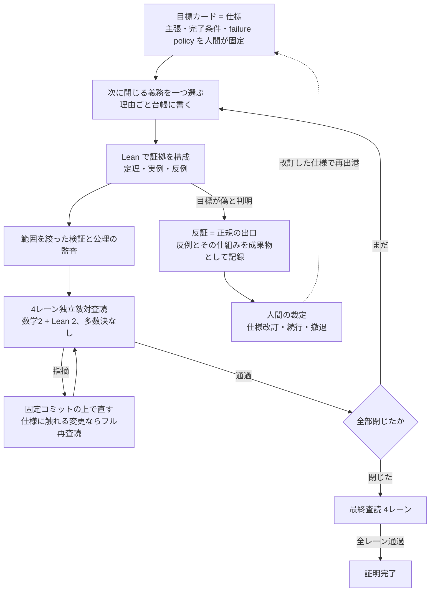

## TL;DR

- 数日がかりの仕事をAIエージェントのループに任せて、最後まで走り切らせたい。そのための規則を**十三条**にまとめた。ループ中に仕様を書き換えさせない。完了と認める証拠の形を先に数え上げて固定する。レビューは独立多重、ただし多数決にしない。検証が実行できなければ合格ではなく不明。ほか九条
- 規則は私のリポジトリで運用されている。2026年8月、15日間で、このループが定理を7本証明し、1本を反証した。約104サイクル、Lean 4 で約6.7万行。証明した7本はすべて、独立に走る4本の敵対査読を通過した
- 定理はいずれも、私の研究プログラム(AAT)が目標に掲げた主定理である。著名な未解決問題の類ではない。ただし各定理は数日がかりの証明対象であり、反証も改訂も起きる、結果の分からない仕事だった
- 体制は3者の分業。Claude(Fable)が目標カードの起草と敵対レビュー、Codex(GPT-5.6 Sol)がループでの証明、人間が裁定を担った
- 十三条が優れた方法だという主張はしない。比較実験のない N=1 の記録である

## はじめに

AIエージェントに数日がかりの仕事を任せるとき、いちばん難しいのは仕事をさせることではない。**出力を信用してよいか判定すること**だ。

舞台は私のモノレポ [AlgebraicArchitectureTheoryV2](https://github.com/iroha1203/AlgebraicArchitectureTheoryV2) だ。ソフトウェアアーキテクチャを代数幾何の道具で解析する理論(AAT)を研究し、主張を Lean 4 で機械検証している。

この記録は N=1 である。ひとつのチームが、ひとつの問題領域で、15日間沈まなかったというだけの話だ。それでも、規則のひとつひとつに発動の記録が残っている。

証明は、人間が固定した目標カードを起点に、このループで進む。

十三条は、このループの要所を固定する規則である。

# 第1部 航海規則十三条

## 事前準備の規則

### 第一条 状態を三分割する

仕様、実行状態、証拠を別の場所に置く。仕様は「何を達成するか」の静的な文書。実行状態は「いまどこか」。証拠は「何が済んだか」。この3つを混ぜると、AIが仕様を書き換えて達成したことにする経路が開く。

このリポジトリでは、仕様は目標カード(GOALカード)、実行状態は GitHub Issue、証拠は report ファイルに置く。ループはカードを読むが、カードに書き込むことはできない。

### 第二条 ループの中で仕様を書き換えない

仕様の改訂は、必ずループを止めて人間の裁定を挟む。AIに許すのは改訂の提案までだ。反証や行き詰まりが起きたとき、いちばん安易な出口は「目標のほうを直す」ことであり、それが正しい場面も実際にある。だからこそ、その判断だけはループの外に出す。

### 第三条 失敗を成果物として設計する

「目標が偽だと判明する」はエラーではなく、正規の出口のひとつだ。出港前に、失敗したとき何を記録するかを決めておく。反例そのもの、失敗の仕組み、再利用できる部品。ここまで書式を決めてあると、失敗が次の仕様の材料になる。

このリポジトリの目標カードには failure policy という節が必須で、反証時の記録形式と扱いを事前に定めている。

### 第四条 1サイクルにつき義務は一つ

ループの各サイクルの冒頭で「今回閉じる義務(証明を前に進めるために残っているタスク)はこれひとつ」と、選んだ理由ごと書かせてから作業を始めさせる。あちこちを少しずつ進めると、進んでいる錯覚が生まれ、失敗したとき原因を切り分けられなくなる。その両方を防ぐ。

このリポジトリでは、サイクル台帳の冒頭に今回閉じる義務を一つ記録してから実装に入る。104サイクルすべてに、この選択の記録が残っている。

### 一般化の注意

この群の前提は、仕様を静的な文書に固定できる粒度まで仕事を刻めることだ。探索的な仕事では、仕様そのものを作る工程が別に要る。ここではその工程を人間と Claude が担い、起草した仕様に敵対レビューを何巡もかけてからループに渡した。仕様の質が悪いままループを回すと、反証と改訂で費用が数倍になる。また第三条の「失敗の記録形式」は領域ごとに設計が要る。数学では反例という再利用可能な形があるが、あなたの領域で反例に相当するものが何かは、自明ではない。

## 検証の規則

### 第五条 完了と認める証拠の形を数え上げて固定する

完了と認める証拠の形を、先に数え上げて固定する。それ以外は理由を問わず完了と認めない。AIの「できました」は、証拠が形式に当てはまるかどうかだけで判定する。

このリポジトリで証明の義務を閉じる資格は3つしかない。機械検証済みの定理、有限の具体データとして固定した実例か反例、ハッシュで固定された証明済みの結果からの導出。逆に、証明すべき内容を型クラスや構造体のフィールドに移して「仮定として受け取る」形にしたものは、どれだけ精巧でも完了と認めない。

### 第六条 「テストが通った」を完了にしない

CI が green である。マージされた。成果物の名前が存在する。これらはどれも完了の証拠ではない。検証は結論そのものに触れなければならない。

このリポジトリでは、受け入れ規約の早見表に、この禁止が1行で書いてある。

### 第七条 レビューは独立に多重化し、多数決にしない

同じ合格基準を持つレビュアーを複数、互いの出力を見せずに並列で走らせる。主査と補助に分けてはいけない。補助に回されたレビュアーは、真剣に欠陥を探さなくなる。そして集計は多数決にしない。ひとりでも致命傷を見つけたら通さない。さらに、全員が合格を出しても、機械的な規則で不合格にできる仕組みを残す。

このリポジトリの査読は、数学2レーンと Lean 2レーンの計4本。不合格にする権限は、主張の弱体化を検知する固定規則が持つ。

### 第八条 レビュー対象を commit SHA で固定する

「指摘は直しました」を、動く対象の上で信用しない。レビューは特定のコミットに固定し、修正後の簡易確認が許される条件を狭く定める。仕様に触れる変更が入ったら、簡易確認の資格は失われ、フル再レビューに戻る。

このリポジトリでは、statement の変更、定義本体の変更、宣言の追加削除、import 方向の変更、台帳 status の変更のどれかがあれば、その時点で簡易確認は不可になる。

### 第九条 「指摘ゼロ」を稀な合格として明文化する

レビューの合格がデフォルトになったら、そのレビューは死んでいる。このリポジトリの査読規約には一文がある。「No major findings は rare pass とする」。この一文だけで、レビュアーAIの探索の深さが変わる。

### 第十条 ごまかしの型に名前を付けて毎回監査する

AIのごまかしには繰り返し現れる型がある。空虚な達成(条件が空集合で自動成立)。採点者への当て込み(目標の文言に合わせただけの構成)。片方向しか示していないのに同値だと名乗る。証明すべき内容を設定側に埋め込む。目標や報告の再解釈。名前が付いていれば毎サイクル機械的に監査できる。名前がなければ毎回見逃す。

このリポジトリのサイクル台帳には、この5つの型それぞれに監査欄がある。

### 第十一条 fail-closed に倒す

検証が実行できなかったら、結果は「不明」であって「合格」ではない。レビュアーが起動できないとき、親エージェントが肩代わりして合格を作るのが最悪手だ。判定不能は判定不能のまま記録し、先へ進めない。

判定を出す側も監査対象にする。検証を打ち切る判定さえ、別の独立レビューが覆せるようにしておく。

### 一般化の注意

この群の最大の前提は、正解判定機が存在することだ。ここでは Lean が証明を型検査する。「完了」が客観的に判定できる。型検査、再現可能なテスト、決定的な計測がある領域なら、この群はそのまま移る。判定が主観的な領域(文章の品質、デザイン)では第五条の列挙が難しく、そのぶん第七条の多重レビューが担う役割が重くなる。もうひとつ。第十条の「名前」は、自分の事故簿から付けるものだ。ここに挙げた5つの型は、この航海で実際に出会った型であって、あなたの領域の型は別の顔をしている。

## 裁定とコストの規則

### 第十二条 止めどきの判断を自動化しない

レビューを何巡で打ち切るか。失敗のあと続行するか、撤退するか。方針をどこで転換するか。この種の判断は人間の裁定として設計する。裁定する場所は、あらかじめ決めた少数の箇所に絞る。それ以外のすべてを自動化するためだ。ループに任せてよいのは、決めてある規則の執行までである。

### 第十三条 検証コストを設計する

フルビルドやフルテストのような全部の検証を、ループの中では明示的に禁止する。そして範囲を絞った検証で置き換える設計を先に作る。禁止と置き換えを対で決めるのが要点で、単に検証を減らすと第十一条と衝突する。

このリポジトリでは、研究領域のフルビルドをループ内で実行しないことが hard rule になっており、代わりに対象モジュールだけの検査、公理の直接監査、placeholder(未証明の穴の目印)の走査を組み合わせる。

### 一般化の注意

この群を運用すると、律速は人間の帯域に移る。実測でも、費用の削減後のボトルネックはトークンではなく、仕様の供給と人間の裁定だった。また第十三条は検証の網羅性を意図的に下げる操作なので、何を諦めたかを記録する。全部の検証は、ループの外(CI やマージ後の監査)に置き場所を移すのであって、消すのではない。

## 十三条がひとつの原則であること

十三条は独立した工夫の集まりではない。どれも同じひとつの原則の切り口だ。

**AIの出力を信用しない、という方針を、人間の注意力ではなく構造に執行させる。**

信用しないと口で言うのは簡単で、実行は難しい。人間の注意力は有限で、104サイクルの全部を疑い続けることはできない。だから、疑うことそのものを仕様、台帳、査読レーン、受け入れ規約の形に固定し、AIとループに肩代わりさせる。15日間の事故は、ほぼすべて構造が捕まえた。

# 第2部 航海日記

この航海は進行中の研究プログラム(AAT 代数的アーキテクチャ論)の一区間だ。研究史はこのブログの過去記事に書いてきた。直近が [Atlas定理の記事](https://zenn.dev/iroha1203/articles/496cff14471f5a)だ。

この理論は先の航海で、SAGA定理に到達した。壊れた整合を修復できるかどうかは、修復を妨げるねじれの量(障害類)が消えるかどうかで決まる。それを示した定理だ。この定理は実在のOSSで1セントの会計ドリフトを検知した。理論が現実の海に届いたその地点を、私たちは喜望峰と呼んでいる。今回の15日間は、岬を回った先の海域だ。水先案内人はいる。グロタンディーク以来の代数幾何が、普遍性、降下、コホモロジーという航法を教えてくれる。だが、この海の全体の海図は誰も持っていない。ソフトウェアアーキテクチャの上で、どの主張が定理として立ち、どこで反証されるか。行ってみるまで分からない。

この海を行く船で、Claude が海図を引き、Codex が舵を取り、人間が裁定する。全員が同じ十三条の下で働く。G-101 のような番号は、目標に振っている通し番号だ。

| 日 | 番号 | 主張 | 結果 | サイクル |
| --- | --- | --- | --- | --- |
| 1日目 | G-101 | 部品の言い換え規則を取り替えても、解析結果一式を運ぶ標準的な方法がただひとつ存在する | 証明 | 16 |
| 2日目 | G-102 | 構造のバグがゼロなら、結合バグはすべて意味の側で検出される | 証明 | 5 |
| 3日目 | G-103 | 与えた法則群を語れる最も粗い部品分割が存在し、実際に計算できる | 証明 | 6 |
| 3日目〜7日目 | G-104 | 一定の条件を満たす限り、診断は読みの解像度に依存しない(Atlas定理) | 証明(反証4回を経て) | 31 |
| 8日目 | G-105 | 部品の配置が作る形は、意味づけの流儀を変えても動かない | **反証** | 7 |
| 8日目〜12日目 | G-107 | 診断の一致は有限の計算で判定できるが、半径1の局所観測からは復元できない | 証明(仕様書き直し2回を経て) | 27 |
| 14日目 | G-106 | 輸送の食い違いは2段階の障害として測れ、それが消えることと全体が噛み合うことは同値である | 証明 | 5 |
| 15日目 | G-108 | 上層の輸送も普遍的に決まり、失敗しうる場所はただ一箇所に特定される | 証明 | 7 |

## 1日目 未知の海域で帆を上げる

最初の定理 G-101。主題は、部品の言い換え規則を取り替えたとき、解析結果の一式を運ぶ標準的な方法がただひとつ存在すること。工学の言葉にすれば、モデリングの流儀を乗り換えるたびに解析をやり直す必要はない、という保証だ。この理論は長らく自分たちの構成を「Grothendieck 的」と呼んできたが、それは比喩だった。この日、その呼び名が本当に成り立つための数学的条件(普遍性)が証明され、比喩は装置の名前になった。

順風の日ではない。最終査読の attempt 1 は、差し戻し3レーンに棄却1レーン。通過したレーンはなかった。attempt 3 で初めて全レーンが通過した。合格が稀であるとは、こういう日常を指す(第九条)。

## 2日目〜3日目 追い風と、見せかけの完了

2日で2本。G-102 は、構造のバグがゼロなら結合バグはすべて意味の側で検出されること。バグの捜索範囲を絞ってよい根拠になる。G-103 は、与えた法則群を語れる最も粗い部品分割が存在し、実際に計算できること。仕様を語るのに必要な最小のモジュール粒度が、計算で出る。

順調に見えるが、査読記録は別の顔をしている。コミットを固定した G-102 の査読は、run 1 から 4 まで連続で欠陥を検出した。中でも run 3 が捕まえたのは、証明の中核が空のまま、外形だけ整った殻だった。通過は run 5(第六条、第八条)。

## 3日目〜7日目 最初の大時化

G-104。主題は、アーキテクチャ診断が読みの解像度に依存しないための条件。サービス粒度で見てもモジュール粒度で見ても、同じ欠陥が同じ場所に見える保証、と言ってもいい。AI がコードを書き、人間が粗く読む時代の、レビュー粒度の保証だ。のちに Atlas 定理と呼ぶことになる、この理論の主定理のひとつである。

この5日間に、証明対象は4回反証された。診断の一致に必要な条件は最終的に7項になった。うち3項は反例に殴られて生え、残りも反証と探索を経て作り直された。3回目の反証のあと、人間が裁定を下す。条件の継ぎ足しをやめ、ループを止めて、探索工程に切り替える(第十二条)。条件の候補6,086件の総当たりと、その先の構造論証が出した結論は「この語彙の条件をいくら継ぎ足しても原理的に届かない」。この否定的な測量が、係数(診断の計算に載せる観測データの語彙)の定義そのものを作り直させた(第二条)。その後、ループは再出港し、31サイクル目で登頂した。

途中、隠れた前提を持ち込んだサイクルが監査に検出され、成果物を全撤去した日もある(第十条)。この5日間の詳細は [Atlas定理の記事](https://zenn.dev/iroha1203/articles/496cff14471f5a)に書いた。

## 8日目 座礁が海図になる

G-105。主題は、構造部品の台が張る空間は語用論の変更で不変であること。部品の配置が作る形は、意味づけの流儀を変えても動かない、という主張だ。サイクル1から6までは順調に進んだ。そしてサイクル7で、最後に残った義務(定理の前提を実際に満たして非自明に成立する具体例。発火実例と呼ぶ)の構成が、**原理的に不可能である**ことが証明された。15日間で唯一の反証だ。

だが記録を読むと、これは沈没ではない。不可能性の中身は、採用した係数の生成規則が情報を無差別に取り込むため、診断の幾何が普遍的に消える、という定理だった。全部盛りの観測ダッシュボードが何も教えてくれない、あの現象の定理版だ。failure policy が事前にあったから、反例とその仕組みはそのまま台帳に載った。のちに理論側はこの反証を、観測を選ぶ設計の必要性を示す最初の機械検証済みの証拠として位置づけ直した(第三条)。座礁の地点が、そのまま浅瀬の海図になった。

## 8日目〜12日目 二度マストが折れた船

G-107。この航海で最も長い5日間だった。

目標の文は2回死んだ。初版「診断の一致は条件 C* で特徴づけられる」には、反例が出た。仕様を書き直した第2版の十分性にも、また反例が出た。どちらも、ループの外の探索工程と査読が見つけたものだ。その探索工程では、探索を打ち切る判定も2回出たが、どちらも早すぎるとして独立レビューが差し戻した。判定を出す側も監査されていた(第十一条)。3回目の仕様は主張の柱を組み替えた。診断の一致は有限の計算で判定できる。しかしその判定は、半径1の局所観測だけからは復元できない。CI では判定できるのに、どれだけ局所ルールを積み上げても lint では代替できない性質が存在する、ということだ。この対を、Codex が27サイクル、実働49時間の単独走で証明しきった。

終わり方も記録に残る。仕様の敵対査読は4巡続いたが、数学的な反例は3巡連続でゼロになり、最後の2巡の指摘は、完了条件の文言の精密化だけになった。ここで人間が宣言する。査読は飽和した。打ち切る(第十二条)。査読を止める判断は、査読と同じくらい設計が要る。

前例調査の記録にはこうある。判定できるのに局所観測できない性質を、機械検証まで固定した既知の前例は見つからなかった。海図のない海域とは、比喩ではなかった。

## 14日目 一晩で山ひとつ

G-106。主題は、輸送を重ねたときの食い違いが2段階の障害として測れ、それが消えることと全体が噛み合うことが同値であること。多段のリファクタリングやマイグレーションが全体として噛み合うかどうかは、測れて、判定できる。2日目に起草され、査読往復で磨かれながら12日間熟成された海図だ。

未明にループが出港し、就寝中に5サイクルを完走した。費用は週間APIリミットの9%(第十三条)。速いだけの夜ではない。サイクル4は、自分の担当義務を閉じる過程で、サイクル2が作った評価器の欠陥(非可換な合成の順序の誤り)を検出し、置き換え、台帳に補正として記録した。また初回サイクルでは、合格を出したレーンが一つあったが、主張の弱体化を検知する上位規則が不合格と判定した(第七条)。船は走りながら自分を修理した。

## 15日目 蜃気楼と、次の海図

G-108。この理論は抽象化の階層を積んだ塔として組まれており、G-101 が証明したのは基礎階の輸送だった。主題は、塔の上層でも輸送が普遍的に決まり、失敗しうる場所がただ一箇所に特定されること。移行が失敗するなら原因はここ、という切り分けの終着点が、作業の前に証明されている。半日で7サイクル。

この日の主役は査読だ。サイクル5で提出された発火実例は、一見すると要件を満たしていた。しかし固定コミットの上の査読は、その発火が本物の構造の差ではなく、設定の差と係数の入れ替えだけに依存していることを突き止め、差し戻した(第八条、第十条)。蜃気楼を陸と報告する寸前で、見張りが止めた。直したあと、通常の4レーンに独立の形式査読4レーンを加えた計8レーンが全通過した。

同じ日、次の目標 G-109 の海図が仕上がった。Claude が起草し、Codex が7巡の敵対査読で殴り、全指摘を直して確定した版だ。二隻は互いの仕事を信用しない。それが、この船団の信頼の形である。

## エピローグ 名前のない海

15日間で、7本の定理と1本の反証。約104サイクル、約6.7万行。そして最後の一枚の海図は、まだ海の上にある。

この海域には、まだ名前がない。候補はある。だが、この理論の命名規則では、名前は証明されたものにしか付かない。海の名も、渡り切った日に付く。

---

**関連記事**: [Atlas定理: 反証4回・Lean 13,000行の末に掴んだ解像度不変性定理](https://zenn.dev/iroha1203/articles/496cff14471f5a) / リポジトリ: [AlgebraicArchitectureTheoryV2](https://github.com/iroha1203/AlgebraicArchitectureTheoryV2)
