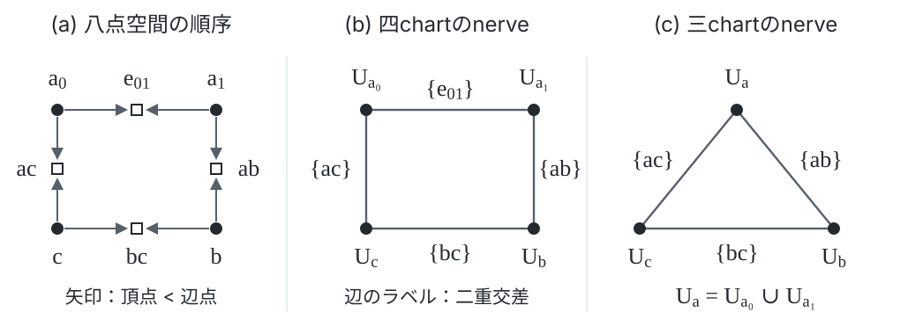

# 第2章 Lawの幾何と局所整合性

## 本章の概要

各部分で法則が成立していても、部分どうしを接続したときに同じ状態を表せるとは限らない。
たとえば、三つのサービスが同じ値を異なる基準で記録しているとする。
接続ごとに基準の補正量を指定できても、三つを一周した補正の総和が零でなければ、
すべてに共通する基準は選べない。この食い違いは、個々のサービス内の方程式だけでは見えない。

本章では、この問題を二段階で扱う。
まず、Lawの方程式をイデアルとしてまとめ、その方程式を満たす状態の空間を構成する。
次に、各部分で選んだ状態の差を重なり上で比較し、局所的な補正で解消できる差を除く。
残る同値類が、貼り合わせを妨げる障害類である。

| 問い | 構成 | 得られるもの |
| --- | --- | --- |
| Lawを満たす状態はどこにあるか | 座標環、方程式のイデアル、評価を構成する | Lawの成立とlawful locusへの因子化の同値（§§2.1–2.2） |
| 局所的な成功から何が不足しているか | 重なりでの差とČech複体を構成する | 指定した局所データの障害類と、補正後の貼り合わせ条件（§§2.3–2.5） |
| 被覆や係数は障害にどう影響するか | 閉路、次元、境界での差、構造相と意味相を調べる | 消滅・検出・比較の条件（§§2.6–2.7） |
| 具体的な障害を次章の診断へどう渡すか | Atom、生成子関係、実際の被覆から整数係数の局所データを作る | 状態と遷移から計算した障害類（§2.8） |
| 修復の意味と方程式の計算は一致するか | 二つの係数と局所状態をそれぞれ構成して比較する | SAGAの障害類の対応と、大域的修復の存在条件（§§2.9–2.10） |

中心となる結論は、必要な評価の条件の下で、Lawの成立を幾何的な零点条件として読めること、
そして実際の修復状態が層をなすとき、障害類の消滅から大域的修復を得られることである。
前者には記号的な方程式とその評価を結ぶ写像が、後者には局所的な補正の作用と貼り合わせが必要になる。
それぞれの写像と条件を、用いる定理の前で定める。

### 修復の意味論に接続する理由

第1章では、独立に定めたlensとプロトコルの意味論をAATの対象へ格納し、
その対象と型付き射から操作と意味保存射を回復した。
また、構成したLawの成立が、元の意味論の法則の成立と同値であることを示した。
局所整合性についても、計算した障害が、実際に許された修復とどう対応するかを知る必要がある。
そのためには、「どの局所変更を同じ修復とみなすか」と「どの方程式の残差を同一視するか」を
それぞれ定め、両者の対応を証明する。

この比較を与えるのがSAGAである
（[SAGA, §§4–5](https://arxiv.org/abs/2608.21458)）。
本章では、その係数・局所状態・比較写像を構成し、障害類の対応と修復の存在を証明する。
これにより、方程式側で得た零・非零の判定を、選択した意味論における修復可能性へ戻せる。

## 2.1 局所代数と方程式のイデアル

方程式を解くには、まず変数と、それらがもともと満たす構造関係を決める。
第1章の文脈ごとの環を使い、構造を表す関係と、検査するLawの方程式を順に組み込む。

以下、アーキテクチャのreadingとsite $`(𝒞,J)`$、方程式系 $`E`$ を固定する。
文脈を $`W`$、Lawの添字を $`i\in K_E`$、必須添字の集合を $`K_E^{\mathrm{req}}`$ と書く。
定義1.12の二つの座標族 $`\nu_{W,i,a}`$ と $`\varepsilon_{W,A,i,a}`$ は、
それぞれ記号的な方程式と、対象 $`A`$ における残差を表す。

**定義2.1（局所代数の表示）.**
定義1.25の座標集合 $`Z_W`$ と構造関係イデアル $`I_W^{\mathrm{str}}`$ に対し、

```math
B_{\mathrm{raw}}(W)=k[x_z\mid z\in Z_W]/I_W^{\mathrm{str}},
\qquad
\theta_W:B_{\mathrm{raw}}(W)\xrightarrow{\sim}O_E(W)
\qquad\text{(2.1)}
```

という $`k`$-代数同型を選ぶ。$`\theta_W`$ は文脈の制限と可換し、
表示中の方程式座標・残差座標を、対応する $`\nu`$・$`\varepsilon`$ へ送るものとする。
これを $`E`$ の局所代数の表示と呼ぶ。
環の層 $`𝒪=a_JO_E`$ は、命題1.23の層化に加法・乗法を移して得る。
演算は局所表示上で計算でき、その環公理は局所的な等式として保たれる。

**命題2.2（局所配置の代数的表示）.**
可換 $`k`$-代数 $`R`$ に対し、座標値の族 $`(c_z)_{z\in Z_W}`$ で
すべての構造関係を満たすものの集合を $`\mathrm{Conf}_W(R)`$ とする。
このとき、$`R`$ に関して自然な全単射

```math
\mathrm{Conf}_W(R)
\cong\mathrm{Hom}_{k\text{-}\mathrm{Alg}}(B_{\mathrm{raw}}(W),R)
```

がある。

**証明.**
座標値の族は、多項式環から $`R`$ への準同型を一意に定める。
すべての構造関係が零に写ることは、その核が $`I_W^{\mathrm{str}}`$ を含むことと同値なので、
準同型は商を通る。逆に商からの準同型を各 $`x_z`$ で評価すれば、元の族を回復する。
環準同型 $`R\to R'`$ との合成は座標値の移送そのものであり、自然性も従う。□

ここで課した関係は、同じ局所配置を記述するための構造関係である。
その配置が満たすべきLawは、次のイデアルで表す。

**定義2.3（Witness idealとobstruction ideal）.**
Law $`i`$ のwitness idealと、必須Lawのobstruction idealを

```math
\begin{aligned}
I_i^E(W)&=(\nu_{W,i,a}\mid a\in\mathrm{At})\subseteq O_E(W),\\
I_{\mathrm{Ob}}^E(W)&=\sum_{i\in K_E^{\mathrm{req}}}I_i^E(W)
\end{aligned}
\qquad\text{(2.2)}
```

と定める。生成イデアルの元は、生成元の有限個の環係数付き和である。
したがって添字集合が無限でも、個々の元は有限和で表される。

**命題2.4（イデアルの制限と層化）.**
制限 $`j:W'\to W`$ は
$`\mathrm{res}_j(I_i^E(W))\subseteq I_i^E(W')`$ を満たす。
同じことが $`I_{\mathrm{Ob}}^E`$ にも成り立つ。
層化した射 $`a_JI_i^E\to𝒪`$ の像は $`𝒪`$ のイデアル層となる。
これを $`ℐ_i^E`$ と書き、その必須添字上の和を $`ℐ_{\mathrm{Ob}}^E`$ とする。

**証明.**
生成元の制限は $`\nu_{W',i,a}`$ であり、生成イデアルの任意の元の制限も生成元の有限和になる。
加法と環要素による乗法への閉性は局所的に確かめられるため、層化後の像にも保たれる。
和についても、各切断を局所的な有限和で表示すれば同じ議論が適用できる。□

必須添字を増やすとイデアルは大きくなり、その零点条件は強くなる。
optionalのLawも同時に課す場合は、そのイデアルを和に加える。

## 2.2 Lawを満たす空間と評価

イデアルは方程式をまとめたものだが、それだけでは対象における方程式の成立を表していない。
この節では、環を幾何的な空間として読み、記号的な方程式が対象の残差へ評価される仕組みを与える。

**定義2.5（アフィンスキームと閉部分スキーム）.**
可換環 $`B`$ に対し、$`\mathrm{Spec}\,B`$ は素イデアルの集合を台とし、

```math
D(f)=\{𝔭\mid f\notin𝔭\},
\qquad
𝒪_{\mathrm{Spec}\,B}(D(f))=B_f
\qquad\text{(2.3)}
```

を基本開集合とその環とするアフィンスキームである。
$`B_f`$ は $`f`$ を可逆にした局所化である。
一般の開集合の切断は、基本開集合上の切断を整合的に貼り合わせて定める。
各点での局所環は $`B_{𝔭}`$ になる。
局所的にこの形を持つ、環の層を備えた空間をスキームと呼ぶ。
これらは通常の素スペクトルと構造層の構成である
（[Stacks, §26.5, Tag 01HR](https://stacks.math.columbia.edu/tag/01HR)）。

イデアル $`I\subseteq B`$ の定める閉部分スキームを
$`V_B(I)=\mathrm{Spec}(B/I)`$ と書く。
環準同型 $`e:B\to R`$ が $`B/I`$ を経由することと、$`e(I)=0`$ は同値である。
したがって $`V_B(I)`$ は、任意の係数環で方程式 $`I`$ を満たす点を表す。

### 記号的な方程式を残差へ評価する

局所評価データを表す空間に、二段階で条件を課す。
最初に、記号的な方程式の評価と対象の残差の評価を一致させる。
次に、必須の残差を零にする。以下の $`Y_W`$、$`X_W`$、$`X_E^{\mathrm{law}}\cap X_W`$ は、
順にこの三段階の空間を表す。

**構成2.6（方程式の幾何的実現）.**
各文脈で、対象のreading $`A_p`$ と準同型 $`e_p:O_E(W)\to R`$ からなる
局所評価データ $`p`$ を考える。これらは係数環の変更で移送できるものとする。
次の代数的な表示が与えられる場合を扱う。

1. 局所評価データの関手がアフィンスキーム $`Y_W=\mathrm{Spec}\,D_W`$ で表され、
   普遍的な環準同型 $`u_W:O_E(W)\to D_W`$ がその評価を与える。
2. 残差の評価 $`p\mapsto e_p(\varepsilon_{W,A_p,i,a})`$ が正則関数であり、
   それを表す元 $`r_{W,i,a}\in D_W`$ が構成されている。
3. 文脈間の表示の比較は開部分上の同型を与え、重なりで構造・座標・残差を保つ。
   三重の重なりでは比較する開部分が対応し、その上で同型の合成が一致する。
4. 貼り合わせ後のchartの対応 $`W\mapsto X_W`$ は文脈の射を開部分の包含へ送り、
   恒等・合成・重なりを保つ。$`J`$ の被覆はchartの開被覆へ写る。

最初の条件は、評価データを座標で記述できること、二番目は残差がその座標の代数的な関数であることをいう。
三番目は、局所的な表示を矛盾なく貼り合わせるための条件である。
四番目は、文脈での制限・重なり・被覆を、得られた空間の開部分で同じように扱えることをいう。
そこで、記号的な方程式と残差の評価を等しくする関係を課す。

```math
\begin{aligned}
K_W&=(u_W(\nu_{W,i,a})-r_{W,i,a}\mid i,a),\\
B_W&=D_W/K_W,\qquad X_W=\mathrm{Spec}\,B_W,\\
\eta_W&:O_E(W)\longrightarrow B_W.
\end{aligned}
\qquad\text{(2.4)}
```

比較同型が $`K_W`$ を保つので、$`X_W`$ の開部分も同型で比較できる。
これらを貼り合わせたスキームを $`X_E`$ とする。
具体的には、$`X_W`$ の直和で対応する点を同一視し、
開集合上の関数を各chart上で一致する関数の族として定める。
重なりの合成条件により同一視は推移的になり、各 $`X_W`$ は開部分として埋め込まれる。
局所環も各chartのものを保つため、得られる空間はスキームである
（[Stacks, §26.14, Tag 01JA](https://stacks.math.columbia.edu/tag/01JA)）。

$`s:T\to X_E`$ に対し、$`T_W=T\times_{X_E}X_W`$ と置く。
その評価を、$`\eta_W`$ と正則関数の引き戻しの合成として
$`\mathrm{ev}_{s,W}:O_E(W)\to\Gamma(T_W,𝒪_T)`$ と定める。
表現する関手から読み出す対象を $`A_s`$ とし、その残差を
$`\varepsilon_{W,i,a}(s)=\mathrm{ev}_{s,W}(\varepsilon_{W,A_s,i,a})`$ と書く。
一般の $`T`$ では、この式をアフィン開集合上で読み、その一致する値を貼り合わせる。

**補題2.7（生成元の評価と局所化）.**
構成2.6で得た評価は、文脈の制限と $`T`$ の基底変換に整合し、

```math
\mathrm{ev}_{s,W}(\nu_{W,i,a})=\varepsilon_{W,i,a}(s)
\qquad\text{(2.5)}
```

を満たす。さらに、$`J_i(W)=(\eta_W(\nu_{W,i,a})\mid a)`$ と置くと、
基本開集合 $`D(f)\subseteq X_W`$ 上で、そのイデアルは

```math
J_i(W)B_{W,f}
=(\eta_W(\nu_{W,i,a})/1\mid a)
\qquad\text{(2.6)}
```

となる。これらの局所イデアルは、$`X_E`$ 上の準連接イデアル層 $`𝒥_i`$ に貼り合う。

**証明.**
式(2.5)は、$`K_W`$ の生成元が $`B_W`$ で零になることを、$`s`$ に沿って引き戻した等式である。
評価の合成則は環準同型の合成則から従う。
局所化したイデアルの元は生成元の有限和を分母付きで表したものであり、式(2.6)を得る。
各chart上で $`\widetilde{J_i(W)}`$ を取り、同じ生成元を保つ重なりの同型で貼り合わせればよい。
準連接性とは、各アフィン開集合上で加群からこの形で作られることをいう。□

被覆と重なりを保つ条件により、$`W\mapsto\Gamma(X_W,𝒪_{X_E})`$ は $`J`$ に関する層である。
したがって $`\eta`$ は層化を通り、site上の $`ℐ_i^E`$ とスキーム上の $`𝒥_i`$ を比較できる。
前者の局所生成元をchartへ写して環係数付きの和を取ると、後者の $`J_i(W)`$ を得る。
この比較は元の生成元と局所化から決まる。

**定義2.8（Lawful locus）.**
$`𝒥_{\mathrm{Ob}}=\sum_{i\in K_E^{\mathrm{req}}}𝒥_i`$ とし、
その定める閉部分スキームを $`X_E^{\mathrm{law}}=V(𝒥_{\mathrm{Ob}})`$ と呼ぶ。
各chartでは $`\mathrm{Spec}(B_W/\sum_iJ_i(W))`$ である。
また、$`s^{*}_{\mathrm{ideal}}𝒥`$ は、$`𝒥`$ の像が $`𝒪_T`$ 内で生成するイデアル層を表す。
これは加群の引き戻し $`s^*𝒥`$ から $`𝒪_T`$ への射の像である。

環の側では、二段階の条件は二回の商

```math
D_W\longrightarrow B_W=D_W/K_W
\longrightarrow B_W/\sum_{i\in K_E^{\mathrm{req}}}J_i(W)
```

に対応する。最初の商が方程式と残差の評価を一致させ、二番目の商が必須Lawの成立を課す。
この順序によって、次の定理の零点条件が対象の残差を判定する。

**定理2.9（方程式・イデアル・零点空間の対応）.**
構成2.6の条件の下で、任意の $`s:T\to X_E`$ について次は同値である。

```math
\begin{aligned}
&\forall W\ \forall i\in K_E^{\mathrm{req}}\ \forall a,
\quad\varepsilon_{W,i,a}(s)=0;\\
&s^{*}_{\mathrm{ideal}}𝒥_{\mathrm{Ob}}=0;\\
&s\text{ は }X_E^{\mathrm{law}}\text{ を経由する。}
\end{aligned}
\qquad\text{(2.7)}
```

**証明.**
引き戻したイデアルが零であることは、$`T_W`$ 上でその生成元がすべて零になることと同値である。
式(2.5)により、この生成元の零性は残差の零性に一致する。
イデアルの和を引き戻して生成することと、引き戻した生成元の和を取ることは同じなので、
必須添字の全体について最初の二条件が同値になる。

最後の条件は、各アフィン開集合上で、準同型が商環を経由する普遍性から得られる。
局所的な因子化は一意なので重なりで一致し、貼り合う。
逆に因子化があれば、商で零となる全生成元の引き戻しも零である。□

この因子化は閉部分スキームの標準的な普遍性でもある
（[Stacks, 補題26.4.6, Tag 01HP](https://stacks.math.columbia.edu/tag/01HP)）。
定理の最初の条件を $`\mathrm{EquationLawful}_E(s)`$ と書く。

**例2.10（二つの値の同期）.**
座標環を $`k[x,y]`$ とし、二つの値を等しくするLawを $`f=y-x`$ で表す。
評価 $`x\mapsto u`$、$`y\mapsto v`$ による残差は $`v-u`$ である。
lawful locusの環は $`k[x,y]/(y-x)\cong k[x]`$ であり、
そこへの点は一つの値を両側へ割り当てることに等しい。
この場合、式(2.5)は $`f(u,v)=v-u`$ という代入計算で確かめられる。

**系2.11（対象のlawfulnessとの比較）.**
対象 $`A`$ の実現 $`s_A:T_A\to X_E`$ があり、各文脈で
残差の評価を元の $`\varepsilon_{W,A,i,a}`$ へ戻す環同型
$`\Gamma((T_A)_W,𝒪_{T_A})\cong O_E(W)`$ が構成されているとする。
このとき、定義1.13の $`\mathrm{Lawful}_E(A)`$ と、
$`s_A`$ が $`X_E^{\mathrm{law}}`$ を経由することは同値である。

**証明.**
同型は零を保存・反映するため、対象の各残差の零性と評価後の零性が一致する。
定理2.9を適用する。□

## 2.3 障害を表す係数

局所状態の食い違いを足し引きするには、その値を入れるアーベル群が必要になる。
方程式から商群を作る方法と、有限の失敗パターンを係数へ写す方法を定める。
係数の選択によって、どの差が同じものとして扱われるかが決まる。

**構成2.12（方程式から生成する商係数）.**
各文脈で

```math
Q_E(W)=O_E(W)/I_{\mathrm{Ob}}^E(W),
\qquad
\overline\varepsilon_{W,A,i,a}=[\varepsilon_{W,A,i,a}]
\qquad\text{(2.8)}
```

と置く。命題2.4により制限は商へ降り、$`Q_E`$ は加法群に値を持つ前層になる。
残差類の制限は、同じ対象・Law・Atomの残差を制限してから商を取ったものに等しい。
また

```math
\overline\varepsilon_{W,A,i,a}=0
\quad\Longleftrightarrow\quad
\varepsilon_{W,A,i,a}\in I_{\mathrm{Ob}}^E(W).
```

これは商群の零元の定義である。Lawが成立して残差自体が零なら、残差類も零になる。
逆向きの検出には、失敗した残差がイデアルに入らないことが必要である。

**例2.13（商で区別される残差）.**
$`O_E(W)=ℤ[x]`$、$`I_{\mathrm{Ob}}^E(W)=(x)`$ なら、$`Q_E(W)\congℤ`$ である。
記号的な生成元 $`x`$ の類は零だが、対象ごとの残差として選んだ $`1`$ の類は非零になる。
残差が $`x`$ なら、それ自体は非零でも商では零になる。
したがって商係数での判定は、指定した残差をイデアルで割った情報を読んでいる。

**定義2.14（局所circuitと係数への実現）.**
対象 $`A`$ と文脈 $`W`$ に対し、Law $`i`$ が $`W`$ 上で成立することを

```math
E_{i,W}(A)\quad\Longleftrightarrow\quad
\forall a\in\mathrm{At},\quad\varepsilon_{W,A,i,a}=0
```

で定める。その失敗とは、少なくとも一つの残差が非零であることである。
第1章の $`E_i(A)`$ は、この局所的な成立条件をすべての文脈に課したものである。

各文脈で読むconfigurationと、定義1.15の形式のdetector codeを選ぶ。
その有限受理集合を $`T_{i,W}`$ とし、定義1.14の各queryをこの局所configurationで評価して
得る一致条件を $`\mathrm{Matches}_W(Q,A)`$ と書く。
受理され、かつ一致する有限パターンのうち、使用するものを

```math
\mathrm{Circ}^{\mathrm{loc}}_E(A,i;W)
\subseteq\{Q\in T_{i,W}\mid\mathrm{Matches}_W(Q,A)\}
```

として選び、その元を局所circuitと呼ぶ。
この族には、採用した文脈の制限に沿って一致と受理を保つ写像を与え、恒等・合成の法則を課す。
このように制限後にも使える族を選ぶことも、局所検出のデータに含める。
局所健全性と、必須Lawについての局所完全性は、それぞれ

```math
\begin{aligned}
c\in\mathrm{Circ}^{\mathrm{loc}}_E(A,i;W)
&\Longrightarrow\neg E_{i,W}(A),\\
i\in K_E^{\mathrm{req}}\ \land\ \neg E_{i,W}(A)
&\Longrightarrow\mathrm{Circ}^{\mathrm{loc}}_E(A,i;W)\ne\varnothing
\end{aligned}
```

という条件である。適用する対象・文脈・Lawについて、これらの条件を確かめる。

さらにアーベル群の層 $`F`$ を選ぶ。
各局所circuit $`c`$ にwitnessの添字 $`a(c)\in\mathrm{At}`$ を対応させ、
生成元 $`\nu(c)=\nu_{W,i,a(c)}\in I_i^E(W)`$ を割り当てる。
その上で、制限と可換する加法的写像

```math
\rho_{i,W}:I_i^E(W)\longrightarrow F(W),
\qquad \kappa_{i,W}(c)=\rho_{i,W}(\nu(c))
\qquad\text{(2.9)}
```

を構成したとき、これをcircuitの係数への実現と呼ぶ。
生成元への割当ても、局所circuitと環の制限に関して可換するものとする。
たとえば商への射を層化した $`I_i^E\to a_J(I_i^E/(I_i^E)^2)`$ は、このような写像の候補となる。
その像がcircuitを検出するかは、選んだ生成元について調べる。

**命題2.15（係数による有限失敗の検出）.**
対象 $`A`$ と文脈 $`W`$ を固定する。必須Lawに対して定義2.14の局所健全性・局所完全性が成り立ち、
各局所circuitの式(2.9)の像が非零であるとする。
このとき、$`W`$ 上で必須Lawの少なくとも一つが失敗することと、
必須Lawに対する非零のcircuit像が存在することは同値である。

**証明.**
失敗からは完全性によってcircuitが得られ、その像は仮定により非零である。
逆にcircuitが存在すれば、健全性から対応するLawが失敗する。□

複数の像を一つに集約する場合は、非零の像が和で相殺されない条件も必要になる。
たとえば独立な座標を持つ直和へ各像を格納すれば、全体の零性は各座標の零性に一致する。
この段階で選んだ係数を、以後の局所比較にも用いる。

## 2.4 重なりの比較とČech障害類

局所状態の差を比較するとき、二重の重なりには差を、三重の重なりには差どうしの整合条件を置く。
Čech複体は、この計算を制限写像と加減算で組み立てたものである。

**定義2.16（被覆とČech複体）.**
有限被覆 $`𝒰=(U_\alpha\to W)_{\alpha\in A}`$ を固定する。
各射は単射射とし、$`A`$ に全順序を選ぶ。
重なり $`U_{\alpha\beta}`$、$`U_{\alpha\beta\gamma}`$ は $`W`$ 上の引き戻しである。
係数 $`F`$ はアーベル群値の前層とする。
空の重なりでは $`F(\varnothing)=0`$ とし、次の積からその成分を除く。

```math
\begin{aligned}
C^0(𝒰,F)&=\prod_\alpha F(U_\alpha),\\
C^1(𝒰,F)&=\prod_{\alpha<\beta}F(U_{\alpha\beta}),\\
C^2(𝒰,F)&=\prod_{\alpha<\beta<\gamma}F(U_{\alpha\beta\gamma}).
\end{aligned}
\qquad\text{(2.10)}
```

これらの元をcochainと呼ぶ。局所状態の補正量は次数0、重なりの差は次数1に入る。
微分を

```math
\begin{aligned}
(d^0b)_{\alpha\beta}&=b_\beta|_{U_{\alpha\beta}}-b_\alpha|_{U_{\alpha\beta}},\\
(d^1g)_{\alpha\beta\gamma}&=g_{\beta\gamma}|_{U_{\alpha\beta\gamma}}
-g_{\alpha\gamma}|_{U_{\alpha\beta\gamma}}
+g_{\alpha\beta}|_{U_{\alpha\beta\gamma}}
\end{aligned}
\qquad\text{(2.11)}
```

と定める。以後、同じ重なりへの制限は $`|`$ で略記する。
高次も同様に、$`n+1`$ 重交差の切断の積を次数 $`n`$ とし、制限の交代和を微分とする。

**補題2.17（微分の合成）.**
$`d^1d^0=0`$ である。

**証明.**
三重の重なりへ制限した成分は
$`(b_\gamma-b_\beta)-(b_\gamma-b_\alpha)+(b_\beta-b_\alpha)=0`$ となる。
各 $`b`$ の二通りの制限が等しいことには、前層の合成則を用いる。□

**定義2.18（固定被覆上の障害群）.**
$`d^1g=0`$ を満たす $`g`$ を1-cocycle、$`d^0b`$ の形の元を1-coboundaryと呼ぶ。
被覆 $`𝒰`$ に関する一次Čechコホモロジーは

```math
\check H^1(𝒰,F)=\ker d^1/\mathrm{im}\,d^0
\qquad\text{(2.12)}
```

である。$`[g]`$ は $`g`$ の同値類を表す。
二つのcocycleは、ある $`d^0b`$ だけ異なるとき同じ類を持つ。
特に $`[g]=0`$ は、$`g=d^0b`$ を満たす局所補正量 $`b`$ の存在を意味する。
本章の $`\check H^1`$ は、明示した被覆と係数に関するこの群を表す。

**例2.19（三つの局所基準）.**
三つのchartの二重の重なりがすべて非空で、三重の重なりは空とする。
各chartと重なりの係数を同じアーベル群 $`M`$ とし、制限を恒等写像とする。
すると

```math
\begin{aligned}
d^0(b_0,b_1,b_2)&=(b_1-b_0,\ b_2-b_0,\ b_2-b_1),\\
\mathrm{per}(g)&=g_{01}+g_{12}-g_{02}
\end{aligned}
\qquad\text{(2.13)}
```

である。この一周の和 $`\mathrm{per}(g)`$ をperiodと呼ぶ。
三重の重なりがないので全1-cochainがcocycleになる。
$`d^0b`$ のperiodは零であり、逆にperiodが零なら
$`b_0=0`$、$`b_1=g_{01}`$、$`b_2=g_{02}`$ と置けば $`d^0b=g`$ である。
よって $`\check H^1(𝒰,M)\cong M`$ となる。

$`M=ℤ`$、$`g_{01}=1`$、$`g_{02}=g_{12}=0`$ なら、periodは1である。
二つずつの基準の差をどのように補正しても、この一周分の差は残る。
この形を持つ実際の被覆は、§2.8で有限な位相空間から構成する。

## 2.5 障害類の消滅から貼り合わせへ

式(2.12)は補正量を求める代数的な条件である。
その補正が局所状態に作用し、補正後の状態が貼り合うとき、大域的な状態を得られる。
この二つの条件を、torsorと層によって記述する。

**定義2.20（局所状態とTorsor）.**
局所状態の前層 $`P`$ と係数前層 $`F`$ を取る。
この節の「被覆の交差」には、各chart自身も含める。被覆の各交差上で
$`F(V)`$ が $`P(V)`$ に作用するとする。これらの作用は交差間の制限と可換するものとする。
被覆の各非空交差 $`V`$ で、任意の $`p,q\in P(V)`$ に対し
$`q=m+p`$ となる $`m\in F(V)`$ がただ一つ存在するとき、
非空の $`P(V)`$ を $`F(V)`$-torsorと呼ぶ。

torsorには基準となる零状態を指定しない。その代わり、二状態の差 $`q-p=m`$ が一意に定まる。
係数群のすべての元が実際の状態変更として作用するので、cochainとして求めた補正量を状態へ適用できる。
空の交差上の $`P`$ は高々一元とする。
局所状態 $`p_\alpha\in P(U_\alpha)`$ の族を、局所atlasと呼ぶ。

各 $`p_\alpha`$ は状態空間 $`P(U_\alpha)`$ の元として与えられており、
係数群 $`F(U_\alpha)`$ との同一視はまだ選んでいない。
この族を係数の0-cochainとして扱うには、各状態を係数で表す基準が必要になる。
局所的に基準状態を選べばこの表示を得られるが、その基準どうしも重なりでずれうる。
制限と整合する共通の基準を選べるかどうかが、ここで調べる貼り合わせの問題である。
§2.8では、局所基準での座標を $`p`$、基準間のずれを $`\xi`$ として明示し、
状態の差を $`\xi+d^0p`$ と計算する。

**命題2.21（状態の差が定める障害類）.**
局所atlasから
$`g_{\alpha\beta}=p_\beta| -p_\alpha|`$ と定めると、$`g`$ はcocycleである。
atlasを $`p'_\alpha=b_\alpha+p_\alpha`$ に変えると、

```math
g'=g+d^0b,
\qquad [g']=[g]
\qquad\text{(2.14)}
```

となる。この $`[g]`$ を局所状態の貼り合わせの障害類と呼ぶ。

**証明.**
三重の重なりでは、$`p_\gamma`$ を $`p_\alpha`$ から直接得る差と、
$`p_\beta`$ を経由して得る差が等しい。
作用の自由性により $`g_{\alpha\gamma}=g_{\beta\gamma}+g_{\alpha\beta}`$ であり、$`d^1g=0`$ を得る。
変更後の差を計算すると
$`g'_{\alpha\beta}=g_{\alpha\beta}+b_\beta|-b_\alpha|`$ なので式(2.14)が従う。□

**定理2.22（局所補正と大域的な状態）.**
定義2.20の $`P`$ がsite $`(𝒞,J)`$ 上の層であるとする。
このとき、局所atlasの障害類について

```math
P(W)\ne\varnothing
\quad\Longleftrightarrow\quad
[g]=0\text{ in }\check H^1(𝒰,F)
\qquad\text{(2.15)}
```

が成り立つ。$`g=d^0b`$ なら、補正後の族 $`(-b_\alpha)+p_\alpha`$ は大域状態へ一意に貼り合う。

**証明.**
$`g=d^0b`$ とすると、命題2.21により補正後の差は零になる。
順序を逆にした重なりでも差は符号が逆になるだけで零である。
自己交差では被覆射の単射性により二つの射影が一致し、空交差では高々一元性により一致する。
したがって補正後の族はすべての重なりで一致するmatching familyとなる。
層条件により、一意な大域状態へ貼り合う。

逆に $`p\in P(W)`$ があれば、各chartで
$`p_\alpha=b_\alpha+p|_{U_\alpha}`$ となる差を取れる。
重なりで計算すると $`g=d^0b`$ である。□

一意なのは、固定した補正後の族の貼り合わせである。
補正の選び方が異なれば、大域状態も異なりうる。
層に値を持つアーベル群のtorsorについて、この議論は標準的な自明化の判定に当たる
（[Stacks, §21.4, Tag 03AG](https://stacks.math.columbia.edu/tag/03AG)）。

### Lawを満たす局所状態への適用

**系2.23（Lawfulな状態の貼り合わせ）.**
状態の層 $`𝒯`$ と、環の層 $`𝒪`$ に値を持つ必須残差の自然な族があり、
$`P(V)\subseteq𝒯(V)`$ を全必須残差が零になる状態の集合とする。
$`F`$ の作用が $`P`$ を保ち、選んだ被覆上で定義2.20の条件を満たすとする。
このとき、局所lawful状態の障害類が零であることと、$`P(W)\ne\varnothing`$ は同値である。

**証明.**
$`P`$ は層である。実際、matching familyは $`𝒯`$ で一意に貼り合い、
その各残差は被覆上で零である。$`𝒪`$ の分離性により大域的にも零となる。
定理2.22を適用する。□

構成2.6の評価を用いれば、この残差条件は定理2.9のlawful locusへの因子化に一致する。
対象のlawfulnessへ戻す場合は、系2.11の評価の比較も用いる。

局所lawfulnessを有限の検査から確かめる場合、検査と残差の接続を指定する必要がある。
具体的には、次の条件を確かめる。

- **情報を読めること。** 被覆が第1章の $`(E,ℛ,\mathrm{Ov})`$-adequateであり、必要な座標と相互作用を読める。
- **失敗を検出できること。** 定義2.14の局所健全性・局所完全性が成立し、必要な全witnessが被覆内で検査される。
- **零判定が対応すること。** 採用した軸の零判定と、対応する残差の零性が同値である。
- **集約で失敗を失わないこと。** circuit像を集約する場合は、各像が非零であり、その和で相殺されない。

これらが局所検査を $`P(U_\alpha)`$ の所属へ結び、torsorの作用と層条件が大域的な結論を与える。

## 2.6 被覆の形、障害の容量、閉路による検出

障害群の大きさは、どれほど多くの独立な食い違いを記録できるかを表す。
一方、今回の局所状態が障害を持つかどうかは、その状態から作った類を調べて決まる。
この節では、前者を次元で、後者を閉路に沿う和で調べる。

**命題2.24（障害空間の次元と交代和）.**
$`k`$ を体とし、$`C^0,C^1,C^2`$ が有限次元 $`k`$-ベクトル空間であるとする。
このとき

```math
\dim_k\check H^1
\geq\dim_k C^1-\dim_k C^0-\dim_k C^2.
\qquad\text{(2.16)}
```

また、有限長の有限次元複体では

```math
\chi(C^\bullet)
=\sum_n(-1)^n\dim_k C^n
=\sum_n(-1)^n\dim_k H^n(C^\bullet).
\qquad\text{(2.17)}
```

**証明.**
$`\dim\check H^1=\dim\ker d^1-\dim\mathrm{im}\,d^0`$ に階数・退化次数の定理を適用する。
$`\mathrm{rank}\,d^1\leq\dim C^2`$、$`\mathrm{rank}\,d^0\leq\dim C^0`$ から式(2.16)を得る。
式(2.17)は
$`\dim C^n=\dim\mathrm{im}\,d^{n-1}+\dim H^n+\dim\mathrm{im}\,d^n`$
の交代和で、像の次元が隣接次数どうしで相殺されることから従う。□

式(2.16)を障害容量の下界と呼ぶ。
各次数のcochain次元を保つ変更は $`\chi`$ を保つが、
個々のコホモロジーの次元や、指定した $`[g]`$ には微分と $`g`$ 自体も関わる。

**命題2.25（定数係数と被覆のNerve）.**
位相空間の有限開被覆を取り、そのすべての非空有限交差が連結であるとする。
係数を局所定数な $`k`$ 値関数の層とする。
非空交差 $`U_{\alpha_0\cdots\alpha_n}`$ に単体を対応させた複体を $`N(𝒰)`$ とすると、
Čech複体と $`N(𝒰)`$ の通常の $`k`$ 係数cochain複体は同型であり、
$`\dim_k\check H^1(𝒰,k)=\beta_1(N(𝒰);k)`$ となる。

**証明.**
連結な交差上の局所定数関数は一つの値で決まる。
この同定で制限は恒等写像になり、式(2.11)は単体の面に沿う交代和に一致する。
各次数でこの同定を取れば複体の同型を得る。
$`\beta_1(N(𝒰);k)`$ は、この複体の一次コホモロジーの次元である。□

交差が複数の連結成分を持つ場合には、成分ごとに座標を置く。
成分が有限個の開かつ連結な部分に分かれる場合、同じ構成は成分を頂点・辺・面に持つ複体で行える。

**命題2.26（Forest上の消滅）.**
三重の重なりがなく、chartを頂点、非空の重なりの成分を辺とする有限グラフがforestであるとする。
係数が各成分に分解され、各端点から辺成分への制限 $`F(U_\alpha)\to F(U_e)`$ が全射なら、
$`\check H^1(𝒰,F)=0`$ である。

**証明.**
各木に根を選び、根の補正量を零とする。
親の補正量が決まったら、親子の辺の差が指定された $`g_e`$ に等しくなるように、
子の補正量を選ぶ。辺への制限の全射性がこの選択を可能にする。
各子には親が一つしかないので、既に満たした別の辺の条件を変更せずに進められる。
全頂点を処理すると $`d^0b=g`$ となる。□

**例2.27（道と閉路）.**
恒等制限を持つ三頂点の道では、二つの差を根から順に吸収できる。
そこに両端を結ぶ辺を加えると、例2.19のperiodが残る。
さらに三重の重なりがあり、その係数と制限も同じなら、
式(2.11)のcocycle条件がこのperiodを零にする。
したがって、重なりの辺だけでなく、その間を埋める面も障害群の計算に入る。

### 閉路の和と境界での差

**命題2.28（PeriodとStokesの式）.**
有限複体 $`N`$ の定数 $`k`$ 係数chainとcochainを、
同じ向きを持つ単体の係数を掛けて足すことでペアリングする。
chainの境界写像 $`\partial`$ とcochainの微分 $`d`$ について

```math
\langle d\omega,z\rangle=\langle\omega,\partial z\rangle
\qquad\text{(2.18)}
```

が成り立つ。したがって1-cycle $`z`$ 上の $`\langle g,z\rangle`$ は、
$`g`$ にcoboundaryを加えても変わらない。
この値が非零なら $`[g]\ne0`$ である。

**証明.**
一つの単体について、両辺はその面の値に同じ交代符号を付けた和になる。
線形性で一般のchainへ延長できる。
$`\partial z=0`$ なら $`\langle d^0b,z\rangle=0`$ であり、残りの主張が従う。□

**命題2.29（境界での差から生じる障害）.**
有限複体を二つの部分複体で $`N=N_A\cup N_B`$ と分け、$`L=N_A\cap N_B`$ とする。
定数係数のcochainに対し、制限の差 $`(u,v)\mapsto u|_L-v|_L`$ は全射である。
$`b\in H^0(L,k)`$、すなわち $`db=0`$ となる0-cochainを取り、
$`u|_L-v|_L=b`$ となる0-cochain $`u,v`$ を選ぶ。
このとき $`du,dv`$ は一つの1-cocycle $`h`$ に貼り合い、
$`\delta(b)=[h]\in H^1(N,k)`$ は選択によらない。
さらに

```math
\begin{aligned}
\delta(b)=0\quad\Longleftrightarrow\quad
&\exists a\in H^0(N_A,k),\ \exists c\in H^0(N_B,k),\\
&b=a|_L-c|_L.
\end{aligned}
\qquad\text{(2.19)}
```

**証明.**
全射性は、$`L`$ 上の各単体の値を $`N_A`$ へ延長して得られる。
$`d(u|_L-v|_L)=db=0`$ なので $`du,dv`$ は一致し、$`h`$ に貼り合う。
$`dh=0`$ は両部分上で $`d^2=0`$ であることから従う。
別の持ち上げとの差は、$`N`$ 上の0-cochain $`w`$ の制限となり、$`h`$ は $`dw`$ だけ変わる。
また $`h=dw`$ なら、$`a=u-w|_{N_A}`$ と $`c=v-w|_{N_B}`$ は0-cocycleであり、
その差は $`b`$ となる。逆は持ち上げとして $`a,c`$ を選べばよい。□

この $`\delta(b)`$ を、境界での差 $`b`$ が作る障害と読める。
閉路 $`z=z_A+z_B`$ を各部分のchainに分けると、
$`\partial z_A=-\partial z_B`$ は $`L`$ に台を持つ。
命題2.28により
$`\langle h,z\rangle=\langle b,\partial z_A\rangle`$ となる。
全体を一周した差は、二部分の境界で比較した差の符号付き和に一致する。

## 2.7 構造相と意味相の比較

ある事実が構造に属するか意味に属するかは、許した意味の変更に対して何が変わるかで決まる。
この分類から係数を分け、意味側だけを見ても障害を失わない条件を調べる。

**定義2.30（抽出の不変性による二相）.**
第1章の抽出doctrine $`D`$ に対し、語彙、正規化、解像度、sourceの構造を保ち、
意味のreadingとその許容述語だけを変える族 $`(D_\lambda)_{\lambda\in\Lambda}`$ を選ぶ。
この族は $`D`$ 自身を含むものとする。
sourceとAtomの対 $`(s,a)`$ が構造的であるとは

```math
\forall\lambda\in\Lambda,\quad
\bigl(a\in\mathrm{Atomize}_{D_\lambda}(s)
\Longleftrightarrow a\in\mathrm{Atomize}_D(s)\bigr)
\qquad\text{(2.20)}
```

が成り立つことをいう。そうでない対を意味的と呼ぶ。
たとえば、構成要素の存在がすべてのreadingで抽出され、値の解釈に関する事実だけが
あるreadingで抽出されなくなるなら、前者は構造的、後者は意味的である。

**定義2.31（二相の係数複体）.**
有限次元の複体 $`C^\bullet_{\mathrm{all}}`$ の各座標にsourceとAtomの対を対応させる。
構造的な対に属する座標の張る部分空間を $`C^n_{\mathrm{str}}`$ とする。
制限と微分がこの部分を保つことを条件Sと呼ぶ。
この条件の下で $`C^n_{\mathrm{sem}}=C^n_{\mathrm{all}}/C^n_{\mathrm{str}}`$ に微分が降り、

```math
0\longrightarrow C^\bullet_{\mathrm{str}}
\longrightarrow C^\bullet_{\mathrm{all}}
\longrightarrow C^\bullet_{\mathrm{sem}}\longrightarrow0
\qquad\text{(2.21)}
```

は各次数で完全な列となる。
この $`C^\bullet_{\mathrm{sem}}`$ は、抽出の二相から作った商複体である。
§2.9では別途、修復操作の関係から係数 $`M_{\mathrm{sem}}`$ を作る。

**命題2.32（意味側での障害の保持）.**
条件Sが成立し、$`H^1(C^\bullet_{\mathrm{str}})=0`$ なら、誘導写像

```math
H^1(C^\bullet_{\mathrm{all}})
\longrightarrow H^1(C^\bullet_{\mathrm{sem}})
\qquad\text{(2.22)}
```

は単射である。

**証明.**
cocycle $`g`$ が意味側でcoboundaryになるとする。
対応する意味側の0-cochainを、次数0の全射性によって $`b\in C^0_{\mathrm{all}}`$ へ持ち上げる。
$`g-d^0b`$ は構造部分に属するcocycleである。
構造側の $`H^1=0`$ により $`g-d^0b=d^0c`$ となる構造的な $`c`$ がある。
よって $`g=d^0(b+c)`$ である。□

構造側の複体が命題2.26のforestの条件を満たせば、必要な $`H^1=0`$ が得られる。
二つの条件の役割は、次の小例で分かる。

**例2.33（条件Sが破れる場合）.**
意味変更の前後で常に抽出される対を $`s`$、抽出の真偽が変わる対を $`t`$ とする。
二頂点一辺の複体で、左頂点に $`s`$、右頂点と辺に $`t`$ を対応させる。
$`C^0_{\mathrm{all}}=k^2`$、$`C^1_{\mathrm{all}}=k`$、$`d^0(a,b)=b-a`$ であり、
構造部分は次数0で $`k(1,0)`$、次数1で零になる。
$`d^0(1,0)=-1`$ なので構造部分は保たれず、意味側の商へこの微分は降りない。

**例2.34（条件Sだけでは単射にならない場合）.**
二頂点を二本の平行辺で結ぶ複体を二組取り、片方の全座標に $`s`$、他方の全座標に $`t`$ を対応させる。
各組の微分は $`(a,b)\mapsto(b-a,b-a)`$ で、次数2は零である。
構造部分は第一組そのものであり、条件Sは成立する。
しかし第一組の1-cochain $`(1,0)`$ は、二辺の値が異なるためcoboundaryにならない。
この非零類は意味側では零に写る。
したがって構造側の障害が消える条件が、命題2.32の単射性を支えている。

## 2.8 Atomから作る整数係数の具体的な障害

次章で診断と比較するため、係数と被覆を具体的に構成する。
係数の生成子はLawとsourceの組、幾何の点は局所的に読む範囲を表す。
これらを一つのAtom族に保持し、局所状態と遷移から障害類を計算する。

### 生成子関係から係数を作る

**定義2.35（生成子と原始関係）.**
有限source集合 $`S`$ と、有限Law族 $`(\ell)_{\ell\in L}`$ を取る。
各Lawには値の集合 $`\mathrm{Val}_\ell`$ と評価 $`v_\ell:S\to \mathrm{Val}_\ell`$ がある。
生成子の集合を $`G=L\times S`$ とし、$`g=(\ell,s)`$ のラベルを
$`(\ell,v_\ell(s))`$ とする。
原始関係 $`R\subseteq G\times G`$ は、このラベルを保つ関係として宣言する。
$`R`$ の反射・対称・推移閉包による商集合を $`𝔅`$ とし、生成子 $`g`$ の成分を $`[g]_R\in𝔅`$ と書く。
整数係数の群を

```math
M_R=ℤ^{(G)}/\langle e_g-e_h\mid gRh\rangle
\qquad\text{(2.23)}
```

と定める。$`ℤ^{(G)}`$ は基底 $`e_g`$ を持つ自由アーベル群である。

**補題2.36（係数の標準形）.**
$`e_g\mapsto e_{[g]_R}`$ は同型 $`M_R\congℤ^{(𝔅)}`$ を誘導する。

**証明.**
原始関係で結ばれた基底は同じ成分へ写るので、写像は商へ降りる。
逆向きには、成分の代表生成子を選び、その $`M_R`$ での類を対応させる。
同じ成分の二生成子は原始関係の有限列で結ばれ、差が各関係の差の和となるため、選択によらない。
二つの写像の合成は基底上で恒等となり、両逆である。□

具体例として $`S=\{0,1\}^2`$、$`L=\{\ell\}`$、$`v_\ell(v,h)=v`$ とする。
原始関係は、同じ $`v`$ を持つ $`(v,0)`$ と $`(v,1)`$ を結ぶ二本とする。
生成子を $`g_{00},g_{01},g_{10},g_{11}`$ と書けば、
二成分 $`B_0=\{g_{00},g_{01}\}`$、$`B_1=\{g_{10},g_{11}\}`$ があり、
$`M_R\congℤ^2`$ となる。
元のsourceの第二成分を同一視しても、異なるLaw値の二成分は区別されている。

### 八点の空間と二つの被覆

**構成2.37（点と生成子を保持するAtom入力）.**
四つの頂点 $`a_0,a_1,b,c`$ と、四つの辺点 $`e_{01},ab,bc,ac`$ を持つ集合 $`X`$ を取る。
辺点の両端を
$`e_{01}:(a_0,a_1)`$、$`ab:(a_1,b)`$、$`bc:(b,c)`$、$`ac:(a_0,c)`$ とする。
順序は、各頂点が接続する辺点以下となる関係と、反射関係だけで定める。
上方に閉じた部分集合を開集合とする。

点Atomと生成子Atomを区別するタグを付け、Atom族を $`X\sqcup G`$ とする。
点Atomは点自身をsubjectに持ち、predicate・payload・軸はそれぞれ固定値とする。
生成子Atom $`(\ell,s)`$ はsource $`s`$、Law添字 $`\ell`$、Law値 $`v_\ell(s)`$ を
それぞれsubject・predicate・payloadに持ち、軸は一つに固定する。
種別とこれらの座標から各Atomは一意に定まる。
configurationの関係は、生成子Atomの間に宣言した $`R`$ とする。

開集合 $`V\subseteq X`$ に対応する文脈 $`c_V`$ は、$`V`$ の点Atomと全生成子Atomを読む。
包含 $`V'\subseteq V`$ を制限射とし、重なりを $`c_{V'\cap V}`$ で与える。
被覆には、開集合を覆い、読まれる生成子も覆う族を採用する。
これらの族が生成する、文脈site上のGrothendieck位相を用いる。
非空の被覆族では各文脈が全生成子を読むため、生成子の被覆条件も成立する。
以下の二つの被覆は、この文脈siteの被覆となる。

**補題2.38（三chart・四chartの被覆）.**
頂点の最小開近傍は

```math
\begin{aligned}
U_{a_0}&=\{a_0,e_{01},ac\},& U_{a_1}&=\{a_1,e_{01},ab\},\\
U_b&=\{b,ab,bc\},& U_c&=\{c,bc,ac\}.
\end{aligned}
\qquad\text{(2.24)}
```

これらは $`X`$ を覆う。
また $`U_a=U_{a_0}\cup U_{a_1}`$ とすれば、$`(U_a,U_b,U_c)`$ も被覆である。
両被覆のchartと非空の二重の重なりは連結であり、異なる三chartの交差は空である。

**証明.**
各頂点は自身の近傍に、各辺点は両端の近傍に入るため被覆になる。
各最小近傍は最小元を持つ。これを二つの相対開集合へ分離しようとすると、
最小元を含む側が上方のすべての点を含むので分離できない。
$`U_{a_0}`$ と $`U_{a_1}`$ は $`e_{01}`$ で交わるので、その和も連結である。
四chart被覆の非空二重交差は $`\{e_{01}\},\{ab\},\{bc\},\{ac\}`$、
三chart被覆の非空二重交差は $`\{ab\},\{bc\},\{ac\}`$ である。
各辺点は二つの端点しか持たず、chartを上記のように併合しても三つに共有される点はない。□



**図2.1：八点空間と二つの被覆。** 左は空間 $`X`$ の八点を表し、
丸は頂点、四角は辺点、矢印は頂点から辺点への順序を表す。
中央と右は被覆のnerveであり、節点がchart、辺が非空二重交差を表す。
中央の $`U_{a_0}`$ と $`U_{a_1}`$ を $`U_a`$ に併合すると、
その交差点 $`e_{01}`$ は $`U_a`$ の内部に入る。
右の三角形には面がなく、三重交差は空である。

この計算で、次数2が零であることは、実際の交差が空であることから得られる。

**構成2.39（局所定数な障害係数の層）.**
$`F_R(c_V)`$ を、$`V`$ 上の局所定数な $`M_R`$ 値関数の群とし、制限を関数の制限とする。
重なりで一致する関数は一意に貼り合い、局所定数性も局所的に確かめられるので、$`F_R`$ は層である。
空の開集合では零群になる。
文脈から開集合への写像 $`c_V\mapsto V`$ は交差と被覆を保つため、
この係数は選んだ文脈site上の実際の層となる。

補題2.38の連結性により、chartと非空交差上の切断は、それぞれ一つの $`M_R`$ の値で決まる。
この表示で制限は恒等準同型である。
したがって、両被覆のČech複体は、頂点と辺の $`M_R`$ 値を持ち、次数2が零の複体になる。

### 局所状態とアフィン遷移から障害を計算する

**命題2.40（Lawfulなchart状態）.**
補題2.36の同型で、各chart状態 $`p_\alpha\in M_R`$ を成分ごとの整数
$`(p_{\alpha,B})_{B\in𝔅}`$ として読む。
多項式環と関係イデアルを

```math
\begin{aligned}
P_R&=ℤ[X_g\mid g\in G],\\
J_R&=(X_g-X_h\mid gRh),\\
e_\alpha:P_R&\longrightarrowℤ,
\qquad X_g\longmapsto p_{\alpha,[g]_R}
\end{aligned}
\qquad\text{(2.25)}
```

と定める。この評価は $`J_R`$ を零に送り、$`\mathrm{Spec}(P_R/J_R)`$ の整数点を与える。
実際の制限で得た重なり上の状態もlawfulである。
さらに任意の $`\xi_e\in M_R`$ による平行移動後の状態もlawfulである。

**証明.**
$`gRh`$ なら $`[g]_R=[h]_R`$ なので、各生成元 $`X_g-X_h`$ の評価は零になる。
重なりへの制限は同じ成分の整数値を保つ。
平行移動後も、同じ成分には同じ $`\xi_{e,B}`$ を加えるため、等式が保たれる。□

ここでの多項式方程式は、宣言した原始関係に沿う座標の一致を要求している。
定義2.35のLaw値は生成子の由来を保持し、次章ではこの係数を診断へ写すために用いる。

**命題2.41（指定したアフィン局所データの障害）.**
いずれかの被覆を $`𝒰_q`$ と書き、局所データ $`x=(\xi,p)`$ を選ぶ。
$`p\in C^0(𝒰_q,F_R)`$ はchart状態、
$`\xi\in C^1(𝒰_q,F_R)`$ は重なりで右側の状態を左側の座標へ移す平行移動である。
辺の向きはchartの順序で選ぶ。向きを反転するときは遷移と比較値の符号を反転する。
辺 $`e:\alpha\to\beta`$ での比較値は

```math
\begin{aligned}
o_q(x)_e&=\xi_e+\mathrm{res}_{\beta,e}(p_\beta)
-\mathrm{res}_{\alpha,e}(p_\alpha),\\
o_q(x)&=\xi+d^0p.
\end{aligned}
\qquad\text{(2.26)}
```

これは、lawfulな左右の状態を実際に制限し、一方を遷移で移した後に比較した差である。
次数2が零なのでcocycleとなり、$`[o_q(x)]\in\check H^1(𝒰_q,F_R)`$ を定める。
局所状態を $`p+h`$ に変えると

```math
o_q(\xi,p+h)=o_q(\xi,p)+d^0h,
\qquad [o_q(\xi,p+h)]=[o_q(\xi,p)]
\qquad\text{(2.27)}
```

である。

**証明.**
式(2.26)は右状態を移した値と左状態の差を計算したものであり、
命題2.40により、比較する両状態はlawfulである。
微分の加法性から式(2.27)が従う。

この類は命題2.21の貼り合わせ障害としても得られる。
各chart上に局所定数な $`M_R`$ 値状態を置き、
重なりで右から左へ $`m\mapsto\xi_e+m`$ によって座標を比較する。
逆方向は $`-\xi_e`$、自己比較は零とする。
異なる三chartの交差が空なので、三重の重なりに追加の条件は生じない。
開集合上の状態を、これらの比較を満たす局所状態の族として定めると層を得る。
各chartと非空交差上では、係数 $`F_R`$ の作用は自由かつ推移的であり、
chart座標で選んだ $`p`$ の差は式(2.26)に等しい。
したがって、同じcochainから同じ障害類を得る。□

**例2.42（局所状態の変更と遷移の変更）.**
三chartの被覆を $`a<b<c`$ と順序づけ、
$`u=e_{B_0}\in M_R\congℤ^2`$ とする。
$`p=0`$、$`\xi_{ab}=u`$、$`\xi_{ac}=\xi_{bc}=0`$ を選ぶ。
例2.19のperiodは $`u`$ なので、$`[o_q(x)]\ne0`$ である。
各chart状態は命題2.40のLawを満たすが、固定した遷移の下では大域状態へ貼り合わない。

$`p`$ だけを変えても式(2.27)により類は変わらない。
一方、$`\xi_{ab}`$ 自体を零に変更すれば、$`p=0`$ はそのまま整合し、障害も零になる。
局所座標の変更で除ける差と、遷移を変更して初めて除ける差が、この計算で区別される。

第3章へ渡すデータは、係数 $`F_R`$、被覆 $`𝒰_q`$、局所データ $`x`$、
そしてそこから生成した具体的な類 $`[o_q(x)]`$ である。

## 2.9 意味的な局所修復と方程式の障害類

修復の側では、利用できる変更と、同じ効果を持つ変更の関係から係数を作る。
方程式の側では、§2.3の商係数を用いる。
それぞれの局所状態から障害類を作った後、次節で両者を比較する。

以下、定義2.16の有限な単射射による被覆 $`𝒰`$ を固定する。
chart、二重・三重の非空交差とその制限射からなる図式を、被覆の交差図式と呼ぶ。
比較に必要な代数的条件は、この図式上で課す。

**定義2.43（意味的修復の表示）.**
各文脈 $`V`$ に、区別する意味的なAtomの集合 $`\Lambda(V)`$、
その基礎となるAtomを与える $`\pi_V:\Lambda(V)\to\mathrm{At}`$、
修復に使える部分集合 $`S(V)\subseteq\Lambda(V)`$ を指定する。
これらには関手的な制限があり、制限は $`S`$ を保ち、$`\pi`$ と可換する。
ここで基礎となるAtomは、制限によって同じものとして読まれる。

修復語は、$`S(V)`$ の元の有限整数結合である。
局所的に効果が同じとみなす語の差を、部分群 $`R_{\mathrm{rep}}(V)`$ として宣言し、
この部分群も制限で保たれるものとする。
意味側の係数を

```math
\begin{aligned}
F_{\mathrm{rep}}(V)&=ℤ^{(S(V))},\\
M_{\mathrm{sem}}(V)&=F_{\mathrm{rep}}(V)/R_{\mathrm{rep}}(V)
\end{aligned}
\qquad\text{(2.28)}
```

と定める。制限は自由アーベル群へ線形に延長され、関係部分群を保つので商へ降りる。
恒等則・合成則は生成元上で成り立つため、$`M_{\mathrm{sem}}`$ はアーベル群値の前層となる。

**命題2.44（修復語の作用から得るTorsor）.**
意味的な局所修復状態の前層 $`P_{\mathrm{sem}}`$ に $`F_{\mathrm{rep}}`$ が作用し、
作用と制限が可換するとする。
交差図式上で、次の三条件を課す。

- $`w\in R_{\mathrm{rep}}(V)`$ なら、すべての状態について $`w+p=p`$ である。
- $`w+p=p`$ なら、$`w\in R_{\mathrm{rep}}(V)`$ である。
- 任意の二状態 $`p,q`$ に対し、ある修復語 $`w`$ が $`q=w+p`$ を満たす。

このとき、非空の $`P_{\mathrm{sem}}(V)`$ は $`M_{\mathrm{sem}}(V)`$-torsorとなる。

**証明.**
第一条件により作用は関係で割った商へ降りる。
第二条件により、商で零でない修復は状態を固定しないので、作用は自由である。
第三条件が推移性を与える。□

最初の二条件は、「効果が零」と宣言した修復語が、実際に状態を変えない語と一致することを述べる。
第三条件は、比較する状態が選んだ修復で互いに到達できることを述べる。

**定義2.45（二つの局所状態と障害類）.**
意味側で局所atlas $`p_\alpha\in P_{\mathrm{sem}}(U_\alpha)`$ を選ぶ。
方程式側では、構成2.12の $`Q_E`$ と、それが作用する局所liftの前層 $`P_E`$ を選ぶ。
非空交差上の $`P_E(V)`$ は $`Q_E(V)`$-torsorとし、制限は作用と可換するものとする。
その局所atlasを $`e_\alpha\in P_E(U_\alpha)`$ とする。
方程式側のliftは、選んだ局所の方程式データを具体的に実現する状態を表す。

二つの係数でそれぞれČech複体 $`C^\bullet_{\mathrm{rep}}=C^\bullet(𝒰,M_{\mathrm{sem}})`$、
$`C^\bullet_E=C^\bullet(𝒰,Q_E)`$ を作り、残差を

```math
\begin{aligned}
r_{\mathrm{sem},\alpha\beta}&=p_\beta|-p_\alpha|,\\
r_{E,\alpha\beta}&=e_\beta|-e_\alpha|
\end{aligned}
\qquad\text{(2.29)}
```

と定める。命題2.21により、いずれもcocycleであり、その類はatlasの選択によらない。
意味側の群 $`\check H^1(𝒰,M_{\mathrm{sem}})`$ を $`H^1_{\mathrm{sem}}(𝒰)`$ と略記する。

空の交差では二つの係数を零群、二つの状態集合を高々一元とする。
局所atlasの制限があるので、非空の各交差上の状態集合は非空である。

**構成2.46（Atom・方程式の対応）.**
各 $`\lambda\in S(V)`$ に、必須方程式 $`i_\lambda`$ と対象のreading $`A_\lambda`$ を指定し、
制限によってこれらが保たれるものとする。
修復の生成元を、対応する方程式の残差類へ送る写像を

```math
\chi_V(\lambda)
=[\varepsilon_{V,A_\lambda,i_\lambda,\pi_V(\lambda)}]
\in Q_E(V)
\qquad\text{(2.30)}
```

と定める。残差の制限則から、$`\chi`$ は制限と可換する。
自由アーベル群の普遍性により、これは準同型
$`\widetilde\chi_V:F_{\mathrm{rep}}(V)\to Q_E(V)`$ へ一意に延長される。
写像 $`\chi`$ は、どの修復の生成元が、どの対象・方程式・Atomの残差を表すかを指定している。

## 2.10 SAGA比較と大域的修復

ここまでの二つの構成を、局所状態の対応で結ぶ。
係数の同型を得るには、修復語の関係が方程式側でも成立すること、
方程式側で失われる修復語がすべて関係に含まれること、
そして方程式側の係数を修復の生成元で表しきれることが必要になる。
最初の性質は、状態の対応から導ける。

**定義2.47（局所状態の対応と完全性）.**
交差図式上で、制限と可換する写像
$`\beta_V:P_{\mathrm{sem}}(V)\to P_E(V)`$ を構成し、各生成元に対して

```math
\beta_V(\lambda+p)=\chi_V(\lambda)+\beta_V(p)
\qquad\text{(2.31)}
```

を要求する。左辺の $`\lambda`$ は自由アーベル群の基底元の作用を表す。
さらに、各非空交差 $`V`$ で

```math
\ker\widetilde\chi_V\subseteq R_{\mathrm{rep}}(V),
\qquad
\mathrm{im}\,\widetilde\chi_V=Q_E(V)
\qquad\text{(2.32)}
```

を要求する。第一条件を関係の完全性、第二条件を生成元の完全性と呼ぶ。
前者は方程式側で効果が零になる語を修復関係がすべて説明すること、
後者は方程式側の各係数を修復語で表せることをいう。

**補題2.48（状態の対応が関係の健全性を与える）.**
命題2.44と定義2.45・2.47の条件の下で

```math
R_{\mathrm{rep}}(V)\subseteq\ker\widetilde\chi_V
\qquad\text{(2.33)}
```

が成り立つ。

**証明.**
式(2.31)を有限和と加法逆元へ延長すると、任意の修復語 $`w`$ について
$`\beta_V(w+p)=\widetilde\chi_V(w)+\beta_V(p)`$ を得る。
$`w\in R_{\mathrm{rep}}(V)`$ とし、局所atlasから得られる状態 $`p`$ を一つ取ると、

```math
\beta_V(p)=\beta_V(w+p)
=\widetilde\chi_V(w)+\beta_V(p).
```

方程式側の作用は自由なので $`\widetilde\chi_V(w)=0`$ である。□

**定理2.49（SAGAの係数・障害類の比較）.**
定義2.43から定義2.47までのデータと条件の下で、
交差図式上の自然同型

```math
\Phi:M_{\mathrm{sem}}\xrightarrow{\sim}Q_E,
\qquad\Phi_V([w])=\widetilde\chi_V(w)
\qquad\text{(2.34)}
```

が得られる。これは次数0〜2の複体の同型と一次コホモロジーの同型を誘導し、
二つの局所atlasが作る障害類を対応させる。

```math
\begin{aligned}
\kappa^n &: C^n_{\mathrm{rep}}\xrightarrow{\sim}C^n_E,
\qquad (\kappa^nc)_V=\Phi_V(c_V)\quad(n=0,1,2),\\
\kappa^{n+1}d^n_{\mathrm{rep}}&=d^n_E\kappa^n
\quad(n=0,1),
\end{aligned}
\qquad\text{(2.35)}
```

```math
\begin{aligned}
\kappa_* &: H^1_{\mathrm{sem}}(𝒰)\xrightarrow{\sim}\check H^1(𝒰,Q_E),\\
\kappa_*[r_{\mathrm{sem}}]&=[r_E].
\end{aligned}
\qquad\text{(2.36)}
```

**証明.**
まず係数を比較する。補題2.48により $`\widetilde\chi_V`$ は商へ降り、$`\Phi_V`$ を与える。
$`\Phi_V([w])=0`$ なら、関係の完全性から $`w\in R_{\mathrm{rep}}(V)`$ なので $`[w]=0`$ である。
生成元の完全性から $`\Phi_V`$ は全射でもある。
制限との可換性は $`\chi`$ について成立し、生成元から全体へ延長される。
よって式(2.34)を得る。

次に $`\Phi_V`$ を各交差の成分へ適用する。
加法性と制限との可換性により、たとえば次数0では

```math
\begin{aligned}
(\kappa^1d^0_{\mathrm{rep}}b)_{\alpha\beta}
&=\Phi_{U_{\alpha\beta}}(b_\beta|-b_\alpha|)\\
&=\Phi_{U_\beta}(b_\beta)|-\Phi_{U_\alpha}(b_\alpha)|\\
&=(d^0_E\kappa^0b)_{\alpha\beta}.
\end{aligned}
```

次数1も三項の交代和に同じ計算を適用できる。
各 $`\Phi_V`$ の逆を成分ごとに使えば逆の複体写像を得るので、
cocycleとcoboundaryは両方向に保存される。
したがって $`[c]\mapsto[\kappa^1c]`$ は式(2.36)の同型を与える。

最後に指定した残差を比較する。
各chartで $`e_\alpha=h_\alpha+\beta(p_\alpha)`$ となる
$`h_\alpha\in Q_E(U_\alpha)`$ を取る。
式(2.31)を商の作用へ降ろし、重なりで差を計算すると

```math
r_E=\kappa^1(r_{\mathrm{sem}})+d^0_Eh
\qquad\text{(2.37)}
```

となる。したがって二つの残差は同じコホモロジー類に対応する。□

二つのatlasを $`e_\alpha=\beta(p_\alpha)`$ と揃えた場合には、式(2.37)の $`h`$ は零となる。
別々に選んだ場合にも、差が明示的なcoboundaryとなるため障害類の対応は保たれる。
これが [SAGA, 定理5.1(i)–(ii), §§5.3–5.5](https://arxiv.org/html/2608.21458v1#S5) の比較である。

**系2.50（SAGAと大域的修復）.**
定理2.49の条件に加え、実際の修復状態 $`P_{\mathrm{sem}}`$ が、選んだsite上の層であるとする。
このとき

```math
P_{\mathrm{sem}}(W)\ne\varnothing
\quad\Longleftrightarrow\quad
[r_{\mathrm{sem}}]=0
\quad\Longleftrightarrow\quad
[r_E]=0.
\qquad\text{(2.38)}
```

**証明.**
最初の同値は、修復語から導いたtorsorの作用に定理2.22を適用して得る。
二番目は定理2.49の同型と残差類の対応による。
具体的には、$`r_{\mathrm{sem}}=d^0b`$ を満たす補正を求め、
$`(-b_\alpha)+p_\alpha`$ を層条件で貼り合わせると、大域的な修復が得られる。□

これは [SAGA, 定理5.1(iii)・5.2, §5.6](https://arxiv.org/html/2608.21458v1#S5.SS6) の
大域的修復の主張である。補正量の存在を表す零類と、修復状態そのものの貼り合わせが、
層条件によって結びつく。

**例2.51（偶奇による二つの表示）.**
補題2.38の四chart被覆を使う。
意味側では、各非空交差で修復生成元 $`\sigma`$ と関係 $`2\sigma=0`$ を宣言する。
方程式側では、環を $`ℤ`$、記号的な生成元を2とし、必須残差の一つを1とする。
両側の係数はそれぞれ

```math
M_{\mathrm{sem}}=ℤ\sigma/(2\sigma),
\qquad Q_E=ℤ/(2),
\qquad\chi(\sigma)=[1]
\qquad\text{(2.39)}
```

として得られる。交差間の制限は恒等写像である。
係数は非空文脈上で定数の前層とし、空文脈では零とする。
意味側の修復語の作用は偶奇だけで決まり、その安定化部分群は $`2ℤ\sigma`$ である。
写像 $`n\sigma\mapsto[n]`$ の核は $`2ℤ\sigma`$、像は $`ℤ/(2)`$ 全体なので、
二つの完全性を直接確かめられる。

局所状態も構成できる。意味側には二状態 $`\{0,1\}`$ と偶奇による変更を、
方程式側には二つの剰余類 $`\{[0],[1]\}`$ と加法作用を置く。
四辺を $`a_0\to a_1\to b\to c\to a_0`$ と向け、
両側で、最初の辺だけ基準を一つずらし、他の三辺ではずらさない比較を選ぶ。
係数は標数2なので、最後の辺を全順序の向きへ戻しても値は変わらない。
これらは、命題2.41と同じくchart上の状態をアフィン移動で貼り合わせた状態の層を定める。
意味側の状態 $`n`$ を方程式側の $`[n]`$ へ送る写像が $`\beta`$ であり、
制限と生成元の作用に関して可換する。

すべてのchartで零状態を選ぶと、両側の残差はそれぞれの表示で $`(1,0,0,0)`$ になる。
四辺の和は1である一方、任意のcoboundaryの和は零なので、両障害類は非零である。
定理2.49はこの二つの非零類を対応させ、系2.50は固定した遷移の下で大域的修復が存在しないことを与える。
最初の遷移も零に変更すれば、零状態がそのまま貼り合い、両側の障害類も零になる。

## 本章のまとめ

本章では、方程式、局所状態の比較、意味的修復を次のようにつないだ。

- **Lawの幾何。** 構造関係から局所代数を、記号的な方程式からイデアルを作った。
  評価データの代数的表示と局所化の条件の下で、残差の同時消滅はlawful locusへの因子化に一致する（定理2.9）。
- **局所整合性の障害。** 重なりでの差がcocycleとなり、局所状態の変更はcoboundaryを加える。
  補正がtorsorの作用として実現され、状態が層をなすとき、零類と大域状態の存在は同値になる（定理2.22）。
- **被覆と係数の役割。** Forest上では制限の全射性から障害が消え、閉路の非零periodは具体的な障害を検出する。
  構造相を取り除く比較では、微分が構造部分を保つことと、構造側の一次障害の消滅が単射性を与える（命題2.26・2.28・2.32）。
- **具体的な局所データ。** 点と生成子を持つAtom族から被覆と整数係数の層を作り、
  lawfulなchart状態とアフィン遷移の比較として $`o_q(x)=\xi+d^0p`$ を得た（命題2.41）。
- **修復の意味との対応。** 修復語の表示と方程式の商から作った二つの係数は、
  局所状態の対応と完全性の条件の下で同型になる。この同型は指定した障害類を対応させ、
  実際の修復状態の層条件と合わせて、大域的修復の存在を特徴づける（定理2.49・系2.50）。

次章では、同じLawを読む解像度や被覆を変えたとき、何が診断に保たれるかを調べる。
§2.8で得た具体的な障害類をLaw評価から生成する診断へ写し、
零・非零の情報が保たれる条件を明らかにする。
