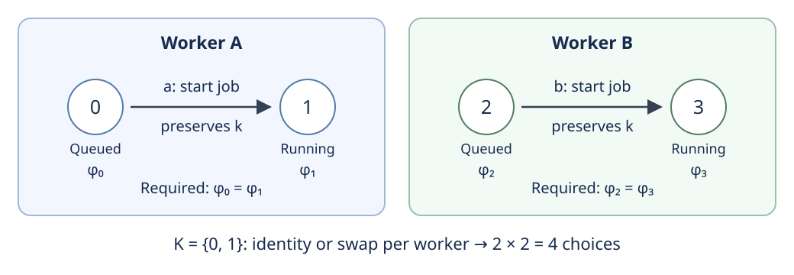

# 第7章 比較を保つ変更と情報

## 本章の概要

本章の問いは、**比較を保つ変更を、どの情報から見分け、どのように構成できるか**である。
第6章では、正規化によって表現の違いをまとめ、残った像の間で比較する方法を得た。
今度は、処理やデータの対応を保ったまま内部の設計を変える、リファクタリングの場面を考える。

たとえば、注文編集の処理から更新ロジックを共通部品へ切り出し、
一つの注文データに入っていた配送先と決済情報を、それぞれ別のデータ型に分ける。
変更後も配送先を正しく表示できるだけでは、配送先の更新時に決済情報を取り違えないことまでは分からない。
必要なのは、旧データを新しい形へ移してから更新しても、旧形式で更新してから移しても、
同じ注文状態になることである。画面の表示や呼出関係だけを比較すると、
このデータの引継ぎが確認から抜け落ちることがある。

この章では、選んだ状態や構造を一対一に対応づけられる変更を取り出し、
その対応が読取り・更新・処理の引継ぎを保つ条件を調べる。

ここには二つの仕事がある。一つは、与えられた変更が比較を保つかを**判定すること**である。
もう一つは、要約された設計への変更から、比較を保つ詳しい設計の変更を**作ること**である。
本章では、AATの正規化に対して、適合する変更を構成できても、
与えられた変更の判定には正規化で失われた情報が必要となる場合を示す。
そのうえで、適合する変更の全選択肢を群の作用によって分類する。

| 問い | 構成 | 得られるもの |
| --- | --- | --- |
| 比較を保つ変更は何か | 比較保存群と両端への射影 | 一方の変更に追随する変更の存在条件と自由度（§§7.1–7.2） |
| 観測だけで適合性を判定できるか | 観測準同型の核 | 判定に必要十分な情報の条件と、同じ観測を持つ変更の分類（§7.3） |
| 正規化後の変更を元へ持ち上げられるか | 冪等像への制限と、そのsection | 一般の判定条件、AATの生成比較に対する持ち上げの構成（§§7.4–7.6） |
| ソフトウェアの操作は変更をどう制約するか | 操作グラフの連結成分 | 操作を保つ変更の分類と個数（§§7.7–7.8） |

## 7.1 一つの比較を保つ変更

まず、処理の呼出関係が同じでも、リファクタリングで引き継ぐべきデータを壊し得ることを確かめる。
続いて、操作やadapterとの対応を保つという条件を、群としてまとめる。

**例7.1（共通部品への切出しで、引継ぎが変わる）.**
注文の配送先更新を共通部品へ切り出す。
この更新では決済区分を変えない、という条件があるとする。
決済区分の内部コード $`\{0,1\}`$ に注目して、処理を小さな状態機械へまとめる。
制御点を一つとし、更新の前後で同じ制御点に戻る操作を、名前付き自己ループ $`a`$ とする。
正しい実装 $`X`$ と、抽出先の変換処理でこのコードを反転してしまう実装 $`Y`$ を

```math
T_a^X(k)=k,\qquad T_a^Y(k)=1-k
\qquad\text{(7.1)}
```

で定める。頂点と辺だけを読むと、どちらにも同じ更新操作がある。
しかし、コード0の注文を一度更新すると、$`X`$ では0のまま、$`Y`$ では1になってしまう。
「配送先更新は決済区分を保持する」というLawを読めば、この違いを見分けられる。
呼出関係の一致に加えて、処理が引き継ぐデータの条件を読む必要がある。

同様に、変更についても、観測に残る部分が一致していて、操作やadapterとの整合性が異なることがある。
この違いを記述するため、比較を一つ固定する。

**定義7.2（比較保存群）.**
圏 $`E`$ の射 $`c:X\to Y`$ と、許容する端点変更の部分群
$`G_X\le\mathrm{Aut}_E(X)`$、$`G_Y\le\mathrm{Aut}_E(Y)`$ を取る。
$`c`$ を保つ変更の群を

```math
\Gamma_c=\{(u,v)\in G_X\times G_Y\mid vc=cu\}
\qquad\text{(7.2)}
```

とする。この等式を満たす変更を、比較に**適合する**と呼ぶ。
群の積は射の合成であり、$`u_2u_1`$ は $`u_1`$ の後に $`u_2`$ を適用する。

リファクタリングでも、新旧の状態を結ぶ適合する可逆な基準対応を一つ固定すると、
他の可逆な状態対応との差を、元の状態集合の自己同型として表せる。
§7.8では、この帰着によって読取り・操作の保存条件を自己同型の条件へ移す。

AATでは $`E=E_{\mathrm{geom}}`$ とし、第1章の二段の射影の合成を
$`\pi:E_{\mathrm{geom}}\to B`$ と書く。
全自己同型を許す場合に加え、底を固定する変更

```math
G_X^0=\ker\bigl(\mathrm{Aut}(X)\xrightarrow{\pi}
\mathrm{Aut}(\pi X)\bigr),\qquad
\Gamma_c^0=\Gamma_c\cap(G_X^0\times G_Y^0)
\qquad\text{(7.3)}
```

を用いる。無印の $`\Gamma_c`$ は、定義7.2を全端点自己同型群で用いた場合の記法である。
固定するのは変更 $`u,v`$ の底への像であり、$`\pi(c)`$ は一般の比較のままでよい。
また、底を固定する条件と係数を固定する条件は別々に指定できる。

**命題7.3（完全幾何の比較対象から得る群）.**
完全幾何の比較 $`c:X\to Y`$ に対し、式(7.3)の $`\Gamma_c^0`$ は
$`G_X^0\times G_Y^0`$ の部分群である。
恒等冪等による埋込み $`J:E_{\mathrm{geom}}\to\mathrm{Kar}(E_{\mathrm{geom}})`$ を用いると、
これは第6章の比較の圏 $`ℳ(E_{\mathrm{geom}})`$ における $`J(c)`$ の
底を固定する可逆な変更群と同型になる。この同定は両端への射影と可換する。

**証明.**
恒等対は適合し、適合する二対の積と逆も $`vc=cu`$ を満たす。
これらの演算は底の恒等写像も保つ。
$`J(X)=(X,1_X)`$ の間の射には冪等射による追加の制約がないため、
同じ端点対を、冪等完備化の射の圏における可逆な平方として読むことができる。
この対応と逆対応は端点の射を保つので、群則・射影・底の固定条件を保つ。□

一方だけを変更したとき、他方で追随できるとは限らない。
$`(u,v)`$ が比較を保つとき、$`v`$ は $`u`$ に追随するという。
追随できる場合の全候補は、比較をそのままにする変更によって記述できる。

**定理7.4（端点への射影と追随変更）.**
命題7.3と同じ完全幾何の比較と底固定群を用いる。
両端への射影 $`p_X:\Gamma_c^0\to G_X^0`$、$`p_Y:\Gamma_c^0\to G_Y^0`$ を取る。
その核はそれぞれ

```math
\ker p_X\cong T_c:=\{v\in G_Y^0\mid vc=c\},\qquad
\ker p_Y\cong S_c:=\{u\in G_X^0\mid cu=c\}
\qquad\text{(7.4)}
```

である。$`u\in G_X^0`$ に追随する $`v`$ が存在する必要十分条件は、$`u\in\mathrm{im}\,p_X`$ である。
一つの追随変更 $`v_0`$ があれば、全候補は $`T_cv_0`$ となる。
同様に、$`v\in G_Y^0`$ に追随する $`u_0`$ があれば、全候補は $`S_cu_0`$ となる。

**証明.**
第一の核は $`u=1_X`$ を式(7.2)へ代入すると得られる。第二も同様である。
$`v_0c=cu`$ から $`v_0^{-1}c=cu^{-1}`$ を得る。これと $`vc=cu`$ を使って

```math
(vv_0^{-1})c=vc\,u^{-1}=c
\qquad\text{(7.5)}
```

を得る。したがって $`v=tv_0`$、$`t=vv_0^{-1}\in T_c`$ と一意に書ける。
逆に $`t\in T_c`$ なら $`tv_0c=tcu=cu`$ である。
もう一方は $`cu_0^{-1}=v^{-1}c`$ を使えば同じ計算になる。□

非空集合に対する群作用が自由かつ推移的であるとき、その集合を群の **torsor** と呼ぶ。
つまり、二つの候補の間に、それらを移す群の元がただ一つある。
定理7.4の候補集合は、それぞれ左からの合成による $`T_c`$、$`S_c`$ のtorsorである。
一つの候補を基準に選ぶと群と同一視できるが、候補集合自体に指定された基準は要らない。

**系7.5（同型比較の変更）.**
完全幾何の比較 $`c:X\xrightarrow{\sim}Y`$ が同型なら、

```math
\Gamma_c^0=\{(u,cuc^{-1})\mid u\in G_X^0\},\qquad
\Gamma_c^0\cong G_X^0
\qquad\text{(7.6)}
```

である。任意の圏で全端点自己同型群を用いる場合にも、
比較保存群は $`u\mapsto(u,cuc^{-1})`$ によって $`\mathrm{Aut}(X)`$ と群同型になる。

**証明.**
$`vc=cu`$ は $`v=cuc^{-1}`$ と同値である。
全端点群の場合はこれで両逆と群則を得る。
完全幾何の底固定版では、
$`\pi(cuc^{-1})=\pi(c)1\pi(c)^{-1}=1`$ により、同じ対応が底固定群を保つ。□

## 7.2 同じ生成元から変更を運ぶ

第5章では、同じsourceから二つの経路と比較を構成した。
この生成元を共有していることは、両端でどの変更を組み合わせればよいかにも答える。

**定理7.6（生成された変更の適合性）.**
第5章§5.8の共通の元対象 $`S`$、二経路の終点 $`X,Y`$、生成比較 $`c:X\to Y`$ を取る。
元対象 $`S`$ の、底を固定する自己同型群を $`G_S^0`$ とする。
二経路への輸送・引き戻しが誘導する準同型を $`F_*:G_S^0\to G_X^0`$、
$`G_*:G_S^0\to G_Y^0`$ と書くと、

```math
G_*(a)c=cF_*(a)\qquad(a\in G_S^0).
\qquad\text{(7.7)}
```

さらに $`J=G_*^{-1}(T_c)`$ と置けば、独立に選んだ $`a,b\in G_S^0`$ について

```math
\bigl(F_*(a),G_*(b)\bigr)\in\Gamma_c^0
\quad\Longleftrightarrow\quad ba^{-1}\in J.
\qquad\text{(7.8)}
```

したがって、一方の変更 $`a`$ を固定したとき、他方で使えるsourceの変更は $`Ja`$ である。

**証明.**
二経路のcartesianな脚を $`q_X:X\to S`$、$`q_Y:Y\to S`$ と書く。
ここでは第5章と同じく、必要に応じてrefinement側へ写して脚を合成する。
生成時の因子化と比較の三角形は
$`q_XF_*(a)=aq_X`$、$`q_YG_*(a)=aq_Y`$、$`q_Yc=q_X`$ である。
よって式(7.7)の両辺に $`q_Y`$ を合成すると、いずれも $`aq_X`$ になる。
両辺は同じ底の射の上にある。Coreのcartesian性、次に幾何のcartesian性による
一意性を使うと、式(7.7)を得る。

式(7.7)と定理7.4より、$`G_*(b)`$ が $`F_*(a)`$ に適合することは
$`G_*(b)G_*(a)^{-1}\in T_c`$ と同値である。
準同型性から、これは式(7.8)となる。□

同じ変更を両経路へ運べば適合し、違う変更を選ぶときには残った差が $`J`$ に入る必要がある。
この説明は、生成元の表示を変えても保たれる。

**命題7.7（入力の表示変更と再生成）.**
第5章の共通の元対象からなる図式を $`(S_v,L_e,\kappa_f)`$ と書く。
$`L_e`$ は辺の射、$`\kappa_f`$ は面に指定した比較である。
各頂点で底と係数を固定する同型 $`\theta_v:S'_v\xrightarrow{\sim}S_v`$ を与え、
新しい入力を

```math
L'_e=\theta_{t(e)}^{-1}L_e\theta_{s(e)},\qquad
\kappa'_f=\theta_{t(f)}^{-1}\kappa_f\theta_{t(f)}
\qquad\text{(7.9)}
```

で作る。第4章の輸送の選択もこれらの同型を介して移し、二経路を新しい入力から構成する。
このとき、普遍性が与える端点同型
$`b_v:X'_v\xrightarrow{\sim}X_v`$、$`d_v:Y'_v\xrightarrow{\sim}Y_v`$ により

```math
\begin{aligned}
c'_v&=d_v^{-1}c_vb_v,\\
F'_*(\theta_v^{-1}a\theta_v)&=b_v^{-1}F_*(a)b_v,\\
G'_*(\theta_v^{-1}a\theta_v)&=d_v^{-1}G_*(a)d_v
\end{aligned}
\qquad\text{(7.10)}
```

となる。比較保存群、式(7.8)の残余部分群、追随変更の集合がこの対応で移る。

**証明.**
同型を介して移した辺も強いopcartesian射である。
実際、元の因子化の前後に $`\theta`$ とその逆を合成すれば、存在と一意性が移る。
引き戻しのcartesian射についても同様である。
したがって、新旧の各経路の普遍性から $`b_v,d_v`$ が一意に得られる。
両脚を $`q_X,q_Y`$ と略すと、これらは
$`q'_X=\theta^{-1}q_Xb`$、$`q'_Y=\theta^{-1}q_Yd`$ を満たす。
候補 $`d^{-1}cb`$ は新しい比較の三角形を満たすので、一意性から $`c'`$ と一致する。
二つの変更の式も新しい因子化へ代入して得られる。
辺と面の条件は式(7.9)の中間の逆が消去されることで保たれる。
最後に式(7.2)、(7.8)へ式(7.10)を代入すれば、群と候補の対応が従う。□

## 7.3 観測で見分けられるための条件

一つの比較に適合する変更を見分けるために、変更の全成分を読む必要があるとは限らない。
どの成分を忘れてよいかは、観測で恒等に見える変更を調べることで正確に述べられる。

**定義7.8（変更の観測）.**
変更の群 $`Q`$、適合する部分群 $`\Gamma\le Q`$、群準同型 $`O:Q\to R`$ を取る。
$`O(q)`$ を変更 $`q`$ の観測と呼び、

```math
K=\ker O,\qquad L=K\cap\Gamma
\qquad\text{(7.11)}
```

と置く。$`K`$ は観測に現れない全変更、$`L`$ はそのうち比較にも適合する変更である。
ここでの観測は、変更の合成を保つ写像として定めている。

**定理7.9（観測だけによる判定）.**
次の条件は同値である。

1. ある述語 $`D:R\to\{\text{真},\text{偽}\}`$ があり、すべての $`q\in Q`$ について
   $`q\in\Gamma\Longleftrightarrow D(O(q))`$ となる。
2. $`K\subseteq\Gamma`$ である。

また、常に

```math
O^{-1}(O(\Gamma))=\Gamma K
\qquad\text{(7.12)}
```

が成り立つ。$`O`$ が全射であることは仮定しない。

**証明.**
1を仮定すると、$`k\in K`$ は恒等元と同じ観測を持つ。
恒等元は $`\Gamma`$ に属するので $`k\in\Gamma`$ となり、2を得る。
逆に2を仮定し、$`D(r)`$ を $`r\in O(\Gamma)`$ と定める。
$`O(q)=O(\gamma)`$、$`\gamma\in\Gamma`$ なら
$`k=\gamma^{-1}q\in K`$ であり、$`q=\gamma k\in\Gamma`$ である。
この分解は、2を仮定しなくても式(7.12)の両包含を示す。□

ここで得たのは、適合性が観測値のみに依存するための条件である。
実際に判定プログラムを作るときには、$`D`$ の計算方法も必要となる。

**命題7.10（同じ観測の中に残る違い）.**
$`\gamma\in\Gamma`$ に対し、観測のfiberとその適合部分は

```math
O^{-1}(O(\gamma))=\gamma K,\qquad
O^{-1}(O(\gamma))\cap\Gamma=\gamma L
\qquad\text{(7.13)}
```

である。左剰余類集合 $`K/L=\{kL\mid k\in K\}`$ に基点 $`L`$ を指定すると、

```math
\gamma k\in\Gamma\quad\Longleftrightarrow\quad kL=L.
\qquad\text{(7.14)}
```

したがって $`K/L`$ が一点であることと、定理7.9の判定条件は同値である。

**証明.**
観測の一致は $`\gamma^{-1}q\in K`$ と同値である。
さらに $`\gamma\in\Gamma`$ より、$`\gamma k\in\Gamma`$ は $`k\in\Gamma`$ と同値となる。
これが式(7.13)、(7.14)を与える。
剰余類集合が一点であることは $`K=L`$、すなわち $`K\subseteq\Gamma`$ と同値である。□

$`L`$ は $`\Gamma`$ の正規部分群だが、$`K`$ の正規部分群とは限らない。
したがって、ここで必要なのは基点を持つ剰余類の集合である。

**系7.11（係数だけを読む場合）.**
完全幾何の同型比較 $`c:X\xrightarrow{\sim}Y`$ を固定する。
両端で底を固定する群から、係数成分を読む準同型を
$`o_X:G_X^0\to\mathrm{Aut}(k_X)`$、$`o_Y:G_Y^0\to\mathrm{Aut}(k_Y)`$ とする。
比較の係数同型を $`\kappa:k_X\xrightarrow{\sim}k_Y`$ と書く。
共役 $`T(u)=cuc^{-1}`$ は
$`o_Y(T(u))=\kappa o_X(u)\kappa^{-1}`$ を満たす。
$`K_X=\ker o_X`$、$`K_Y=\ker o_Y`$、$`O=o_X\times o_Y`$ とすると、

```math
\begin{gathered}
K=K_X\times K_Y,\qquad L=\{(a,T(a))\mid a\in K_X\},\\
K/L\xrightarrow{\sim}K_Y,\qquad [(a,b)]\longmapsto bT(a)^{-1}.
\end{gathered}
\qquad\text{(7.15)}
```

最後の対応は基点を単位元へ送る集合の全単射である。
係数観測だけで比較への適合性を判定できる必要十分条件は $`K_Y=\{1\}`$ である。

**証明.**
係数写像の合成則と系7.5から、$`T`$ は $`K_X\cong K_Y`$ を与え、$`L`$ はそのグラフになる。
剰余類の代表を $`(a,b)(x,T(x))`$ へ変えても、
$`bT(x)T(ax)^{-1}=bT(a)^{-1}`$ なので式(7.15)は定義できる。
逆は $`y\mapsto[(1,y)]`$ である。
実際、$`(a,b)(a^{-1},T(a)^{-1})=(1,bT(a)^{-1})`$ であり、両合成は恒等になる。
判定条件は命題7.10から従う。□

この剰余類集合を商群として扱えない場合は具体的にも生じる。
$`K_X=K_Y=S_3`$（三点の置換群）、$`T=\mathrm{id}`$ なら $`L`$ は対角部分群である。
$`s=(12)`$、$`t=(23)`$ に対し、
$`(s,1)(t,t)(s,1)^{-1}=(sts^{-1},t)`$ は対角に属さない。
式(7.15)の全単射は、この場合にも成立する。

命題7.7のように入力表示を移すと、端点群と係数群の共役が観測準同型と可換する。
したがって $`K,L`$ と基点付き剰余類も対応する。
表示を変更して再生成しても、観測から適合性を判定できるかという結論は変わらない。

## 7.4 正規化への制限、反映、持ち上げ

正規化を観測として使うときには、三つの性質を分けて調べる。
元で適合する変更が像でも適合することを**保存**、像での適合性から元での適合性が従うことを
**反映**と呼ぶ。像で与えられた適合変更の元を作ることが**持ち上げ**である。

**命題7.12（関手による比較の保存）.**
関手 $`F:E\to D`$ と比較 $`c:X\to Y`$ は準同型

```math
\begin{gathered}
r_F:\mathrm{Aut}(X)\times\mathrm{Aut}(Y)
\longrightarrow\mathrm{Aut}(FX)\times\mathrm{Aut}(FY),\\
(u,v)\longmapsto(Fu,Fv)
\end{gathered}
\qquad\text{(7.16)}
```

を誘導し、$`r_F(\Gamma_c)\subseteq\Gamma_{F(c)}`$ となる。
第6章のcore正規化関手 $`\mathcal N`$ にこれを適用すると、任意の比較の保存が得られる。
さらに、定理6.21の底への射影の等式 $`\pi_N\mathcal N=\pi`$ によって、
底を固定する比較保存群の間にも準同型を得る。
命題6.22により、完全幾何の正規化関手にも同じことが成り立つ。

**証明.** 関手は同型、恒等、合成を保つので、式(7.16)は準同型である。
$`vc=cu`$ に $`F`$ を適用すれば保存が従う。
底の等式を $`u,v`$ に適用すれば、底を固定する条件も保たれる。□

別に、任意の圏で冪等射を指定した場合にも制限を作れる。
この場合は、正規化と交換する変更を始域に選ぶ。

**構成7.13（冪等像への制限）.**
射 $`c:X\to Y`$ と冪等射 $`e:X\to X`$、$`d:Y\to Y`$ に $`dc=ce`$ を仮定する。
中心化群と像の比較を

```math
\begin{aligned}
C_e&=\{u\in\mathrm{Aut}(X)\mid ue=eu\},\quad
C_d=\{v\in\mathrm{Aut}(Y)\mid vd=dv\},\\
H&=C_e\times C_d,\qquad
a=dce:(X,e)\longrightarrow(Y,d)
\end{aligned}
\qquad\text{(7.17)}
```

とする。$`a`$ は $`\mathrm{Kar}(E)`$ の射である。制限は

```math
\begin{gathered}
r:H\longrightarrow\mathrm{Aut}_{\mathrm{Kar}(E)}(X,e)
\times\mathrm{Aut}_{\mathrm{Kar}(E)}(Y,d),\\
r(u,v)=(eue,dvd)
\end{gathered}
\qquad\text{(7.18)}
```

で与えられる。
$`eue`$ の逆は $`eu^{-1}e`$ であり、両合成は $`(X,e)`$ の恒等射 $`e`$ になる。
交換条件によって、制限は積も保つ。
$`\Gamma_0=H\cap\Gamma_c`$、$`\Delta=\Gamma_a`$ と置けば、$`r(\Gamma_0)\subseteq\Delta`$ である。
実際、$`vc=cu`$ を冪等射ではさみ、$`ue=eu`$、$`vd=dv`$ を使えばよい。

命題7.12は正規化関手が定義されている全自己同型を扱い、構成7.13は中心化群を扱う。
第6章の正規化関手では、中心化する変更上で二つの準同型は一致する。

定理7.9では、観測された適合変更の集合への所属を判定に使えた。
ここでは、像側の適合部分群が独立に定まっている。
そのため核の条件に加え、実際に到達できる像側の適合変更が、
元で適合する変更から得られることも必要になる。次の定理の第二条件がこれを表す。

**定理7.14（反映と持ち上げの一般判定）.**
群準同型 $`r:H\to R`$、部分群 $`\Gamma_0\le H`$、$`\Delta\le R`$ に
$`r(\Gamma_0)\subseteq\Delta`$ を仮定する。このとき

```math
r^{-1}(\Delta)=\Gamma_0
\quad\Longleftrightarrow\quad
\begin{cases}
\ker r\subseteq\Gamma_0,\\
r(\Gamma_0)=\Delta\cap\mathrm{im}\,r.
\end{cases}
\qquad\text{(7.19)}
```

制限準同型を $`\bar r:\Gamma_0\to\Delta`$、その核を $`L=\ker\bar r`$ とする。
$`\delta\in\Delta`$ の適合する持ち上げは、$`\delta\in r(\Gamma_0)`$ のとき、かつそのときに限り存在する。
一つを $`\gamma_0`$ とすると、すべての適合する持ち上げは

```math
\bar r^{-1}(\delta)=\gamma_0L
\qquad\text{(7.20)}
```

であり、右からの乗法による $`L`$ のtorsorとなる。
$`\bar r`$ が全射なら、包含 $`L\hookrightarrow\Gamma_0`$ により短完全列

```math
1\longrightarrow L\longrightarrow\Gamma_0
\xrightarrow{\bar r}\Delta\longrightarrow1
\qquad\text{(7.21)}
```

を得る。ここで短完全とは、最初の写像が単射、その像が次の写像の核であり、最後の写像が全射であることをいう。
$`\bar r\sigma=\mathrm{id}_\Delta`$ を満たす群準同型 $`\sigma:\Delta\to\Gamma_0`$ があるとき、
この列は分裂すると呼び、$`\sigma`$ をsectionと呼ぶ。

**証明.**
反映が成立すれば、単位元の原像は $`\Gamma_0`$ に入り、
$`\Delta`$ に属する $`r`$ の像はすべて $`\Gamma_0`$ から来る。
逆に右辺を仮定し、$`r(q)\in\Delta`$ とする。
像の条件から $`r(\gamma)=r(q)`$ となる $`\gamma\in\Gamma_0`$ が存在し、
$`\gamma^{-1}q\in\ker r\subseteq\Gamma_0`$ より $`q\in\Gamma_0`$ となる。

持ち上げ $`\gamma_0,\gamma`$ の観測が同じなら、$`\gamma_0^{-1}\gamma\in L`$ である。
よって式(7.20)を得る。右作用は $`(\gamma\ell_1)\ell_2=\gamma(\ell_1\ell_2)`$ を満たし、
二つの持ち上げの間の元は $`\gamma_0^{-1}\gamma`$ と一意に定まる。
短完全性は核の定義と全射性そのものである。□

持ち上げの自由度を表すのは $`L=\ker\bar r`$ である。
一方、適合性の反映を妨げるのは、全端点変更の核 $`\ker r`$ のうち $`\Gamma_0`$ に入らない元である。
この二つを、次の例で見分けられる。

**例7.15（反映が失われても持ち上げは存在する）.**
有限集合の圏で $`X=Y=\{0,1,2\}`$、$`c=1_X`$、$`e=d`$ を定値写像 $`x\mapsto0`$ とする。
置換 $`\tau=(12)`$ は $`e`$ と交換するが、端点対 $`(\tau,1)`$ は恒等比較を保たない。
像は一元集合なので、制限後には両端とも恒等となり、像の比較を保つ。
像の比較保存群は自明群だから、その唯一の元は $`(1,1)`$ に持ち上がる。
さらに $`(\tau,\tau)`$ も同じ元への適合する持ち上げである。

**例7.16（像の変更が持ち上がらない場合）.**
同じ三点集合と $`c=1_X`$ を用い、今度は

```math
e(0)=0,\qquad e(1)=1,\qquad e(2)=1,
\qquad d=e
\qquad\text{(7.22)}
```

とする。像 $`\{0,1\}`$ の両端で0と1を交換すれば、像の恒等比較を保つ。
しかし、$`e`$ と交換する置換 $`u`$ は、$`e^{-1}(0)`$ と $`e^{-1}(u(0))`$ を全単射で対応させる。
前者の要素数は1、$`e^{-1}(1)`$ の要素数は2なので、$`u(0)=1`$ とはできない。
$`e^{-1}(2)`$ は空なので、$`u(0)=2`$ ともできない。
したがって、この像の交換には中心化群内の持ち上げがない。

これらの例から、保存、反映、持ち上げの存在には、それぞれの証明が必要だと分かる。
次節では、AATの対象形成と正規化の具体的な形を使い、持ち上げを構成する。

## 7.5 完全幾何で持ち上げを構成する

一般の冪等射には、例7.16のように大きさの違うfiberがあり得る。
AATのcanonicalな正規化では、対象はconfigurationと、それに付随する構造データに分かれる。
この共通の形を使うと、正規化像で与えられた変更を、元の対象全体へ一貫して延長できる。

本節では、完全幾何 $`G`$ のcore $`P`$ が定義5.39の $`\mathrm{Ad}(P)`$ を満たすとする。
すなわち、正規化で方程式残差、invariant、signatureの座標が変わらず、
operationの型の同一視がconfiguration写像を保つ。
この仮定を満たす完全幾何の充満部分圏を $`\mathcal A`$ と書く。
第6章の正規化関手を
$`\mathcal N:\mathcal A\to\mathrm{Kar}(\mathcal A)`$、
$`\mathcal N(G)=(G,N_G)`$、$`\mathcal N(f)=fN_G`$ として用いる。

### 対象の付随データを運ぶ

**構成7.17（選択対象を保つ延長）.**
第1章のarchitecture object $`A`$ を、configuration $`C_A`$ と付随データ
$`(S_A,Q_A,s_A,q_A)`$ に分ける。全付随データの集合を、必要な大きさの宇宙で

```math
D=\coprod_{S,Q\in𝕌}(S\times Q)
\qquad\text{(7.23)}
```

と書く。$`S,Q`$ という型自体もデータに含めるので、対象全体は $`\mathcal C\times D`$ と一対一に対応する。
ここで $`\mathcal C`$ はconfigurationの集合である。
Coreが選ぶ対象を $`s_P(C)=(C,d_C)`$ と書き、$`D`$ の基準元 $`d_*`$ を一つ固定する。
一元集合二つとそれぞれの元を使えば、そのような $`d_*`$ が得られる。

$`\theta_C`$ を $`d_C`$ と $`d_*`$ を交換する置換とする。
両者が等しい場合には恒等を用いる。すると

```math
\theta_C^2=1,\qquad \theta_C(d_C)=d_*,\qquad
\theta_C(d_*)=d_C.
\qquad\text{(7.24)}
```

正規化像の自己同型 $`a`$ のAtom成分を $`\sigma`$ とし、configurationの輸送を $`\sigma C`$ と略す。
単に $`(C,d)\mapsto(\sigma C,d)`$ とすると、選択対象 $`(C,d_C)`$ は $`(\sigma C,d_C)`$ に移り、
移動先の選択対象 $`(\sigma C,d_{\sigma C})`$ と一致するとは限らない。
そこで出発点と到着点の二つの交換を組み合わせ、対象全体への延長を

```math
\widehat a(C,d)=
\bigl(\sigma C,\theta_{\sigma C}\theta_C(d)\bigr)
\qquad\text{(7.25)}
```

と定める。まず出発点の選択値を共通の基準へ揃え、移動先で選択値へ戻す形である。
したがって $`\widehat a(s_P(C))=s_P(\sigma C)`$ であり、対象形成を保つ。
同じ式は、Atomの自己写像に対しても定義できる。

この作り方では、変更を続けて行うと中間の置換が消える。
Atom成分 $`\sigma,\rho`$ に対応する二つの延長について

```math
\theta_{\rho\sigma C}\theta_{\sigma C}
\theta_{\sigma C}\theta_C
=\theta_{\rho\sigma C}\theta_C.
\qquad\text{(7.26)}
```

よって対象写像は恒等と合成を保つ。
選択した対象だけでなく、すべての付随データに対してこの等式が成立することが、
群準同型としての持ち上げを得る理由である。

### 操作と幾何の成分を延長する

**補題7.18（完全幾何の自己同型のsection）.**
任意の $`G\in\mathcal A`$ に対し、群準同型

```math
\sigma_G:\mathrm{Aut}(\mathcal N G)\longrightarrow\mathrm{Aut}(G),
\qquad \mathcal N(\sigma_G(a))=a
\qquad\text{(7.27)}
```

が存在する。このsectionは底と係数成分を保持し、その値は $`N_G`$ と交換する。

**証明.**
正規化像の射を、元の圏の射 $`f:G\to G`$、$`N_GfN_G=f`$ で表す。
対象には構成7.17を用いる。第6章の対象正規化を $`n=n_P`$ と略記し、operationの型の同一視を
$`\nu_{A,B}:\mathrm{Op}(A,B)\xrightarrow{\sim}\mathrm{Op}(nA,nB)`$ と書く。
型の等式に沿うこれらの同一視は、選択対象上では恒等となり、連続する同一視の合成と整合する。
対象形成から $`f(nA)=n\widehat f(A)`$ であるので、operationへの作用を

```math
S_G(f)_{A,B}^{\mathrm{op}}
=\nu_{\widehat f(A),\widehat f(B)}^{-1}
\,f_{nA,nB}^{\mathrm{op}}\,\nu_{A,B}
\qquad\text{(7.28)}
```

と定める。中間の対象の同一視には、上の対象形成の等式を用いる。
これは、出発点で正規化し、与えられた射を適用してから、延長先の型へ戻す写像である。
$`\nu`$ と $`f`$ はそれぞれconfigurationの作用を保つので、この合成も保つ。

Atom、文脈、方程式添字、invariant添字、軸とその値域の写像には $`f`$ の成分を使う。
方程式残差の保存は、出発点で $`A`$ を $`nA`$ に置き換え、$`f`$ の保存則を適用し、
到着点で $`n\widehat f(A)`$ を $`\widehat f(A)`$ に戻すことで従う。
Invariantsとsignatureの座標にも同じ三段の計算を行う。
底と係数、被覆・overlap、support・軸・observableの局所写像は $`f`$ のものを保持する。
これらが参照するAtomと文脈の写像は変わらないため、raw systemの等式と局所制限の可換性も保たれる。
したがって、$`S_G(f)`$ は完全幾何の射になる。

対象では式(7.26)、operationでは式(7.28)の中間の $`\nu\nu^{-1}`$ の消去によって、
正規化像の自己射 $`f,g`$ に対し

```math
S_G(N_G)=1_G,\qquad
S_G(gf)=S_G(g)S_G(f),\qquad
S_G(f)N_G=N_GS_G(f)=f
\qquad\text{(7.29)}
```

を得る。最後の等式では、$`f=N_GfN_G`$ により $`fN_G=N_Gf=f`$ となることも用いる。
他の成分は $`f,g`$ から保持しているので、同じ等式を満たす。
特に、正規化像の自己同型の両向きの射に $`S_G`$ を適用すると、両合成は $`1_G`$ となる。
これを $`\sigma_G`$ とすれば、式(7.27)と群準同型性を得る。
底・係数の保持は構成から、$`N_G`$ との交換は式(7.29)から従う。□

### 比較を保つように両端を組み合わせる

比較の両端で別々に作ったsectionが、その比較と整合するとは限らない。
そこで、片側だけを持ち上げ、他方は元の比較による共役で決める。

**定理7.19（同型比較の適合する持ち上げ）.**
$`X,Y\in\mathcal A`$ と同型 $`c:X\xrightarrow{\sim}Y`$ を取る。
命題7.12の制限
$`\bar r_N:\Gamma_c\to\Gamma_{\mathcal N(c)}`$ は、section

```math
\sigma_c(a,b)=\bigl(\sigma_X(a),\ c\sigma_X(a)c^{-1}\bigr)
\qquad\text{(7.30)}
```

を持つ。両端の底・係数成分は、与えられた $`a,b`$ の成分と一致する。
したがって、底を固定する部分群への制限もsectionを持つ。

**証明.**
第二成分を共役で作ったので、式(7.30)は元の比較 $`c`$ を保つ。
第一成分の正規化は $`a`$ である。
$`(a,b)\in\Gamma_{\mathcal N(c)}`$ と関手性から、第二成分の正規化は

```math
\mathcal N(c)\,a\,\mathcal N(c)^{-1}=b
\qquad\text{(7.31)}
```

となる。これで $`\bar r_N\sigma_c=\mathrm{id}`$ を得る。
第一成分のsectionも共役も群準同型なので、$`\sigma_c`$ は群準同型である。
正規化は底・係数成分を変更しないため、第二成分についても式(7.31)から保持が従う。□

## 7.6 生成比較に残る情報と、すべての持ち上げ

Sectionがあれば、正規化後の適合変更から元の適合変更を作れる。
しかし、それと同じ正規化後の値を持つ変更が、すべて適合するとは限らない。
この違いは、AATの対象全体に実際の自己同型を作ることで確かめられる。

**構成7.20（正規化に現れない非恒等変更）.**
$`G\in\mathcal A`$ とし、構成7.17の表示 $`(C,d)`$ を使う。
$`D`$ には少なくとも三つの異なる元がある。
たとえば $`S=\{0,1,2\}`$、$`Q=\{*\}`$ を固定し、構造の値 $`s=0,1,2`$ を使えばよい。
各 $`C`$ で、選択値 $`d_C`$ と異なる二つを選び、それらを交換する置換を $`\rho_C`$ とする。
対象写像

```math
\tau_G(C,d)=(C,\rho_C(d))
\qquad\text{(7.32)}
```

はconfigurationとすべての選択対象を固定し、二回適用すると恒等になる。
たとえば、coreが指定するconfigurationには交換される二対象があるため、この写像は非恒等である。

この写像は完全幾何の自己同型へ延長できる。
Operationには $`\nu_{\tau_G A,\tau_G B}^{-1}\nu_{A,B}`$ を用い、
Atom・底・文脈・方程式添字・invariant添字・軸・係数・局所幾何の写像には恒等を使う。
両対象の正規化が一致するので、補題7.18と同じ正規化を介した計算で保存条件が従う。
付随データの交換とoperationの型の同一視は二回で戻る。したがって

```math
\begin{gathered}
\tau_G\ne1_G,\qquad \tau_G^2=1_G,\\
N_G\tau_G=\tau_GN_G=N_G,\qquad
\mathcal N(\tau_G)=1_{\mathcal N G}.
\end{gathered}
\qquad\text{(7.33)}
```

この変更は、底と係数を固定する。
対象の区別を動かしている一方、Adで正規化を通して読まれる成分には現れない。

**定理7.21（生成比較の識別と持ち上げ）.**
構成5.37の共通入力を固定する。有限codeで実現した平方、各頂点のcoreと強い辺、
面の終点と底の二道の条件、指定比較、選んだ面、係数と元の完全幾何から、
完全幾何の標準比較 $`\alpha:X\xrightarrow{\sim}Y`$ を生成する。
Source coreにAdを仮定し、両端のcanonicalな正規化を用いる。
第6章の補題6.15と定理6.16により、両端もAdを満たし、
$`N_Y\alpha=\alpha N_X`$ である。

$`\Gamma=\Gamma_\alpha`$、$`\Delta=\Gamma_{\mathcal N(\alpha)}`$、
$`r_N`$ を全端点群上の準同型、$`L=\ker(r_N|_\Gamma)`$ とする。このとき、

1. $`r_N|_\Gamma`$ はsection $`\sigma_\alpha`$ を持ち、後掲の式(7.34)の分裂短完全列を得る。
2. 任意の $`\delta\in\Delta`$ に対し、適合する持ち上げ全体は
   $`\sigma_\alpha(\delta)L`$ であり、右 $`L`$-torsorとなる。
3. 全端点群には、同じ正規化後の値 $`\delta`$ を持つ不適合な変更も存在する。
   したがって、$`\alpha`$ への適合性は正規化後の値だけからは判定できない。

```math
1\longrightarrow L\longrightarrow\Gamma
\xrightarrow{\bar r_N}\Delta\longrightarrow1
\qquad\text{(7.34)}
```

これらは、両端で底を固定する群についても成り立つ。

**証明.**
1と2は定理7.19と7.14から従う。
3のため $`q_-=(\tau_X,1_Y)`$ と置く。構成7.20から $`r_N(q_-)=1`$ である。
もし $`q_-\in\Gamma`$ なら $`\alpha=\alpha\tau_X`$ となり、
$`\alpha`$ の可逆性から $`\tau_X=1_X`$ という矛盾を得る。
したがって

```math
q_+=\sigma_\alpha(\delta),\qquad
q_{\mathrm{bad}}=\sigma_\alpha(\delta)q_-
\qquad\text{(7.35)}
```

は同じ値 $`\delta`$ を持ち、前者だけが適合する。
後者も適合すれば、その差 $`q_-`$ が部分群 $`\Gamma`$ に入ってしまう。
Sectionは底成分を保持し、$`q_-`$ は底を固定するので、同じ証明が底固定版にも適用できる。□

係数だけを読む場合にも、構成7.20が実際の不適合対を与える。
$`(\tau_X,\alpha\tau_X\alpha^{-1})`$ は適合し、$`(\tau_X,1_Y)`$ は適合しないが、
両対の底と係数の観測は同じ恒等対である。したがって、系7.11の情報損失は、
同じ入力から生成した完全幾何の比較でも生じている。

**系7.22（診断による正規化の選択）.**
構成5.37の共通入力と同じ図式のcochainを取り、構成5.40の選択条件を $`\chi`$ と書く。
第6章の記法で $`\beta=d\alpha=\alpha e`$ とし、$`e,d`$ と交換する端点変更の群を $`H`$ とする。
構成7.13の制限は、$`\Gamma_\alpha\cap H`$ から像の比較保存群
$`\Gamma_{\beta:(X,e)\to(Y,d)}`$ へのsectionを持つ。
この制限による $`\alpha`$ への適合性の保存・反映は、次のとおりである。

| 正規化 | 比較の保存 | $`\alpha`$ への適合性の反映 | 像の適合変更の持ち上げ |
| --- | --- | --- | --- |
| $`\chi`$ が偽、$`e=1_X,d=1_Y`$ | 成立 | 成立 | Sectionがある |
| $`\chi`$ が真、$`e=N_X,d=N_Y`$ | 成立 | 不成立 | Sectionがある |
| Adの下でcanonical正規化を直接選ぶ | 成立 | 不成立 | Sectionがある |

各行は、底を固定する部分群でも成立する。

**証明.**
選択条件が偽なら恒等冪等への制限なので、元の比較群と同じ群になる。
真の場合には、定理6.16によって $`e=N_X,d=N_Y`$ である。
補題7.18の $`\sigma_X(a)`$ は $`N_X`$ と交換する。
$`\alpha N_X=N_Y\alpha`$ より、共役 $`\alpha\sigma_X(a)\alpha^{-1}`$ も $`N_Y`$ と交換する。
したがって式(7.30)は $`H`$ 内のsectionを与える。
反映の失敗は、$`H`$ にも属する $`(\tau_X,1_Y)`$ から従う。
Canonical正規化を直接選ぶ場合も同じ証明である。底の条件は全構成で保持される。□

ここで反映していないのは、正規化前の $`\alpha`$ への適合性である。
中心化群 $`H`$ 上では、像で $`\beta`$ を保つことは、元の圏の射として $`\beta`$ を保つことと同値であり、

```math
r^{-1}\bigl(\Gamma_{\beta:(X,e)\to(Y,d)}\bigr)
=H\cap\Gamma_{\beta:X\to Y}
\qquad\text{(7.36)}
```

となる。実際、$`d\beta=\beta=\beta e`$ と中心化条件により、
像での等式 $`(dvd)\beta=\beta(eue)`$ は $`v\beta=\beta u`$ に簡約される。
正規化は、元の比較を保つ条件の一部を忘れた比較へ移している。

## 7.7 操作のつながりによる変更の分類

これまでの分類をソフトウェアの操作へ戻す。
状態の一部を変えずに運ぶ操作は、読取りには見えない変更を互いに結びつける。
lensの更新と、内部状態を保持して進むプロトコルは、この同じ形を持つ。

**定義7.23（隠れ状態を保持する操作系）.**
有向多重グラフ $`Q=(V,E,s,t)`$、集合 $`K`$、許容する可視変更群
$`H\le\mathrm{Aut}(Q)`$ を取る。
グラフの自己同型 $`u`$ は、頂点の置換 $`u_V`$ と名前付き辺の置換 $`u_E`$ からなり、
始点・終点を保つものとする。状態、観測、各辺の操作を

```math
S=V\times K,\qquad o(v,k)=v,\qquad
T_e(s(e),k)=(t(e),k)
\qquad\text{(7.37)}
```

と定める。$`K`$ は操作によって変化しない内部状態である。
可視変更 $`u\in H`$ に追随する状態変更は、全単射 $`h:S\xrightarrow{\sim}S`$ で
$`oh=u_Vo`$ を満たすものとする。
さらに名前付き操作を保つ条件は、各辺の始点のfiber上で $`hT_e=T_{u_E(e)}h`$ である。
辺の向きや名前は、この等式の入力として保持する。

読取りに追随する組 $`(u,h)`$ 全体の群を $`B_Q`$、
そのうち名前付き操作も保つ部分群を $`A_Q`$ と書く。
変更の観測は、可視射影 $`(u,h)\mapsto u`$ である。
これらが定理7.9の変更全体・適合する変更・観測に対応する。
以下では、操作を保つ条件がどの頂点間に伝わるかを調べ、この部分群を具体的に求める。

**定理7.24（操作保存と連結成分）.**
固定した $`u`$ に追随する状態変更は、頂点ごとの置換（$`\mathrm{Sym}(K)`$ は $`K`$ の置換全体の群）を使って一意に

```math
h(v,k)=(u_V(v),\phi_v(k)),\qquad \phi_v\in\mathrm{Sym}(K)
\qquad\text{(7.38)}
```

と書ける。操作を保つ必要十分条件は

```math
\phi_{s(e)}=\phi_{t(e)}\qquad(e\in E)
\qquad\text{(7.39)}
```

である。したがって、操作を保つ変更は、向きを忘れた連結成分の集合 $`\pi_0(Q)`$ ごとに
一つの置換を選ぶことと一対一に対応する。

**証明.**
観測の条件により、$`h`$ は $`\{v\}\times K`$ を $`\{u_V(v)\}\times K`$ へ送る。
逆写像も対応するfiberへ戻るので、第二成分は置換 $`\phi_v`$ になる。
操作保存の両辺を $`(s(e),k)`$ で評価すると、第一成分はいずれも $`u_V(t(e))`$ であり、
第二成分はそれぞれ $`\phi_{t(e)}(k)`$、$`\phi_{s(e)}(k)`$ となる。
これで式(7.39)を得る。

頂点間の関係 $`s(e)\sim t(e)`$ が生成する同値関係で $`V`$ を割ったものが $`\pi_0(Q)`$ である。
式(7.39)は反射・対称・推移の各操作で保たれるため、置換族はこの商へ一意に降りる。
逆に、連結成分ごとの置換族は頂点へ引き戻せば式(7.39)を満たす。□

辺の操作が内部状態をそのまま運ぶため、両端では同じ置換が必要になる。
連結成分は、この等式が辺の向きによらず伝わる範囲を表す。

**定理7.25（分裂短完全列と変更の自由度）.**
操作を保つ変更の群 $`A_Q`$ から可視変更への射影を $`p:A_Q\to H`$ とする。
合成は $`(u,h)(u',h')=(uu',hh')`$ であり、式(7.38)の族では

```math
(\phi\star\phi')_v=\phi_{u'_V(v)}\phi'_v
\qquad\text{(7.40)}
```

となる。$`M_Q=\prod_{j\in\pi_0(Q)}\mathrm{Sym}(K)`$ と置くと、分裂短完全列

```math
1\longrightarrow M_Q\longrightarrow A_Q
\xrightarrow{p}H\longrightarrow1
\qquad\text{(7.41)}
```

を得る。Sectionは $`\sigma(u)=(u,h_u)`$、$`h_u(v,k)=(u_V(v),k)`$ である。
各 $`u\in H`$ 上の変更の集合は $`M_Q`$ の右torsorとなる。
有限な $`V,K`$ について、その個数は

```math
|p^{-1}(u)|=(|K|!)^{|\pi_0(Q)|}
\qquad\text{(7.42)}
```

である。

**証明.**
観測と操作の等式は合成・逆で保たれるので、$`A_Q`$ は群になる。
$`u=1`$ のfiberは定理7.24によって $`M_Q`$ と群同型である。
$`\sigma(u)`$ は操作を保ち、$`\sigma(uu')=\sigma(u)\sigma(u')`$、$`p\sigma=\mathrm{id}`$ なので短完全列は分裂する。
各fiberの右torsor構造は定理7.14を $`p`$ に適用して得る。
定理7.24の置換族を数えれば式(7.42)となる。□

**系7.26（選択状態を保つ版）.**
$`k_0\in K`$ を固定し、$`s_0(v)=(v,k_0)`$ を選択状態とする。
$`hs_0=s_0u_V`$ も要求する場合、各連結成分の置換を
$`\mathrm{Sym}(K)_{k_0}=\{\phi\mid\phi(k_0)=k_0\}`$ に制限する。
この置換族と各fiberの全単射、分裂短完全列、核による右torsorを得る。
Sectionは内部状態を変えない同じ $`\sigma(u)`$ である。
有限な場合、各fiberの個数は $`((|K|-1)!)^{|\pi_0(Q)|}`$ となる。

**証明.** 式(7.38)を $`(v,k_0)`$ で評価すると、追加条件は $`\phi_v(k_0)=k_0`$ である。
恒等な隠れ状態の作用はこの条件を満たすので、同じsectionが使える。□

この分類を使って、可視変更だけで操作保存を判定できる条件を求める。
読取りに追随する変更の群 $`B_Q`$ の可視射影の核は
$`\prod_{v\in V}\mathrm{Sym}(K)`$ であり、その中で操作を保つ部分は $`M_Q`$ である。
したがって定理7.9より、可視変更だけから操作保存を判定できるのは、この二つが一致するときである。
異なる頂点を結ぶ辺があり、$`K`$ に二つ以上の元があれば、その両端で違う置換を選ぶと反例になる。
操作を読むことで、可視射影が忘れた制約が現れる。

## 7.8 lensとプロトコルへの帰結

第1章では、lensとプロトコルの状態・操作・意味保存射を独立に定義し、
対象の役割と型付き操作を持つAATの構成へ対応づけた。
ここでは、リファクタリングの前後を結ぶ一対一の状態対応に、その構成を使う。

変更前後の状態を $`C,C'`$、読取りを $`g,g'`$、操作を $`T_e,T'_e`$ と書く。
Viewと操作名を固定すると、状態対応 $`h:C\xrightarrow{\sim}C'`$ に要求するのは、
$`g'h=g`$ と $`hT_e=T'_eh`$ である。
前者は読取り結果の一致、後者は「変換してから操作」と「操作してから変換」の一致を表す。

適合する対応 $`h_0`$ が一つ得られた場合、他の対応は
$`a=h_0^{-1}h\in\mathrm{Sym}(C)`$ を使って $`h=h_0a`$ と一意に書ける。
すると読取りの条件は $`ga=g`$、操作の条件は $`aT_e=T_ea`$ となる。
実際、$`h_0aT_e=T'_eh_0a=h_0T_ea`$ の左から $`h_0^{-1}`$ を合成すればよい。
このように基準となる対応を介して前後の状態を同じ形で表せば、
前節の自己同型群は、リファクタリングで残る状態対応の選択肢を分類する。

### lens：全域更新がすべてのviewを結ぶ

**命題7.27（積lensの変更）.**
基準view $`v_0\in V`$ と有限集合 $`K`$ を固定し、同じ積lens
$`C=V\times K`$ の自己変更を考える。
可視置換 $`u:V\xrightarrow{\sim}V`$ を一つ固定する。
全単射 $`h:C\xrightarrow{\sim}C`$ の保存条件は

```math
gh=ug,\qquad h(p(c,w))=p(h(c),u(w))
\qquad\text{(7.43)}
```

である。頂点をview、各順序対 $`(v,w)`$ を更新の名前付き辺とするグラフでは、
これらの変更は、可視置換 $`u`$ に追随し、全名前付き操作を保つ状態変更と全単射に対応する。
各変更には一意な置換 $`\phi\in\mathrm{Sym}(K)`$ があり、

```math
h(v,k)=(u(v),\phi(k))
\qquad\text{(7.44)}
```

となる。逆に、この式は任意の $`\phi`$ から変更を作る。
したがって、固定した可視置換に追随する変更は $`|K|!`$ 個である。

**証明.**
積lensの読取りは第一成分であり、名前付き辺 $`(v,w)`$ は
$`(v,k)`$ を $`(w,k)`$ へ送る。二つの保存条件をそれぞれの型で読むと、
追随する状態変更の条件になる。
全順序対の更新を保つことから、各viewの隠れた置換は基準viewの置換に一致する。
これが式(7.44)であり、基準viewで評価すると一意性も得られる。
逆に $`u\times\phi`$ は両保存式を満たす。
この両逆から、変更の集合と $`\mathrm{Sym}(K)`$ の全単射および個数を得る。□

選択sectionを $`s_0(v)=(v,k_0)`$ と固定した場合、
$`hs_0=s_0u`$ は各fiberの置換が $`k_0`$ を固定する条件と同値である。

**例7.28（配送先編集を分離しても、決済データを引き継ぐ）.**
冒頭のリファクタリングで、配送先の編集処理と決済データの保持を分ける。
変更前の `Order(address, payment)` を、変更後の `OrderDetails(address)` と
`PaymentDetails(payment)` の組へ移す。この詰め替えが基準となる状態対応である。
配送先を $`V=\{0,1\}`$、表示しない決済データの内部コードを $`K=\{0,1,2\}`$ とする。
View 0と1は自宅と職場の二つの配送先、$`k_0=0`$ は決済データの未設定値を表す。
新旧のコードの対応も変更案の一部とし、未設定値0の対応は固定する。
読取りは配送先を返し、更新は配送先だけを書き換えて決済データを引き継ぐ積lensである。

可視変更を恒等に固定し、前後の状態を同じ積表示に揃える。
配送先の読取りと未設定値を保つ対応は、各viewで1と2を交換するかどうかを選ぶ4個である。
更新も保つ対応は、どちらの配送先でも同じコード対応を使う2個となる。

たとえば、変換処理が配送先によって分岐し、view 0ではコードを保持する一方、
view 1でだけ1と2を交換するとする。この対応 $`h`$ では、

```math
h(p((0,1),1))=(1,2),\qquad
p(h((0,1)),1)=(1,1)
\qquad\text{(7.45)}
```

となる。先に配送先を変えてから新形式へ移すとコード2、
新形式へ移してから配送先を変えるとコード1になり、引き継ぐ決済データが食い違う。
配送先の表示テストと、決済データが未設定の注文のテストは、どちらもこの違いを通り過ぎる。
既に決済データを持つ注文について、更新と状態変換を両順序で確かめることが必要になる。

### プロトコル：独立な成分には独立な変更が残る

**命題7.29（内部状態を保持するプロトコル）.**
定義1.36の有限なプロトコルグラフ $`Q`$ と有限集合 $`K`$ を取り、
各頂点の状態を $`F(v)=K`$、各生成辺の作用を $`F(e)=\mathrm{id}_K`$ とする。
観測先は定値一元集合とする。このとき、平行経路はすべて同じ恒等写像を与えるので、
指定した経路等式 $`\Pi`$ を満たす実現を得る。

$`\Pi`$ が生成する経路同値を保つ可視変更群 $`H\le\mathrm{Aut}(Q)`$ を取る。
固定した $`u\in H`$ に追随する実現の可逆変更は、頂点ごとの全単射 $`\phi_v:K\to K`$ で

```math
\phi_{t(e)}F(e)=F(u_E(e))\phi_{s(e)}
\qquad\text{(7.46)}
```

を満たすものであり、定義7.23の操作保存変更と同じである。
したがって、変更の群には定理7.25の分裂短完全列、section、核のtorsorによる分類が適用できる。

**証明.**
実現の全状態を、制御点を区別して $`\coprod_{v\in V}F(v)=V\times K`$ にまとめる。
制御点の読取りが前節の観測 $`o(v,k)=v`$ になる。
式(7.46)は $`\phi_{t(e)}=\phi_{s(e)}`$ と同値である。
命題1.38と同じ経路帰納によって、この等式は全実行へ延長される。
可視変更は経路同値も保つので、商圏上でも対応が定まる。
逆に、実現の可逆変更は頂点成分を読めばこの置換族に戻る。
両方向は合成を保つため、群と各可視変更上のfiberが対応する。□

固定したグラフ上の $`u=1`$ の変更は、観測を一元集合への定値とした
$`\mathrm{Prot}(Q,\Pi,1)`$ における、この実現の自己同型である。
$`u`$ も動かす場合は、制御点と操作名の再添字づけに追随する同型を同時に記録している。
一般の状態遷移を持つプロトコルでは、式(7.46)の中に実際の辺写像が残る。
連結成分だけによる上の分類は、各辺が内部状態を恒等に運ぶという入力から得られた帰結である。

**例7.30（ワーカーの実行コンテキストをまとめる）.**
同じ役割を持つ二つのワーカーAとBが、それぞれ独立にジョブを受け取って実行するとする。
各ワーカー内で分散していた引数を `JobContext` というデータ型へまとめ、
キューから実行処理への受渡しを整理するリファクタリングを考える。
ジョブが実行中へ進んでも、どのコンテキストで動くかは変わってはならない。

引継ぎを調べるコンテキストの一成分を、内部コード $`K=\{0,1\}`$ で表す。
置換は、同じコンテキストの新旧表現をどう対応づけるかの選択である。
四つの制御点 $`V=\{0,1,2,3\}`$ のうち、0と1をAの待機中・実行中、
2と3をBの待機中・実行中とする。
実行開始を表す辺 $`a:0\to1`$、$`b:2\to3`$ は、このコードをそのまま運ぶ。
このモデルではワーカー間でコンテキストを受け渡す辺はなく、二つの連結成分を持つ。



**図7.1：受渡しの両端で対応を揃える。** 可視変更を恒等とすると、
Aでは $`\phi_0=\phi_1`$、Bでは $`\phi_2=\phi_3`$ が必要になる。
たとえばキュー側だけでコードを交換し、実行側が以前の対応を使うと、
ジョブが待機中から実行中へ進むことは確認できても、コンテキストの対応が壊れる。
両ワーカー間に受渡しがないため、Aの内部表現とBの内部表現は独立に選べる。

ワーカーの配置を固定する場合と、同じ役割のAとBを入れ替える場合を比べる。

| 確認する条件 | ワーカーの配置を固定 | ワーカーAとBを交換 |
| --- | --- | --- |
| 制御点の読取りへの追随 | $`2^4=16`$ 個 | $`2^4=16`$ 個 |
| 名前付き操作も保存 | $`2^2=4`$ 個 | $`2^2=4`$ 個 |

交換では頂点 $`0\leftrightarrow2`$、$`1\leftrightarrow3`$ と辺 $`a\leftrightarrow b`$ を同時に動かす。
内部状態を変えない交換を一つ選べる。
これに二成分の置換を合成すると、交換に追随する操作保存変更4個を得る。

### 比較保存群への接続

lensでは命題1.43の型付き射の対応を可逆射へ制限すると、
固定viewの意味保存自己同型群とAAT側の型付き自己同型群が同定される。
プロトコルについても、同じ命題により頂点写像・名前付き操作・観測を保つ可逆射が対応する。
Adapter $`c:X\to Y`$ を固定し、命題1.43の充満忠実関手に定理4.41を適用する。
すると、$`vc=cu`$ を満たす端点対の群が、固定viewのlensまたは固定schemaの
プロトコルと、その型付き構成の間で同定される。
この対応は両端への射影と整合する。

操作の等式は、比較保存群のどの部分群を選ぶかを決め、持ち上げの自由度を制限する。
lensでは全域更新がすべてのviewを結び、プロトコルの例では独立なワーカーごとに変更が残る。
積lensでは固定した可視置換上の全単射と個数を、
プロトコルでは分裂短完全列と各fiberを用いて、その自由度を記述する。

## 本章のまとめ

本章では、比較を保つ変更の判定、構成、全候補の分類を区別し、それぞれに必要な情報を求めた。

- **比較を保つ変更の群。** 一つの比較 $`c`$ に対し、$`vc=cu`$ を満たす端点対の群を構成した。
  完全幾何の底固定群では、その射影と核が、追随できる条件と全候補の自由度を与える。
  共通の元対象から生成した変更は比較を保ち、入力の同型による再表示とも整合する（§§7.1–7.2）。
- **観測による判定。** 変更の観測 $`O`$ だけで適合性を判定できる必要十分条件は、$`\ker O\subseteq\Gamma`$ である。
  観測に現れない変更が比較を壊すと、適合する変更と適合しない変更が同じ観測を持つ（§7.3）。
- **持ち上げの構成と反映。** AATのcanonicalな正規化では、付随データの共通表示からsectionを構成できる。
  同じ生成比較について、適合する持ち上げが存在しても、与えられた変更の適合性を正規化後だけでは判定できない場合がある（§§7.4–7.5）。
- **持ち上げ全体の自由度。** Sectionが一つの適合する持ち上げを与え、制限準同型の核が他の候補を記述する。
  各fiberはこの核のtorsorであり、情報の損失と持ち上げの選択肢を同じ制限写像から読める（§7.6）。
- **操作による分類。** 操作を保つ状態変更を連結成分ごとに記述し、可視群への分裂短完全列を得た。
  積lensでは一つの可視置換に追随する変更を隠れた置換と対応づけた。
  内部状態を保持するプロトコルでは、独立な成分に独立な変更が残る（§§7.7–7.8）。

冒頭のリファクタリングでは、配送先を更新した後も決済データが同じ対応で引き継がれることを求める。
lensの例では、配送先の表示と未設定値を保つ4候補が、更新も保つ2候補へ絞られた。
ワーカーの例でも、制御点の対応を保つ16候補が、コンテキストの受渡しを保つ4候補へ絞られる。
これらの個数は、各操作が状態間の対応を結びつけることで、変更の自由度がどれだけ残るかを示す。

第8章では、対象や変更を読み取った局所データから、元の構造と構造保存射を組み立てる問題へ進む。
本章の変更分類は、その再構成が保持すべき射と、観測に残る自由度を具体的に与える。
