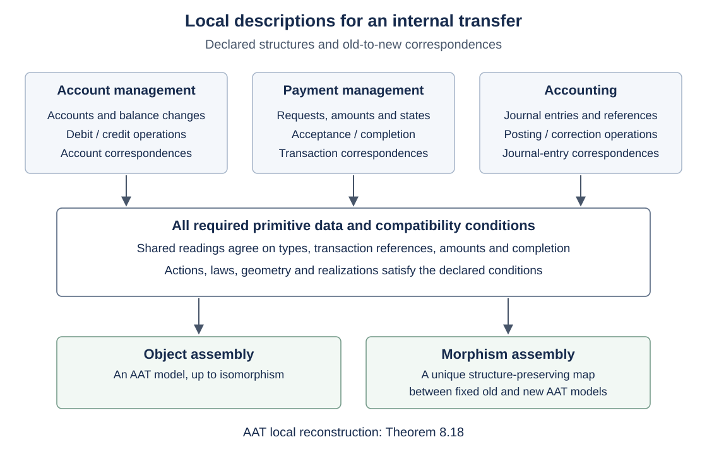

# 第8章 表示と局所再構成

## 本章の概要

本章の問いは、**局所的な記述から、いつ全体の幾何と構造保存射を回復できるか**である。
第7章で扱った構造を保つ変更について、その各成分の記述から一つの射を構成する問題を扱う。

例として、行内送金システムの刷新を、口座・送金・会計の各担当が分担する場合を考える。
各担当の記述は、共通の取引・金額・完了条件について整合する必要がある。
刷新前後の対応についても、取引の対応、操作の作用、Lawの評価を各担当の間で整合させる。
本章では、こうした分担された記述から全体のモデルを構成し、
部分ごとの変更を一つの構造保存射へ組み立てる条件を説明する。

再構成には三つの条件を課す。
局所データによって全体の異なる射を区別できること、
整合する対応表から全体の射を構成できること、
および構造の局所的な記述から対象を構成できることである。
本章では、これらをそれぞれ分離、射の組立て、対象の組立てとして定式化し、証明する。
完全幾何については、型・operation・Law・局所幾何・実現の原始データからこれらの構成を与える。
主定理は、完全幾何とその全構造保存射の圏が、
原始データと整合条件から定義した局所モデルの圏と同値になることを示す。

第2章の貼り合わせでは、幾何と文脈の被覆を固定し、各文脈で選んだ状態を補正して貼り合わせた。
そこでの「局所」は、状態を読む文脈の範囲を指す。
本章での「局所」は、幾何と射を記述する有限個の型・値・等式の読取りを指す。
被覆や文脈自体も読み取るデータに含め、それらを備えた幾何と構造保存射を組み立てる。

一般の再構成で用いるのは、すべての有限片にわたる整合族である。
再構成には、対象と射を決定するだけの読取り項目と、それらの整合条件を指定する必要がある。
主定理の後では、設計変更への適用と、操作の法則によって有限の記述が十分となる場合を扱う。
有限なモデルについても、必要な情報の選択と、検査・再構成の計算費用を区別する。

| 問い | 構成 | 得られるもの |
| --- | --- | --- |
| 対象と射をいつ有限表示できるか | 有限例外codeと固定端点間の射 | 有限表示の成立条件と限界 |
| 有限片をいつ一つの表や関数へ貼り合わせられるか | 制限と型付き関数のグラフ | 表の貼り合わせと、関数としての成立条件 |
| 局所データから全体を回復できる条件は何か | 分離・射の組立て・対象の組立て | 読取り関手による圏同値 |
| AATの幾何と射を何から組み立てるか | operation・Law・幾何・実現の原始データ | 対象と全構造保存射の再構成 |
| 分担した記述から設計変更を構成できるか | 行内送金の局所記述と対応 | 分担された記述からのモデルと変更の構成 |
| 有限表から全体の射を回復できるか | 操作の法則による一意な延長 | 有限の記述から全体の射を回復する条件 |
| 有限なモデルではどう検査できるか | 読取り項目の選択、列挙と等号判定 | 再構成に十分な情報と計算手順の区別 |

第3章の診断不変性は、読み方を変えても選んだ診断の判定が変わらないことを保証する。
第7章の反映は、正規化した像での適合性から元の変更の適合性を導く性質である。
本章の再構成では、対象と射そのものを回復する。
それぞれの性質は、指定された対象・射・観測量について成立する。

## 8.1 有限表示による対象と射の回復

第5章では、端点の表示を選ぶことを許すと、
有限のsourceと有限または余有限な抽出から底射を表示できることを示した。
端点の表示を固定した場合には、すべての意味的な射がその間の射として表示できるとは限らない。
本節では、有限例外codeを用いて、この相違を明らかにする。

### 有限例外表と一点コンパクト化

**定義8.1（有限例外code）.**
集合 $`D`$ に対し、codeを既定値 $`b\in\{0,1\}`$ と有限集合 $`E\subseteq D`$ の組とする。
評価は

```math
\mathrm{ev}(b,E)(x)=
\begin{cases}
1-b,&x\in E,\\
b,&x\notin E
\end{cases}
\qquad\text{(8.1)}
```

である。既定値0は有限集合の特性関数を、既定値1は余有限集合の特性関数を表す。

既定値は、有限例外集合の外での評価値を指定する。
これを一つの点で表すため、$`D^+=D\sqcup\{\infty\}`$ を考える。
$`D`$ の各点は孤立点とし、$`\infty`$ を含む集合は、
その補集合が $`D`$ の有限部分集合なら開とする。
これは離散空間 $`D`$ の一点コンパクト化である。
$`D`$ が有限の場合には、$`\infty`$ も孤立する。

**命題8.2（codeの位相的な意味）.**
$`\{0,1\}`$ に離散位相を入れると、次の全単射がある。

```math
\begin{aligned}
\mathrm{Code}(D)&\ \cong\ C(D^+,\{0,1\}),\\
(b,E)&\longmapsto
\left[
x\longmapsto
\begin{cases}
\mathrm{ev}(b,E)(x),&x\in D,\\
b,&x=\infty.
\end{cases}
\right]
\end{aligned}
\qquad\text{(8.2)}
```

$`D`$ が無限なら、$`D`$ 上の評価だけでもcodeは一意に決まる。
$`D`$ が有限なら、任意の関数 $`a:D\to\{0,1\}`$ に対して、
既定値0と1の二つのcodeがある。

**証明.**
codeから得た関数は、$`\infty`$ の近傍 $`D^+\setminus E`$ で一定なので連続である。
逆に連続関数 $`a`$ に対し、$`b=a(\infty)`$ と置く。
連続性より $`a^{-1}(\{b\})`$ は $`\infty`$ の近傍だから、
$`E=\{x\in D\mid a(x)\ne b\}`$ は有限である。二つの構成は互いに逆になる。

無限の $`D`$ では、二つの有限例外集合の和集合の外に点を取れる。
評価が等しければそこで既定値が等しくなり、例外集合も等しくなる。
有限の $`D`$ では、各 $`b`$ に対して
$`E_b=\{x\mid a(x)\ne b\}`$ が有限であり、これが二つのcodeを与える。□

したがって第5章の定理5.15は、次の位相的な特徴づけを与える。
両端のsourceが有限で、標的の各抽出述語が $`D^+`$ 上の連続関数へ延びることが、
端点同型を含めた底射の有限表示を特徴づける。
離散sourceの有限性も、位相的にはコンパクト性に等しい。
実際、各点からなる開被覆が有限部分被覆を持つことは、点の総数が有限であることを意味する。
この特徴づけでは、意味を保つ端点の列挙やAtomの対応の変更を許している。

### 固定表示間の射

次に、固定した表示の間で、どの意味的な射を表示できるかを調べる。
第5章の有限source、正規化表、有限例外表を持つcodeを対象とする。
表示の射には、sourceの有限表と、有限個のAtomだけを動かす置換を記録する。
正規化・指定点を保ち、輸送した抽出codeが標的のcodeと等しくなることを要求する。
同じ意味的射を与える置換の記述は同一視し、この商による圏の復号関手を $`D_0`$ とする。

二つの表示 $`P,Q`$ を固定し、その意味を $`D_0P,D_0Q`$ と書く。
$`b_P(s)`$ は、source $`s`$ を正規化した後に用いる抽出codeの既定値とする。

**命題8.3（固定表示間の射の存在条件）.**
意味的な底射 $`f:D_0P\to D_0Q`$ のsource写像を $`s_f`$、
Atomの置換を $`\sigma_f`$ とする。このとき

```math
\exists h:P\to Q,\ D_0(h)=f
\quad\Longleftrightarrow\quad
\left\{
\begin{aligned}
&\{a\in D\mid \sigma_f(a)\ne a\}\text{ が有限},\\
&b_Q(s_f(s))=b_P(s)\quad\text{for all }s.
\end{aligned}
\right.
\qquad\text{(8.3)}
```

**証明.**
表示された置換は有限個のAtomだけを動かす。
またcodeの輸送は既定値を変えないから、左辺は右辺を含意する。

逆に右辺を仮定する。
$`\sigma_f`$ が動かす有限集合を列挙し、その上の置換を表にすれば、
この置換は $`\sigma_f`$ そのものへ延びる。
source写像には $`s_f`$ を用いる。
正規化と指定点の保存は $`f`$ の条件である。
抽出のexactnessから、輸送したcodeと標的codeの評価は等しい。
さらに既定値も等しいので、式(8.1)より例外集合が等しくなり、codeの等号を得る。□

したがって、この表示から漏れる意味的な射は、無限個のAtomを動かすものか、
対応するsourceで正規化後の既定値が一致しないものに限られる。
次の例は、後者が有限のAtom集合でも起こることを示す。

**例8.4（固定表示間の非充満性）.**
$`D=\{a\}`$ とし、sourceは一点、正規化は恒等とする。
抽出codeをそれぞれ $`(0,\varnothing)`$ と $`(1,\{a\})`$ にすると、
どちらの抽出も常に偽である。
意味的な恒等射は存在するが、既定値が異なるため、
その恒等射をこの二つのcodeの間に表示することはできない。

この例は、対象の意味の一致から固定表示間のHomの回復が従わないことを示す。
表示に残る既定値の情報が、意味的な射の表示可能性を制約している。

**系8.5（有限Atom上での表示の正規化）.**
$`D`$ が有限なら、各抽出codeを

```math
R_{\mathrm{fin}}(b,E)
=
\bigl(0,\{a\in D\mid\mathrm{ev}(b,E)(a)=1\}\bigr)
\qquad\text{(8.4)}
```

へ置き換えられる。
正規化後に用いる抽出codeの既定値がすべて0である対象の充満部分圏上で、
$`D_0`$ は充満忠実である。
また $`D_0R_{\mathrm{fin}}\cong D_0`$ であり、意味的な対象と射を保つ。

**証明.**
式(8.4)は評価を変えない。
有限集合上の置換は有限の台を持ち、既定値は両端とも0だから、
命題8.3がすべての意味的射に適用できる。
忠実性は、同じ意味的射を与える記述を同一視したことによる。
$`R_{\mathrm{fin}}`$ はsource写像とAtom置換を保持して射にも作用する。
評価後には各成分が恒等の同型となり、射との自然性も成立する。□

## 8.2 有限片の整合性と貼り合わせ

前節では、対象の意味が一致しても、固定表示間の射を回復できるとは限らないことを見た。
以下では、対象に加えて射の各成分も読み取り、
整合する局所記述から全体の対象と射を構成する条件を調べる。
有限片の貼り合わせでは、共通部分での値の一致と、貼り合わせた表が関数や構造を定める条件を区別する。
前者を有限片の整合性として定義する。
後者には、各入力に対する出力の存在と一意性、および操作の保存などが含まれる。

### 読取りの添字と制限

**定義8.6（有限片の整合族）.**
読み取る項目の集合を $`\Lambda`$、項目 $`q`$ の値の型を $`V_q`$ とする。
有限部分集合 $`S\subseteq\Lambda`$ に対し、有限片は

```math
T_S=\prod_{q\in S}V_q
\qquad\text{(8.5)}
```

の元とする。$`S\subseteq T`$ に対して、成分を忘れる制限写像
$`r_{S,T}:T_T\to T_S`$ を用いる。
全有限部分集合にわたる族 $`(a_S)_S`$ が**整合する**とは、

```math
r_{S,T}(a_T)=a_S
\quad\text{whenever }S\subseteq T
\qquad\text{(8.6)}
```

が成立することをいう。

ここで有限なのは、一つの片に含まれる項目数である。
値の型は、Bool、環の元、有限の多項式、宣言された集合の参照などを含みうる。
したがって有限片は、必ずしも有限長のbit列を表すものではない。

**補題8.7（単点からの貼り合わせ）.**
全体の表と有限片の整合族との間には、次の全単射がある。

```math
\prod_{q\in\Lambda}V_q
\ \cong\
\left\{(a_S)_S\ \middle|\ r_{S,T}(a_T)=a_S\right\}.
\qquad\text{(8.7)}
```

**証明.**
全体の表からは各有限部分集合への制限を取る。
逆向きには、$`q`$ での値を単点片 $`a_{\{q\}}(q)`$ と定める。
式(8.6)より、任意の有限片の各成分はこの値に一致する。
制限と貼り合わせは両方向に恒等となる。□

### 型付き関数のグラフによる表現

**定義8.8（型付き関数のグラフ）.**
宣言された集合 $`A,B`$ の間の関数を、
入力と出力の組に対するBool表 $`R(x,y)`$ で記述する。
候補となる型の組も添字に含める場合には、
選ばれた $`(A,B)`$ 以外の組での値を0とする。
有効な型の上では、次を要求する。

```math
\forall x\in A,\quad\exists!y\in B,\quad R(x,y)=1.
\qquad\text{(8.8)}
```

すなわち、各行にはちょうど一つの出力がある。
関数 $`f:A\to B`$ の読取りは
$`R_f(x,y)=1\Longleftrightarrow f(x)=y`$ とする。

**補題8.9（関数のグラフの読取りと組立て）.**
関数 $`A\to B`$ と、定義8.8を満たす表とは一対一に対応する。
この対応は恒等と合成を保つ。

**証明.**
式(8.8)の一意な出力を $`f_R(x)`$ とする。
定義より $`R_{f_R}=R`$、また $`f_{R_f}=f`$ である。
恒等の表は対角線 $`x=y`$ である。
合成は

```math
(R_g\star R_f)(x,z)=1
\quad\Longleftrightarrow\quad
\exists y,\ R_f(x,y)=1\ \land\ R_g(y,z)=1
\qquad\text{(8.9)}
```

で与えられ、これは $`g(f(x))=z`$ に等しい。
各行の一意性から合成後も式(8.8)が成立する。□

**例8.10（整合性と関数のグラフの条件）.**
$`A`$ が空でないとき、すべての値を0としたBool表の有限片は整合する。
しかし、どの行にも出力がなく、式(8.8)を満たさない。
また一つの入力に異なる二つの出力を置けば、存在は満たしても一意性を失う。
したがって、有限片の整合性だけでは関数のグラフの条件は保証されない。

**定義8.11（原始評価による局所条件）.**
型・値・関数のグラフの有限個の成分から組み立てた等式や含意を、原始評価の式と呼ぶ。
一つの式で参照される添字の有限集合を、その式のsupportとする。
局所条件は、これらの式を指定された入力について量化したものとする。

たとえば、操作の作用 $`d:A\to B`$ と $`d':A'\to B'`$ に対し、
対応 $`h_A:A\to A'`$、$`h_B:B\to B'`$ が作用を保つ条件

```math
h_B(d(a))=d'(h_A(a))
\qquad\text{(8.10)}
```

は、$`a`$ と途中の出力を固定すれば、
四つの関数適用を評価する有限の式になる。
すべての $`a`$ にこの条件を要求することで、操作の作用の保存を得る。

式(8.8)も同様に、各 $`x`$ に出力 $`y`$ を取り、
その値が1で、任意の異なる候補 $`z`$ では0となることを要求する。
各候補に対する評価の式は有限であるが、行の全体性を表す条件には量化を要する。
有限carrierを要求する場合には、全要素を覆う有限リストの存在も条件に含める。
各評価の式が有限supportを持つことと、条件全体を有限回で検査できることは区別される。

## 8.3 分離と組立てによる再構成原理

個別の構造への適用に先立ち、局所再構成の十分条件を述べる。
$`N:ℛ\toℳ`$ を、全体の構造と射を局所モデルへ読む関手とする。

**定理8.12（局所再構成原理）.**
$`N`$ が次の三条件を満たすとき、$`N`$ を前向きの関手とする圏同値
$`ℛ\simeqℳ`$ が得られる。

1. **分離。** 同じ端点を持つ $`f,g`$ について、$`N(f)=N(g)`$ なら $`f=g`$。
2. **射の組立て。** 任意の $`u:NX\to NY`$ から $`\mathrm{asm}(u):X\to Y`$ を構成でき、
   $`N(\mathrm{asm}(u))=u`$ となる。
3. **対象の組立て。** 任意の $`m\inℳ`$ から対象 $`A(m)\inℛ`$ と
   同型 $`\varepsilon_m:N(A(m))\xrightarrow{\sim}m`$ を構成できる。

このとき各Homについて、

```math
\mathrm{Hom}_{ℛ}(X,Y)
\ \underset{\mathrm{asm}}{\overset{N}{\rightleftarrows}}\
\mathrm{Hom}_{ℳ}(NX,NY),\qquad
N\mathrm{asm}=1,\quad
\mathrm{asm}N=1
\qquad\text{(8.11)}
```

となり、各局所射にはただ一つの全体の射が対応する。

**証明.**
射 $`f:X\to Y`$ に対し、射の組立てから
$`N(\mathrm{asm}(Nf))=Nf`$ を得る。
分離を使うと $`\mathrm{asm}(Nf)=f`$ であり、式(8.11)が成立する。
したがって $`N`$ は充満忠実である。
対象の組立ては本質的全射性を与えるので、圏同値を得る。
これは圏同値の標準的な特徴づけである
（[Stacks, Lemma 4.2.19, Tag 02C3](https://stacks.math.columbia.edu/tag/02C3)）。

逆関手を次のように構成する。
対象には $`A(m)`$ を対応させ、$`u:m\to n`$ に対して

```math
A(u)=
\mathrm{asm}
\bigl(\varepsilon_n^{-1}\,u\,\varepsilon_m\bigr)
\qquad\text{(8.12)}
```

と置く。$`N`$ の像では恒等・合成の保存が成立し、分離によって $`ℛ`$ でも成立する。
$`\varepsilon`$ は式(8.12)から自然同型になる。
他方の自然同型は、$`\varepsilon_{NX}^{-1}:NX\to N(A(NX))`$ の一意な組立てで与えられる。
この自然同型の自然性と $`ℛ`$ 側の三角恒等式は、両辺に $`N`$ を適用して確かめる。
式(8.12)と組立ての逆律を用い、$`\varepsilon`$ とその逆の合成を簡約すると、比較する射は一致する。
分離によって元の等式を得る。$`ℳ`$ 側の三角恒等式は、
$`\varepsilon_{NX}`$ とその逆の合成が恒等射になることから従う。□

この原理では、分離が射の一意性を保証する。
射と対象の存在には、局所条件からそれぞれの構造を構成する証明を要する。
以下では、局所対象や局所射を型と等式から定義し、この三条件を証明する。

## 8.4 完全幾何の局所モデル

### 実現圏と射の方式

**構成8.13（完全幾何の入力と実現圏）.**
Atomの集合と、以下に定める射の方式を固定し、その組を $`\Theta`$ とする。
第1章の完全幾何を対象とし、選んだ方式の全構造保存射を射とする圏を
$`ℛ_\Theta`$ と書く。
局所モデルは、これらの対象と射を構成する原始データから定める。

完全幾何の変更には、輸送後の表示を等号で比較する場合と、
両表示の具体的な対応写像を保持する場合がある。それぞれに応じて、次の二方式を用いる。

**定義8.14（完全幾何の射の二方式）.**
**代表表示による方式**では、定義1.30の射を使う。
底とcoreの写像、被覆とoverlapの輸送、係数環の準同型を持ち、
終域のraw systemが、始域のraw systemの係数と文脈を輸送したものに等しいことを要求する。
support・軸・observableの比較写像は、そこで選んだ制限について自然である。

**明示写像による方式**では、同じ底・core・被覆・overlap・係数の成分を持ち、
raw systemの等号を、次の具体的な対応に置き換える。
輸送後の各文脈で、raw座標、局所データ、関係の添字を全単射で対応させる。
この対応は係数写像を用いた多項式の評価、関係式、制限を保つ。
各文脈射の行先も指定し、制限射を制限射へ送ることを要求する。
各文脈のsupport・軸・observableにも全単射を指定し、
読取りの述語と、これらの文脈射に沿う自然性を要求する。
たとえばraw座標については、ある座標をどの座標へ送るかを指定し、
その対応を関係式と制限の多項式にも適用する。

どちらの方式でも、底やarchitecture対象の写像、および係数写像は、可逆とは限らない。
恒等は各成分の恒等であり、合成は対応する成分の合成である。

### 原始データと局所整合条件

**定義8.15（完全幾何の局所対象と局所射）.**
$`\Theta`$ を固定する。
次の表は、完全幾何の対象と射を再構成するために読み取るデータをまとめたものである。
各データを、値または関数のグラフの一点として読む。
関数の定義域・値域となる集合は、対応する役割の型参照で指定する。

| 読む層 | 対象から読む原始データ | 射から読む原始データ |
| --- | --- | --- |
| 底とAtom | sourceの型、指定点、正規化のグラフ、抽出述語 | source写像とAtomの全単射のグラフ |
| architecture | 有限Atom族の合成関係、対象形成、operationの型・端点・Atomへの作用 | 対象写像とoperation写像のグラフ |
| Lawと不変量 | Lawの添字・両辺・評価、検出子、不変量の型と値、signature | 添字対応、評価と作用の保存、signatureの対応 |
| 文脈とobservable | 文脈の型と関係、制限、observableの環演算と読取り | 文脈対応、observableの環同型と制限の保存 |
| 選択された幾何 | 被覆要件、overlap、係数環、raw座標、関係式、制限の多項式 | 被覆とoverlapの保存、係数写像、方式に応じたrawの等号または対応のグラフ |
| 実現 | support・軸・observableの型、読取り述語、文脈射の作用 | 各実現成分の比較と自然性 |

たとえば、operation $`u:A\to B`$ の作用の一項目は、
そのconfiguration射がAtom $`a`$ をAtom $`b`$ へ送るという命題の真偽を表す。
係数環の乗法の一項目は、等式 $`a\cdot b=c`$ の真偽を表す。
rawの制限は有限の多項式として記し、その変数と係数の型を対応づける。
局所値にはこれらの原始成分を指定し、幾何や射の全体はその組立てによって構成する。

射の読取りでは、始域対象、終域対象、射自身の項目を区別する。
その共通の添字集合は

```math
\Lambda_\Theta
=
\Lambda_\Theta^{\mathrm{src}}
\sqcup
\Lambda_\Theta^{\mathrm{tgt}}
\sqcup
\Lambda_\Theta^{\mathrm{hom}}.
\qquad\text{(8.13)}
```

各項目に値の型を割り当て、定義8.6の有限片と制限を定める。
対象の場合には対象の項目だけを用いる。
射の始域・終域部分には、指定された両端の局所対象と一致することを要求する。

**局所対象**は、対象の有限片の整合族で、次の条件を満たすものとする。

- 役割ごとに宣言された型が一致し、各関数のグラフが定義8.8を満たす。
- 第1章の完全幾何を構成する各構造の法則が、原始評価の式として成立する。
- coreで選ぶAtom族が有限である。

**局所射**は、射の有限片の整合族で、型と両端の一致、関数のグラフの全体性・一意性、
および表に挙げた保存条件を満たすものとする。
全単射が必要な成分には、逆向きのグラフと二つの逆律を指定する。
環準同型には0・1・加法・乗法の保存を課し、
Lawには添字の対応と両辺の評価の保存を課す。
自然性は、指定された各制限または文脈射についての成分等式である。
rawの多項式に関する条件は、有限個の係数・変数の対応から評価する。

たとえば、operationとそのconfiguration作用を保つ条件は、
Atomの対応を $`e`$、operationの対応を $`\Phi`$、
operation $`u`$ のconfiguration射を $`d(u)`$ として

```math
e\bigl(d(u)_{\mathrm{At}}(a)\bigr)
=
d(\Phi(u))_{\mathrm{At}}\bigl(e(a)\bigr)
\qquad\text{(8.14)}
```

と書ける。制限とobservableの自然性は、
制限と成分写像をいずれの順序で適用しても評価値が等しくなることを要求する。
各式を固定した入力で展開すると有限supportを持つ。
式をすべての入力で要求することで、構造の保存条件全体を得る。

定義1.28の不変量条件では、値域の全単射は存在を要求されるだけで、射の保持成分には含まれない。
このような存在条件を表すため、局所表示に往復の写像を表す補助グラフを付ける。
これらにも型・逆律・評価保存・有限片の制限との整合性を課す。
整合する表示を構成した後、補助グラフの選択だけが異なる表示を同一視する。
この商により、source・operation・文脈・係数・rawなど、保持すべき射の成分を残す。

**補題8.16（局所圏と読取り関手）.**
定義8.15の局所対象と局所射は圏 $`ℳ_\Theta`$ をなす。
原始データの読取りは関手

```math
N_\Theta:ℛ_\Theta\longrightarrowℳ_\Theta
\qquad\text{(8.15)}
```

を定める。

**証明.**
局所射の恒等は対角グラフ、合成は式(8.9)で成分ごとに定める。
各グラフは再び全体的かつ一意である。
二つの保存等式から合成の保存等式が従い、
逆方向のグラフは逆順に合成することで逆律を保つ。
被覆や制限で要求した含意も、二つの含意の連鎖で保たれる。
rawの式では係数写像と変数の代入を順に合成する。

不変量の補助表示についても往復の対応を合成できる。
保持成分が等しい表示からは保持成分の等しい合成を得るので、
合成は同一視の後にも定まる。
単位則と結合則は、グラフの合成および成分ごとの合成から従う。

実現の各成分を読み取れば、型と法則はその実現の定義から成立する。
関数のグラフの読取りは恒等・合成を保つので、これらの読取りは関手となる。□

## 8.5 完全幾何の局所再構成定理

定義8.15の原始データと条件から、完全幾何とその構造保存射を構成する。
この構成によって定理8.12の分離と組立ての条件を証明し、
完全幾何の圏と局所モデルの圏との同値を得る。

### 完全幾何の組立て

**補題8.17（完全幾何の組立てと分離）.**
完全幾何の両方式について、局所対象から完全幾何を組み立てられる。
また任意の完全幾何 $`G,H`$ の間で、局所射 $`N_\Theta G\to N_\Theta H`$ と
完全幾何の射 $`G\to H`$ の読取り・組立ては互いに逆である。

**証明.**
まず対象を型の依存順に構成し、その対象間の射を組み立てる。
最後に、これらの構成と原始データの読取りが互いに逆であることを確かめる。

有限片を補題8.7で貼り合わせる。
source、Atom、architecture対象、configuration、operationの型を取得し、
各グラフから補題8.9によって正規化やoperationのAtomへの作用を構成し、
抽出と有限Atom族の合成関係、対象形成の値を取り出す。
指定点は型の条件によってsourceに属する。
正規化と抽出の条件、選択されたAtom族の有限性、
対象形成と合成関係の条件、operationの端点とconfiguration射の条件が、
第1章の底とarchitectureの構造を与える。

次に不変量とsignature、およびLawの添字を取り出す。
続いて文脈とその関係、各文脈のobservableの環演算と制限を構成し、
それぞれの公理を確かめる。この文脈と環を用いて、Lawの両辺と評価を構成する。
原始条件を、組み立てた関数の値についての等式として読み直すと、Lawと検出の条件が成立する。
以上によりcoreが定まる。

このcoreの上で、被覆要件とoverlapを取り、選択されたsiteを構成する。
係数環の型と演算は環の公理を満たす。
各文脈のraw座標、局所データ、関係の添字、および制限の多項式を組み立てる。
原始条件には、関係式の保存と、制限の恒等・合成の等式が含まれるので、
これらはraw systemとなる。
最後にsupport・軸・observableとその読取り・文脈射の作用を合わせ、
完全幾何を得る。
この順序により、後のデータが参照する型は、先に構成したデータによって定まっている。

射についても、まず保持する各成分のグラフを関数へ組み立てる。
全単射の成分では二つの逆律が逆写像を与える。
source・正規化・抽出・operation・Law・observableの局所条件は、
組み立てた写像の保存等式をそのまま与える。
被覆とoverlapの保存、係数準同型も同様である。
代表表示による方式ではrawの輸送等号を得る。
明示写像による方式では、rawの対応と実際の文脈射に沿う自然性を得る。
不変量の補助グラフは、要求される値の全単射の存在を与える。
補助の選び方を変えても、組み立てた射の保持成分は変わらない。

この構成の各関数のグラフは、補題8.9によって元の表と一致する。
有限片の一致も補題8.7から従う。
逆に、完全幾何の射の読取りを組み立てると、各関数の値が元の射の値と一致する。
射の等号はこれらの保持成分の等号で決まるから、組立ての結果は元の射に等しい。
対象についても各構造が回復し、型の同一視を介した標準同型を得る。□

### 主定理

**定理8.18（完全幾何の局所再構成）.**
構成8.13のAtomの集合と射の方式を固定する。
定義8.15の局所モデルへの原始読取り関手 $`N_\Theta`$ は圏同値を与える。

```math
ℛ_\Theta\simeqℳ_\Theta.
\qquad\text{(8.16)}
```

その前向きの関手は式(8.15)の $`N_\Theta`$ そのものである。
任意の完全幾何 $`X,Y`$ に対し、

```math
\mathrm{Hom}_{ℛ_\Theta}(X,Y)
\ \underset{\mathrm{asm}_\Theta}
{\overset{N_\Theta}{\rightleftarrows}}\
\mathrm{Hom}_{ℳ_\Theta}(N_\Theta X,N_\Theta Y)
\qquad\text{(8.17)}
```

は全単射であり、読取りと組立ては両方向に恒等となる。

**証明.**
補題8.17により、どちらの射の方式でも、
原始読取りは射を分離し、すべての局所射と局所対象を組み立てられる。
したがって定理8.12の三条件が満たされ、$`N_\Theta`$ を前向きの関手とする圏同値を得る。□

主定理のHomは、選んだ方式が許す非可逆な射も含む全構造保存射である。
その存在は、原始的な型と保存条件から補題8.17によって導かれる。
対象は同型まで回復し、固定した端点間の射は一意に回復する。

**系8.19（評価・合成・同型の回復）.**
$`u:N_\Theta X\to N_\Theta Y`$ と
$`v:N_\Theta Y\to N_\Theta Z`$ に対して、

```math
\begin{aligned}
\mathrm{asm}_\Theta(1)&=1,\\
\mathrm{asm}_\Theta(vu)
&=\mathrm{asm}_\Theta(v)\mathrm{asm}_\Theta(u).
\end{aligned}
\qquad\text{(8.18)}
```

各原始成分の評価は、元の局所表の値に一致する。
また $`N_\Theta(f)`$ が同型であることと、$`f`$ が同型であることは同値である。

**証明.**
式(8.18)の両辺を読めば、読取りの関手性と式(8.17)によって等しくなる。
分離から元の射も等しい。
評価の一致は、グラフの組立てで選んだ出力の定義による。
局所射が逆を持てば、その逆を組み立て、式(8.18)を使うことで全体の逆射を得る。
逆方向は関手性である。□

## 8.6 設計変更への適用

### 行内送金システムの刷新

冒頭の行内送金を、完全幾何の再構成を説明する例として具体化する。
口座管理・支払実行・会計を区別する業務上の分担は、
[BIANのService Domain Landscape 9.0](https://bian.org/wp-content/uploads/2024/12/BIAN-Service-Landscape-V9_0-Value-Chain-View.pdf)
にも見られる。本例では同一通貨・手数料なしの送金を扱い、以下の状態とLawを定める。

旧設計では、送金と口座の更新、記帳の情報を一つの取引記録に保持していたとする。
新設計では、それらを送金記録・口座明細・仕訳に分け、共通の取引参照によって結びつける。
各担当は次の構造と、旧設計からの対応を記述する。

| 担当 | 記述する構造 | 他の記述と整合させる事項 |
| --- | --- | --- |
| 口座 | 口座、残高、引落し・入金操作 | 取引と残高増減の対応、送金元と送金先、金額 |
| 送金 | 送金依頼、金額、処理状態、受付・完了操作 | 各記録が参照する取引、送金の完了条件 |
| 会計 | 仕訳、取引参照、記帳・訂正操作 | 取引と仕訳の対応、金額の一致、貸借の均衡 |

担当による分担は記述の分担であり、本章の有限片は、各担当が記述する有限個の型・値・等式からなる。
共通の取引や金額の型を宣言したうえで、操作の端点と作用、Lawの評価、
文脈とその制限、選択した幾何および実現のデータを、定義8.15に従って指定する。
同じ読取り項目が複数の記述に現れる場合、その値は一致しなければならない。

整合条件の一部を、送金の完了に関するLawで示す。
送金識別子 $`q`$ と、同一通貨の正の金額 $`m`$ を固定する。
$`c,d,i,j\in\{0,1\}`$ を、それぞれ完了判定、送金元からの出金記録、
送金先への入金記録、対応する借方・貸方仕訳の組の存在を表す値とする。
後三者では、取引参照と金額がそれぞれ $`q,m`$ に一致することも含めて判定する。
この例の完了条件は $`c=1\Longrightarrow d=i=j=1`$ である。
値を整数として評価すれば、これは三つの残差
$`c(1-d)`$、$`c(1-i)`$、$`c(1-j)`$ がすべて0となる条件で表せる。
各残差は有限個の値を参照するため、定義8.11の原始評価として記述できる。

たとえば、旧設計の完了した取引について、送金担当と会計担当は新設計の完了・記帳済み記録を指定し、
口座担当は引落し・入金前の記録を指定したとする。

| 読取り項目 | 旧設計の取引 | 不整合な対応候補 | このLawを満たす対応候補 |
| --- | --- | --- | --- |
| 完了判定 $`c`$ | 1 | 1 | 1 |
| 出金記録 $`d`$ | 1 | 0 | 1 |
| 入金記録 $`i`$ | 1 | 0 | 1 |
| 仕訳の組 $`j`$ | 1 | 1 | 1 |

不整合な候補では、最初の二つの残差が1となる。
各記録への参照の型が正しくても、完了した送金に要求したLawの評価を保存しない。
右端の候補はこのLawを満たす。全体の射を構成するには、
さらに操作の作用と、定義8.15に挙げたすべての保存条件を満たすことを要求する。

対象の組立てでは、これらの原始データを補題8.7で貼り合わせ、
補題8.17により新設計の完全幾何を構成する。
必要なデータを揃えて局所対象を定めたとき、その実現は読取りとの同型を伴って得られる。
射の組立てでは、Atomの集合と射の方式を共通の入力 $`\Theta`$ として固定する。
旧設計と新設計の完全幾何を $`G_{\mathrm{old}},G_{\mathrm{new}}`$ とし、
各担当の対応を局所射 $`u:N_\Theta G_{\mathrm{old}}\to N_\Theta G_{\mathrm{new}}`$ として指定する。
定理8.18は、これを読取りとする一意な構造保存射
$`h:G_{\mathrm{old}}\to G_{\mathrm{new}}`$ を与える。
ここで構成される対象と射は、型・operation・Law・局所幾何・実現のデータを明示したAATモデルのものである。



**図8.1：口座・送金・会計の各担当による原始データと対応の記述。**
必要な全データと整合条件から、対象は同型まで、固定した端点間の射は一意に再構成される。
個々の記録の型の一致に加え、操作の作用、Lawの評価、選択した幾何と実現の保存を要求する。

この構成により、分担された設計変更の整合性を、全体の構造保存射の存在として記述できる。
別の刷新案についても、同じ旧設計と保持すべき構造を固定し、
その案への局所対応が保存条件を満たすかを比較できる。

### 正規化と生成比較への適用

**例8.20（タグ付きoperation）.**
例6.25のoperation $`(u,t)`$ には、configurationへの作用 $`u`$ と、
その作用に影響しないタグ $`t\in\{0,1\}`$ が付随する。
architecture対象全体の集合を $`\Omega`$ とし、
$`\chi:\Omega\to\{0,1\}`$ に対して

```math
T_\chi(u,t)=(u,t+\chi(A))
\quad\text{for }u:A\to B
\qquad\text{(8.19)}
```

と置く。加法はmod 2である。
この例のLaw・不変量・幾何はタグの値に依存しないので、
$`T_\chi`$ は明示写像による方式の完全幾何の自己同型となる。
一様なタグ反転は $`\chi=1`$ である。
$`\chi`$ を始点ごとの反転選択と呼ぶ。

定理8.18は、これらすべての $`T_\chi`$ と、
同じ例のcanonicalな正規化を、もとの完全幾何の射として回復する。
タグ成分を読むことにより、configuration作用が等しい二つの射も区別できる。
正規化との合成に関する式も、系8.19により、そのまま局所圏で成立する。

**例8.21（生成比較の対象・射・端点の変更）.**
構成5.37の共通入力を用いる。有限codeで実現した平方と、同じ比較図式のcore・強い辺・
面の終点と底の二道の条件・指定比較を固定する。
そのうえで、同じ面・cochain・係数・元の完全幾何から比較を作る。

二経路の完全幾何を $`G_{\mathrm d},G_{\mathrm v}`$、
標準比較を $`\overline\alpha:G_{\mathrm d}\xrightarrow{\sim}G_{\mathrm v}`$ とする。
第6章の正規化を両端で $`e,d`$ と書けば、生成比較は

```math
\overline\beta=d\overline\alpha,\qquad
e^2=e,\quad d^2=d,\qquad
d\overline\alpha=\overline\alpha e
\qquad\text{(8.20)}
```

を満たす。したがって $`d\overline\beta=\overline\beta=\overline\beta e`$ である。

これらは代表表示による方式の対象と射であり、
定理8.18は生成に用いた元の幾何、二経路の幾何、
$`\overline\alpha,\overline\beta,e,d`$ をすべて回復する。
また両端の全自己同型と、それらの間の可換平方も回復する。
式(8.20)は系8.19によって局所モデルにも保たれる。

## 8.7 再構成原理のCS意味論への適用

第1章で導入したlensと観測付きプロトコルに、定理8.12の局所再構成原理を適用する。
まず、原始データと保存条件から対象と一般射を回復する。
次に、それぞれの法則を用いて、基準fiberまたは生成表という有限の記述からの再構成を示す。

### 局所モデルと組立て

**構成8.22（CS意味論の局所モデル）.**
入力 $`\Theta`$ を次の表から選び、実現の圏を $`ℛ_\Theta`$ と書く。

| 入力 | 固定するもの | 実現の圏 $`ℛ_\Theta`$ |
| --- | --- | --- |
| lens | viewの集合 $`V`$ と基準値 $`v_0\in V`$ | 三法則と基準fiberの有限性を満たすlens、およびget・putを保つすべての写像 |
| プロトコル | 有限表示 $`Q`$ と、商経路圏上の観測関手 $`O`$ | 各頂点の状態集合が有限な実現、および観測を保つすべての自然変換 |

対象・射は、それぞれ定義1.32と定義1.36の意味論から定める。
その操作とLawは、§1.10の型付き構成によってAtom・operationの記述へ接続している。
基準fiber間の任意の写像や、非単射な状態写像も、それぞれの保存条件を満たせば射となる。

局所記述には、次の原始データを用いる。

| 入力 | 対象から読むデータ | 射から読むデータ |
| --- | --- | --- |
| lens | 状態の型、get・各putのグラフ | 状態写像のグラフ |
| プロトコル | 各頂点の状態の型、生成辺と観測のグラフ | 頂点ごとの写像のグラフ |

型はその役割ごとの参照で指定し、関数のグラフの各値を読取り項目とする。
射の項目ではsource・target・射自身を区別し、§8.2の有限片と制限を用いる。
局所対象は、型の一致と各グラフの全体性・一意性を満たす有限片の整合族とする。
lensには三法則と基準fiberの有限性を、プロトコルには道の関係、観測の自然性、
各頂点の状態集合の有限性を原始評価の条件として課す。
有限性は、該当する集合の全要素を覆う有限リストの存在によって表す。

局所射には、指定した両端との一致とグラフの全体性・一意性を要求する。
lensではget・putの保存を、プロトコルでは生成辺と観測の保存を、成分ごとの等式で課す。
操作と観測の保存等式は、入力を固定すると有限supportを持つ。
対角グラフと式(8.9)の合成はこれらの条件を保つため、局所圏 $`ℳ_\Theta`$ を得る。
実現の各成分を読む関手を $`N_\Theta:ℛ_\Theta\toℳ_\Theta`$ と書く。

**補題8.23（lensの組立てと分離）.**
lensの局所対象と局所射から、lensとその一般射を組み立てられる。
読取りと組立ては各Homで互いに逆であり、対象も同型まで回復する。

**証明.**
局所対象から状態集合 $`C`$ を取り、
getのグラフと各view $`v`$ におけるputのグラフを組み立てる。
得られる写像を $`g:C\to V`$、$`p:C\times V\to C`$ と書く。
局所対象の三つの点ごとの条件は、

```math
p(c,g(c))=c,\qquad
g(p(c,v))=v,\qquad
p(p(c,v),w)=p(c,w)
\qquad\text{(8.21)}
```

である。したがって $`(C,g,p)`$ は全域lensになる。
局所対象には $`g^{-1}(v_0)`$ を覆う有限リストが存在するという条件もあるので、
その基準fiberは有限である。

局所射のグラフを $`h:C\to C'`$ へ組み立てる。
射の二つの局所条件から

```math
g'h=g,\qquad
h(p(c,v))=p'(h(c),v)
\qquad\text{(8.22)}
```

を得るため、$`h`$ はlensの射である。
補題8.9と補題8.7により、すべてのグラフと有限片について両逆が成立する。□

**補題8.24（プロトコルの組立てと分離）.**
観測付きプロトコルの局所対象と局所射から、実現とその一般射を組み立てられる。
読取りと組立ては各Homで互いに逆であり、対象も同型まで回復する。

**証明.**
有限表示 $`Q`$ の各頂点 $`v`$ について、状態集合 $`X_v`$ を得る。
有限リストで全状態を覆うという条件から $`X_v`$ は有限である。
生成辺 $`e:v\to w`$ のグラフを $`X_e:X_v\to X_w`$ へ、
観測のグラフを $`o_v:X_v\to O(v)`$ へ組み立てる。

局所対象は指定された関係 $`p=q`$ について作用の等号を満たす。
また、各生成辺での局所条件は

```math
o_wX_e=O(e)o_v
\qquad\text{(8.23)}
```

を与える。したがって命題1.37により、これらの有限状態・辺写像・観測を持つ実現
$`(X,o)`$ が一意に定まる。

局所射からは頂点写像 $`h_v:X_v\to Y_v`$ を得る。
局所条件は

```math
h_wX_e=Y_eh_v,\qquad
o_v^Yh_v=o_v^X
\qquad\text{(8.24)}
```

であり、第一式はすべての生成辺で、第二式はすべての頂点で成り立つ。
命題1.38により、これらの頂点写像は一意な意味保存射 $`h:X\Rightarrow Y`$ を定める。
すべての成分はグラフから一意に得られ、延長も一意である。
補題8.7・8.9の両逆により、読取りと組立ての両逆も従う。□

**系8.25（CS意味論の局所再構成）.**
構成8.22の各入力に対し、原始読取り関手 $`N_\Theta`$ は
圏同値 $`ℛ_\Theta\simeqℳ_\Theta`$ を与える。
対象は同型まで回復し、固定した任意の実現間では、
非可逆な射も含めて読取りと組立てが互いに逆となる。
この再構成は恒等・合成と原始評価を保ち、同型を反映する。

**証明.**
補題8.23と補題8.24は、それぞれ定理8.12の三条件を与える。
したがって原始読取りを前向きの関手とする圏同値を得る。
恒等・合成の保存と同型反映は、読取りの関手性と各Homの両逆から従う。
原始評価の一致は、補題8.7と補題8.9の読取りと組立ての両逆による。□

### 基準fiberによるlensの再構成

第1章の命題1.34を、射の再構成に用いる表とその延長として述べ直す。

**命題8.26（基準fiberの表とlensの一般射）.**
$`L=(C,g,p)`$、$`L'=(C',g',p')`$ を、
同じview $`V`$ と基準値 $`v_0`$ を持つlensとする。
$`K=g^{-1}(v_0)`$、$`K'=(g')^{-1}(v_0)`$ と置く。
任意の写像 $`t:K\to K'`$ は、

```math
\mathrm{ext}(t)(c)
=
p'\bigl(t(p(c,v_0)),\,g(c)\bigr)
\qquad\text{(8.25)}
```

によってlensの射へ一意に延びる。
$`p(c,v_0)`$ は $`K`$ の元として読む。
この延長と基準fiberへの制限は互いに逆である。

**証明.**
式(8.25)は命題1.34の延長式(1.19)である。
同命題により、この延長はgetとputを保ち、基準fiberへの制限と互いに逆となる。□

射の再構成に必要な表は $`K,K'`$ 間の写像であり、viewの集合 $`V`$ の有限性は仮定しない。
各viewでの対応は、putの法則による一意な延長として定まる。

**例8.27（補完情報の統合）.**
積lensの状態を $`(a,k)\in V\times K`$ とし、getは第一成分を読み、
putは第一成分を指定されたviewに置き換えるものとする。
基準fiberの写像 $`t:K\to K'`$ から

```math
h(a,k)=(a,t(k))
\qquad\text{(8.26)}
```

が得られる。たとえば $`K=\{0,1,2\}`$、$`K'=\{0,1\}`$ とし、
$`t(0)=t(1)=0`$、$`t(2)=1`$ とすれば、補完情報の二つの値を統合する非単射な射となる。
式(8.26)はgetとputを保ち、命題8.26によって、この基準fiber上の表から一意に定まる。

### 生成辺によるプロトコルの再構成

**命題8.28（生成辺からのadapterの一意な延長）.**
二つの観測付きプロトコル実現 $`(X,o^X),(Y,o^Y)`$ に対し、
頂点ごとの有限表 $`h_v:X_v\to Y_v`$ が一般射へ延びるための必要十分条件は、
式(8.24)の第一式をすべての生成辺で、第二式をすべての頂点で満たすことである。
延長は一意で、制限と延長は互いに逆になる。

**証明.**
必要性は定義1.36の自然性と観測保存から従う。
十分性と延長の一意性は、命題1.38を頂点表 $`h_v`$ に適用すれば得られる。
得られた射の頂点成分は元の表そのものなので、制限と延長は互いに逆になる。□

観測保存は、生成辺を持たない孤立頂点にも必要である。

lensでは、基準fiber上の写像がputの法則によって全状態への射を定める。
プロトコルでは、頂点ごとの写像が生成辺での自然性によって全経路上の自然変換を定める。
両者とも、局所的な写像から全体の射への延長に操作の法則を用いている。

**例8.29（観測保存と自然性）.**
二頂点と一つの生成辺 $`e:v\to w`$ を持つプロトコルを考える。
両実現の各頂点の状態集合を $`\{0,1\}\times\{0,1\}`$ とし、
観測関手は両頂点に $`\{0,1\}`$ を割り当て、辺には恒等写像を割り当てる。
各状態の観測を $`(a,k)\mapsto a`$ とする。
辺の状態作用を $`X_e(a,k)=(a,k)`$、$`Y_e(a,k)=(a,0)`$ と定める。
両頂点で恒等写像を対応候補とすると、観測は保存される。
しかし $`k=1`$ では、$`h_wX_e(a,1)=(a,1)`$ に対し
$`Y_eh_v(a,1)=(a,0)`$ となり、自然性を満たさない。
生成辺での保存条件は、このように観測だけでは区別できない作用の相違を検出する。

### 有限表示と原始読取りの整合性

**系8.30（有限復号関手との整合）.**
lensとプロトコルには、それぞれ次の有限表の圏 $`𝒫_\Theta`$ と復号関手
$`D_\Theta:𝒫_\Theta\toℛ_\Theta`$ がある。

lensの表示対象は自然数 $`n`$、射は任意の表
$`\mathrm{Fin}(n)\to\mathrm{Fin}(m)`$ とする。
復号関手は $`n`$ を積lens $`V\times\mathrm{Fin}(n)`$ へ送り、
表 $`t`$ を $`(v,k)\mapsto(v,t(k))`$ へ送る。

プロトコルの表示対象は、頂点ごとの自然数 $`n_v`$、
各生成辺の表、観測の表であり、関係式と観測の自然性を満たすものとする。
射は生成辺と観測を保つ頂点表である。
復号関手は、生成辺の表を道の合成へ延ばす。

両方の復号関手は圏同値であり、系8.25の原始読取りとの合成

```math
𝒫_\Theta
\xrightarrow{D_\Theta}
ℛ_\Theta
\xrightarrow{N_\Theta}
ℳ_\Theta
\qquad\text{(8.27)}
```

も圏同値となる。
さらに、原始データによる局所モデルを組み立ててから基準fiberまたは生成表を読む経路は、
実現から直接それらを読む経路と自然同型で一致する。

**証明.**
lensでは、命題8.26により各Hom上で復号関手が全単射である。
対象については、命題1.33の同型

```math
C\xrightarrow{\sim}V\times K,\qquad
c\longmapsto\bigl(g(c),p(c,v_0)\bigr)
\qquad\text{(8.28)}
```

と、有限な $`K`$ の列挙を合わせれば、任意のlensが復号関手の像と同型になる。
プロトコルでは各頂点の有限状態集合を列挙し、
生成辺と観測をその列挙へ輸送する。
命題8.28がHomの全単射を与えるので、同様に圏同値を得る。
式(8.27)はこれらと系8.25の合成である。

最後の自然同型を明示するため、基準fiberまたは生成表を読む関手を $`F_\Theta`$、
系8.25の同値の逆関手を $`A_\Theta`$ とする。
定理8.12の単位同型 $`1\cong A_\Theta N_\Theta`$ に
$`F_\Theta`$ を適用すると、

```math
F_\Theta
\ \cong\
F_\Theta A_\Theta N_\Theta
\qquad\text{(8.29)}
```

を得る。したがって両経路は対象だけでなく一般射についても一致する。□

有限表示から射を得る手順は、二つの意味論で異なる。
lensでは、有限な基準fiber間の表を入力とし、式(8.25)によって全状態への写像を構成する。
get・putの保存は、命題8.26が全状態について保証する。
viewが無限の場合、任意に与えられた全状態写像の保存条件を有限個の状態だけで検査できるとは限らない。

プロトコルでは、有限な各頂点の状態を列挙し、候補の頂点表について、
式(8.24)の自然性を全生成辺で、観測保存を全頂点で検査する。
表示対象そのものも検査する場合には、辺の表と観測の自然性に加え、
指定された有限個の関係について有限長の道の作用を比較する。
必要な表の評価と等号判定が計算可能なら、これらは有限の検査として実行できる。

**命題8.31（retract・Karoubi・比較平方への接続）.**
lensとプロトコルの両入力で、実現圏は冪等完備である。
有限復号関手を $`D_\Theta`$ とすると、式(8.27)は

```math
\mathrm{Kar}(𝒫_\Theta)
\simeq
ℛ_\Theta
\simeq
ℳ_\Theta
\qquad\text{(8.30)}
```

へ延び、有限表示の包含上では元の復号関手と自然同型で一致する。
また、これらの同値は射圏と比較の可換平方へ延び、
端点の評価、および第6章のKaroubiと射圏の交換と整合する。

**証明.**
固定viewのlensの冪等完備性は命題6.30による。
プロトコルでは、冪等な意味保存adapter $`p:X\Rightarrow X`$ に対して

```math
X_v^p=\{x\in X_v\mid p_v(x)=x\}
\qquad\text{(8.31)}
```

を取る。命題6.31により、実行と観測を制限したこの像は同じプロトコルの実現となり、
$`p_v`$ と包含がその分裂を与える。

系8.30により、任意の実現は有限復号関手の像と同型であり、特にその像のretractである。
充満忠実な復号関手と上の分裂を用いると、
$`(P,e)`$ を $`D_\Theta(e)`$ の分裂像へ送ることで、
第6章のKaroubiの構成から式(8.30)を得る。
$`e=1`$ の場合には、復号した元の対象と同型になる。

射圏への作用は、射と可換平方の両端に同値関手を適用することで定まる。
端点評価との整合はこの定義から従う。
第6章の同値 $`\mathrm{Kar}(\mathrm{Arr}(𝒞))\simeq\mathrm{Arr}(\mathrm{Kar}(𝒞))`$ も、
同じ両端の冪等射と平方を使う。
Karoubi化の後に射圏を取る場合と、射圏の後にKaroubi化する場合には、
同じ端点・射・平方のデータを得る。
分裂の選択による違いはその標準同型で一致する。□

## 8.8 有限なモデルにおける記述と再構成

### 実装の資源制約とモデルの有限性

記憶領域を $`b`$ bitに固定した実装では、その記憶に格納できる状態は高々 $`2^b`$ 通りである。
固定bit幅の整数や、文字集合と格納長に上限のある文字列も有限集合をなす。
こうした資源制約の下で、再構成の問題は、指定した構造と変更をどの情報から回復できるかという問いになる。

実装の有限性を有限表による再構成に用いるには、
モデルが採用する型・係数・文脈と読取り項目の範囲も指定する必要がある。
以下では、必要な全項目を表にする場合と、部分的な読取りから法則によって回復する場合を分ける。

### 全体表と部分的な読取り

定義8.6で添字集合 $`\Lambda`$ が有限なら、
整合族は全項目を含む表 $`a_\Lambda`$ とその制限からなる。
補題8.7の貼り合わせは、この全体表の回復である。
各値を有限に符号化できるとき、全体表も有限の記述を持つ。

全項目が有限であっても、選んだ一部分だけで候補を区別できるとは限らない。
§8.6の行内送金の例では、完了判定 $`c`$ と仕訳の存在 $`j`$ だけを読むと、
不整合な候補とLawを満たす候補は、どちらも $`(c,j)=(1,1)`$ を返す。
出金記録 $`d`$ と入金記録 $`i`$ を追加すれば、
前者の $`(d,i)=(0,0)`$ と後者の $`(d,i)=(1,1)`$ を区別し、完了条件を検査できる。
これは、有限な候補についても、読み取る項目の選択が検査結果を左右することを示す。

定理8.18は、必要な原始データと保存条件をすべて用いて、全体の構造と射を回復する。
固定した端点間の射をより少ない項目から回復するには、
省いた成分の値を法則から一意に定められることが必要となる。
前節の基準fiberや生成表による再構成は、そのような一意な延長の例である。

### 有限の検査手順と計算費用

| 性質 | 内容 | 本章の対応 |
| --- | --- | --- |
| 必要な全データからの再構成 | 整合条件を満たす記述から対象を同型まで、固定端点間の射を一意に回復する | 定理8.18 |
| 選んだ有限表による決定 | その表から全体の射へ一意に延長できる | 基準fiberと生成表による再構成 |
| 有限の実行手順 | 明示された列挙と等号判定を用いて、条件の検査と延長を計算する | §8.7の有限表示 |

対象となる表と検査条件を有限に列挙でき、各評価と等号判定を計算できれば、
有限回の検査によって指定条件の成立を判定できる。
有限集合の存在だけでは、これらの列挙や計算手順を与えたことにはならない。

さらに、検査が有限回で終了することと、所定の時間・記憶資源で実行できることは異なる。
実用的な検査には、入力表の大きさと、各条件の評価に要する費用を調べる必要がある。
本章の再構成定理は、再構成の存在と一意性を示すものであり、計算費用の上界は与えていない。

## 8.9 補足：無限対象を許す場合の表示と再構成

数学的な一般化として、Atomや読取りの添字に無限集合を許した場合を扱う。
資源上限を捨象した仕様モデルでは、このような集合を用いることがある。
以下の二つの反例は、そのモデルで許す射と読取りについて述べる。
固定された有限資源の下での実装について、表示や再構成が不可能であることを意味しない。

### 可算構文による表示の限界

第一の反例では、無限集合上のすべての自己同型を対象とし、計算可能性による制限を課さない。
その集合の濃度を用いて、可算な構文からの復号写像が全射にならないことを示す。

**命題8.32（可算構文による全射的な表示の不可能性）.**
第1章の底圏 $`B`$ には、自己同型の集合が、
任意の可算な構文集合からの復号写像の像には収まらない対象がある。

**証明.**
Atomを $`ℕ`$、sourceを一点、正規化を恒等、抽出を常に真とする。
この底対象を $`b_\infty`$ とする。
任意の $`S\subseteq ℕ`$ に対し、$`n\in S`$ のときだけ
$`2n`$ と $`2n+1`$ を交換する置換 $`\sigma_S`$ を定める。
抽出は一定だから、各 $`\sigma_S`$ は $`b_\infty`$ の自己同型になる。
交換される対の集合から $`S`$ が一意に定まるため、

```math
\mathcal P(ℕ)\hookrightarrow\mathrm{Aut}_{B}(b_\infty),
\qquad S\longmapsto\sigma_S
\qquad\text{(8.32)}
```

は単射である。左辺は非可算なので、可算集合から右辺への全射は存在しない。□

たとえば可算個の記号からなる有限文字列全体は可算であり、この結論が適用される。
この濃度の議論は、計算可能性の条件を課さず、すべての部分集合 $`S\subseteq ℕ`$ を許すことに依存する。
有限のコードで記述される計算可能な変更に対象を限定した場合の表示不能性を、この命題からは結論できない。

また全隣接対を交換する $`\sigma_{ℕ}`$ は無限の台を持つため、
命題8.3により、有限例外codeの射として表示できない。
一方、この置換は、偶数には1を加え、奇数から1を引く有限の規則で記述できる。
指定した表形式での表示可能性と、有限の規則による記述可能性は異なる。

この例は底圏の対象について成立する。選択された抽出は無限であり、
coreで選択するAtom族の有限性は満たさない。
§8.2以降の局所記述では、集合を型参照として保持し、添字集合全体に無限を許している。
この読取りによる再構成と、可算な構文による全射的な表示は別の性質である。

### 無限の添字に対する有限片の限界

第二の反例は、例8.20のタグ変更を用いる。
architecture対象の集合 $`\Omega`$ の各 $`A`$ について、
$`A`$ を始点とするoperationのタグを反転するかどうかを、他の対象での選択と独立に定める。
この選択を表す $`\chi:\Omega\to\{0,1\}`$ を全有限片から回復する。

**命題8.33（タグ変更の全有限片による回復）.**
例8.20の始点ごとの反転選択 $`\chi:\Omega\to\{0,1\}`$ と、
各有限集合 $`S\subseteq\Omega`$ 上のBool表 $`a_S`$ の整合族は一対一に対応する。
mod 2の加法を用いると、これは群同型

```math
\{0,1\}^{\Omega}
\ \cong\
\varprojlim_{S\subseteq\Omega,\ S\text{ finite}}\{0,1\}^{S}
\qquad\text{(8.33)}
```

になる。
$`\Omega`$ が無限なら、どの一つの有限集合 $`S`$ 上の読取りも、
この始点ごとの反転選択のすべてを区別できない。

**証明.**
全単射は補題8.7を $`V_q=\{0,1\}`$ に適用したものである。
加法と制限は点ごとに定まるため、全単射は群演算を保つ。
また式(8.19)より
$`T_\psi T_\chi=T_{\chi+\psi}`$ である。
各 $`A`$ の恒等作用にタグ0を付けたoperationへの作用から $`\chi(A)`$ が定まるので、
この族は実際の自己同型の部分群としても忠実に表される。

$`\Omega`$ が無限で $`S`$ が有限なら、
$`A\notin S`$ を取り、恒等的に0の関数と、
$`A`$ でだけ1となる関数を比較する。
$`S`$ 上の値は等しいが、$`A`$ を始点とするoperationのタグへの作用は異なる。□

$`\Omega`$ が有限なら、$`S=\Omega`$ として全体を読み取ることで、この族を決定できる。
無限の場合の反例は、どの有限片の外にも変更可能な箇所が残ることを用いている。
濃度による第一の反例とは異なり、この議論に必要なのは、読取り範囲の外の一点だけで異なる変更である。

したがって、これらの反例を適用する際には、モデルにおける無限集合、許す変更の範囲、読取り方式を指定する必要がある。
有限なモデルに対する情報の十分性と計算費用の問題は、§8.8で述べた条件によって扱う。

## 本章のまとめ

本章では、幾何と射の局所的な記述から、対象とその間の全構造保存射を回復する方法を与えた。

- **有限表示の範囲。** 有限例外codeでは、対象の意味を回復できても、固定表示間の射が意味的なHom全体を表すとは限らない。
  有限Atom上では、表示の正規化によってこの非充満性を解消できる（§8.1）。
- **分離と組立て。** 型付きの読取り項目、有限片の整合性、関数のグラフの全体性と一意性から、表と関数を組み立てた。
  射の分離、射の組立て、対象の組立てが揃うと、読取り関手は圏同値を与える（§§8.2–8.3）。
- **完全幾何の回復。** 型・operation・Law・局所幾何・実現の原始データについて、三つの条件を証明した。
  主定理の圏同値は、対象と、非可逆なものを含む選んだ方式の全構造保存射を回復し、恒等と合成を保つ（§§8.4–8.5）。
- **操作の法則による有限の記述。** lensとプロトコルにも同じ再構成原理が適用できる。
  有限な基準fiberや生成表から、操作の法則によって一般射を一意に延長できる（§8.7）。
- **情報の十分性と計算。** 有限なモデルでは、対象と射を決定する情報、列挙と等号判定に基づく手順、計算費用を区別する。
  無限対象を許す場合には、全有限片からの再構成と、一つの有限表や可算構文による表示の違いが現れる（§§8.8–8.9）。

行内送金システムの刷新では、口座・送金・会計の各担当の記述から、
必要な原始データと条件を満たす局所対象を定めることで、設計全体が同型まで構成される。
固定した旧設計と新設計の間では、各担当の対応がすべての保存条件を満たすとき、
それらを一意な構造保存射へ組み立てられる。
したがって、同じ旧設計と保持すべき構造を固定すれば、
複数の刷新案を、全体として整合する変更が成立するかという観点から比較できる。
