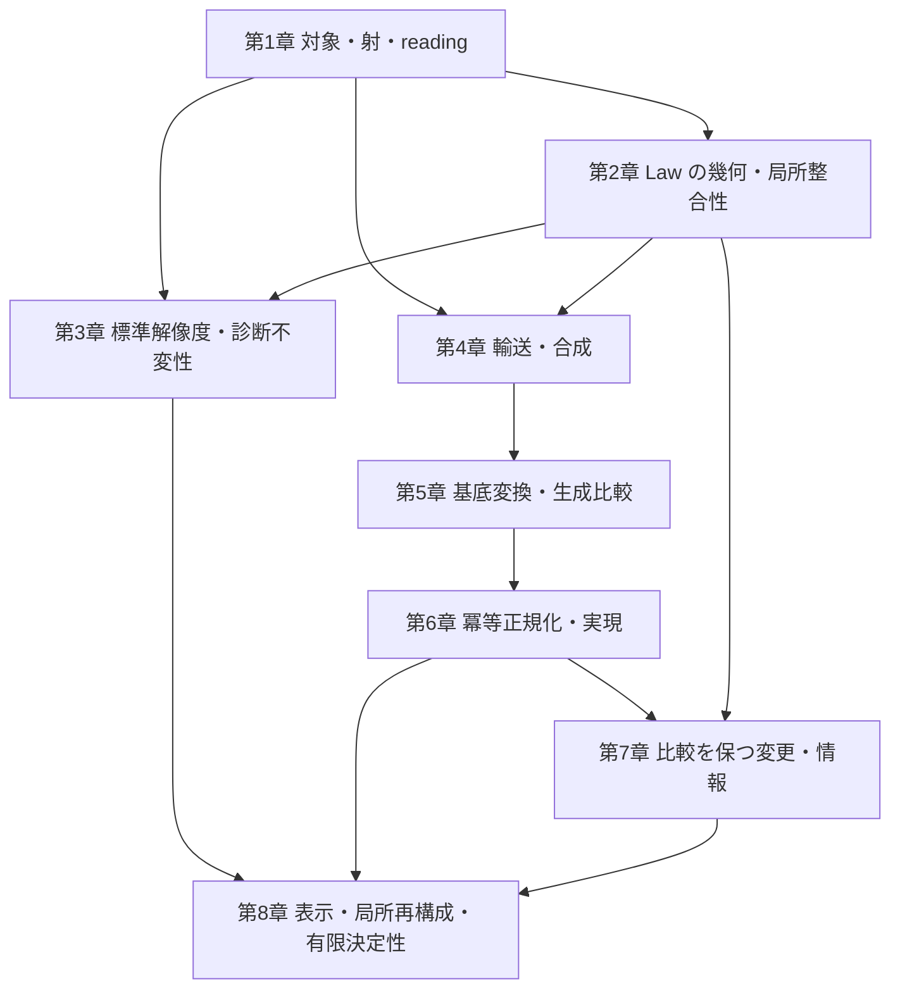

# Rising Sea — 論文構成マスター

仮題: **Foundations of Algebraic Architecture Theory**

## 1. この文書で定めること

本書は、AAT の基礎論文の主題、収録方針、章構成、各章の役割を定める。
この論文の[数学内容の棚卸し](mathematics-inventory.md)、章別設計、原稿は本書に従う。構成を変更するときは、
本書へ反映してから後続文書へ適用する。

[n1012 の構想メモ](../../../docs/note/n1012_aat_unified_theory_foundations_paper_plan.md)と
[n1015 の CS 対応メモ](../../../docs/note/n1015_aat_reconstruction_cs_correspondence_design.md)
を含む `docs/note/` の文書は、検討の経緯と着想を伝える
参考資料であり、本論文の構成・収録範囲を拘束しない。

数学の定義と証明は [AAT 数学本文](../../../docs/aat/algebraic_geometric_theory/README.md)、
形式化の内容は Lean source に照合し、論文の命題と一次資料の対応を付録に置く。
共通の執筆・文献確認・レビュー・公開手順は
[論文作成ガイドライン](../../../docs/paper/guideline.md)に従う。

## 2. 論文の主題と到達像

**Atom と Law を出発点として、対象・射・局所整合性・診断・輸送・比較・再構成を備えた、
AAT の数学的基礎を一つの体系として提示する。**

相対的なアーキテクチャの対象と幾何を構成し、その局所から大域への整合性を調べる。
reading を変えると何が運ばれ、何が保存されるかを証明し、異なる構成経路を比較する。
さらに、比較を保つ変更、その選択の自由度、表示から回復できる構造を扱う。
各結果群が固有の問いに答え、共通の対象と構成を通じて結びつく論文にする。

理論は公理、定義、構成、定理、証明によって展開する。CS・ソフトウェア工学への適用では、
独立に定めた問題と意味論から AAT の入力を構成し、対応を証明して帰結を戻す。
異なる問題に同じ構成と定理が働くことによって、体系の意義を示す。

到達像は、読者が論文中の対象・写像・成立条件を理解し、自身の問題を定式化して、
新しい定理や適用を研究できることである。基本構成の存在、普遍性、合成則、
成立を妨げる反例も、この基礎を与える主要な内容として扱う。

局所再構成と有限決定性は、体系の後半を担う結果群として配置する。
基礎幾何、障害、診断不変性、輸送、比較にも、それぞれの中心的な構成と定理を置く。

## 3. 読者・形式・収録方針

想定読者は、基本的な代数と圏論を知る CS・ソフトウェア工学の研究者、および
この対象に関心を持つ数学の研究者とする。AAT の研究履歴やリポジトリの既読を前提にしない。

AAT は新しい理論であり、基本対象と言語、構成と定理の関係を、論文自身の中で
確立する必要がある。個別の小さな成果を小出しにする形ではなく、基礎部分を一本の
論文にまとめ、公理・定義から基本構成の存在・普遍性・合成則、主要定理とその証明までを
体系的に展開する。そのうえで、既存の CS の問題との意味論的な対応を示し、
それらを一般理論の特殊な場合として包括する。異なる問題の成立条件や解の分類が
共通の構成と定理から導かれるところまで、基礎を一体として提示する。

これは、理論の水位を上げることで個々の問題を包み込む **Rising Sea** の思想である。
本論文を **AAT にとっての Tohoku** と位置づけ、後続の研究者が同じ基礎の上で
新しい問題を定式化し、定理や適用を展開できるようにする。この役割を果たすために、
定理と証明を中心とする長編の理論論文とし、200 ページ級を想定する。
実際の長さは、主要な定義・証明・CS との対応を自立して読めるために必要な内容から決める。

収録を判断する単位は、数学的な構成・命題・証明・適用とする。
研究成果を、基本対象から主要定理へ進む依存関係に沿って再編成する。
共通の用語と記号を整え、同じ構成の重複した導入は統合する。

次の内容を本論の中心に据える。

| 結果群 | 論文で答える問い | 主な配置 |
| --- | --- | --- |
| 基礎幾何の構成 | Atom・Law・reading・operation から、どの対象・射・site・係数・幾何が構成されるか | 第1〜2章 |
| 局所整合性と障害 | 局所的な解や補正はいつ貼り合い、その失敗はどの具体的な障害類として現れるか | 第2章 |
| 解像度と診断不変性 | Law の評価を保つ reading はどう構成され、reading や被覆の変更が診断を保存する条件は何か | 第3章 |
| 輸送と基底変換 | reading 間の輸送はどの普遍性を持ち、合成や異なる構成経路とどう整合するか | 第4〜5章 |
| 正規化と比較を保つ変更 | 生成比較をどう分解でき、比較を保つ変更をどの条件で識別・構成・分類できるか | 第6〜7章 |
| 表示・局所再構成・有限決定性 | 対象・射・比較をどの表示から回復でき、その回復はいつ有限の読み取りで決まるか | 第8章 |
| CS 意味論との対応と共通帰結 | モデル同期とプロトコルの意味をどう保ち、同じ変更分類・再構成・有限決定の定理から何が導かれるか | 第1・4・7〜8章、§6 |

この表は収録する問いと結果の役割を定める。各定理には量化、仮定、結論、証明を明記する。
一般命題の証明、AAT の入力からその仮定を満たす構成、CS の問題への対応は、
それぞれの数学的仕事として記載する。

数学本文の全10部と付録を収録素材とする。Law algebra、obstruction ideal、
lawful locus など、基礎幾何を成立させる構成を第1〜2章で扱う。
derived geometry、特異性、monodromy、表現、測定、時間方向の構造は、
主定理の依存と論文の問いに応じて、本論・補足・発展課題に配置する。

後続の descent・H¹・Morita 形・幾何学的表現可能性は、展望に置く。
これは第2章で用いる局所貼り合わせや Čech 障害、第4章の合成の障害を含めた
既存の基礎構成とは、対象とする問題を区別して記述する。

## 4. 全体構成

構成は四部八章とする。以下の章番号は理論本体の番号であり、原稿全体の通し番号は
組版上の番号と区別する。

| 配置 | 内容 | 読者が得るもの |
| --- | --- | --- |
| 冒頭 | Abstract | 体系が扱う問い、主要な結果群、成立条件、意義 |
| 導入 | Introduction | CS の問題から数学的対象へ進む動機、論文全体の貢献、各部の関係 |
| 準備 | Preliminaries and Notation | 共通の数学的前提、集合と圏の大きさ、合成順序、係数と記号の規約 |
| 第I部・第1章 | 相対的アーキテクチャの構成 | Atom・Law・reading から対象、射、局所文脈、幾何を構成する方法 |
| 第I部・第2章 | Law の幾何と局所整合性 | Law algebra、lawful locus、係数、貼り合わせ、障害類の関係 |
| 第II部・第3章 | 標準解像度と診断不変性 | reading の普遍性・表示可能性と、診断を保存する変更の条件 |
| 第II部・第4章 | 輸送と合成の整合性 | core・幾何の輸送、普遍性、合成比較とその整合性 |
| 第III部・第5章 | 基底変換と生成比較 | 異なる構成経路の比較と、その存在・可逆性・診断保存の条件 |
| 第III部・第6章 | 冪等正規化と実現 | 比較の分解、像と固定点、core と完全幾何における正規化 |
| 第IV部・第7章 | 比較を保つ変更と情報 | 適合する変更の構成・分類と、観測・正規化による情報損失 |
| 第IV部・第8章 | 表示・局所再構成・有限決定性 | 独立な表示からの回復と、有限の読み取りによる決定の条件 |
| 終盤 | Related Work | 主結果ごとの近接研究、既存数学への帰属、AAT 固有の構成と帰結 |
| 結び | Conclusions and Further Directions | 各結果群が与えた答えと、体系から生じる次の数学的問題 |
| 文献 | References | 引用した原典と固定版の証明ソース |
| 付録A | Lean 形式化との対応 | 本文の命題と形式化された対象・仮定・結論の対応 |
| 付録B | 補足証明と有限例 | 本文の理解を支える補助証明、計算、例の詳細 |
| 付録C | 検証資料と再現手順 | 証明ソースの版、環境、検証方法と結果 |

### 導入と準備

Introduction は、局所整合性、reading の違い、構造の移送、比較を保つ変更という
複数の問題から、共通の対象と構成を必要とする理由を示す。
主要な結果群をそれぞれの仮定とともに予告し、具体例と証明の着想を通して全体を見渡す。
モデル同期では読取りを保ちながら更新を壊す変更、プロトコルでは操作と既存 adapter を
保つ変更を提示し、両者に共通する「許容変更の自由度と決定に必要な情報」の問いを置く。

準備節では全章で共用する前提と記号を揃える。AAT 固有の定義は第1章から導入し、
site・sheaf・コホモロジー・冪等完備化などは、使用する章で必要な内容と原典を示す。

### 第I部 — 対象を構成し、局所整合性を問う

**第1章**では、Atom、family、configuration、architecture object、Law、operation、
reading とその射を定める。局所文脈、coverage、overlap、係数を指定して幾何へ進み、
`E_geom → E_core → B` の各段が保持する対象・射・データを説明する。
ここでの `B` は底の圏、`E_core` は core の総圏、`E_geom` は幾何を備えた総圏を表す。
対象を構成するための入力と、その入力から導く性質を分けて示す。
CS との対応では、lens の状態・view・get・put、プロトコルの制御点・状態・名前付き操作・
観測を独立に定め、Atom・Law・operation への構成と読み戻しを与える。
一般の意味保存射は非可逆な写像を含み、可逆変更の群はその後に取り出す。

**第2章**では、Law の方程式から局所代数、obstruction ideal、lawful locus へ進み、
局所データの貼り合わせと障害を構成する。イデアルによる方程式の読みと、
選択した係数でのコホモロジーの読みは、それぞれの定義と比較写像を通じて接続する。
具体的な局所データから障害類が生じる過程、消滅から補正や貼り合わせを得る条件、
構造相・意味相の役割を扱う。SAGA の比較結果は、採用する係数と入力の対応を示して配置する。

### 第II部 — reading の変更と輸送を扱う

**第3章**では、Law 評価を保持する標準解像度、その普遍性と admissible reading による
表示可能性を扱う。続いて、被覆・係数・解像度の比較から診断不変性を述べ、Atlas の
結果と一様不変性の判定を位置づける。十分条件、必要十分条件、反例の役割を明示する。

**第4章**では、exact な reading 変更に沿う core の輸送を、存在と普遍性から構成する。
幾何への輸送、段をまたぐ整合性、単位と合成、合成比較の選択と障害へ進む。
各段で輸送するデータと、それを保証する仮定を示す。
CS への適用では、読み出しと更新の同時保存、名前付き操作と adapter の可換図式を用い、
許容する変更の合成と AAT 側の合成との対応を示す。

診断不変性と輸送は、共通の基礎から分かれる二つの結果群として展開する。
両者を結ぶ箇所では、実際の比較写像と保存命題を与える。

### 第III部 — 構成経路を比較し、正規化を調べる

**第5章**では、移送と制限などの二つの構成経路を、型の揃った比較射として定める。
doctrine の積、基底変換、exact・refinement の各条件を整理し、比較射の生成経路を追う。
比較の存在、可逆性、診断の保存は、それぞれ対応する命題で判断する。

**第6章**では、生成比較の可逆な部分と冪等な正規化因子への分解から、像、固定点、
冪等完備化における実現を記述する。core と完全幾何の各結果を、保持するデータと
射影を明示して結ぶ。正規化の関手性、包含や射影の自然性は個別に扱い、
成立する合成則と自然性を妨げる反例を共に配置する。

### 第IV部 — 変更を分類し、表示から回復する

**第7章**では、比較を保つ端点変更を群とその作用によって記述する。
元の比較と正規化後の比較、全端点変更と底を固定する変更、ambient な核と比較保存群への
制限の核を区別する。適合する持ち上げの構成、各 fiber の分類、観測による判定条件を述べ、
実生成比較に適用する。同じ正規化後の変更に適合・不適合な持ち上げが現れる結果は、
入力と導出を揃えた系として収録を検討する。

CS への主要な帰結として、操作が隠れ状態を恒等に運ぶグラフ上の変更を分類する。
操作保存を連結成分ごとの置換族へ帰着し、分裂短完全列、section、各可視変更上の
核の torsor を求める。lens の全域 put と独立セッションのプロトコルへ同じ定理を適用し、
操作による結びつきが変更の自由度を決めることを示す。対象と結論の詳細は数学内容の棚卸しに置く。

**第8章**では、独立に定めた実現と表示の対応から、対象・射・比較を回復する。
対象の表示可能性と射の表示可能性を区別し、次の三つを接続する。

1. 指定した入力族における有限表示と Karoubi 再構成。
2. 整合する局所データの族からの再構成と、比較・正規化・分類との整合。
3. 有限読み取りの区別・延長・実効性、およびそれぞれの成立条件と不可能性。

CS の一般射については、lens の基準 fiber 上の任意の写像と、プロトコルの生成辺・観測を
保つ頂点ごとの写像から、意味保存射を制限・延長によって回復する。
有限表示による圏同値、冪等射の分裂、retract・射の圏への再構成と、整合する局所表示からの
再構成を可換図式で結ぶ。同じ対応で比較保存群とその section・核・fiber を運ぶ。

有限決定性は、一般射の有限 table による回復と、前章で分類する可逆変更族に対する
連結成分による判定を二層に分けて扱う。全域 put が基準 fiber 一つでの決定を与えること、
プロトコルでは各成分から一頂点を読むことが十分になることを、同じ判定から導く。
タグ変更族では、全有限片の整合族からの回復と、一つの有限読み取りでは区別できない
ことを同時に扱う。局所片の有限性、添字全体の有限性、有限個の読み取りでの決定を区別する。
一般再構成原理と、AAT のデータからその仮定を満たす構成を、別々に証明する。

### 関連研究・結論・付録

Related Work では、主結果ごとに近接する原典を確認し、
対象、仮定、許容射、保持する構造、結論を比較する。既存数学への帰属は初出にも記し、
AAT 固有の入力構成、仮定の導出、適用による帰結を具体的に述べる。

結論では、基礎幾何、障害、不変性、輸送、比較、再構成の各結果が答えた問いをまとめる。
Further Directions では、本文の対象と構成から述べられる後続問題を選ぶ。
SFT や ArchSig への展開も、必要な接続と数学的な問いを特定して位置づける。

主要な定義、仮定、証明の筋道、CS との対応命題は本文に置く。
付録Aには命題番号と Lean 宣言・固定版の対応を、付録Bには補助証明と計算を、
付録Cには環境・検証・再現の情報を置く。複数の宣言から導く命題と未形式化の命題も、
対応する範囲を明記する。

## 5. 章間の接続と読書経路

次の図は、章で導入した構成を後続へ渡す関係を表す。
個々の定理の証明依存は、対応する定理・補題への参照で明示する。

診断を主に読む経路は第1〜3章、輸送と生成比較は第1・2・4〜6章、
変更の分類と再構成は必要な基礎を受け取った第6〜8章とする。
各章の冒頭で、既出の何を用い、その章で何を新しく構成するかを示す。

## 6. CS との対応と具体例

CS との対応では、次の論証を揃え、元の問題に何が分かるかを示す。

**独立した問題・意味論 → AAT の入力の構成 → 対応命題 → 共通定理 → 元の問題への帰結。**

対応命題は同値・含意・保存の向きを明示し、その構成や証明が主要な仕事を担う場合は
本文の主要結果として扱う。主な適用と配置は次のとおりとする。

| 適用 | 扱う問いと数学 | 主な配置 |
| --- | --- | --- |
| モデル同期 | lens の読取りと更新を保つ射・変更、その表示と決定 | 第1・4・7〜8章 |
| プロトコル | 名前付き操作・観測・adapter を保つ射・変更、その表示と決定 | 第1・4・7〜8章 |
| 両問題への共通定理 | 許容する操作系での変更分類、再構成、有限決定性から得られる共通の帰結 | 第7〜8章 |

一般の意味保存射と可逆変更族を区別し、それぞれの成立条件を示す。
対象・許容射・仮定・数式・有限例・一次資料への対応は、
[数学内容の棚卸し](mathematics-inventory.md)に置く。
計算可能性・計算量・実用上の効果は、それぞれ必要な証拠に基づいて述べる。

例は、定義の理解、仮定の必要性、定理の帰結を示すために必要な箇所へ置く。
設定と計算をその箇所で理解できる規模に保ち、章を進むごとに一つのシステム例へ
設定を積み重ねる構成は採らない。論文全体の連続性は、定義・構成・定理の接続によって示す。

例の採用は、その例によって何が理解できるかと、設定を読む負担との釣り合いで決める。
再使用する場合も必要な設定を短く示し、補助的な計算の詳細は付録に置く。
