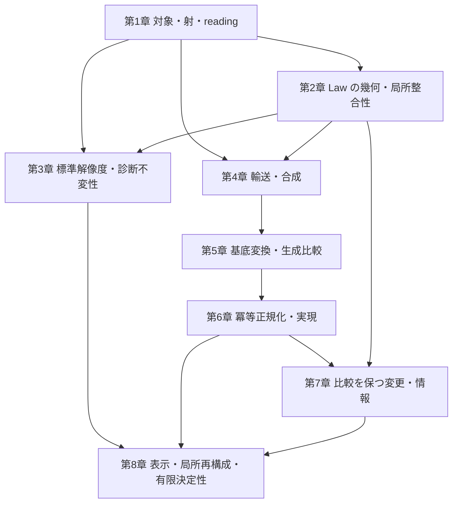

# Rising Sea — 論文構成マスター

仮題: **Foundations of Algebraic Architecture Theory**

## 1. この文書で定めること

本書は、AAT の基礎論文の主題、収録方針、章構成、各章の役割を定める。
この論文の数学内容の棚卸し、章別設計、原稿は本書に従う。構成を変更するときは、
本書へ反映してから後続文書へ適用する。

[n1012 の構想メモ](../../../docs/note/n1012_aat_unified_theory_foundations_paper_plan.md)と
[n1015 の CS 対応メモ](../../../docs/note/n1015_aat_reconstruction_cs_correspondence_design.md)
を含む `docs/note/` の文書は、検討の経緯と着想を伝える
参考資料であり、本論文の構成・収録範囲を拘束しない。

数学の定義と証明は [AAT 数学本文](../../../docs/aat/algebraic_geometric_theory/README.md)、
形式化の内容は Lean source に照合し、論文の命題と一次資料の対応を付録に置く。
共通の執筆・文献確認・レビュー・公開手順は
[論文作成ガイドライン](../../../docs/paper/guideline.md)に従う。

## 2. 論文の主題と到達像

**Atom と Law を出発点として、対象・射・局所整合性・診断・輸送・比較・再構成を備えた、
AAT の数学的基礎を一つの体系として提示する。**

相対的なアーキテクチャの対象と幾何を構成し、その局所から大域への整合性を調べる。
reading を変えると何が運ばれ、何が保存されるかを証明し、異なる構成経路を比較する。
さらに、比較を保つ変更、その選択の自由度、表示から回復できる構造を扱う。
各結果群が固有の問いに答え、共通の対象と構成を通じて結びつく論文にする。

理論は公理、定義、構成、定理、証明によって展開する。CS・ソフトウェア工学への適用では、
独立に定めた問題と意味論から AAT の入力を構成し、対応を証明して帰結を戻す。
異なる問題に同じ構成と定理が働くことによって、体系の意義を示す。

到達像は、読者が論文中の対象・写像・成立条件を理解し、自身の問題を定式化して、
新しい定理や適用を研究できることである。基本構成の存在、普遍性、合成則、
成立を妨げる反例も、この基礎を与える主要な内容として扱う。

局所再構成と有限決定性は、体系の後半を担う結果群として配置する。
基礎幾何、障害、診断不変性、輸送、比較にも、それぞれの中心的な構成と定理を置く。

## 3. 読者・形式・収録方針

想定読者は、基本的な代数と圏論を知る CS・ソフトウェア工学の研究者、および
この対象に関心を持つ数学の研究者とする。AAT の研究履歴やリポジトリの既読を前提にしない。

定理と証明を中心とする長編の理論論文とし、200 ページ級を想定する。
実際の長さは、主要な定義・証明・具体例を自立して読めるために必要な内容から決める。

収録を判断する単位は、数学的な構成・命題・証明・適用とする。
研究成果を、基本対象から主要定理へ進む依存関係に沿って再編成する。
共通の用語と記号を整え、同じ構成の重複した導入は統合する。

次の内容を本論の中心に据える。

| 結果群 | 論文で答える問い | 主な配置 |
| --- | --- | --- |
| 基礎幾何の構成 | Atom・Law・reading・operation から、どの対象・射・site・係数・幾何が構成されるか | 第1〜2章 |
| 局所整合性と障害 | 局所的な解や補正はいつ貼り合い、その失敗はどの具体的な障害類として現れるか | 第2章 |
| 解像度と診断不変性 | Law の評価を保つ reading はどう構成され、reading や被覆の変更が診断を保存する条件は何か | 第3章 |
| 輸送と基底変換 | reading 間の輸送はどの普遍性を持ち、合成や異なる構成経路とどう整合するか | 第4〜5章 |
| 正規化と比較を保つ変更 | 生成比較をどう分解でき、比較を保つ変更をどの条件で識別・構成・分類できるか | 第6〜7章 |
| 表示・局所再構成・有限決定性 | 対象・射・比較をどの表示から回復でき、その回復はいつ有限の読み取りで決まるか | 第8章 |
| CS 意味論との対応と共通帰結 | モデル同期とプロトコルの意味をどう保ち、同じ変更分類・再構成・有限決定の定理から何が導かれるか | 第1・4・7〜8章、§6 |

この表は収録する問いと結果の役割を定める。各定理には量化、仮定、結論、証明を明記する。
一般命題の証明、AAT の入力からその仮定を満たす構成、CS の問題への対応は、
それぞれの数学的仕事として記載する。

数学本文の全10部と付録を収録素材とする。Law algebra、obstruction ideal、
lawful locus など、基礎幾何を成立させる構成を第1〜2章で扱う。
derived geometry、特異性、monodromy、表現、測定、時間方向の構造は、
主定理の依存と論文の問いに応じて、本論・補足・発展課題に配置する。

後続の descent・H¹・Morita 形・幾何学的表現可能性は、展望に置く。
これは第2章で用いる局所貼り合わせや Čech 障害、第4章の合成の障害を含めた
既存の基礎構成とは、対象とする問題を区別して記述する。

## 4. 全体構成

構成は四部八章とする。以下の章番号は理論本体の番号であり、原稿全体の通し番号は
組版上の番号と区別する。

| 配置 | 内容 | 読者が得るもの |
| --- | --- | --- |
| 冒頭 | Abstract | 体系が扱う問い、主要な結果群、成立条件、意義 |
| 導入 | Introduction | CS の問題から数学的対象へ進む動機、論文全体の貢献、各部の関係 |
| 準備 | Preliminaries and Notation | 共通の数学的前提、集合と圏の大きさ、合成順序、係数と記号の規約 |
| 第I部・第1章 | 相対的アーキテクチャの構成 | Atom・Law・reading から対象、射、局所文脈、幾何を構成する方法 |
| 第I部・第2章 | Law の幾何と局所整合性 | Law algebra、lawful locus、係数、貼り合わせ、障害類の関係 |
| 第II部・第3章 | 標準解像度と診断不変性 | reading の普遍性・表示可能性と、診断を保存する変更の条件 |
| 第II部・第4章 | 輸送と合成の整合性 | core・幾何の輸送、普遍性、合成比較とその整合性 |
| 第III部・第5章 | 基底変換と生成比較 | 異なる構成経路の比較と、その存在・可逆性・診断保存の条件 |
| 第III部・第6章 | 冪等正規化と実現 | 比較の分解、像と固定点、core と完全幾何における正規化 |
| 第IV部・第7章 | 比較を保つ変更と情報 | 適合する変更の構成・分類と、観測・正規化による情報損失 |
| 第IV部・第8章 | 表示・局所再構成・有限決定性 | 独立な表示からの回復と、有限の読み取りによる決定の条件 |
| 終盤 | Related Work | 主結果ごとの近接研究、既存数学への帰属、AAT 固有の構成と帰結 |
| 結び | Conclusions and Further Directions | 各結果群が与えた答えと、体系から生じる次の数学的問題 |
| 文献 | References | 引用した原典と固定版の証明ソース |
| 付録A | Lean 形式化との対応 | 本文の命題と形式化された対象・仮定・結論の対応 |
| 付録B | 補足証明と有限例 | 本文の理解を支える補助証明、計算、例の詳細 |
| 付録C | 検証資料と再現手順 | 証明ソースの版、環境、検証方法と結果 |

### 導入と準備

Introduction は、局所整合性、reading の違い、構造の移送、比較を保つ変更という
複数の問題から、共通の対象と構成を必要とする理由を示す。
主要な結果群をそれぞれの仮定とともに予告し、具体例と証明の着想を通して全体を見渡す。
モデル同期では読取りを保ちながら更新を壊す変更、プロトコルでは操作と既存 adapter を
保つ変更を提示し、両者に共通する「許容変更の自由度と決定に必要な情報」の問いを置く。

準備節では全章で共用する前提と記号を揃える。AAT 固有の定義は第1章から導入し、
site・sheaf・コホモロジー・冪等完備化などは、使用する章で必要な内容と原典を示す。

### 第I部 — 対象を構成し、局所整合性を問う

**第1章**では、Atom、family、configuration、architecture object、Law、operation、
reading とその射を定める。局所文脈、coverage、overlap、係数を指定して幾何へ進み、
`E_geom → E_core → B` の各段が保持する対象・射・データを説明する。
ここでの `B` は底の圏、`E_core` は core の総圏、`E_geom` は幾何を備えた総圏を表す。
対象を構成するための入力と、その入力から導く性質を分けて示す。
CS との対応では、lens の状態・view・get・put、プロトコルの制御点・状態・名前付き操作・
観測を独立に定め、Atom・Law・operation への構成と読み戻しを与える。
一般の意味保存射は非可逆な写像を含み、可逆変更の群はその後に取り出す。

**第2章**では、Law の方程式から局所代数、obstruction ideal、lawful locus へ進み、
局所データの貼り合わせと障害を構成する。イデアルによる方程式の読みと、
選択した係数でのコホモロジーの読みは、それぞれの定義と比較写像を通じて接続する。
具体的な局所データから障害類が生じる過程、消滅から補正や貼り合わせを得る条件、
構造相・意味相の役割を扱う。SAGA の比較結果は、採用する係数と入力の対応を示して配置する。

### 第II部 — reading の変更と輸送を扱う

**第3章**では、Law 評価を保持する標準解像度、その普遍性と admissible reading による
表示可能性を扱う。続いて、被覆・係数・解像度の比較から診断不変性を述べ、Atlas の
結果と一様不変性の判定を位置づける。十分条件、必要十分条件、反例の役割を明示する。

**第4章**では、exact な reading 変更に沿う core の輸送を、存在と普遍性から構成する。
幾何への輸送、段をまたぐ整合性、単位と合成、合成比較の選択と障害へ進む。
各段で輸送するデータと、それを保証する仮定を示す。
CS への適用では、読み出しと更新の同時保存、名前付き操作と adapter の可換図式を用い、
許容する変更の合成と AAT 側の合成との対応を示す。

診断不変性と輸送は、共通の基礎から分かれる二つの結果群として展開する。
両者を結ぶ箇所では、実際の比較写像と保存命題を与える。

### 第III部 — 構成経路を比較し、正規化を調べる

**第5章**では、移送と制限などの二つの構成経路を、型の揃った比較射として定める。
doctrine の積、基底変換、exact・refinement の各条件を整理し、比較射の生成経路を追う。
比較の存在、可逆性、診断の保存は、それぞれ対応する命題で判断する。

**第6章**では、生成比較の可逆な部分と冪等な正規化因子への分解から、像、固定点、
冪等完備化における実現を記述する。core と完全幾何の各結果を、保持するデータと
射影を明示して結ぶ。正規化の関手性、包含や射影の自然性は個別に扱い、
成立する合成則と自然性を妨げる反例を共に配置する。

### 第IV部 — 変更を分類し、表示から回復する

**第7章**では、比較を保つ端点変更を群とその作用によって記述する。
元の比較と正規化後の比較、全端点変更と底を固定する変更、ambient な核と比較保存群への
制限の核を区別する。適合する持ち上げの構成、各 fiber の分類、観測による判定条件を述べ、
実生成比較に適用する。同じ正規化後の変更に適合・不適合な持ち上げが現れる結果は、
入力と導出を揃えた系として収録を検討する。

CS への主要な帰結として、操作が隠れ状態を恒等に運ぶグラフ上の変更を分類する。
操作保存を連結成分ごとの置換族へ帰着し、分裂短完全列、section、各可視変更上の
核の torsor を求める。lens の全域 put と独立セッションのプロトコルへ同じ定理を適用し、
操作による結びつきが変更の自由度を決めることを示す。対象と結論は §6.4 に定める。

**第8章**では、独立に定めた実現と表示の対応から、対象・射・比較を回復する。
対象の表示可能性と射の表示可能性を区別し、次の三つを接続する。

1. 指定した入力族における有限表示と Karoubi 再構成。
2. 整合する局所データの族からの再構成と、比較・正規化・分類との整合。
3. 有限読み取りの区別・延長・実効性、およびそれぞれの成立条件と不可能性。

CS の一般射については、lens の基準 fiber 上の任意の写像と、プロトコルの生成辺・観測を
保つ頂点ごとの写像から、意味保存射を制限・延長によって回復する。
有限表示による圏同値、冪等射の分裂、retract・射の圏への再構成と、整合する局所表示からの
再構成を可換図式で結ぶ。同じ対応で比較保存群とその section・核・fiber を運ぶ。

有限決定性は、一般射の有限 table による回復と、§6.4 の可逆変更族に対する
連結成分による判定を二層に分けて扱う。全域 put が基準 fiber 一つでの決定を与えること、
プロトコルでは各成分から一頂点を読むことが十分になることを、同じ判定から導く。
タグ変更族では、全有限片の整合族からの回復と、一つの有限読み取りでは区別できない
ことを同時に扱う。局所片の有限性、添字全体の有限性、有限個の読み取りでの決定を区別する。
一般再構成原理と、AAT のデータからその仮定を満たす構成を、別々に証明する。

### 関連研究・結論・付録

Related Work では、主結果ごとに近接する原典を確認し、
対象、仮定、許容射、保持する構造、結論を比較する。既存数学への帰属は初出にも記し、
AAT 固有の入力構成、仮定の導出、適用による帰結を具体的に述べる。

結論では、基礎幾何、障害、不変性、輸送、比較、再構成の各結果が答えた問いをまとめる。
Further Directions では、本文の対象と構成から述べられる後続問題を選ぶ。
SFT や ArchSig への展開も、必要な接続と数学的な問いを特定して位置づける。

主要な定義、仮定、証明の筋道、CS との対応命題は本文に置く。
付録Aには命題番号と Lean 宣言・固定版の対応を、付録Bには補助証明と計算を、
付録Cには環境・検証・再現の情報を置く。複数の宣言から導く命題と未形式化の命題も、
対応する範囲を明記する。

## 5. 章間の接続と読書経路

次の図は、章で導入した構成を後続へ渡す関係を表す。
個々の定理の証明依存は、対応する定理・補題への参照で明示する。

診断を主に読む経路は第1〜3章、輸送と生成比較は第1・2・4〜6章、
変更の分類と再構成は必要な基礎を受け取った第6〜8章とする。
各章の冒頭で、既出の何を用い、その章で何を新しく構成するかを示す。

## 6. CS との対応と具体例

各節で、扱う数学と CS・ソフトウェア工学の問いとの関係を示す。
具体的な適用では、次の論証を揃える。

**独立した問題・意味論 → AAT の入力の構成 → 対応命題 → 共通定理 → 元の問題への帰結。**

対応命題は同値・含意・保存の向きを明示する。対応の構成や証明が主要な仕事を担う場合は、
本文の主要結果として扱う。計算可能性、計算量、実用上の効果を述べる場合は、
その主張に必要なアルゴリズム、解析、実験を選ぶ。

### 6.1 モデル同期 — 読取りと更新を保つ変更

view の集合 `V` と基準値 `v₀` を固定し、状態集合 `C`、読取り `g:C→V`、
更新 `p:C×V→C` を持つ全域 lens を扱う。対象条件は次の三法則と、
基準 fiber `K_L={c∈C | g(c)=v₀}` の有限性とする。`V` 自体は無限でもよい。

\[
 p(c,g(c))=c,\qquad g(p(c,v))=v,\qquad p(p(c,v),w)=p(c,w).
\]

固定 view 上の一般の意味保存射は、`g'h=g`、`h(p(c,v))=p'(h(c),v)` を満たす関数 `h` とする。
三法則から `c↦(g(c),p(c,v₀))` による積表示 `C≃V×K_L` を与え、
基準 fiber への制限と、任意の写像 `t:K_L→K_L'` の延長

\[
 \operatorname{ext}(t)(c)=p'\bigl(t(p(c,v_0)),g(c)\bigr)
\]

が互いに逆になることを示す。この対応により有限集合間の table から一般射を回復する。

可視変更 `u:V≃V` に追随する可逆変更 `h:C≃C'` には、同じ `h,u` による
`g'h=ug` と `h(p(c,v))=p'(h(c),u(v))` の同時成立を要求する。
積表示での形 `h(v,k)=(u(v),φ(k))` により、変更を一つの補完の全単射 `φ` で記述する。
`u` は `v₀` を固定する必要がない。

`V=K=Bool` の積 lens で `h(v,k)=(v,k⊕v)` を取る例を導入に置く。
この変更は get を保つが put を保たず、可視変更を恒等に固定したとき、
get のみを保つ変更 4 個のうち get・put を共に保つものは 2 個になる。
この差を、第7章の変更分類と第8章の有限決定性へつなぐ。

### 6.2 プロトコル — 名前付き操作と adapter を保つ変更

有限有向多重グラフ `Q` と有限個の経路等式 `L` から実行圏 `C_Q` を定める。
観測先の関手 `O:C_Q→Set` を固定し、各制御点の状態が有限である関手 `X:C_Q→Set` と
自然変換 `o:X→O` を実現とする。一般射 `a:X→Y` は観測を保つ自然変換とし、
非可逆な adapter も含める。観測値の集合は無限でもよい。

有限表示は、制御点ごとの状態 table、名前付き生成辺の作用、各状態の観測値、
経路等式から構成する。一般射は、生成辺 `e:v→w` ごとの
`a_w X(e)=Y(e)a_v` と `o_Y(v)a_v=o_X(v)` を満たす頂点 table から回復し、
経路帰納によって全実行へ延長する。異なる操作名は、状態写像が同じ場合にも保持する。

adapter `q:X→Y` と `q':X'→Y'` に対する変更 `a:X→X'`、`b:Y→Y'` の条件を
`b∘q=q'∘a` とする。各頂点でのこの等式と操作保存から、全実行との整合を示す。
可逆変更の分類では `a,b` を同型に制限し、adapter 自体は一般射のまま扱う。
操作名を変える版では、グラフ自己同型と経路等式・観測の輸送を別の入力として定める。

### 6.3 CS 意味論から AAT の比較への対応

第1章で導入する対応では、型・役割・操作名を Atom 側に、状態 carrier と実行の値を
Source・対象・局所実現側に配置する。lens の読取り・更新とプロトコルの名前付き実行を
operation として構成し、三法則・経路等式・観測の保存を Law と射の条件に対応させる。
射の許容条件は CS 側のデータから定め、構成と読み戻しの両逆を示す。
非単射な状態写像や補完 table も、この対応の対象に含める。

lens の同時保存は、get と put をまとめた射
`c_L:C⊔(C×V)→V⊔C` と、連動する端点変更 `h⊔(h×u)`、`u⊔h` の可換図式で表す。
同じ状態 carrier が現れる各箇所に同じ `h` を作用させる条件を、許容変更の部分群として
保持する。プロトコルでは名前付き操作の可換図式と adapter の図式を保持する。
これらを第4章の合成、第7章の比較保存群、第8章の表示へ接続する。

完全幾何への対応では、context・coverage・overlap・係数・raw restriction・
Support・Axis・Observable を構成し、それぞれの保存則を示す。
比較群を運ぶ箇所では、充満忠実な関手による比較群の同型と、底を固定する条件や
CS の許容条件への制限を明記する。実生成比較と正規化に沿って、section、制限の核、
ambient な核、lift fiber のどれを回復するかを揃える。

### 6.4 二つの問題で共有する変更分類

共通定理の入力は、有向多重グラフ `Q=(V,E,s,t)`、隠れ状態の集合 `K`、
許容する可視変更群 `H≤Aut(Q)` とする。状態は `V×K`、観測は `(v,k)↦v`、
各名前付き辺 `e:v→w` の操作は `(v,k)↦(w,k)` と定める。

`u∈H` 上の観測保存変更は、頂点ごとの置換を用いて `h(v,k)=(u_V(v),φ_v(k))` と一意に書ける。
操作保存は各辺での `φ_{s(e)}=φ_{t(e)}` と同値になり、向きを忘れた連結成分 `π₀(Q)`
ごとの置換族へ降下する。操作も保つ組 `(u,h)` の群を `A_Q` とすると、

\[
 1\longrightarrow\prod_{j\in\pi_0(Q)}\operatorname{Sym}(K)
 \longrightarrow A_Q\longrightarrow H\longrightarrow1
\]

は、隠れ状態を変えない変更を section として分裂する。
各 `u` 上の変更の集合は核の torsor であり、`V,K` が有限なら個数は
`(|K|!)^{|π₀(Q)|}` になる。`H` の連結成分への作用を合成に含め、半直積として記述する。

積 lens はすべての view 間の put を辺とする連結な入力であり、核は `Sym(K)` となる。
プロトコルには、各制御点の状態を同じ `K`、各生成辺の状態作用を恒等とする
セッションモデルを代入し、連結成分ごとに独立な補完の変更を得る。
この共通分類の適用範囲は、ここに定めた辺の作用を持つ入力とする。

基準補完 `k₀` を保つ版では `Sym(K)` を `k₀` の固定部分群に置き換える。
lens 側では、`g(s(v))=v`、`p(s(v),w)=s(w)` を満たす選択 section `s:V→C` の保存に対応する。
`V=Bool`、`K={0,1,2}`、`k₀=0` の有限例では、get と選択値を保つ変更 4 個のうち
put も保つものは 2 個になる。ここでも可視変更は恒等に固定する。
プロトコルの有限例は、頂点 `{0,1,2,3}`、辺 `0→1` と `2→3`、`K=Bool` とする。
可視変更を恒等に固定すると、観測保存変更 16 個のうち操作も保つものは 4 個であり、
二つの辺を交換する可視変更の上でも追随変更は 4 個となる。

### 6.5 再構成と有限決定によって CS へ戻す帰結

第8章では、lens の有限基準 fiber とプロトコルの有限生成 table による再構成を、
整合する局所データからの再構成と対応させる。一般の意味保存射を含む圏同値を与え、
冪等射の分裂、Karoubi 再構成、retract、射の圏への拡張を同じ対応で結ぶ。
比較保存群の輸送も整合させ、表示側から元の変更の自由度を回復する。

有限読み取りには次の三性質を別々に定める。

| 性質 | 意味と、CS の帰結として示すこと |
| --- | --- |
| 区別 | 読み取りが対象とする射・変更の集合上で単射であり、同じ有限データから異なる射を取り違えない |
| 延長 | 有限片の独立な整合条件を満たす任意のデータから、全域の射・変更を構成できる |
| 実効性 | 列挙可能な有限入力と必要な等号判定を指定し、整合判定と延長を計算できる |

一般射の層では、lens は基準 fiber の任意の table が意味保存射へ延長する。
プロトコルは、全頂点・状態の table における型、生成辺、観測の整合条件から延長する。
どちらも制限・延長の両逆を示す。実効性には状態・生成辺の列挙と必要な等号判定を
入力として指定し、有限性の存在命題から計算手続きを得たことにはしない。

§6.4 の可逆変更族では、可視変更 `u` を固定し、有限頂点集合 `S⊆V` で隠れた置換を読む。
`|K|≥2` のもとで、次の同じ判定を両方の CS 問題へ適用する。

- 区別の必要十分条件は、`S` が全連結成分と交わることである。
- 延長の必要十分条件は、同じ連結成分にある `S` の任意の二頂点が、`S` 上の誘導グラフでも
  結ばれることである。局所整合条件は、両端が `S` にある辺での置換の一致とする。
- 区別と延長を満たす有限決定集合が存在する必要十分条件は、`π₀(Q)` の有限性である。
  各成分から一頂点を選べば決定集合となる。

この判定で数えるのは読み取る頂点であり、一つの読み取りの値は `K` 上の置換全体である。
有限量の table による決定には、さらに `K` の有限性を明示する。
lens では基準 fiber 上の置換 table、上記セッションモデルでは各成分の代表頂点における
置換 table が変更を決める。有限の頂点・辺・隠れ状態を明示的に列挙した入力では、
整合判定と延長の計算も示す。一般のプロトコル射には、前段の頂点・生成辺 table による
再構成を適用する。

同一定義で扱うタグ変更族では、二元巡回群 `C₂` を用いて、全有限制限の整合族との群同型

\[
 C_2^{\Omega}\cong\varprojlim_{S\subseteq_{\mathrm{fin}}\Omega}C_2^S
\]

を与える。
`Ω` が無限なら、どの有限集合の外でも変更を残せるため有限読み取りによる区別は成立しない。
全有限片からの再構成と有限決定性の違いを、lens・プロトコルの成立条件と並べて説明する。

### 6.6 例の選び方と配置

例は、定義の理解、仮定の必要性、定理の帰結を示すために必要な箇所へ置く。
設定と計算をその箇所で理解できる規模に保ち、章を進むごとに一つのシステム例へ
設定を積み重ねる構成は採らない。論文全体の連続性は、定義・構成・定理の接続によって示す。

| 役割 | 使い方 |
| --- | --- |
| 定義や構成の理解を助ける小さな例 | その箇所で必要な対象・写像・計算に絞り、導入した数学の働きを示す |
| 仮定の実質を示す有限例・反例 | どの仮定がどの結論に必要かを、実際の対象・写像・障害で示す |
| 異なる問題への共通定理の適用 | 再利用した証明、共通に導いた成立条件、問題間で移せる帰結を特定する |

例の採用は、その例によって何が理解できるかと、設定を読む負担との釣り合いで決める。
再使用する場合も、その箇所で必要な設定を短く示す。本文には理解と論証に必要な計算を置き、
補助的な計算の詳細は付録に置く。

lens とプロトコルの意味論・対応命題・CS への帰結は、対応する結果を扱う節に配置する。
共有するのは操作保存式の導出、変更分類、再構成と有限決定の判定であり、
各問題から共通定理の入力を作る対応も本文の数学的内容に含める。
lens の三法則と定数補完、schema の関手意味論、一般的な圏同値・核・torsor の結果は
それぞれの原典に帰属させ、AAT 固有の入力構成と比較・正規化への接続を明記する。
