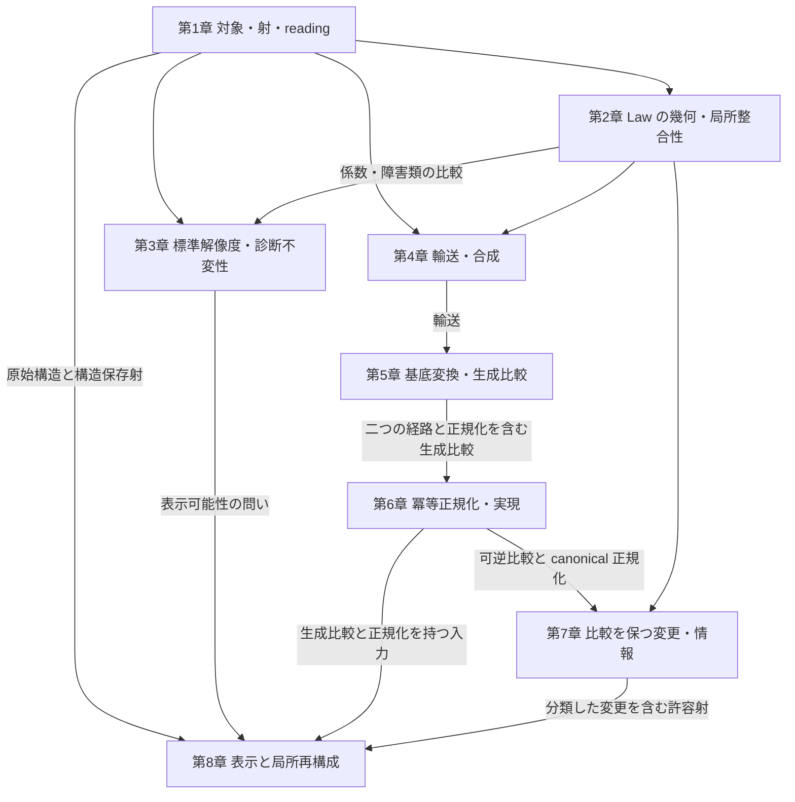

# Rising Sea — 論文構成マスター

**Foundations of Algebraic Architecture Theory**

*A Rising Sea of Geometry, Transport, Comparison, and Reconstruction*

## 1. この文書で定めること

本書は、AAT の基礎論文の主題、収録方針、章構成、各章の役割を定める。
この論文の[数学内容の棚卸し](mathematics-inventory.md)、章別設計、原稿は本書に従う。構成を変更するときは、
本書へ反映してから後続文書へ適用する。

[n1012 の構想メモ](../../../docs/note/n1012_aat_unified_theory_foundations_paper_plan.md)と
[n1015 の CS 対応メモ](../../../docs/note/n1015_aat_reconstruction_cs_correspondence_design.md)
を含む `docs/note/` の文書は、検討の経緯と着想を伝える
参考資料であり、本論文の構成・収録範囲を拘束しない。

数学の定義と証明は [AAT 数学本文](../../../docs/aat/algebraic_geometric_theory/README.md)、
形式化の内容は Lean source に照合し、論文の命題と一次資料の対応を付録に置く。
共通の執筆・文献確認・レビュー・公開手順は
[論文作成ガイドライン](../../../docs/paper/guideline.md)に従う。

## 2. 論文の主題と到達像

**Atom と Law を出発点として、対象・射・局所整合性・診断・輸送・比較・再構成を備えた、
AAT の数学的基礎を一つの体系として提示する。**

相対的なアーキテクチャの対象と幾何を構成し、その局所から大域への整合性を調べる。
reading を変えると何が運ばれ、何が保存されるかを証明し、異なる構成経路を比較する。
さらに、比較を保つ変更、その選択の自由度、表示から回復できる構造を扱う。
各結果群が固有の問いに答え、共通の対象と構成を通じて結びつく論文にする。

理論は公理、定義、構成、定理、証明によって展開する。CS・ソフトウェア工学への適用では、
独立に定めた問題と意味論から AAT の入力を構成し、対応を証明して帰結を戻す。
異なる問題に同じ構成と定理が働くことによって、体系の意義を示す。

到達像は、読者が論文中の対象・写像・成立条件を理解し、自身の問題を定式化して、
新しい定理や適用を研究できることである。基本構成の存在、普遍性、合成則、
成立を妨げる反例も、この基礎を与える主要な内容として扱う。

表示と局所再構成を、初版の体系の到達点に置く。
基礎幾何、障害、診断不変性、輸送、比較にも、それぞれの中心的な構成と定理を置く。

## 3. 読者・形式・収録方針

想定読者は、基本的な代数と圏論を知る CS・ソフトウェア工学の研究者、および
この対象に関心を持つ数学の研究者とする。AAT の研究履歴やリポジトリの既読を前提にしない。

日本語原稿で内容を確定し、同じ内容の英語版へ翻訳して投稿・公開する。
日本語原稿は、公開する英語論文の執筆・レビュー用の下書きとする。

AAT は新しい理論であり、基本対象と言語、構成と定理の関係を、論文自身の中で
確立する必要がある。個別の小さな成果を小出しにする形ではなく、基礎部分を一本の
論文にまとめ、公理・定義から基本構成の存在・普遍性・合成則、主要定理とその証明までを
体系的に展開する。そのうえで、既存の CS の問題との意味論的な対応を示し、
それらを一般理論の特殊な場合として包括する。異なる問題の成立条件や解の分類が
共通の構成と定理から導かれるところまで、基礎を一体として提示する。

これは、理論の水位を上げることで個々の問題を包み込む **Rising Sea** の思想である。
本論文を **AAT にとっての Tohoku** と位置づけ、後続の研究者が同じ基礎の上で
新しい問題を定式化し、定理や適用を展開できるようにする。この役割を果たすために、
定理と証明を中心とする長編の理論論文とし、200 ページ級を想定する。
実際の長さは、主要な定義・証明・CS との対応を自立して読めるために必要な内容から決める。

収録を判断する単位は、数学的な構成・命題・証明・適用とする。
研究成果を、基本対象から主要定理へ進む依存関係に沿って再編成する。
共通の用語と記号を整え、同じ構成の重複した導入は統合する。

初版（arXiv v1）は、基礎幾何、障害と診断の比較、輸送、生成比較と正規化、
変更の分類、表示と局所再構成を収録する。要旨・序論・結論は局所再構成までの成果で完結させる。

改訂版（v2）には、局所再構成と投影・正規化・比較群との整合、有限決定性と
具体的帰結を追加する。初版ではこれらを展望に置く。
各族の有限表示・有限決定の個別結果は、その入力と証明を独立に述べられるものを
初版の例・系・補足にも使う。

次の内容を本論の中心に据える。

| 結果群 | 論文で答える問い | 主な配置 |
| --- | --- | --- |
| 基礎幾何の構成 | Atom・Law・reading・operation から、どの対象・射・site・係数・幾何が構成されるか | 第1〜2章 |
| 局所整合性と障害 | 局所的な解や補正はいつ貼り合い、その失敗はどの具体的な障害類として現れるか | 第2章 |
| 解像度と診断不変性 | Law の評価を保つ reading はどう構成され、診断が指定障害類の零性を判定し、その判定を reading 変更に沿って保つ条件は何か | 第3章 |
| 輸送と基底変換 | reading 間の輸送はどの普遍性を持ち、合成や異なる構成経路とどう整合するか | 第4〜5章 |
| 正規化と比較を保つ変更 | 生成比較をどう分解でき、比較を保つ変更をどの条件で識別・構成・分類できるか | 第6〜7章 |
| 表示と局所再構成 | 原始構造の読み取りと独立な整合条件から、対象と構造保存射をどう再構成するか | 第8章 |
| CS 意味論との対応と共通帰結 | モデル同期とプロトコルの意味をどう保ち、同じ変更分類と局所再構成の定理から何が導かれるか | 第1・4・7〜8章、§6 |

この表は収録する問いと結果の役割を定める。各定理には量化、仮定、結論、証明を明記する。
主要定理は、AAT の入力から対象・射・比較を構成し、その性質と帰結を得る形で述べる。
一般命題の証明、AAT の入力からその仮定を満たす構成、CS の問題への対応は、
それぞれの数学的仕事として記載する。一般原理は構成の証明に必要な位置へ置き、
独立した数学的価値を持つ一般定理には、その問いと結論に応じた位置を与える。

数学本文の全10部と付録を収録素材とする。Law algebra、obstruction ideal、
lawful locus など、基礎幾何を成立させる構成を第1〜2章で扱う。
derived geometry、特異性、monodromy、表現、測定、時間方向の構造は、
主定理の依存と論文の問いに応じて、本論・補足・発展課題に配置する。

後続の descent・H¹・Morita 形・幾何学的表現可能性は、展望に置く。
これは第2章で用いる局所貼り合わせや Čech 障害、第4章の合成の障害を含めた
既存の基礎構成とは、対象とする問題を区別して記述する。

## 4. 全体構成

構成は四部八章とする。以下の章番号は理論本体の番号であり、原稿全体の通し番号は
組版上の番号と区別する。

| 配置 | 内容 | 読者が得るもの |
| --- | --- | --- |
| 冒頭 | Abstract | 体系が扱う問い、主要な結果群、成立条件、意義 |
| 導入 | Introduction | CS の問題から数学的対象へ進む動機、主要構成とその帰結、各部の関係 |
| 準備 | Preliminaries and Notation | 共通の数学的前提、集合と圏の大きさ、合成順序、係数と記号の規約 |
| 第I部・第1章 | 相対的アーキテクチャの構成 | Atom・Law・reading から対象、射、局所文脈、幾何を構成する方法 |
| 第I部・第2章 | Law の幾何と局所整合性 | Law の幾何・貼り合わせ・障害類の対応と意味的修復 |
| 第II部・第3章 | 標準解像度と診断不変性 | reading の普遍性・表示可能性、診断不変性、障害類との比較 |
| 第II部・第4章 | 輸送と合成の整合性 | core・幾何の輸送、普遍性、合成比較とその整合性 |
| 第III部・第5章 | 基底変換と生成比較 | 同じ入力から生成される二経路と実比較、その成立条件 |
| 第III部・第6章 | 冪等正規化と実現 | 生成比較の正規化分解・可逆性分類と冪等像での実現 |
| 第IV部・第7章 | 比較を保つ変更と情報 | 正規化後の情報による識別条件、適合する持ち上げの構成と全選択肢の分類 |
| 第IV部・第8章 | 表示と局所再構成 | 原始データと局所整合条件からの完全幾何・全構造保存射の再構成 |
| 終盤 | Related Work | 主結果ごとの近接研究、既存数学への帰属、AAT 固有の構成と帰結 |
| 結び | Conclusions and Further Directions | 各結果群が与えた答えと、体系から生じる次の数学的問題 |
| 文献 | References | 引用した原典と固定版の証明ソース |
| 付録A | Lean 形式化との対応 | 本文の命題と形式化された対象・仮定・結論の対応 |
| 付録B | 検証資料と再現手順 | 証明ソースの版、環境、検証方法と結果 |
| 付録C | AI利用の開示 | 研究の主導と責任の所在、定理証明・理論構築・執筆でのAIの役割 |

### 導入と準備

Introduction は、局所整合性、reading の違い、構造の移送、比較を保つ変更という
複数の問題から、共通の対象と構成を必要とする理由を示す。
「主要構成とその帰結」節では、各結果群の入力、新しく作る対象・写像、
その構成が答える問いを、主要な成立条件とともに示す。障害類と修復、診断比較、
生成比較の正規化、変更の分類、表示からの回復をそれぞれの主要定理へ結びつけ、
どの構成の出力を後続の入力に用いるかを予告する。具体例と証明の着想を通して全体を見渡す。
モデル同期では読取りを保ちながら更新を壊す変更、プロトコルでは操作と既存 adapter を
保つ変更を提示し、両者に共通する「許容変更の自由度と決定に必要な情報」の問いを置く。

準備節では全章で共用する前提と記号を揃える。AAT 固有の定義は第1章から導入し、
site・sheaf・コホモロジー・冪等完備化などは、使用する章で必要な内容と原典を示す。

### 第I部 — 幾何と局所整合性

**第1章**では、Atom、family、configuration、architecture object、Law、operation、
reading とその射を定める。局所文脈、coverage、overlap、係数を指定して幾何へ進み、
`E_geom → E_core → B` の各段が保持する対象・射・データを説明する。
ここでの `B` は底の圏、`E_core` は core の総圏、`E_geom` は幾何を備えた総圏を表す。
対象を構成するための入力と、その入力から導く性質を分けて示す。
CS との対応では、lens の状態・view・get・put、プロトコルの制御点・状態・名前付き操作・
観測を独立に定め、Atom・Law・operation への構成と読み戻しを与える。
一般の意味保存射は非可逆な写像を含み、可逆変更の群はその後に取り出す。

**第2章**では、Law の方程式から局所代数、obstruction ideal、lawful locus へ進み、
局所データの貼り合わせと障害を構成する。イデアルによる方程式の読みと、
選択した係数でのコホモロジーの読みは、それぞれの定義と比較写像を通じて接続する。
具体的な局所データから障害類が生じる過程、消滅から補正や貼り合わせを得る条件、
構造相・意味相の役割を扱う。
章末の「意味的な局所修復と方程式の障害類」では、SAGA の構成を用いて、
意味側と方程式側で独立に生成した係数・複体・指定障害類を比較する。
係数比較から障害類の対応を導き、所定の貼り合わせ条件の下で零類から大域的修復を得る。
この「障害類の対応と大域的修復」を、第1〜2章の構成を集約する主要結果として置く。
第3章へは、生成子・関係式から作る整数係数の障害 sheaf と、その係数を持つ局所状態・
アフィン遷移を渡す。局所状態の実際の制限と遷移から mismatch を計算し、
既存の Čech 障害類に対応させる。この具体的な障害を、次章で Law 評価から生成する診断へ結ぶ。

### 第II部 — 診断と輸送

**第3章**では、Law 評価を保持する標準解像度、その普遍性と admissible reading による
表示可能性を扱う。続いて Law の評価から診断係数と実際の比較写像を生成し、
被覆・係数・解像度の比較に基づく Atlas の結果、正例と反例、一様不変性の判定へ進む。
章末の「障害の読み取りと診断比較」では、前章の整数係数の障害と、本章の有理数値の
Law-value 診断を、同じ Atom・Law・被覆の入力から比較する。生成子・関係式による係数写像を
次数0–2の cochain 比較へ持ち上げ、微分との可換性から加法的な H¹ 写像を得る。
任意の許容局所データについて、実際の制限とアフィン遷移から生じる指定障害類が、
同じデータの Law 評価から生成する診断類へ送られることを示す。

同じ Law-value を持つ生成子が関係式で結ばれる条件と、各値の代表を全 chart で読める
条件の下で、診断類と指定障害類の零性が同値になる。証明では、有理数値の補正の辺差が
整数であることを使い、整数部分を取って障害側の補正を構成する。
粗い reading から細かい reading への実際の被覆 refinement に沿う比較平方と類の輸送を示し、
Atlas の条件 C から障害の零性の不変性を導く。
採用入力は点と Law の生成子を同じ Atom carrier に収め、非空の chart・overlap と
異なる三つの chart の交差が空であると示した有限被覆を持つ。非単射の reading factor、3 chart から4 chartへの
refinement、零障害と非零障害を生む二つの局所データを同じ入力で扱う。
零障害例には非零の mismatch が補正で消える場合を用い、類による判定の意味を示す。

**第4章**では、exact な reading 変更に沿う core の輸送を、存在と普遍性から構成する。
幾何への輸送、段をまたぐ整合性、単位と合成、合成比較の選択と障害へ進む。
各段で輸送するデータと、それを保証する仮定を示す。
CS への適用では、読み出しと更新の同時保存、名前付き操作と adapter の可換図式を用い、
許容する変更の合成と AAT 側の合成との対応を示す。

診断不変性と輸送は、共通の基礎から分かれる二つの結果群として展開する。
両者を結ぶ箇所では、実際の比較写像と保存命題を与える。

### 第III部 — 比較と正規化

**第5章**では、移送と制限などの二つの構成経路を、型の揃った比較射として定める。
doctrine の積、基底変換、exact・refinement の各条件を整理し、比較射の生成経路を追う。
比較の存在、可逆性、診断の保存は、それぞれ対応する命題で判断する。
章末の「二つの経路と正規化を含む生成比較」で、第4章の輸送と本章の基底変換を用い、
同じ入力から二経路を生成して、端点・比較射・core への射影を揃える。
canonical な可逆比較、authored な比較、正規化因子を含む生成比較の役割と生成元を定め、
第6章で分析する対象を構成する。

**第6章**では、「生成比較の正規化分解と可逆性分類」を主要定理に据える。
第5章と同じ square・cell・cochain・係数・source geometry から生成した完全幾何の比較を、
可逆な比較と冪等な正規化因子へ分解する。正規化因子による可逆性判定、
core への射影との整合、冪等完備化における像の同型としての実現を述べる。
証明では configuration の固定点、total 射の冪等性、冪等完備化の一般構成、
完全幾何への持ち上げを順に用いる。
正規化の関手性、包含や射影の自然性を個別に扱い、成立する合成則と自然性の反例によって、
生成した正規化が保つ構造と、自然性に必要な条件を明らかにする。

### 第IV部 — 分類と再構成

**第7章**では、第6章の比較対象から比較保存群を取り出し、底を固定する比較保存群を
比較対象の自己同型のうち、両端の射が底への射影で恒等射となるものの群として同定する。
全端点変更と底を固定する変更を扱い、
正規化に沿う準同型、観測による判定条件、適合する持ち上げの分類へ進む。
core 正規化による比較群の移送は、正規化が誘導する写像を構成する位置に置く。

到達点は「正規化後の変更の識別と持ち上げ」節とする。同じ生成データから得られた
完全幾何の canonical な可逆比較と、その canonical 正規化を対象とする。
admissible な入力から、比較保存群間の制限準同型の section と、ambient な核に属しながら
元の比較を壊す変更を構成する。任意の正規化後の適合変更について、同じ読みを持つ
適合・不適合な持ち上げを与え、適合する持ち上げ全体を制限準同型の核の torsor として
分類する系を導く。識別に必要な情報、適合する変更の構成、その全選択肢を同じ比較について述べる。

CS への主要な帰結として、操作が隠れ状態を恒等に運ぶグラフ上の変更を分類する。
操作保存を連結成分ごとの置換族へ帰着し、分裂短完全列、section、各可視変更上の
核の torsor を求める。lens の全域 put と独立セッションのプロトコルへ同じ定理を適用し、
操作による結びつきが変更の自由度を決めることを示す。対象と結論の詳細は数学内容の棚卸しに置く。

**第8章**は、完全幾何の圏と、原始データから独立に定めた局所モデルの圏との同値を主要定理に据える。
対象の表示可能性と射の表示可能性を区別し、次の順に展開する。

1. 有限表示から回復する対象と射、固定表示間の射の成立条件と有限対象での反例。
2. 有限片と型付き関数 graph、および分離・組立てによる一般再構成原理。
3. 完全幾何の局所モデルとその組立て、全 Hom の両逆と対象の同型による主同値。
4. 行内送金システムの刷新への適用、タグ変更・正規化・生成比較の回復。
5. 同じ再構成原理の既存 CS 意味論への適用と、有限表による再構成。
6. 有限なモデルでの情報の十分性、有限の検査手順、計算費用の区別。
7. 無限対象を許す場合の表示・再構成の反例を補足として記述。

実現圏の射には、指定した構造を保つすべての写像を含める。局所値は型付き図式・table・
パラメータ参照から有限に組み立て、添字全体には無限を許す。局所モデルの対象・射は、
制限・overlap・operation・Law・係数の等式として独立に定めた整合族とし、恒等・合成を成分ごとに構成する。
一般の分離・組立て原理と、AAT の入力からその仮定を満たす証明を順に与える。

主定理の適用は、口座・送金・会計が分担する行内送金システムの設計記述で説明する。
必要な原始データと条件を指定したうえで、全体のモデルと旧設計からの構造保存射を構成する。
さらに、タグ族の canonical 正規化と全 source-choice 変更、
生成比較の族の元の比較・正規化・端点自己同型を回復する。

lens とプロトコルの入力・局所モデル・組立ては、これらの後の CS 適用節にまとめる。
独立に定めた意味保存射の全範囲について分離と組立てを証明し、一般再構成原理から圏同値を得る。
lens の基準 fiber 上の写像と、プロトコルの生成辺・観測を保つ頂点写像による有限再構成を示し、
原始読み取りによる同値および Karoubi・retract・Arr との整合を述べる。

有限資源の実装を扱う際には、モデルの型・係数・contextと読み取り範囲を指定し、
全体表による回復、選んだ部分からの一意な延長、検査の計算手順と費用を区別する。
無限の自己同型族に対する可算構文の非全射性と、無限のタグ族に対する有限片の限界は補足に置く。
無限集合と許す射・読み取り方式への依存を明示し、有限資源の実装の不可能性とは区別する。
共通の主同値と投影・正規化・変更分類との整合、および同じ読み取りによる有限決定の体系化は、
改訂版で追加する結果群として展望へ渡す。

### 関連研究・結論・付録

Related Work では、主結果ごとに近接する原典を確認し、
対象、仮定、許容射、保持する構造、結論を比較する。既存数学への帰属は初出にも記し、
AAT 固有の入力構成、仮定の導出、適用による帰結を具体的に述べる。

結論では、基礎幾何、障害、不変性、輸送、比較、再構成の各結果が答えた問いをまとめる。
Further Directions では、本文の対象と構成から述べられる後続問題を選ぶ。
局所再構成と投影・正規化・全比較群の整合、区別・延長・実効性の
共通の定義と判定、タグ・lens・プロトコルへの接続を改訂版の課題として具体的に述べる。
SFT や ArchSig への展開も、必要な接続と数学的な問いを特定して位置づける。

主要な定義、仮定、証明の筋道、CS との対応命題は本文に置く。
補助証明、計算、例も本文の必要な箇所に置く。
付録Aには命題番号と Lean 宣言・固定版の対応を、
付録Bには環境・検証・再現の情報を置く。
本文の対象・量化・仮定・結論は、対応するLean宣言に合わせる。
Issue #4847で著者が個別に認めたA/B型の例外は、その対象と根拠を区別して記録する。
この例外を他の主張や今後の執筆へ適用しない。
障害・診断比較について、付録Aには係数・cochain 比較、既存障害類との一致、零性同値、
reading 変更の可換平方と類の輸送を対応づける。
付録Bにはこれらの証明ソースの固定版と検証記録を置く。
付録CにはAI利用の開示を200〜800字で置く。研究の主導と責任の所在、
定理証明・理論構築・執筆でのAIの役割、詳細な利用記録の所在を記し、
本文からの参照は置かない。

## 5. 章間の接続と読書経路

次の図は、章で導入した構成を後続へ渡す関係を表す。
個々の定理の証明依存は、対応する定理・補題への参照で明示する。

診断を主に読む経路は第1〜3章、輸送と生成比較は第1・2・4〜6章、
変更の分類と再構成は必要な基礎を受け取った第6〜8章とする。
各章の冒頭では、数学的な問いと主要な結論を短く示す。必要な定義が揃った位置で
厳密な主要定理を述べ、その証明に必要な一般原理と AAT の構成を展開する。
章をつなぐ節では、既出の対象・写像から次の構成を与え、対応する命題への参照を揃える。

## 6. CS との対応と具体例

CS との対応では、次の論証を揃え、元の問題に何が分かるかを示す。

**独立した問題・意味論 → AAT の入力の構成 → 対応命題 → 共通定理 → 元の問題への帰結。**

対応命題は同値・含意・保存の向きを明示し、その構成や証明が主要な仕事を担う場合は
本文の主要結果として扱う。主な適用と配置は次のとおりとする。

| 適用 | 扱う問いと数学 | 主な配置 |
| --- | --- | --- |
| モデル同期 | lens の読取りと更新を保つ射・変更、その表示と決定 | 第1・4・7〜8章 |
| プロトコル | 名前付き操作・観測・adapter を保つ射・変更、その表示と決定 | 第1・4・7〜8章 |
| 両問題への共通定理 | 許容する操作系での変更分類と、共通の原始読み取りからの対象・意味保存射の再構成 | 第7〜8章 |

一般の意味保存射と可逆変更族を区別し、それぞれの成立条件を示す。
対象・許容射・仮定・数式・有限例・一次資料への対応は、
[数学内容の棚卸し](mathematics-inventory.md)に置く。
計算可能性・計算量・実用上の効果は、それぞれ必要な証拠に基づいて述べる。

例は、定義の理解、仮定の必要性、定理の帰結を示すために必要な箇所へ置く。
設定と計算をその箇所で理解できる規模に保ち、章を進むごとに一つのシステム例へ
設定を積み重ねる構成は採らない。論文全体の連続性は、定義・構成・定理の接続によって示す。

例の採用は、その例によって何が理解できるかと、設定を読む負担との釣り合いで決める。
再使用する場合も必要な設定を短く示す。
