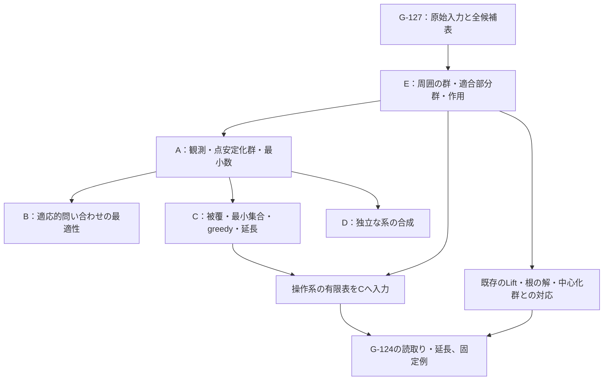

# G-128：最小観測集合と適合性判定の実装設計

[G-128の固定target A–E](../../goals/G-128-aat-minimal-compatibility-observations.md)を、
群作用の一般論、有限な観測選択、G-127の原始入力への適用として構成する。
greedy法と調和数による近似保証をCの構成に含める。
入力・量化範囲・完了条件はGOALに従い、設計上の分割によって変更しない。

| 文書 | 内容 |
| --- | --- |
| 本文 | A・Dの証明方針、Eの群・作用・既存理論への接続、依存順と受入条件 |
| [問い合わせと有限アルゴリズム](query-and-greedy.md) | Bの決定的手続き、Cの全探索・greedy・延長、近似保証の証明 |
| [再利用対応表](reuse-map.md) | 既存宣言の入力・結論、適用条件、新しく証明する対応 |

## 1. 構成の全体像

一般部分は `Group G`、`MulAction G X`、`Subgroup G` を直接使う。
操作系への適用では、G-127の `FiniteProtocolInput` から周囲の群と適合部分群を
別々に構成して、この一般部分へ渡す。



新しく証明するのは点観測の判定条件、最小観測数、問い合わせ下限、greedyの保証である。
G-127の道の輸送・holonomy・中心化群・持ち上げの復元は既存宣言を使う。
有限構成には既存の完全な候補列挙を使い、G-128に必要な選択・所属判定を加える。

## 2. A：観測と最小数の一般論

### 2.1 点安定化群と観測fiber

任意の `G`、`X` と `Gamma : Subgroup G` に対し、`B : Finset X` を入力する。
観測表の型は `({x // x ∈ B} → X)` とし、`observe B g x = g • x.1` とする。
点安定化群はmathlibの `MulAction.stabilizer` の共通部分

```math
G_{(B)}=\bigcap_{x\in B}\operatorname{Stab}_G(x)
```

で定義する。`B` を集合として保つ作用の安定化群とは区別する。
必要な所属補題は、元の作用に対する $`\forall x\in B,\ g\cdot x=x`$ との同値とする。
A・Dには有限型や決定可能性の仮定を加えず、有限集合の操作に必要な古典論理は
定義・証明内で使う。

最初に
$`O_B(g)=O_B(h)\iff h^{-1}g\in G_{(B)}`$
を作用の結合法則と逆元から示す。これを用い、十分性の述語を
$`P(t)\iff\exists\gamma\in\Gamma,\ O_B(\gamma)=t`$
で構成する。必要性は $`k\in G_{(B)}`$ の観測を恒等元の観測と比較して得る。
部分群の正規性を必要とする商群の議論は介在させない。

### 2.2 最小数

`Sufficient B` を `pointStabilizer B ≤ Gamma` とし、`ℕ∞` 上で

```math
b_\Gamma=\inf_{B:\,\mathrm{Sufficient}(B)} |B|
```

を定義する。Leanでは十分な `Finset` の部分型にわたる `iInf` を使う。
mathlibの `ENat.iInf_coe_eq_top` と `ENat.exists_eq_iInf` から、次の共通APIを作る。

- 十分な `B` から $`b_\Gamma\le |B|`$ を得る。
- $`b_\Gamma\ne\infty`$ と十分な有限集合の存在を同値にする。
- 有限値の場合には、その濃度を達成する `B` が存在する。
- $`b_\Gamma=0\iff\Gamma=\top`$ と、$`\Gamma=\bot`$ における観測の単射性を示す。

最小集合の存在を示すこの一般論と、Cの実行可能な最小集合の計算を同じ定義へ接続する。
有限集合の全探索をAの定義に持ち込まず、任意の群・作用への量化を保つ。

### 2.3 G-120との同じ観測による接続

`O : G →* L` から、mathlibの `MulAction.compHom` で
$`g\cdot x=O(g)x`$ を構成する。`B={1}` について
点安定化群が `O.ker` に等しく、観測表の唯一の値が `O g` に等しいことを証明する。
表型と `L` の全単射を介し、G-120の
`exists_observation_predicate_iff_ker_le` とA1の述語を双方に移す。
一般の `O_B` は群準同型ではないため、G-120の定理をそのまま一般の点観測へ
適用することはせず、この特殊化で実際の観測値を一致させる。

## 3. D：合成則

`G₁ × G₂` の各射影から `X₁`、`X₂` への作用を作り、mathlibの `Sum` の作用で
`X₁ ⊕ X₂` に作用させる。任意の有限集合 `B` を `Finset.toLeft`、`toRight` で分解し、

```math
(G_1\times G_2)_{(B)}
=(G_1)_{(B_1)}\times(G_2)_{(B_2)},\qquad
|B|=|B_1|+|B_2|
```

を示す。積部分群への包含が各因子での包含と同値であることから下限を得る。
両辺の最小数が有限なら、Aの最小集合の存在と `Finset.disjSum` によって上限を得る。
いずれかが無限なら、積に十分な有限集合があるという仮定をその因子へ射影して矛盾を得る。
この場合分けで `ℕ∞` の加法を扱い、有限値だけの定理にしない。

適合部分群の包含 $`\Gamma_1\le\Gamma_2`$ に対する反単調性は、
各十分集合について包含を合成し、Aの最小数APIへ渡す。

## 4. E：名前付き操作から周囲の群を作る

### 4.1 周囲の群とfiber全単射の表示

入力はG-127の `P : FiniteProtocolInput Q` とし、`D=P.data`、`H=P.H`、
`S=Σ v, D.Fiber v` と置く。群の実装表示は、積群の部分群

```math
\widehat G=
\{(u,p)\in H\times\operatorname{Perm}(S)\mid
  \forall s\in S,\ \pi(p(s))=u_V(\pi(s))\}
```

とする。恒等元・合成・逆元について条件を証明すれば、群法則はmathlibの積群・部分群
から得られる。可視射影と状態への作用は、それぞれ積の射影から構成する。

GOALの $`G_{F,H}`$ との全単射は、fiberの全単射族から `Equiv.sigmaCongr` による
全状態の置換を作り、逆方向には `p` と `p.symm` を各fiberへ制限して作る。
逆写像も明示的に構成し、実行可能な変換には `Equiv.ofBijective` による選択を使わない。
この全単射で群構造を対応させ、各頂点で

```math
((u,\varphi)(v,\psi))_x=\varphi_{v_V(x)}\circ\psi_x
```

となることを示す。G-127の `liftPair_mul_fiber_apply` と同じ合成順を保つ。
空fiberも許すため、状態の置換だけから可視変更を復元する仮定は置かない。
また、ある可視変更に沿うfiber全単射族が存在しない場合もある。
周囲の群から `H` への射影の全射性は仮定せず、各可視元上の空のfiberも扱う。

### 4.2 適合部分群と既存の変更群

`widehat G` の中で、元の `D.NamedExecution` について

```math
\forall e,s,t,\quad
\operatorname{NamedExecution}(e,s,t)
\iff\operatorname{NamedExecution}(u_E(e),p(s),p(t))
```

を満たす元を部分群とする。関係の同値として書くことで、合成・逆元での閉性を示す。
fiber表示に戻した条件がGOALの(E1)そのものであることを証明する。
`Lift.preserves_namedExecution` と `StateChange.toLift` を使い、
元の辺の全単射・端点の型変換を保って対応させる。

適合群の元を `D.ChangeGroup H` へ送る写像は、同じ `u,p` に保存条件を付ける。
逆写像は既存の `StateChange` の可視写像・状態写像を取り出す。
この群同型 `compatibleMulEquivChangeGroup` について、次を個別に証明する。

| 対応 | 確認する等式・同値 |
| --- | --- |
| 元と合成 | 全状態の写像、各fiberの写像、積が元の変更と一致する |
| 可視射影 | 新しい射影と `ChangeGroup.projection` が可換になる |
| 各可視fiber | 任意の `u : H` について、新しい適合群のfiberが `D.Lift u.1` と全単射になる。空fiberも含む |
| 根の条件・復元 | 上の全単射を `liftEquivRootSolutions` と合成し、戻した各頂点の写像が一致する |
| 底を固定する群 | 適合群の射影の核を `D.Lift 1` に群同型で移し、`verticalRootMulEquiv` へ接続する |

既存の `StateChange` と `Lift` は操作保存条件を持つため、適合群の接続先として使う。
不適合な変更も含む周囲の群は4.1で構成する。周囲の群の射影の核と、
適合群の射影の核も区別し、B2の中心化群表示には後者を接続する。

`P.equations`、`P.satisfies`、`P.renaming_preserves` はG-127の原始入力として保持する。
点観測の一般論は `G,X,Gamma` だけを使い、操作系の適合条件は元の(E1)から作る。
経路等式の意味論との対応は、同じ `P` に対するG-127の接続へ引き継ぐ。

### 4.3 観測対象への作用

`Xst=S` には状態成分で、`Xall=V ⊕ (E ⊕ S)` には可視頂点、可視辺、状態の各成分で
作用させる。`Xall` の作用が同じ二つの元は、頂点と辺での評価から可視自己同型が等しく、
状態での評価から状態置換が等しい。積の部分群の外延性によって元が等しいので、
`FaithfulSMul` を構成できる。

有限な `Xall` 全体の点安定化群は自明となる。Aへ渡して、任意の適合部分群に対する
最小観測数が有限であることを得る。`Xst` は独立に扱い、その作用の忠実性は仮定しない。
空の頂点集合、空の辺集合、空fiberの場合にも同じ外延性の証明を使う。

### 4.4 原始表からCへの入力を生成する

G-127 Eと同じ `vertices, edges, fibers, visible` の `ExplicitEnumeration` と等号判定を使う。
`FiniteProtocolInput` の `Finite` だけから実行用の列挙を選ばず、入力された表を使う。

1. 各 `u : H` について既存の `allCandidateMaps` を呼び、前向き・逆向きのfiber表を列挙する。
2. **二つの逆写像条件だけ**で選別して全単射族を作り、4.1の写像で周囲の群へ送る。
   元の辺の可換式はここでの選別に含めない。
3. 全可視元について連結した列を周囲の群の完全な列挙とし、積・逆・作用の有限表を得る。
4. 適合所属は全ての名前付き辺の(E1)を検査する。各 `u` の `finiteSelectedAllLifts` を
   周囲の群へ送った列との所属同値も証明する。
5. Cへ生成した表を渡し、返した元・観測集合・延長を元の `u,φ` へ読み戻す。

2の完全性は、任意のfiber全単射族とその逆が既存の `allCandidateMaps.complete` に
現れることから示す。4の完全性には `mem_finiteSelectedAllLifts` を使う。
G-127の `ValidCandidate` は逆写像条件と辺の可換式の両方を含むため、
周囲の群用には逆写像条件だけの新しい検査と、その完全性証明が必要になる。

## 5. G-124の同じ読取り・延長への対応

GOALの恒等操作への特殊化で、
`R=CSFixedFDetermining.protocolRepresentativeSet Q` をそのまま使う。
`B` は `R` の各代表に `K` の全点を組み合わせた状態集合とする。
適合群の元 `a` と、それに対応するG-124の変更 `c` について

```math
O_B(a)(r,x)=(r,\operatorname{readAt}(c,r)(x))
```

を `identityG124_readAt` から示す。全点評価の一致と置換の一致は関数の外延性で同値になる。
G-124の `FiniteReading.Determining` は「適合する変更同士の区別」と「整合表の延長」の
連言なので、それぞれを次のように接続する。

- **区別：** `identityLift_representatives_determining` の単射性を、適合群上の
  点観測へ移す。周囲の全変更に対する適合性判定の十分性とは別の命題として保つ。
- **延長：** `tR : R → Equiv.Perm K` から `tB(r,x)=(r,tR(r)(x))` を構成する。
  同じ `EdgeCoherent` の下で既存の延長の存在を使い、Cの適合する延長探索が成功することを示す。
  区別の結果からその延長は一意なので、探索が返す元を既存の延長と一致させられる。
- **全頂点：** `identity_G124_C2_extension_agree` を用い、各 `v,x` でCの出力、
  G-124の延長、G-127 C2の復元の評価を一致させる。

G-124の一回の `readAt` は置換全体を返す。G-128でその表を全点評価として読む構成には
$`|R|\,|K|`$ 個の観測点があり、代表の個数を点問い合わせ回数と同一視しない。
この `B` の最小性は主張せず、GOALが求める読取り・延長の一致を証明する。

既存の `R` と根の選択は `noncomputable` である。Cの探索自体は任意に与えられた
有限な `B,t` で実行可能にし、上記はその同じ関数への `B=R×K` の数学的特殊化として述べる。
G-124の選ばれた代表を、G-127の有限表から選ぶ別の代表へ置き換えない。

## 6. 固定例の再利用と新しい結論

入力は既存の `oneLoopInput`、列挙は `oneLoopVertices`、`oneLoopEdges`、`oneLoopFibers` を使う。
可視群は `oneLoopHEquivPermBool` で既に `Equiv.Perm Bool` と群同型である。
周囲の群の新しい表示を
$`\operatorname{Perm}(\mathrm{Bool})\times\operatorname{Perm}(\mathrm{Bool})`$
へ群同型で移し、第一因子を辺名、第二因子を状態に対応させる。
適合部分群は `oneLoopSwap_noLift`、`oneLoop_H_lift_eq_bot`、既存の中心化群の計算を
用いて $`\{1\}\times\operatorname{Perm}(\mathrm{Bool})`$ に対応させる。

| 観測対象・判定対象 | A・Bの結論 | Cの出力と直接確認する内容 |
| --- | --- | --- |
| 状態のみ、操作への適合性 | $`b_\Gamma=D_\Gamma=\infty`$ | 辺名だけを交換する元が全状態を固定する。最小探索とgreedyはその判定不能の証拠を返す |
| 頂点・辺・状態、操作への適合性 | $`b_\Gamma=D_\Gamma=1`$ | 辺名 `a` 一点が十分で、空集合は十分でない |
| 同じ全観測、全変更の識別 | $`b_{\{1\}}=D_{\{1\}}=2`$ | `a` と状態 `0` が十分。一点だけでは他方の因子の交換を区別できない |

出力を固定する例では、可視元・周囲の元・`Xall` の列挙順を明示する。
`Xall` は頂点、辺 `a,b`、状態 `0,1` の順に置き、greedyの同数時の選択も検証する。
この例の数値は、独立に置いた四元群の計算だけで済ませず、4の生成表とCの実際の関数へ接続する。

## 7. 実装の分割と受入条件

新規実装の配置を `research/lean/ResearchLean/AG/MinimalCompatibilityObservations/`、
namespaceを `AAT.AG.MinimalCompatibilityObservations` とする。次の名称は設計上のmodule案である。

| 依存順 | module案 | 構成・受入条件 |
| --- | --- | --- |
| 1 | `PointObservation`, `Minimum` | 任意の群作用でA1・A2、観測fiber、最小値達成、0・∞・単射性 |
| 2 | `ObservationKernelBridge`, `Product` | G-120の同じ値・述語への接続、Dの∞を含む加法性・反単調性 |
| 3 | `FiniteObservation`, `FiniteSearch` | 入力表から被覆族、最小集合、判定不能の元、二種類の延長と完全性 |
| 4 | `QueryModel`, `QueryOptimality` | 全ての決定的停止手続きの下限、固定集合による上限、`D=b` |
| 5 | `GreedyCover`, `GreedyBound` | 最大新規被覆の選択、停止・正確性・入力順の同数処理、調和数の保証 |
| 6 | `ProtocolAmbient`, `ProtocolCompatibility`, `ProtocolActions` | Eの元の群法則、適合部分群、G-127への群同型、二つの作用と全観測の忠実性 |
| 7 | `ProtocolClassification`, `ProtocolFiniteTables` | 同じ可視fiber・垂直群、原始表から全周囲群と適合群の列挙、Cの出力の読み戻し |
| 8 | `IdentityReading`, `OneVertexTwoLoops` | 同じG-124代表・全頂点の延長、固定例の三つの値と実際の探索出力 |

一般論の1–5と操作系の6–7を分け、前者の証明では群作用・有限列挙のAPIを使う。
`ExplicitEnumeration` は `FiniteDirectDecision` から既存型をimportするため、
その推移的importは共有する。列挙型を独立moduleへ分離する場合も、型とAPIを保つ整理とする。

各構成では、群公理・作用公理・入力列挙の完全性から結論までを辿れるようにする。
十分集合、最適性、被覆可能性、適合群の完全列挙、近似不等式を外部の仮定として
受け取って最終定理を閉じない。実行関数の証明には、計算で選ばれた同じ元・集合を使う。

有限構成の定量的結論は、Bの点問い合わせ回数とCの選択点数である。
greedyは最小集合の全探索を呼ばず、作用表から直接選択する。
実装量を抑える方針と、各手続きに必要な数学的補題は[アルゴリズム設計](query-and-greedy.md)に置く。

検証は[Research Leanの検証手順](../../lean/README.md)と
[Lean build運用](../../../docs/aat/guideline.md#lean-build-運用hard-rule)に従う。
新規moduleをmanifestとaggregateへ登録し、対象の非aggregate fileをfocused checkで確認する。
空集合・重複を含む入力列挙・判定不能・非正規部分群・非忠実作用を含む一般定理の仮定を確認する。
宣言・前提の出所・使用先・実行関数の対応はG-128 reportに、検証と査読の履歴はtracking IssueとPRに置く。
