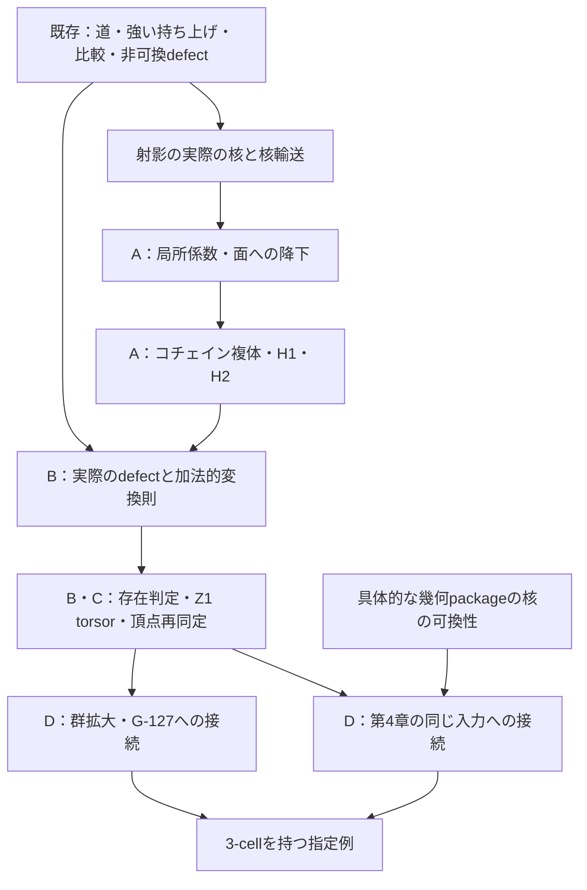

# G-129：可換核による持ち上げ障害と解の分類の実装設計

[G-129の固定target A–D](../../goals/G-129-aat-abelian-lifting-obstruction.md)を、
実際の射影の核、道に沿う輸送、指定比較の貼り合わせから構成する。
入力・量化・完了条件はGOALに従う。以下の宣言名・module分割は新規実装の設計案である。

| 文書 | 内容 |
| --- | --- |
| 本文 | 一般定理の入力、構成・証明の依存、AATへの接続、実装順と検証 |
| [再利用対応表](reuse-map.md) | 既存宣言の入力・結論、そのまま使う部分、接続補題、新規構成 |
| [3-cellと具体例](witnesses.md) | 共通の有限表示、G-127・`S_3`・幾何packageでの仮定と結論の計算 |

## 1. 構成の全体像

既存の `TransportCoherence.Arbitrary` が扱う任意の関手上の強い持ち上げを一般部分の
土台にする。道・面・貼り合わせ、標準比較、非可換defectの変換則は再利用する。
G-129では実際の核への制限と加法化、局所係数複体、障害類、解への作用を加える。

`CrossStageCoherence` への接続では、元の幾何packageとcoreの射を保持する。
群拡大への接続では、一対象圏から同じ一般定理を使い、G-127の実際の変更群・射影へ戻す。
いずれもコホモロジーはGOALの同じ有限表示 $`K`$ に対するものとする。



## 2. 入力と型の構成

### 2.1 任意の塔と固定したcore

`p : E ⥤ B`、`q : B ⥤ D`、`K : FiniteTransportPresentation` を使う。
上段は `Arbitrary.TransportData K.toFiniteTransportTwoPresentation (p ⋙ q)` とし、
下段の `Arbitrary.LiftData ... q` は同じ対象・辺に `p` を適用して構成する。
下段の強いopcartesian性はGOALの入力条件から与える。

一般部分の辺に要求するのは `p ⋙ q` に関する強いopcartesian性と、
その `p` による像の `q` に関する強いopcartesian性である。
第4章の `TwoLayerLiftData` は二段それぞれの強いopcartesian性を持つため、
既存の合成定理で一般部分の条件を証明して渡す。

各対象で `p.mapIso` を制限した準同型

```math
\pi_v:\operatorname{FiberAut}(q\circ p,X_v)
\longrightarrow\operatorname{FiberAut}(q,pX_v)
```

を作り、係数の乗法的表示を `(π_v).ker` とする。
固定core、辺ごとの持ち上げ、射影等式、GOAL (A2) は別の入力として保持する。
可換性を用いて `Additive ((π_v).ker)` に加法群構造を入れる。
`C^0` から `C^3` までの積には依存関数型を使い、係数群の有限性は加えない。

GOAL Aの条件1–4は、それぞれ核の可換性、構成した核輸送の全単射性、
指定比較の中心化条件、実際の `AuthoredSyzygy` として表す。
微分、`d²=0`、defect、コサイクル性は、これらの入力から作る側に置く。

### 2.2 合成順

本文の $`yx=y\circ x`$ に対し、Leanの射では `x ≫ y` と書く。
`Aut` の積 `a * b` の射は `b.hom ≫ a.hom` である。
同じ `Arbitrary.rawFaceDefect` の順序 $`u_fm_f^{-1}`$ を使う。
`SingleObj.comp_as_mul` も `f ≫ g = g * f` なので、群拡大の特殊化で順序を変えない。

## 3. A：実際の核から局所係数を得る

### 3.1 輸送の制限と同型性

`whiskerFiberAutHom` を上段・下段に適用し、まず射影との可換式

```math
\pi_w(\operatorname{whisker}_{\widetilde L_e}(c))
=\operatorname{whisker}_{p(\widetilde L_e)}(\pi_v(c))
```

を証明する。両辺の特徴づけを `p` で写し、下段の強い持ち上げの一意性を使う。
この式から核への所属を得て、`kernelTransportHom` を構成する。
条件2の全単射性をこの準同型へ適用し、`MulEquiv.ofBijective` と加法化から
$`\rho_e:A_v\simeq A_w`$ を得る。

道の輸送は `PresentedPath` の帰納法で合成する。
空道・辺・連結について評価式を作り、同じ道の `whiskerFiberAutHom` の制限と一致させる。

### 3.2 面と基準選択

同じcoreの二つの持ち上げの差は、辺ごとに
$`\widetilde a'_e\widetilde a_e^{-1}\in\ker\pi_{t(e)}`$ として構成する。
輸送の特徴づけから、新しい核輸送は元の核輸送をこの差で共役したものになる。
核の可換性で共役を消し、輸送が基準の持ち上げによらないことを証明する。

面では、標準比較の因子分解と(A2)から
$`p(m_f)=p(u_f)`$ と $`u_fm_f^{-1}\in A_{t(f)}`$ を先に得る。
その後でGOALの共役式と、条件3が面の輸送一致と同値であることを証明する。
この核所属の補題はBにも共用し、Bの障害消滅を前提にしない。

道の関係への降下にはmathlibの `CategoryTheory.Paths` と `CategoryTheory.Quotient` を使う。
`PresentedPath` と `Quiver.Path` の変換について辺・空道・連結の一致を証明する。
辺の $`\rho_e`$ から `Paths.lift` で加法群値の関手を作り、
面の輸送一致を `Quotient.lift` に渡す。対象と各生成辺で元の核・輸送を回復する評価式を残す。

## 4. A：微分とコホモロジー

### 4.1 道の補正と面の微分

道の総補正は次の再帰で構成する。

```math
T_{\varnothing}(h)=0,\qquad
T_{ew}(h)=\rho_w(h_e)+T_w(h).
```

連結について
$`T_{vw}(h)=\rho_w(T_v(h))+T_w(h)`$ を示す。
これがGOALの各出現を数える和と一致すること、`h` に関して加法的であることを証明する。

`d0` と `d1` を `AddMonoidHom` として作り、
$`T_w(d^0b)=b_{t(w)}-\rho_w(b_{s(w)})`$ を道の帰納法で示す。
面の両側でこの式を引き、局所係数の面条件から $`d^1d^0=0`$ を得る。

### 4.2 3-cellの微分

`WhiskeredFace` の向きから符号を決め、`outgoing` に沿う $`\rho`$ で面の値を運ぶ。
`RewritePasting` の `nil` を零、`cons` を加算として `pastingSum` を定義する。
`d2` は `threeLeft` と `threeRight` の評価の差である。

一段の書き換えについて

```math
\operatorname{pastingSum}_{\mathrm{step}}(d^1h)
=T_{\mathrm{before}}(h)-T_{\mathrm{after}}(h)
```

を示す。接頭辞の寄与が消える箇所で面の輸送一致を使う。
列全体では中間の道の項が相殺されるため、共通の始点・終点を持つ二つの貼り合わせの
差が零となり、$`d^2d^1=0`$ を得る。この証明は指定比較の条件4に依存しない。

### 4.3 nativeな複体と商

`CochainComplex.of` に `AddCommGrpCat` 値の次数0–3と、それ以上の零群を渡す。
二つの合成零の証明をこの同じ複体に登録する。
次数1・2では隣接する三項を `ShortComplex` とし、`abToCycles` によって
直前の微分を核へ制限する。

$`H^1`$ と $`H^2`$ の計算表示は、核の中の像による `QuotientAddGroup` とする。
`ShortComplex.abHomologyIso` で同じ三項のnativeなhomologyへ対応させる。
零性のAPIは「代表が直前の微分の像に属する」との同値にまとめる。

## 5. B：defectの加法化と存在判定

`rawFaceDefect` を3.2の核所属で制限し、加法化した値を `innerDefect` とする。
既存の `rawDefect_cocycle_of_authoredSyzygy` が返すのは非可換な貼り合わせの等式なので、
次の接続を先に証明する。

1. 各指定比較と標準比較は終点の核を中心化する。
2. 輸送先でもこの性質が保たれる。ここで核輸送の全射性を使う。
3. 逆向きの面のdefectは元のdefectの負に対応する。
4. `pastingRawDefect` の核での値は同じ `pastingSum innerDefect` と一致する。

条件4の既存のコサイクル定理に4を適用して、$`d^2\delta=0`$ を得る。
核への制限・加法化を介した実際の値の一致を証明し、コサイクル性だけを移す形にしない。

補正 $`h`$ について、既存の `pathReselectionTransition` が
$`\iota(T_w(h))`$ と一致することを強い持ち上げの一意性で示す。
`rawFaceDefect_transition` の指定比較による共役を条件3で消し、
$`\delta^h=\delta+d^1h`$ を得る。
輸送された指定比較も核補正の共役で変わらないことを示し、条件4の基準選択からの独立性を得る。

`Sol` は元の辺の持ち上げ族に射影条件と面の射の等式を付けた部分型として先に定義する。
基準の持ち上げとの差を取る操作と、$`h`$ を左から掛ける操作が互いに逆であることを示す。
`[δ]=0` から `δ=d1(x)` を取り出し、補正 `h=-x` を選ぶ。
逆方向は実際の解と基準の差を取り、変換則から同じ商の零性を得る。

## 6. C：実際の解への作用と頂点再同定

`Z1 := d1.ker` の元を辺の核補正として実際の解へ作用させる。
二つの解 $`c,c'`$ の差を $`c'_e c_e^{-1}`$ として取り出し、
変換則から `Z1` に属することを示す。包含の単射性と群の消去で差の一意性を証明する。
非空性の下でのみ `AddTorsor Z1 Sol` を構成する。

頂点族 $`b`$ はGOAL (C1)の射の式で作用させる。
輸送の特徴づけを使って辺の補正が `d0 b` に等しいことを示し、同じcoreと指定比較を保つことを確認する。
`C0` の作用の軌道関係には `AddAction.orbitRel` を使う。
頂点作用には安定化群があり得るため、この作用自体には自由性を要求しない。

商上の差は元の解の差の `H1` 類とする。代表解を頂点再同定で変えると差が
`d0` の像だけ変わることを示し、`H1` の作用と差を商に降ろす。
作用・差の二つの消去法則から `AddTorsor H1 (Sol の頂点作用による商)` を構成する。
基準解からの全単射と、基準の辺持ち上げを変えたときの対応は、元の解を恒等に保つ写像で与える。

## 7. D：既存のAAT入力へ戻す

`TwoLayerTransportData` から一般入力への変換を一つ作る。
一般側の `FiberAut` と既存の `CompositeFiberAut`・`PackageFiberAut` の群同型、
射影との可換式、核と `InnerFiberAut` の群同型を構成する。
同型はいずれも元の自己同型の `hom`・`inv` を保存する。

| 対応対象 | 接続で証明すること |
| --- | --- |
| 辺・道・核輸送 | 同じ `upperReselectedPathLift`、`upperWhiskerCompositeFiberAut` の因子分解を満たす |
| 標準比較・defect | `sectionCellComparator` と一致し、核への包含後に `sectionInnerObstruction` と一致する |
| 任意の補正 | `relativeUpperReselection` と同じ辺を返し、`relativeInnerDefectCochain` の値に一致する |
| 持ち上げ全体 | 基準との差を `sectionReplacementGauge` と対応させ、同じcore上の全持ち上げを覆う |
| 解と存在 | 実際の辺を保つ全単射を作り、非空性を `SectionRelativeCoherentizable` と同値にする |
| 3-cell | `upperAuthoredPastingComparator` の等式を一般側の `AuthoredSyzygy` と一致させる |

`Arbitrary.packageTransportData` はcore段への既存の接続である。
幾何からcoreへの今回の変換は、上の値の一致を持つ別の接続として構成する。

群拡大では `MonoidHom.toFunctor` と `SingleObj` を使い、実際の核との群同型から
係数を作る。すべての辺が同型なので強いopcartesian性は `of_iso` から得る。
共役による核輸送、恒等の指定比較、辺ごとの持ち上げからAの条件を証明する。
G-127には `projectionToLiftable` の実際の核を用い、
`verticalLiftEquivLiftableKernel` と `verticalLiftInclusion` を通じて元のfiber写像へ戻す。

## 8. module分割と実装順

新規の配置先は `research/lean/ResearchLean/AG/AbelianLiftingObstruction/` とする。
以下は責務の分割であり、GOALの達成をファイル数で判定しない。

| module案 | 責務・主な依存 |
| --- | --- |
| `Tower.lean` | 任意の塔、射影、実際の核、coreの選択、核所属。既存の `Arbitrary` を使用 |
| `KernelTransport.lean` | 輸送の制限・同型、共役式、面条件、基準選択からの独立性 |
| `LocalCoefficients.lean` | 道の評価と関係への降下 |
| `Cochains.lean`、`Cohomology.lean` | 道・貼り合わせの和、三つの微分、複体、核・像の商 |
| `Defect.lean`、`Correction.lean` | 実際のdefect、コサイクル性、補正と基準選択の変換 |
| `Solutions.lean`、`VertexGauge.lean` | `Sol`、`Z1` torsor、頂点作用、`H1` torsor |
| `CrossStage.lean` | 第4章の入力・射・核・defect・解との対応 |
| `GroupExtension.lean`、`ProtocolExtension.lean` | 一対象圏の特殊化とG-127の同じ変更群への適用 |
| `SquarePresentation.lean` | 三つの具体例で共有する面と3-cell |
| `C4Witness.lean`、`S3Witness.lean` | GOAL完了条件2・3の同じ一般構成による計算 |
| `GeometryKernel.lean`、`GeometryWitness.lean` | 完了条件4の実際の核の可換性、指定比較、障害計算 |

実装は次の順で証明義務を切る。

1. [幾何の具体例](witnesses.md#4-第4章の幾何package)の核全体の可換性を確かめる。
   係数成分だけで十分か、文脈ごとの三つの比較成分に追加の証明が要るかを確定する。
2. `Tower` と `KernelTransport` を作り、第4章の実際の核との型・射の対応を先に確認する。
3. 道・3-cellの複体を作り、`SquarePresentation` 上の三つの微分で符号を確認する。
4. 非可換defectとの接続、補正、存在判定を証明する。
5. `Z1` の作用、頂点作用、`H1` の作用をこの順に構成する。
6. 第4章・群拡大・G-127の接続を完結させ、三つの具体例を同じ一般定理へ適用する。

## 9. 検証と受入条件

各moduleは必要な既存moduleを個別にimportする。
追加時に `research/lean/ResearchLean/AG.lean` と
`research/lean/research-modules.txt` へ登録し、`#assert_standard_axioms_only` を付ける。
ローカル検証は[Research packageの手順](../../lean/README.md)に従い、
登録した単一の非aggregate fileを対象にする。

```bash
research/lean/check_research_modules.sh --focused ResearchLean/AG/AbelianLiftingObstruction/KernelTransport.lean
```

一般部は任意の可換核と依存する頂点の型で検証し、具体例では同じ定義を簡約する。
空道、同じ辺の複数出現、逆向きの面、接頭辞・接尾辞のある書き換えを
再帰式と特徴づけの補題で覆う。具体的な符号と作用の確認は `SquarePresentation` に集める。

成果とGOALの対応は次の単位でreportへ記録する。

| GOAL | 照合する証拠 |
| --- | --- |
| A | 実際の核、輸送の生成、面への降下、微分の定義と二つの合成零 |
| B | 元のdefectとの一致、3-cellの使用、全補正の変換則、実際の解との双方向構成 |
| C | 実際の辺への作用、差の一意性、頂点再同定、商上の `H1` torsor |
| D | 同じ射影・自己同型・辺・defectの対応、一般定理の仮定の使用箇所 |
| 完了条件2–4 | 同じ例で入力条件を証明し、障害と存在判定、要求された作用を評価する |

証明・検証結果はreportとtracking Issueへ記録し、完了判定にはGOALが参照する共通基準を適用する。
